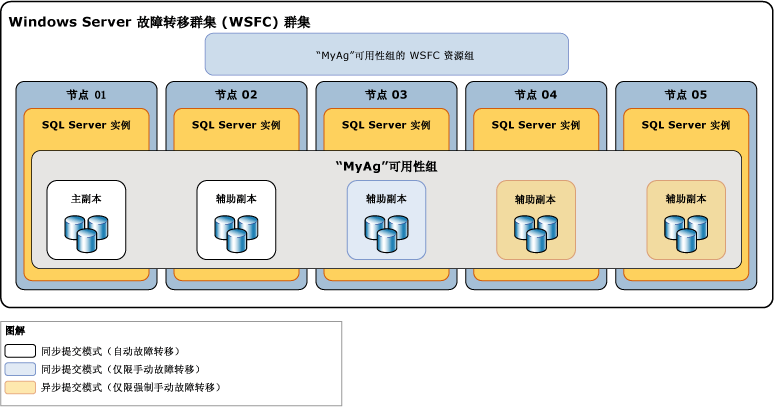

# 可用性模式（AlwaysOn 可用性组）
[!INCLUDE[appliesto-ss-xxxx-xxxx-xxx-md](../../../includes/appliesto-ss-xxxx-xxxx-xxx-md.md)]

  在 [!INCLUDE[ssHADR](../../../includes/sshadr-md.md)] 中，“可用性模式”是一个副本属性，该属性确定某一给定可用性副本是否可在同步提交模式下运行。 对于每个可用性副本，必须为同步提交模式、异步提交模式或仅配置模式配置可用性模式。  如果主要副本配置为“异步提交模式”，则它不会等待任何次要副本将传入的事务日志记录写入磁盘（以便强制写入日志）。 如果某一给定的辅助副本配置为异步提交模式，则主副本不会等待该辅助副本强制写入日志。 如果主要副本和某一给定次要副本都配置为同步提交模式，则主要副本将等待次要副本，以便确认它已强制写入日志（除非次要副本在主要副本的会话超时期限内未能使用 ping 命令联系上主要副本）。 
  

> [!NOTE]  
>  如果某一辅助副本超过了主副本的会话超时期限，则主副本将暂时切换到该辅助副本的异步提交模式。 在该辅助副本重新与主副本连接后，它们将恢复同步提交模式。  
  
 **本主题内容：**  
  
-   [受支持的可用性模式](#SupportedAvModes)  
  
-   [Asynchronous-Commit Availability Mode](#AsyncCommitAvMode)  
  
-   [Synchronous-Commit Availability Mode](#SyncCommitAvMode)  
  
-   [相关任务](#RelatedTasks)  
  
-   [相关内容](#RelatedContent)  
  
##   受支持的可用性模式  
 [!INCLUDE[ssHADR](../../../includes/sshadr-md.md)] 支持三种可用性模式：异步提交模式、同步提交模式和仅配置模式，如下所示：  
  
-   异步提交模式是一种灾难恢复解决方案，适合于可用性副本的分布距离较远的情况。 如果每个辅助副本都在异步提交模式下运行，则主副本不会等待任何辅助副本强制写入日志， 而会在将日志记录写入本地日志文件后，立即将事务确认发送到客户端。 主副本使用与针对异步提交模式配置的辅助副本相关的最小事务滞后运行。  如果为当前主副本配置了异步提交可用性模式，则它将通过异步方式为所有辅助副本提交事务，而不管这些副本各自的可用性模式设置如何。  
  
     有关详细信息，请参阅本主题后面的[异步提交可用性模式](#AsyncCommitAvMode)。  
  
-   同步提交模式相对于性能而言更强调高可用性，为此付出的代价是事务滞后时间增加。 在同步提交模式下，事务将一直等到辅助副本已将日志强制写入到磁盘中才会向客户端发送事务确认。 当在辅助数据库上开始数据同步时，辅助副本将开始应用来自相应的主数据库的传入日志记录。 一旦已经强制写入每个日志记录，辅助数据库就会进入 SYNCHRONIZED 状态。 此后，在日志记录写入本地日志文件之前，辅助副本会先将每个新事务强制写入。 在同步给定辅助副本的所有辅助数据库时，同步提交模式将支持手动故障转移和自动故障转移（可选）。  
  
     有关详细信息，请参阅本主题后面的 [同步提交可用性模式](#SyncCommitAvMode)。  

-   仅配置模式适用于不位于 Windows Server 故障转移群集的可用性组。 仅配置模式中的副本不包含用户数据。 在仅配置模式下，主数据库副本存储可用性组配置元数据。 有关详细信息，请参阅[包含仅配置副本的可用性组](../../../linux/sql-server-linux-availability-group-ha.md)。
  
 下图显示具有五个可用性副本的可用性组。 主副本和一个辅助副本配置为使用同步提交模式以及自动故障转移。 另一个次要副本配置为仅使用计划手动故障转移的同步提交模式，并且两个次要副本配置为使用异步提交模式，其仅支持强制手动故障转移（一般称为“强制故障转移”）。  
  
   
  
 两个可用性副本之间的同步和故障转移行为取决于这两个副本的可用性模式。 例如，为进行同步提交，当前主副本和有关的辅助副本必须都配置为同步提交。 同样，为进行自动故障转移，这两个副本需要都配置为自动故障转移。 因此，下表总结了上图阐释的部署方案的行为，它通过每个可能的主副本说明了该行为：  
  
|当前主副本|自动故障转移目标|具有以下节点的同步提交模式行为|具有以下节点的异步提交模式行为|能否自动故障转移|  
|-----------------------------|--------------------------------|--------------------------------------------|---------------------------------------------|---------------------------------|  
|01|02|02 和 03|04|用户帐户控制|  
|02|01|01 和 03|04|用户帐户控制|  
|03||01 和 02|04|否|  
|04|||01、02 和 03|否|  
  
 通常，节点 04 作为异步提交副本，部署在灾难恢复站点中。 在故障转移到节点 04 后节点 01、02 和 03 保持在异步提交模式，这一情况有助于避免因两个站点之间网络延迟较长而导致您的可用性组中的性能下降。  
  
##   Asynchronous-Commit Availability Mode  
 在异步提交模式下，次要副本永远不会与主要副本同步。 虽然给定的辅助数据库可能会赶上对应的主数据库，但任何辅助数据库在任何时点都可能会落后。 对于主副本和辅助副本相隔很远而且您不希望小错误影响主副本的灾难恢复方案的情况，或性能比同步数据保护更重要的情况，异步提交模式将会很有用。 而且，由于主副本不会等待来自辅助副本的确认，因而辅助副本上的问题从不会影响主副本。  
  
 异步提交辅助副本会尝试与接收自主副本的日志记录保持一致。 但异步提交辅助数据库往往会保持未同步状态，并且可能稍微滞后于相应的主数据库。 通常，异步提交辅助数据库和相应的主数据库之间的这个时间差会很小。 但是，如果承载辅助副本的服务器的工作负荷过高或网络速度很慢，则这个时间差会变得较大。  
  
 异步提交模式所支持的唯一故障转移形式为强制故障转移（可能造成数据丢失）。 强制故障转移是一种最后手段，仅可用于当前主要副本长时间保持不可用状态并且主数据库的即时可用性比可能丢失数据的风险更为重要的情况。故障转移目标必须是其角色处于 SECONDARY 或 RESOLVING 状态的副本。 故障转移目标将转换为主角色，并且其数据库副本将成为主数据库。 任何剩余的辅助数据库以及变得可用后的以前的主数据库都将被挂起，直到您手动单独恢复它们。 在异步提交模式下，原始主副本尚未发送到以前的辅助副本的任何事务日志都将丢失。 这意味着，某些或全部新的主数据库可能会缺少最近提交的事务。 有关强制故障转移的工作原理及其最佳使用方法的详细信息，请参阅 [故障转移和故障转移模式（AlwaysOn 可用性组）](../../../database-engine/availability-groups/windows/failover-and-failover-modes-always-on-availability-groups.md)。  
  
##   Synchronous-Commit Availability Mode  
 在同步提交可用性模式（同步提交模式）下，联接到某个可用性组后，辅助数据库就会与对应的主数据库求得一致并进入 SYNCHRONIZED 状态。 只要一直在进行数据同步，辅助数据库就会保持 SYNCHRONIZED 状态。 这可确保对某一给定主数据库提交的每个事务也对相应的辅助数据库提交。 在同步给定辅助副本上的每个辅助数据库之后，辅助副本的同步运行状态总体上将为 HEALTHY。  
  
 **本节内容：**  
  
-   [破坏数据同步的因素](#DisruptSync)  
  
-   [辅助副本的同步工作原理](#HowSyncWorks)  
  
-   [仅使用手动故障转移的同步提交模式](#SyncCommitWithManual)  
  
-   [使用自动故障转移的同步提交模式](#SyncCommitWithAuto)  
  
###   破坏数据同步的因素  
 一旦其所有数据库均已同步，辅助副本即进入 HEALTHY 状态。 除非发生下列情况之一，否则，同步的辅助副本将会保持正常：  
  
-   网络/计算机的延迟或故障导致辅助副本与主副本之间的会话超时。  
  
    > [!NOTE]  
    >  有关可用性副本的会话时间属性的信息，请参阅 [AlwaysOn 可用性组概述 (SQL Server)](../../../database-engine/availability-groups/windows/overview-of-always-on-availability-groups-sql-server.md)。  
  
-   挂起了辅助副本上的辅助数据库。 辅助副本停止同步，其同步运行状态标记为 NOT_HEALTHY。 辅助副本将无法恢复正常，除非恢复并重新同步挂起的辅助数据库或从可用性组中删除它。  
  
-   向可用性组添加了一个主数据库。 以前同步的辅助副本进入 NOT_HEALTHY 同步运行状态。 这种状态表示至少一个数据库处于 SYNCHRONIZING 同步状态。 给定的辅助副本将无法恢复 HEALTHY 状态，除非已在该辅助副本上准备了对应的辅助数据库并将其联接到可用性组，而且其与新的主数据库已经同步。  
  
-   将主副本或辅助副本的模式改为异步提交可用性模式。 更改为异步提交模式之后，只要还在进行数据同步，辅助副本就会一直保持 HEALTHY 同步运行状态。 但是，如果只有主副本更改为异步提交模式，同步提交的辅助副本将进入 PARTIALLY_HEALTHY 同步运行状态。 这种状态表示至少一个数据库处于 SYNCHRONIZING 同步状态，但没有任何数据库处于 NOT SYNCHRONIZING 状态。  
  
-   将任何辅助副本更改为同步提交可用性模式。 这将导致辅助副本被标记为处于 PARTIALLY_HEALTHY 同步运行状态， 直到其所有数据库都处于 SYNCHRONIZED 同步状态。  
  
> [!TIP]  
>  若要查看可用性组、可用性副本或可用性数据库的同步运行状况，请分别查询 **sys.dm_hadr_availability_group_states** 、 **sys.dm_hadr_availability_replica_states** 或 [sys.dm_hadr_database_replica_states](../../../relational-databases/system-dynamic-management-views/sys-dm-hadr-availability-group-states-transact-sql.md)的 [synchronization_health](../../../relational-databases/system-dynamic-management-views/sys-dm-hadr-availability-replica-states-transact-sql.md)或 [synchronization_health_desc](../../../relational-databases/system-dynamic-management-views/sys-dm-hadr-database-replica-states-transact-sql.md)列。  
  
###   辅助副本的同步工作原理  
 在同步提交模式下，在次要副本联接可用性组并与主要副本建立会话之后，次要副本会将传入日志记录写入到磁盘（强制写入日志）并向主要副本发送确认消息。 一旦辅助数据库上已经强制写入的日志赶上主数据库的日志末尾，辅助数据库的状态就会设置为 SYNCHRONIZED。 同步所需的时间实质上取决于会话开始时辅助数据库滞后于主数据库的程度（按最初从主副本收到的日志记录数计量）、主数据库的工作负荷和承载辅助副本的服务器实例的计算机的速度。  
  
 同步操作按下列方式维护：  
  
1.  从客户端收到事务后，主副本会将事务的日志写入事务日志，同时将该日志记录发送到辅助副本。  
  
2.  日志记录写入主数据库的事务日志后，事务将不能撤消，除非在此时故障转移到尚未收到该日志的辅助副本。 主副本将等待来自同步提交辅助副本的确认。  
  
3.  辅助副本将强制写入日志，并将确认消息返回给主副本。  
  
4.  收到来自辅助副本的确认后，主副本将完成提交处理并向客户端发送一条确认消息。  
  
    > [!NOTE]  
    >  如果同步提交辅助副本未能确认其已强制写入日志即超时，则主副本会将该辅助副本标记为失败。 辅助副本的连接状态更改为 DISCONNECTED，主副本停止等待辅助副本的确认。 此行为确保失败的同步提交辅助副本不会阻止在主副本上强制写入事务日志。  
  
 同步提交模式通过要求在两个位置之间同步数据来保护您的数据，但代价是使事务的滞后时间有所增加。  
  
###  仅使用手动故障转移的同步提交模式  
 当这些副本连接在一起并且数据库已同步时，将支持手动故障转移。 如果辅助副本关闭，则主副本将不受影响。 如果不存在任何 SYNCHRONIZED 副本（即，不会将数据发送到任何辅助副本），则主副本将会暴露在风险之中。 如果主副本丢失，辅助副本将进入 RESOLVING 状态，但数据库所有者可强制故障转移到辅助副本（可能造成数据丢失）。 有关详细信息，请参阅本主题后面的 [故障转移和故障转移模式（AlwaysOn 可用性组）](../../../database-engine/availability-groups/windows/failover-and-failover-modes-always-on-availability-groups.md)。  
  
###   使用自动故障转移的同步提交模式  
 通过确保在丢失主副本之后快速使数据库再次变为可用，自动故障转移可提供高可用性。 若要为可用性组配置自动故障转移，你需要将当前的主要副本和至少一个次要副本设置为使用同步提交模式自动故障转移。 你最多可以有三个自动故障转移副本。  
  
 此外，为了在特定时间自动执行故障转移，此辅助副本必须与主副本同步（即，辅助数据库全部同步），并且 Windows Server 故障转移群集 (WSFC) 群集必须具有仲裁。 如果主副本在这些条件下变得不可用，则将发生自动故障转移。 辅助副本将切换为主副本角色，并提供其数据库作为主数据库。 有关详细信息，请参阅[故障转移和故障转移模式（AlwaysOn 可用性组）](../../../database-engine/availability-groups/windows/failover-and-failover-modes-always-on-availability-groups.md)主题的“自动故障转移”一节。  
  
> [!NOTE]  
>  有关 WSFC 仲裁模式和 [!INCLUDE[ssHADR](../../../includes/sshadr-md.md)] 的详细信息，请参阅 [WSFC 仲裁模式和投票配置 (SQL Server)](../../../sql-server/failover-clusters/windows/wsfc-quorum-modes-and-voting-configuration-sql-server.md)。  

### 次要副本上的数据滞后
如果您的只读工作负荷可以容忍一定程度的数据滞后，则实现对辅助副本的只读访问很有用。 在数据滞后不可接受的情况下，请考虑对主副本运行只读工作负荷。

主副本将主数据库上的更改日志记录发送到辅助副本。 在每个辅助数据库上，专用重做线程应用这些日志记录。 在读访问权限的辅助数据库上，给定的数据更改不显示在查询结果中，直到包含更改的日志记录已应用到辅助数据库并且已在主数据库上提交事务。+

这意味着在主副本和辅助副本之间将会存在一定程度的滞后时间，通常只需几秒钟。 但是，在极少数情况下，例如在网络问题降低了网络吞吐量的情况下，滞后时间可能会较长。 在存在 I/O 瓶颈和数据移动操作处于挂起状态时，将增加滞后时间。 若要监视挂起的数据移动，可以使用 [Always On 仪表板](../../../database-engine/availability-groups/windows/use-the-always-on-dashboard-sql-server-management-studio.md)或 [sys.dm_hadr_database_replica_states](../../../relational-databases/system-dynamic-management-views/sys-dm-hadr-database-replica-states-transact-sql.md) 动态管理视图。

有关调查次要副本上的重做延迟的详细信息，请参阅[ 故障排除：主要副本未反映在次要副本上](../../../database-engine/availability-groups/windows/troubleshoot-primary-changes-not-reflected-on-secondary.md)。
  
##   相关任务  
 **更改可用性模式和故障转移模式**  
  
-   [更改可用性副本的可用性模式 (SQL Server)](../../../database-engine/availability-groups/windows/change-the-availability-mode-of-an-availability-replica-sql-server.md)  
  
-   [更改可用性副本的故障转移模式 (SQL Server)](../../../database-engine/availability-groups/windows/change-the-failover-mode-of-an-availability-replica-sql-server.md)  
  
 **调整仲裁投票**  
  
-   [查看群集仲裁 NodeWeight 设置](../../../sql-server/failover-clusters/windows/view-cluster-quorum-nodeweight-settings.md)  
  
-   [配置群集仲裁 NodeWeight 设置](../../../sql-server/failover-clusters/windows/configure-cluster-quorum-nodeweight-settings.md)  
  
-   [在无仲裁情况下强制启动 WSFC 群集](../../../sql-server/failover-clusters/windows/force-a-wsfc-cluster-to-start-without-a-quorum.md)  
  
 **执行手动故障转移**  
  
-   [执行可用性组的计划手动故障转移 (SQL Server)](../../../database-engine/availability-groups/windows/perform-a-planned-manual-failover-of-an-availability-group-sql-server.md)  
  
-   [执行可用性组的强制手动故障转移 (SQL Server)](../../../database-engine/availability-groups/windows/perform-a-forced-manual-failover-of-an-availability-group-sql-server.md)  
  
-   [使用故障转移可用性组向导 (SQL Server Management Studio)](../../../database-engine/availability-groups/windows/use-the-fail-over-availability-group-wizard-sql-server-management-studio.md)  
  
 **查看可用性组、可用性副本和数据库状态**  
  
-   [sys.dm_hadr_availability_group_states (Transact-SQL)](../../../relational-databases/system-dynamic-management-views/sys-dm-hadr-availability-group-states-transact-sql.md)  
  
-   [sys.dm_hadr_availability_replica_states (Transact-SQL)](../../../relational-databases/system-dynamic-management-views/sys-dm-hadr-availability-replica-states-transact-sql.md)  
  
-   [sys.dm_hadr_database_replica_states (Transact-SQL)](../../../relational-databases/system-dynamic-management-views/sys-dm-hadr-database-replica-states-transact-sql.md)  
  
##   相关内容  
  
-   [用于高可用性和灾难恢复的 Microsoft SQL Server AlwaysOn 解决方案指南](https://go.microsoft.com/fwlink/?LinkId=227600)  
  
-   [SQL Server AlwaysOn 团队博客：SQL Server AlwaysOn 团队官方博客](https://blogs.msdn.microsoft.com/sqlalwayson/)  
  
## 另请参阅  
 [AlwaysOn 可用性组概述 (SQL Server)](../../../database-engine/availability-groups/windows/overview-of-always-on-availability-groups-sql-server.md)   
 [故障转移和故障转移模式（AlwaysOn 可用性组）](../../../database-engine/availability-groups/windows/failover-and-failover-modes-always-on-availability-groups.md)   
 [Windows Server 故障转移群集 (WSFC) 与 SQL Server](../../../sql-server/failover-clusters/windows/windows-server-failover-clustering-wsfc-with-sql-server.md)  
  
  
