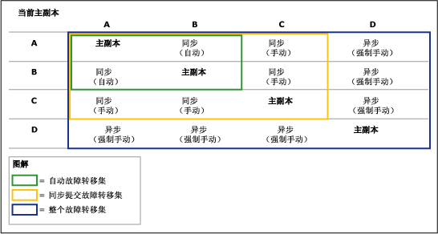
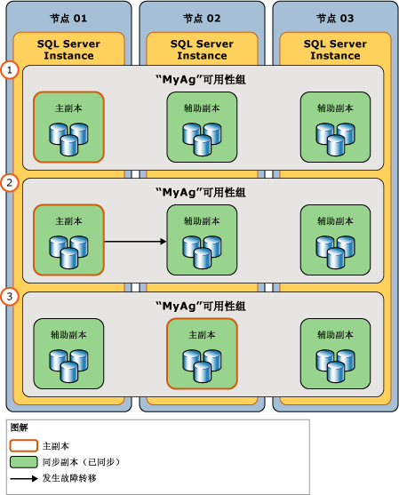

# 故障转移和故障转移模式（AlwaysOn 可用性组）
[!INCLUDE [SQL Server](../../../includes/applies-to-version/sqlserver.md)]

  在可用性组的上下文中，可用性副本的主角色和辅助角色在称为“故障转移” 的过程中通常是可互换的。 存在三种故障转移形式：自动故障转移（无数据丢失）、计划的手动故障转移（无数据丢失）和强制手动故障转移（可能丢失数据）。最后一种形式通常称为“强制故障转移”。 自动故障转移和计划的手动故障转移会保留您的所有数据。 可用性组在可用性副本级别进行故障转移。 也就是说，可用性组故障转移到其次要副本之一（当前故障转移目标）。  
  
> [!NOTE]  
>  在数据库级别，诸如因数据文件丢失而使数据库成为可疑数据库、删除数据库或事务日志损坏之类的数据库问题不会导致可用性组进行故障转移。  
  
 在故障转移期间，故障转移目标将接管主角色、恢复其数据库并且使它们作为新的主数据库处于联机状态。 以前的主副本一旦可用将切换为辅助角色，并且其数据库成为辅助数据库。 在可能的情况下，这些角色可以来回切换（或切换为不同的故障转移目标），以应对多次故障或满足管理的需要。  
  
 “故障转移模式”属性指定某一给定可用性副本支持的故障转移形式。 对于某一给定的可用性副本，可能的故障转移模式取决于该副本的[可用性模式](../../../database-engine/availability-groups/windows/availability-modes-always-on-availability-groups.md)，如下所示：  
  
-   同步提交副本支持两种设置：自动或手动。 “自动”设置支持自动故障转移和手动故障转移。 为了防止丢失数据，自动故障转移和计划的故障转移要求故障转移目标为同步提交的辅助副本且处于正常同步状态（这表示故障转移目标上的每个辅助数据库与相应的主数据库同步）。 只要某一辅助副本不满足这两个条件，它就仅支持强制故障转移。 请注意，强制故障转移还支持角色处于“正在解析”状态的副本。  
  
-   **异步提交副本** 仅支持手动故障转移模式。 此外，因为它们永远不会同步，所以它们仅支持强制故障转移。  
  
> [!NOTE]  
>  故障转移后，需要访问主数据库的客户端应用程序必须连接到新的主副本。 此外，如果新的辅助副本配置为允许只读访问，则只读客户端应用程序可以连接到它。 有关客户端如何连接到可用性组的信息，请参阅[可用性组侦听程序、客户端连接和应用程序故障转移 (SQL Server)](../../../database-engine/availability-groups/windows/listeners-client-connectivity-application-failover.md)。  
  
 **本主题的内容：**  
  
-   [术语和定义](#TermsAndDefinitions)  
  
-   [故障转移的概述](#Overview)  
  
-   [自动故障转移](#AutomaticFailover)  
  
-   [计划的手动故障转移（无数据丢失）](#ManualFailover)  
  
-   [强制故障转移（可能丢失数据）](#ForcedFailover)  
  
-   [相关任务](#RelatedTasks)  
  
-   [相关内容](#RelatedContent)  
  
##   术语和定义  
 自动故障转移 (automatic failover)  
 在丢失主副本时自动发生的故障转移。 仅当当前主副本和一个辅助副本同时配置为使用自动故障转移模式，并且辅助副本当前已同步时，才支持自动故障转移。  如果主副本或辅助副本的故障转移模式设置为手动，则不能发生自动故障转移。  
  
 计划的手动故障转移（无数据丢失）  
 计划的手动故障转移或“手动故障转移”通常是由数据库管理员为了进行管理而启动的故障转移。 仅当主副本和辅助副本同时配置为使用同步提交模式并且主副本和辅助副本当前均已同步（处于同步状态）时，才支持计划的手动故障转移。 当目标辅助副本同步后，即使主副本已崩溃，也可以进行手动故障转移（无数据丢失），因为辅助数据库已准备好进行故障转移。 数据库管理员需要手动启动手动故障转移。  
  
 强制故障转移（可能丢失数据）  
 当没有任何辅助副本与主副本同步，或者主副本未运行且没有辅助副本准备好进行故障转移时，可由数据库管理员启动的故障转移。 强制故障转移存在数据丢失的风险，建议严格限制用于灾难恢复。 强制故障转移也称为强制手动故障转移，因为它只能手动启动。 这是异步提交可用性模式下支持的唯一故障转移形式。  
  
 [!INCLUDE[ssFosAutoC](../../../includes/ssfosautoc-md.md)]  
 在给定的可用性组中，仅当一对可用性副本（包括当前主副本）配置为使用同步提交模式以及自动故障转移（如果有）时，才发生这种故障转移。 仅当次要副本当前已与主要副本同步时，[!INCLUDE[ssFosAuto](../../../includes/ssfosauto-md.md)] 才会生效。  
  
 [!INCLUDE[ssFosSyncC](../../../includes/ssfossyncc-md.md)]  
 在给定的可用性组中，仅当一组（两个或三个）可用性副本（包括当前主副本）配置为使用同步提交模式（如果有）时，才发生这种故障转移。 仅当辅助副本配置为使用手动故障转移模式，并且至少一个辅助副本当前与主要副本同步时， [!INCLUDE[ssFosSync](../../../includes/ssfossync-md.md)]才会生效。  
  
 [!INCLUDE[ssFosEntireC](../../../includes/ssfosentirec-md.md)]  
 在给定的可用性组内，其运行状态当前为联机的所有可用性副本的集合，而不考虑可用性模式和故障转移模式。 仅在当前没有辅助副本与主要副本同步时， [!INCLUDE[ssFosEntire](../../../includes/ssfosentire-md.md)]才会变为相关。  
  
##   故障转移的概述  
 下表概述了在不同的可用性和故障转移模式下支持的故障转移形式。 对于每个对，有效的可用性模式和故障转移模式由主副本的模式和一个或多个辅助副本的模式的交集决定。  
  
|故障转移形式|异步提交模式|同步提交模式（手动故障转移模式）|同步提交模式（自动故障转移模式）|  
|-------------------------------|---------------------------------------------------------|------------------------------------------------------------|  
|自动故障转移 (automatic failover)|否|否|是|  
|计划的手动故障转移|否|是|“是”|  
|强制故障转移|是|是|是&#42;|  
  
 &#42;如果对已同步的次要副本发出强制故障转移命令，次要副本的行为与手动故障转移时的行为相同。  
  
 在故障转移过程中，数据库不可用的时间取决于故障转移的类型及其原因。  
  
> [!IMPORTANT]  
>  为了支持在故障转移后进行客户端连接，除包含的数据库外，必须在新的主数据库上手动重新创建在任何先前主数据库上定义的登录名和作业。 有关详细信息，请参阅 [管理可用性组中数据库的登录名和作业 (SQL Server)](../../../database-engine/availability-groups/windows/logins-and-jobs-for-availability-group-databases.md)。  
  
### 故障转移集  
 就故障转移集而言，可理解为某一给定可用性组的可能的各种故障转移形式。 一个故障转移集由主副本和支持某一给定故障转移形式的辅助副本构成，如下所示：  
  
-   **[!INCLUDE[ssFosAutoC](../../../includes/ssfosautoc-md.md)]（可选）：** 在给定的可用性组中，仅当一对可用性副本（包括当前主副本）配置为使用同步提交模式以及自动故障转移（如果有）时，才发生这种故障转移。 仅当辅助副本当前已与主副本同步时，自动故障转移集才会生效。  
  
-   **[!INCLUDE[ssFosSyncC](../../../includes/ssfossyncc-md.md)]（可选）：** 在给定的可用性组中，仅当一组（两个或三个）可用性副本（包括当前主副本）配置为使用同步提交模式（如果有）时，才发生这种故障转移。 仅当辅助副本配置为使用手动故障转移模式，并且至少一个辅助副本当前已与主副本同步时，同步提交故障转移集才会生效。  
  
-   **[!INCLUDE[ssFosEntireC](../../../includes/ssfosentirec-md.md)]：** 在给定的可用性组内，其运行状态当前为联机的所有可用性副本的集合，而不考虑可用性模式和故障转移模式。 仅当当前没有辅助副本已与主副本同步时，整个故障转移集才会变为相关的。  
  
 当您将可用性副本配置为同步提交以及自动故障转移时，此可用性副本将成为 [!INCLUDE[ssFosAuto](../../../includes/ssfosauto-md.md)]的一部分。 但是，该集是否生效则取决于当前主副本。 在某一给定时间实际可用的故障转移形式取决于当前有效的故障转移集。  
  
 例如，考虑一个可用性组，它有四个可用性副本，如下所示：  
  
|副本|可用性模式和故障转移模式设置|  
|-------------|--------------------------------------------------|  
|A|同步提交模式（自动故障转移）|  
|B|同步提交模式（自动故障转移）|  
|C|同步提交模式（仅限计划的手动故障转移）|  
|D|异步提交模式（仅限强制故障转移）|  
  
 每个辅助副本的故障转移行为取决于哪个可用性副本当前是主副本。 基本上，对于给定的辅助副本而言，针对当前主副本的故障转移行为是最坏的情况。 下图说明辅助副本的故障转移行为如何随当前主副本而变化，以及该行为是配置为异步提交模式（仅限强制故障转移）还是同步提交模式（具有或没有自动故障转移）。  
  
   
  
##   Automatic Failover  
 在主副本变得不可用之后，自动故障转移将导致合格的辅助副本自动转换为主角色。 当承载主副本的 WSFC 节点对于承载辅助副本的节点而言为本地节点时，自动故障转移最适合。 这是因为数据同步最适合于计算机之间的低消息延迟时间情况以及因为客户端连接可以保持为本地。  
  
 **本节内容：**  
  
-   [自动故障转移所需条件](#RequiredConditions)  
  
-   [自动故障转移的原理](#HowAutoFoWorks)  
  
-   [启用自动故障转移](#EnableAutoFo)  
  
###   自动故障转移所需条件  
 仅在以下条件下才发生自动故障转移：  
  
-   存在自动故障转移集。 此自动故障转移集由主要副本和次要副本（自动故障转移目标）构成，主要副本和次要副本都配置为同步提交模式并且设置为自动故障转移。 如果主要副本设置为手动故障转移，则自动故障切换将无法发生，即使将某一次要副本设置为自动故障转移。  
  
     有关详细信息，请参阅 [可用性模式（AlwaysOn 可用性组）](../../../database-engine/availability-groups/windows/availability-modes-always-on-availability-groups.md)。  
  
-   自动故障转移目标具有正常运行的同步状态（这指示故障转移目标上的每个辅助数据库都与其相应的主数据库同步）。  
  
    > [!TIP]  
    >  AlwaysOn 可用性组监视自动故障转移集中两个副本的运行状况。 如果任一副本失败，则该可用性组的运行状况状态将设置为“严重”。 如果辅助副本失败，则自动故障转移将不可行，因为自动故障转移目标不可用。 如果主副本失败，则可用性组将故障转移到辅助副本。 在之前的主副本进入联机状态之前，将不存在任何自动故障转移目标。 在任一情况下，为了在连续出现失败这种近乎不可能发生的情况下确保可用性，我们建议您将其他辅助副本配置为自动故障转移目标。  
    >   
    >  有关详细信息，请参阅[使用 AlwaysOn 策略查看可用性组的运行状况 (SQL Server)](../../../database-engine/availability-groups/windows/use-always-on-policies-to-view-the-health-of-an-availability-group-sql-server.md) 和[更改可用性副本的故障转移模式 (SQL Server)](../../../database-engine/availability-groups/windows/change-the-failover-mode-of-an-availability-replica-sql-server.md)。  
  
-   Windows Server 故障转移群集 (WSFC) 群集具有仲裁。 有关详细信息，请参阅 [WSFC 仲裁模式和投票配置 (SQL Server)](../../../sql-server/failover-clusters/windows/wsfc-quorum-modes-and-voting-configuration-sql-server.md)。  
  
-   主副本已变得不可用，并且由灵活的故障转移策略定义的故障转移条件级别已得到满足。 有关故障转移条件级别的信息，请参阅 [针对可用性组的自动故障转移的灵活的故障转移策略 (SQL Server)](../../../database-engine/availability-groups/windows/flexible-automatic-failover-policy-availability-group.md)。  
  
###   自动故障转移的原理  
 自动故障转移将启动以下操作序列：  
  
1.  如果承载当前主副本的服务器实例仍在运行，则它会将主数据库的状态更改为“已断开连接”并断开所有客户端的连接。  
  
2.  如果在目标辅助副本上有任何日志记录正在恢复队列中处于等待状态，则辅助副本会应用剩下的日志记录，以完成对辅助数据库的前滚操作。  
  
    > [!NOTE]  
    >  将日志应用于给定数据库所需的时间取决于系统的速度、最近的工作负载以及恢复队列中的日志量。  
  
3.  先前的辅助副本转换到主角色。 其数据库成为主数据库。 新的主副本将尽快回滚任何未提交的事务（恢复的撤消阶段）。 锁定会分离这些未提交的事务，允许当客户端使用数据库时在后台进行回滚。 此过程不会回滚任何已提交的事务。  
  
     直到连接给定的辅助数据库后，才将其简要标记为 NOT_SYNCHRONIZED。 在回滚恢复开始前，辅助数据库可以连接到新的主数据库并快速转换为同步状态。 最佳事例是通常用于第三个同步提交的副本，该副本在故障转移之后仍然为辅助角色。  
  
4.  然后，当承载先前主副本的服务器实例重新启动时，它将识别出其他可用性副本现在拥有主角色。 以前的主副本将转换为辅助角色，并且其数据库将成为辅助数据库。 新的辅助副本连接到当前主副本，并尽快将其数据库更新为当前主数据库。 只要新的辅助副本重新同步了其数据库，就可以再次执行故障转移，但按反向执行。  
  
###   配置自动故障转移  
 可用性副本可以配置为支持在任何一点进行自动故障转移。  
  
 **配置自动故障转移**  
  
1.  确保辅助副本配置为使用同步提交可用性模式。 有关详细信息，请参阅 [更改可用性副本的可用性模式 (SQL Server)](../../../database-engine/availability-groups/windows/change-the-availability-mode-of-an-availability-replica-sql-server.md)。  
  
2.  将故障转移模式设置为自动。 有关详细信息，请参阅 [更改可用性副本的故障转移模式 (SQL Server)](../../../database-engine/availability-groups/windows/change-the-failover-mode-of-an-availability-replica-sql-server.md)。  
  
3.  更改可用性组的灵活故障转移策略，以指定可以导致自动故障转移的故障类别，此功能为可选的。 有关详细信息，请参阅 [配置灵活的故障转移策略以控制自动故障转移的条件（AlwaysOn 可用性组）](../../../database-engine/availability-groups/windows/configure-flexible-automatic-failover-policy.md) 和 [故障转移群集实例的故障转移策略](../../../sql-server/failover-clusters/windows/failover-policy-for-failover-cluster-instances.md)。  
  
##   计划的手动故障转移（无数据丢失）  
 在数据库管理员针对承载目标辅助副本的服务器实例发出手动故障转移命令后，手动故障转移将导致已同步的辅助副本转换为主角色。 为了支持手动故障转移，辅助副本和当前主副本必须同时配置为同步提交模式（如果有）。 可用性副本上的每个辅助数据库都必须加入到可用性组中，并与其对应的主数据库同步（也即，必须同步辅助副本）。 这可确保对先前主数据库提交的每个事务也对新的主数据库提交。 因此，新的主数据库与旧的主数据库完全相同。  
  
 下图说明计划的故障转移的各个阶段：  
  
1.  在故障转移之前，主副本位于 `Node01`的服务器实例上。  
  
2.  数据库管理员启动计划的故障转移。 故障转移目标为位于 `Node02`的服务器实例上的可用性副本。  
  
3.  故障转移目标（位于 `Node02`上）将成为新的主副本。 因为这是计划的故障转移，以前的主副本在故障转移期间切换为辅助角色，并且使其数据库立即联机作为辅助数据库。  
  
   
  
 **本节内容：**  
  
-   [手动故障转移所需条件](#ManualFailoverConditions)  
  
-   [手动故障转移的原理](#ManualFailoverHowWorks)  
  
-   [升级期间维护可用性](#ManualFailoverDuringUpgrades)  
  
###   手动故障转移所需条件  
 为了支持手动故障转移，当前主副本必须设置为同步提交模式，而辅助副本必须：  
  
-   配置为同步提交模式。  
  
-   当前已与主副本同步。  
  
 若要手动对可用性组执行故障转移，您必须连接到将成为新的主副本的辅助副本。  
  
###   计划的手动故障转移的工作方式  
 计划的手动故障转移（必须在目标辅助副本上启动）将启动以下操作序列：  
  
1.  为了确保在原始主数据库上不发生任何新的用户事务，WSFC 群集向主副本发送要求脱机的请求。  
  
2.  如果任何辅助数据库的恢复队列中有任何日志处于等待状态，则辅助副本将完成对辅助数据库进行前滚的操作。 所需时间取决于系统速度、最新工作负荷以及恢复队列中的日志量。 若要了解恢复队列的当前大小，请使用 **Recovery Queue** 性能计数器。 有关详细信息，请参阅 [SQL Server，数据库副本](../../../relational-databases/performance-monitor/sql-server-database-replica.md)。  
  
    > [!NOTE]  
    >  可通过限制恢复队列的大小调整故障转移时间。 不过，这会导致主副本的速度下降，以允许辅助副本与其同步。  
  
3.  辅助副本成为新的主副本，先前的主副本成为新的辅助副本。  
  
4.  新的主要副本会回滚任何未提交的事务，并使其数据库作为主数据库上线。所有辅助数据库都简要标记为“不同步”，直到它们连接并重新同步到新的主数据库。 此过程不会回滚任何已提交的事务。  
  
5.  当以前的主副本重新联机后，它将承担辅助角色，而以前的主数据库将成为辅助数据库。 新的辅助副本快速将新的辅助数据库与对应的主数据库重新同步。  
  
    > [!NOTE]  
    >  只要新的辅助副本重新同步了数据库，就可以再次执行故障转移，但按反向执行。  
  
 执行故障转移后，客户端必须重新连接到当前的主数据库。 有关详细信息，请参阅 [可用性组侦听程序、客户端连接和应用程序故障转移 (SQL Server)](../../../database-engine/availability-groups/windows/listeners-client-connectivity-application-failover.md)概念。  
  
###   升级期间维护可用性  
 当您升级硬件或软件时，可用性组的数据库管理员可以使用手动故障转移来维护数据库可用性。 若要将可用性组用于软件升级，承载目标辅助副本的服务器实例和/或计算机节点必须已经收到升级。 有关详细信息，请参阅 [升级 AlwaysOn 可用性组副本实例](../../../database-engine/availability-groups/windows/upgrading-always-on-availability-group-replica-instances.md)。  
  
##   强制故障转移（可能丢失数据）  
 强制执行可用性组的故障转移（可能丢失数据）是一种灾难恢复方法，可使你使用次要副本作为热备用服务器。因为强制执行故障转移可能面临数据丢失的风险，因此应审慎使用它。 建议仅当您必须立即将服务还原到可用性数据库并愿意承担数据丢失的风险时，才执行强制故障转移。 有关强制故障转移的先决条件和建议，以及使用强制故障转移从灾难性故障中恢复的示例应用场景的详细信息，请参阅 [执行可用性组的强制手动故障转移 (SQL Server)](../../../database-engine/availability-groups/windows/perform-a-forced-manual-failover-of-an-availability-group-sql-server.md)。  
  
> [!WARNING]  
>  强制故障转移要求 WSFC 群集具有仲裁。 有关配置仲裁和强制仲裁的信息，请参阅 [Windows Server 故障转移群集 (WSFC) 与 SQL Server](../../../sql-server/failover-clusters/windows/windows-server-failover-clustering-wsfc-with-sql-server.md)。  
  
 **本节内容：**  
  
-   [强制故障转移的原理](#ForcedFailoverHowWorks)  
  
-   [强制故障转移的风险](#ForcedFailoverRisks)  
  
-   [强制仲裁后需要强制故障转移的原因](#WhyFFoPostForcedQuorum)  
  
-   [跟踪可能的数据丢失](#TrackPotentialDataLoss)  
  
-   [管理潜在的数据丢失](#ForcedFailoverManagingDataLoss)  
  
###   强制故障转移的原理  
 强制故障转移会启动一个将主角色转换为角色处于辅助或正在解析状态的目标副本的过程。 故障转移目标成为新的主副本，并立即将其数据库副本提供给客户端。 当以前的主副本变得可用时，它将转换为辅助角色，并且其数据库将成为辅助数据库。  
  
 所有辅助数据库（包括现在变得可用的以前的主数据库）将挂起。 根据挂起的辅助数据库以前的数据同步状态，它可能适合于补救该主数据库的未能提交的数据。 在配置为只读访问的辅助副本上，您可以查询辅助数据库以手动发现丢失的数据。 然后，您可以对新的主数据库发出 [!INCLUDE[tsql](../../../includes/tsql-md.md)] 语句来进行必要的更改。  
  
###   强制故障转移的风险  
 一定要注意，强制故障转移可能会造成数据丢失。 这是因为目标副本无法与主副本进行通信，从而不能保证两个数据库同步。 强制故障转移启动新的恢复分叉。 因为原始主数据库和辅助数据库位于不同的恢复分叉上，所以每个数据库现在包含另一个数据库不包含的数据：每个原始主数据库包含任何尚未从其发送队列发送到以前的辅助数据库的更改（未发送的日志）；以前的辅助数据库包含任何强制故障转移之后发生的更改。  
  
 如果因为主副本出现故障而强制进行故障转移，则潜在的数据丢失取决于是否在出现故障之前已将所有事务日志发送到辅助副本。 在异步提交模式下，可能会始终存在累积的未发送日志。 在同步提交模式下，可能仅在辅助数据库同步之前会出现这种情况。  
  
 下表总结了在强制故障转移到该副本上时特定数据库丢失数据的可能性。  
  
|辅助副本的可用性模式|数据库是否同步？|是否可能发生数据丢失？|  
|--------------------------------------------|-------------------------------|----------------------------|  
|同步提交|是|否|  
|同步提交|否|“是”|  
|异步提交|否|是|  
  
 辅助数据库仅跟踪两个恢复分叉，因此，如果您执行多个强制故障转移，则确实已与先前的强制故障转移启动数据同步的任何辅助数据库都可能无法恢复运行。 如果发生这种情况，则需要从可用性组中删除无法恢复的所有辅助数据库，还原到正确的时间点，然后重新加入可用性组。 在此方案中，可能会发生状态为 103 的错误 1408（错误：1408，严重性：16，状态：103）。 还原不能跨多个恢复分叉执行，因此请确保在执行多个强制故障转移后执行日志备份。  
  
###   强制仲裁后需要强制故障转移的原因  
 在对 WSFC 群集强制执行仲裁（强制仲裁）后，你需要在每个可用性组上执行强制故障转移（可能会丢失数据）。 强制故障转移是必需的，因为 WSFC 群集的真实状态值可能已丢失。 在强制仲裁后需要防止常规故障转移，因为在重新配置的 WSFC 群集上未同步的辅助副本很可能显示为“已同步”。  
  
 例如，考虑在 3 个节点上承载可用性组的 WSFC 群集：节点 A 承载主要副本，而节点 B 和节点 C 分别承载一个次要副本。 节点 C 断开了与 WSFC 群集的连接，而此时该节点上的本地辅助副本处于同步状态。  但是节点 A 和节点 B 仍可以正常仲裁，可用性组仍处于联机状态。 在节点 A 上，主副本继续接受更新，在节点 B 上，辅助副本继续与主副本同步。 节点 C 上的辅助副本就会变得不同步，并且越来越滞后于主副本。 但是，由于节点 C 已断开连接，该副本仍错误地处于同步状态。  
  
 如果仲裁丢失，然后在节点 A 上强制执行，则 WSFC 群集上可用性组的同步状态应是正确的（节点 C 上的辅助副本显示为未同步状态）。 但是，如果在节点 C 上强制执行仲裁，则可用性组的同步状态将是不正确的。 群集上的同步状态将恢复为节点 C 断开连接时所处的状态（节点 C 上的辅助副本“错误地”显示为同步状态）。 由于计划的手动故障转移确保了数据的安全性，在强制仲裁后它们不允许将可用性组恢复为联机状态。  
  
###   跟踪可能的数据丢失  
 WSFC 群集正常仲裁时，您可以估计数据库上当前可能的数据丢失量。 对于给定的辅助副本，当前可能的数据丢失量取决于本地辅助数据库滞后相应主数据库的程度。 因为滞后程度随时间而变化，我们建议您定期跟踪未同步的辅助数据库可能的数据丢失情况。 跟踪滞后情况涉及比较每个主数据库和辅助数据库的上次提交 LSN 和上次提交时间，如下所示：  
  
1.  连接到主副本。  
  
2.  查询 **sys.dm_hadr_database_replica_states** 动态管理视图的 **last_commit_lsn** （上次提交事务的 LSN）和 [last_commit_time](../../../relational-databases/system-dynamic-management-views/sys-dm-hadr-database-replica-states-transact-sql.md) （上次提交时间）列。  
  
3.  比较为每个主数据库和它的每个辅助数据库返回的值。 它们的上次提交 LSN 的差值指示滞后的程度。  
  
4.  当某个或某组数据库上的滞后程度超过指定时间段的最大滞后程度时，您可以触发一个警报。 例如，可以通过每分钟在每个主数据库上执行的一个作业来运行查询。 如果自上次执行该作业以来，主数据库的 **last_commit_time** 和任意辅助数据库的相应值的差值超过恢复点目标 (RPO)（例如，5 分钟），该作业可能引发一个警报。  
  
> [!IMPORTANT]  
>  当 WSFC 群集缺少仲裁或已强制执行仲裁时， **last_commit_lsn** 和 **last_commit_time** 为 NULL。 有关在强制仲裁后如何避免数据丢失的信息，请参阅 [执行可用性组的强制手动故障转移 (SQL Server)](../../../database-engine/availability-groups/windows/perform-a-forced-manual-failover-of-an-availability-group-sql-server.md)。  
  
###   管理潜在的数据丢失  
 强制故障转移后，所有辅助数据库都将挂起。 这包括以前的主数据库（在以前的主副本返回到联机状态并且发现它现在是辅助副本后）。 您必须单独在每个辅助副本上手动恢复每个挂起的数据库。  
  
 以前的主副本可用后，假设其数据库没有损坏，则可以尝试管理可能的数据丢失。 管理潜在数据丢失的可用方法取决于原始主副本是否已连接到新的主副本。 假设原始主副本可以访问新的主实例，则会自动透明地进行重新连接。  
  
#### 已重新连接原始主副本  
 通常，出现故障后，原始主副本在重新启动时便会迅速重新连接到其伙伴。 重新连接后，原始主副本将成为辅助副本。 其数据库将成为辅助数据库，然后进入挂起状态。 除非您恢复新的辅助数据库，否则不会回滚它们。  
  
 但是，无法访问挂起的数据库；因此，不能对其进行检查以确定恢复给定数据库时可能丢失的数据。 因此，确定是恢复还是删除辅助数据库取决于您是否能够完全接受数据丢失，如下所示：  
  
-   如果数据丢失不可接受，则应该从可用性组中删除数据库以对数据进行补救。  
  
     数据库管理员现在可以恢复以前的主数据库，并尝试恢复可能已丢失的数据。 但是，当以前的主数据库处于联机状态后，它与当前主数据库存在偏差，因此，数据库管理员需要使客户端无法访问删除的数据库或当前主要数据库，以免数据库之间出现更大偏差并防止出现客户端故障转移问题。  
  
-   如果数据丢失对于您的业务目标是可以接受的，您可以恢复辅助数据库。  
  
     恢复辅助数据库会导致它如同步数据库第一步所述那样回滚。 如果出现故障时日志记录在发送队列中等待，则相应的事务将会丢失，即使已提交这些事务也会如此。  
  
#### 未重新连接原始主副本  
 如果可以暂时阻止原始主副本通过网络重新连接到新的主副本，则可以检查原始主数据库以确定恢复它们时可能丢失的数据。  
  
-   如果潜在的数据丢失可以接受  
  
     允许原始主副本重新连接到新的主副本。 重新连接会导致新的辅助数据库被挂起。 要启动数据库的数据同步，只需恢复它。 新的辅助副本会删除该数据库的原始恢复分叉，从而丢失从未发送到以前的辅助副本或由其接收的所有事务。  
  
-   如果数据丢失不可接受  
  
     如果原始主数据库包含在恢复挂起的数据库时可能丢失的重要数据，则可以从可用性组中删除它，以保留原始主数据库中的数据。 这样会导致数据库进入“正在还原”状态。 此时，我们建议您尝试备份已删除数据库的日志尾部。 然后，通过从原始主数据库中导出要补救的数据，并将其导入当前主数据库来更新当前主数据库（以前的辅助数据库）。 建议尽快对已更新的主数据库执行完整数据库备份。  
  
     然后，在承载新的辅助副本的服务器实例上，您可以使用 RESTORE WITH NORECOVERY 来还原此备份（以及至少一个后续日志备份），从而删除挂起的辅助数据库并创建新的辅助数据库。 我们建议延迟当前主数据库的其他日志备份，直到恢复相应的辅助数据库。  
  
> [!WARNING]  
>  在其任何辅助数据库被挂起时，事务日志截断在主数据库上被延迟。 此外，只要任何本地数据库保持挂起状态，同步提交辅助副本的同步运行状况就无法转换到“正常”。  
  
##   相关任务  
 **配置故障转移行为**  
  
-   [更改可用性副本的可用性模式 (SQL Server)](../../../database-engine/availability-groups/windows/change-the-availability-mode-of-an-availability-replica-sql-server.md)  
  
-   [更改可用性副本的故障转移模式 (SQL Server)](../../../database-engine/availability-groups/windows/change-the-failover-mode-of-an-availability-replica-sql-server.md)  
  
-   [配置灵活的故障转移策略以控制自动故障转移的条件（AlwaysOn 可用性组）](../../../database-engine/availability-groups/windows/configure-flexible-automatic-failover-policy.md)  
  
 **执行手动故障转移**  
  
-   [执行可用性组的计划手动故障转移 (SQL Server)](../../../database-engine/availability-groups/windows/perform-a-planned-manual-failover-of-an-availability-group-sql-server.md)  
  
-   [执行可用性组的强制手动故障转移 (SQL Server)](../../../database-engine/availability-groups/windows/perform-a-forced-manual-failover-of-an-availability-group-sql-server.md)  
  
-   [使用故障转移可用性组向导 (SQL Server Management Studio)](../../../database-engine/availability-groups/windows/use-the-fail-over-availability-group-wizard-sql-server-management-studio.md)  
  
-   [管理可用性组中数据库的登录名和作业 (SQL Server)](../../../database-engine/availability-groups/windows/logins-and-jobs-for-availability-group-databases.md)  
  
 **配置 WSFC 仲裁配置**  
  
-   [配置群集仲裁 NodeWeight 设置](../../../sql-server/failover-clusters/windows/configure-cluster-quorum-nodeweight-settings.md)  
  
-   [查看群集仲裁 NodeWeight 设置](../../../sql-server/failover-clusters/windows/view-cluster-quorum-nodeweight-settings.md)  
  
-   [在无仲裁情况下强制启动 WSFC 群集](../../../sql-server/failover-clusters/windows/force-a-wsfc-cluster-to-start-without-a-quorum.md)  
  
##   相关内容  
  
-   [用于高可用性和灾难恢复的 Microsoft SQL Server AlwaysOn 解决方案指南](https://go.microsoft.com/fwlink/?LinkId=227600)  
  
-   [SQL Server Always On 团队博客：SQL Server Always On 团队官方博客](https://blogs.msdn.microsoft.com/sqlalwayson/)  
  
## 另请参阅  
 [AlwaysOn 可用性组概述 (SQL Server)](../../../database-engine/availability-groups/windows/overview-of-always-on-availability-groups-sql-server.md)   
 [可用性模式（AlwaysOn 可用性组）](../../../database-engine/availability-groups/windows/availability-modes-always-on-availability-groups.md)   
 [Windows Server 故障转移群集 (WSFC) 与 SQL Server](../../../sql-server/failover-clusters/windows/windows-server-failover-clustering-wsfc-with-sql-server.md)   
 [用于 AlwaysOn 可用性组和数据库镜像的跨数据库事务和分布式事务 (SQL Server)](../../../database-engine/availability-groups/windows/transactions-always-on-availability-and-database-mirroring.md)   
 [故障转移群集实例的故障转移策略](../../../sql-server/failover-clusters/windows/failover-policy-for-failover-cluster-instances.md)   
 [针对可用性组的自动故障转移的灵活的故障转移策略 (SQL Server)](../../../database-engine/availability-groups/windows/flexible-automatic-failover-policy-availability-group.md)  
  
  
