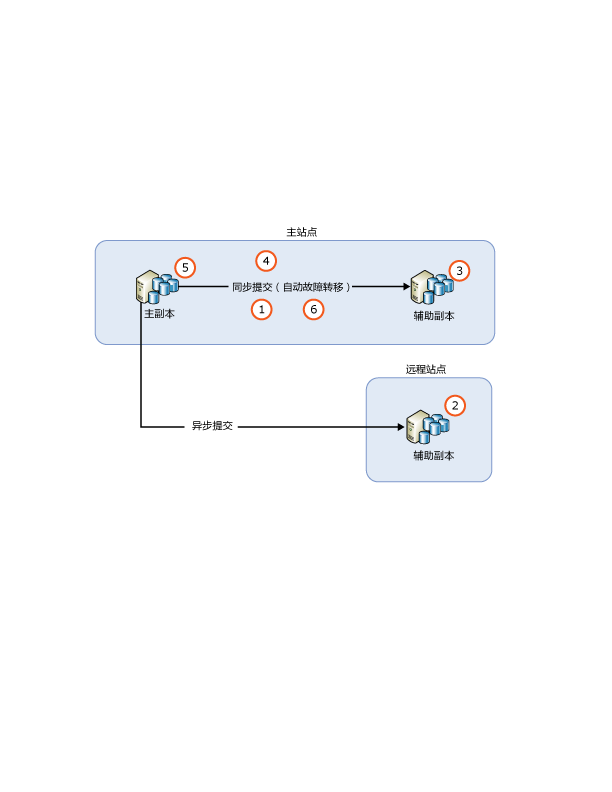
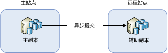
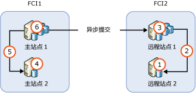

# <a name="upgrading-always-on-availability-group-replica-instances"></a>升级 AlwaysOn 可用性组副本实例
[!INCLUDE[appliesto-ss-xxxx-xxxx-xxx-md](../../../includes/appliesto-ss-xxxx-xxxx-xxx-md.md)]

在将托管 Always On 可用性组 (AG) 的 [!INCLUDE[ssNoVersion](../../../includes/ssnoversion-md.md)] 实例升级到新的 [!INCLUDE[ssCurrent](../../../includes/sscurrent-md.md)] 版本、新的 [!INCLUDE[ssNoVersion](../../../includes/ssnoversion-md.md)] 服务包或积累更新，或在安装到新的 Windows 服务包或积累更新时，可以通过执行滚动升级将主要副本的故障时间降低到仅需一次手动故障转移（或者如果无法故障转移回原始的主要副本，则需两次手动故障转移）。 在升级过程中，次要副本将不可用于故障转移或只读操作，并且在升级之后，次要副本可能需要花费一些时间来与主要副本节点保持同步，具体时间取决于主要副本节点上的活动量（因此需要较高的网络流量）。 另请注意，初始故障转移到运行较新版本 SQL Server 的次要副本后，可用性组中的数据库会运行升级进程，将其升级到最新版本。 在此期间这些数据库都没有可读副本。 初始故障转移之后的故障时间取决于可用性组中的数据库数量。 若计划故障回复至原始的主副本，那么在故障回复时将不会重复此步骤。
  
>[!NOTE]  
>本文仅讨论 SQL Server 本身的升级。 它不涵盖升级包含 Windows Server 故障转移群集 (WSFC) 的操作系统。 Windows Server 2012 R2 之前的操作系统不支持升级承载故障转移群集的 Windows 操作系统。 若要升级在 Windows Server 2012 R2 上运行的群集节点，请参阅[群集操作系统滚动升级](https://docs.microsoft.com/windows-server/failover-clustering/cluster-operating-system-rolling-upgrade)。  
  
## <a name="prerequisites"></a>必备条件  
开始之前，请仔细阅读以下重要信息：  
  
- [支持的版本和版本升级](../../../database-engine/install-windows/supported-version-and-edition-upgrades.md)：验证是否可以从你的 Windows 操作系统版本和 SQL Server 版本升级到 SQL Server 2016。 例如，不能直接从 SQL Server 2005 实例升级到 [!INCLUDE[ssCurrent](../../../includes/sscurrent-md.md)]。  
  
- [选择数据库引擎升级方法](../../../database-engine/install-windows/choose-a-database-engine-upgrade-method.md)：要按正确顺序升级，请检查支持的版本和版本升级以及环境中安装的其他组件，并据此选择适当的升级方法和步骤。  
  
- [计划并测试数据库引擎升级计划](../../../database-engine/install-windows/plan-and-test-the-database-engine-upgrade-plan.md)：查看发行说明和已知升级问题、预升级清单，并制定和测试升级计划。  
  
- [安装 SQL Server 的硬件和软件要求](../../../sql-server/install/hardware-and-software-requirements-for-installing-sql-server.md)：查看安装 [!INCLUDE[ssCurrent](../../../includes/sscurrent-md.md)] 的软件要求。 如果需要其他软件，则应在升级过程开始之前在每个节点上安装该软件，从而最大程度减少故障时间。  

- [检查是否对任何 AG 数据库使用了更改数据捕获或复制](#special-steps-for-change-data-capture-or-replication):如果 AG 中的任何数据库已启用更改数据捕获 (CDC)，请完成这些[指令](#special-steps-for-change-data-capture-or-replication)。

>[!NOTE]  
>在滚动升级之外，不支持在同一 AG 中混合使用 SQL Server 实例版本，并且不应该长时间保持该状态，因为升级应该快速进行。 升级 SQL Server 2016 及更高版本的其他选项是使用分布式可用性组。

## <a name="rolling-upgrade-basics-for-always-on-ags"></a>Always On AG 的滚动升级基础  
在执行服务器升级或更新时请按照以下准则操作，以最大程度减少 AG 的故障时间和数据丢失量：  
  
- 在开始滚动升级前，  
  
    - 至少对一个同步提交副本实例执行实际手动故障转移  
  
    - 通过对每个可用性数据库执行完整数据库备份来保护您的数据  
  
    - 在每个可用性数据库上运行 DBCC CHECKDB  
  
-   始终首先升级远程次要副本实例，然后升级本地次要副本实例，最后升级主要副本实例。  
  
-   无法在正在升级的数据库中执行备份。  在升级辅助副本之前，请将自动备份首选项配置为仅在主副本上运行备份。  在版本升级期间，任何副本都不可读取并且不能用于备份。 在非版本升级期间，可以先配置要在次要副本上运行的自动备份，再升级主要副本。  
  
-   在版本升级期间，在升级可读次要副本之后，以及在主要副本故障转移到已更新的次要副本或者升级主要副本之前，无法读取可读的次要副本。  
  
-   要防止 AG 在升级过程中执行意外的故障转移，请在开始前从所有同步提交副本中删除可用性故障转移。  
  
-   在将 AG 故障转移到具有次要副本的已升级实例之前，不要升级主要副本实例。 否则，在主要副本实例上进行升级期间，客户端应用程序的故障时间可能更长。  
  
-   始终将 AG 故障转移到同步提交的次要副本实例。 如果故障转移到异步提交的次要副本实例，数据库易丢失数据，且数据移动会自动暂停，直到手动恢复数据移动为止。  
  
-   在升级或更新任何其他的次要副本实例之前，不要升级主要副本实例。 已升级的主要副本不再将日志传送到 [!INCLUDE[ssCurrent](../../../includes/sscurrent-md.md)] 实例尚未升级到同一版本的任何次要副本。 在挂起到辅助副本的数据移动时，对于该副本无法进行自动故障转移，且您的可用性数据库很可能发生数据丢失。  
  
-   在故障转移 AG 前，请验证故障转移目标的同步状态为 SYNCHRONIZED。  

  > [!WARNING]
  > 将 SQL Server 的新实例或新版本安装到安装了旧版 SQL Server 的服务器可能会无意中“导致旧版 SQL Server 托管的任何可用性组中断。”  这是因为在安装 SQL Server 实例或版本期间，SQL Server 高可用性模块 (RHS.EXE) 会升级。 这会导致服务器上主要角色中的现有可用性组暂时中断。 因此，强烈建议在将较新版本的 SQL Server 安装到已托管具有可用性组的旧版 SQL Server 系统时执行以下操作之一：
  > - 在维护时段内安装新版本的 SQL Server。 
  > - 将可用性组故障转移到次要副本，这样在安装新 SQL Server 实例期间它便不再是主要副本。 
  
## <a name="rolling-upgrade-process"></a>滚动升级过程  
 实际上，确切的过程取决于一些因素，如 AG 的部署拓扑和每个副本的提交模式。 但在最简单的方案中，滚动升级是涉及以下步骤的多阶段过程：  
  
   
  
1.  在所有同步提交的副本上删除自动故障转移  
  
2.  升级所有异步提交的次要副本实例。 
  
3.  升级所有远程同步提交的次要副本实例。 

4.  升级所有本地同步提交的次要副本实例。 
  
4.  手动将 AG 故障转移到（新升级的）本地同步提交的次要副本。  
  
5.  升级或更新以前承载主要副本的本地副本实例。  
  
6.  根据需要配置自动故障转移伙伴。
  
 如果需要，可以执行额外的手动故障转移将 AG 恢复到原始配置。  
 
   > [!NOTE]
   > - 升级同步提交的副本并使它处于脱机状态不会延迟主要副本上的事务。 次要副本断开连接后，无需等待在次要副本上强制执行日志操作，事务即可在主要副本上提交。 
   > - 如果 `REQUIRED_SYNCHRONIZED_SECONDARIES_TO_COMMIT` 设置为 `1` 或 `2`，那么在更新过程中，当相应数量的同步次要副本不可用时，主要副本则不可用于读/写。 
  
## <a name="ag-with-one-remote-secondary-replica"></a>具有一个远程次要副本的 AG  
 如果仅为灾难恢复部署了一个 AG，可能需要将该 AG 故障转移到异步提交的次要副本。 这样的配置如下图所示：  
  
   
  
 在此情况下，在滚动升级期间必须将 AG 故障转移到异步提交的次要副本。 要防止数据丢失，请在故障转移 AG 前将提交模式更改为同步提交并等待次要副本同步。 因此，滚动升级过程可能如下所示：  
  
1.  在远程站点上升级次要副本实例  
  
2.  将提交模式更改为同步提交  
  
3.  等待直到同步状态为 SYNCHRONIZED  
  
4.  在远程站点上将 AG 故障转移到次要副本  
  
5.  升级或更新本地（主站点）副本实例  
  
6.  将 AG 故障转移回主站点  
  
7.  将提交模式更改为异步提交  
  
 因为同步提交模式不是用于数据同步到远程站点的建议设置，客户端应用程序可能发现在设置更改后，数据库延迟时间立即增加。 此外，执行故障转移将导致丢弃所有未确认的日志消息。 由于两个站点之间的高网络延迟，丢弃的日志消息量可能很大，这导致客户端经历大量事务失败。 可以通过执行以下操作之一来尽量降低对客户端应用程序的影响：  
  
-   在低客户端流量期间认真选择一个维护窗口  
  
-   在主站点上升级/更新 [!INCLUDE[ssCurrent](../../../includes/sscurrent-md.md)] 时，将可用性模式改回异步提交，在准备好再次故障转移到主站点时再将其恢复为同步提交  
  
## <a name="ag-with-failover-cluster-instance-nodes"></a>具有故障转移群集实例节点的 AG  
 如果 AG 包含故障转移群集实例 (FCI) 节点，应先升级不活动的节点，再升级活动的节点。 下图显示一个常见的 AG 方案（它包含 FCI 用于本地高可用性且用于远程灾难恢复的 FCI 之间采用异步提交模式）和升级顺序。  
  
   
  
1.  升级或更新 REMOTE2  
  
2.  将 FCI2 故障转移到 REMOTE2  
  
3.  升级或更新 REMOTE1  
  
4.  升级或更新 PRIMARY2  
  
5.  将 FCI1 故障转移到 PRIMARY2  
  
6.  升级或更新 PRIMARY1  
  
## <a name="upgrade-or-update-sql-server-instances-with-multiple-ags"></a>升级或更新包含多个 AG 的 SQL Server 实例  
 如果正在单独的服务器节点（活动/活动配置）上运行包含主要副本的多个 AG，则升级路径涉及更多故障转移步骤以在过程中保持高可用性。 假定正在所有副本均处于同步提交模式下的三个服务器节点上运行三个 AG，如下表所示：  
  
|AG|Node1|Node2|Node3|  
|------------------------|-----------|-----------|-----------|  
|AG1|主|||  
|AG2||主||  
|AG3|||主|  
  
 按以下顺序执行负载平衡的滚动升级可能适合你的情况：  
  
1.  将 AG2 故障转移到 Node3（以空出 Node2）  
  
2.  升级或更新 Node2  
  
3.  将 AG1 故障转移到 Node2（以空出 Node1）  
  
4.  升级或更新 Node1  
  
5.  将 AG2 和 AG3 故障转移到 Node1（以空出 Node3）  
  
6.  升级或更新 Node3  
  
7.  将 AG3 故障转移到 Node3  
  
 此升级顺序具有每个 AG 小于两个故障转移的平均故障时间。 最终配置如下表所示。  
  
|AG|Node1|Node2|Node3|  
|------------------------|-----------|-----------|-----------|  
|AG1||主||  
|AG2|主|||  
|AG3|||主|  
  
 基于你的特定实现，你的升级路径可能不同，客户端应用程序经历的故障时间也可能不同。  
  
> [!NOTE]  
>  在许多情况下，滚动升级完成后，将会故障转移回原始的主要副本。 

## <a name="rolling-upgrade-of-a-distributed-availability-group"></a>分布式可用性组的滚动升级
要执行分布式可用性组的滚动升级，首先升级所有次要副本。 接下来，故障转移转发器，升级第二个可用性组的最后一个剩余实例。 升级其他所有副本后，故障转移全局主要副本，升级第一个可用性组的最后一个剩余实例。 下面提供了包含步骤的详细关系图。 

 基于你的特定实现，你的升级路径可能不同，客户端应用程序经历的故障时间也可能不同。  
  
> [!NOTE]  
>  在许多情况下，滚动升级完成后，将会故障转移回原始的主要副本。 

### <a name="general-steps-to-upgrade-a-distributed-availability-group"></a>升级分布式可用性组的一般步骤
1. 备份所有数据库，其中包括系统数据库，以及参与可用性组的数据库。 
2. 升级并重启第二个可用性组（下游）的所有次要副本。 
3. 升级并重启第一个可用性组（上游）的所有次要副本。 
4. 将主要转发器故障转移到第二个可用性组的已升级次要副本。
5. 等待数据同步。 数据库应显示为在所有同步提交副本上同步，且全局主要副本应与转发器同步。  
6. 升级并重启第二个可用性组的最后一个剩余实例。 
7. 将全局主要副本故障转移到第一个可用性组的已升级次要副本。  
8. 升级主要可用性组的最后一个剩余实例。
9. 重启新升级的服务器。 
10. （可选）将两个可用性组故障回复到其原始主要副本。  

>[!IMPORTANT]
>- 验证各步骤间的同步。 在进行下一步前，确认同步提交副本在可用性组中同步，且全局主要副本与分布式 AG 中的转发器同步。 
>- **建议**：每当验证同步时，在 SQL Server Management Studio 中刷新数据库节点和分布式 AG 节点。 所有项同步后，保存每个副本状态的屏幕截图。 这有助于跟踪当前步骤，在进行下一步前确保一切运行正常，并帮助你在故障发生时进行故障排除。 


### <a name="diagram-example-for-a-rolling-upgrade-of-a-distributed-availability-group"></a>分布式可用性组的滚动升级的示例图

| 可用性组 (availability group) | 主副本 | 次要副本|
| :------ | :----------------------------- |  :------ |
| AG1 | NODE1\SQLAG | NODE2\SQLAG|
| AG2 | NODE3\SQLAG | NODE4\SQLAG|
| Distributedag| AG1（全局） | AG2（转发器） |
| &nbsp; | &nbsp; | &nbsp; |


此图中关于实例升级的步骤： 

1. 备份所有数据库，其中包括系统数据库，以及参与可用性组的数据库。 
2. 升级 NODE4\SQLAG（AG2 的次要副本）并重启服务器。 
3. 升级 NODE2\SQLAG（AG1 的次要副本）并重启服务器。 
4. 将 AG2 从 NODE3\SQLAG 故障转移到 NODE4\SQLAG。 
5. 升级 NODE3\SQLAG 并重启服务器。 
6. 将 AG1 从 NODE1\SQLAG 故障转移到 NODE2\SQLAG。 
7. 升级 NODE1\SQLAG 并重启服务器。 
8. （可选）故障回复到原始主要副本。
    1. 将 AG2 从 NODE4\SQLAG 故障转移到 NODE3\SQLAG。  
    2. 将 AG1 从 NODE2\SQLAG 故障转移到 NODE1\SQLAG。 

如果每个可用性组中存在第三个副本，将在 NODE3\SQLAG and NODE1\SQLAG 前升级。 

>[!IMPORTANT]
>- 验证各步骤间的同步。 在进行下一步前，确认同步提交副本在可用性组中同步，且全局主要副本与分布式 AG 中的转发器同步。 
>- 建议：每当验证同步时，在 SQL Server Management Studio 中刷新数据库节点和分布式 AG 节点。 同步所有项后，拍摄屏幕快照并保存。 这有助于跟踪当前步骤，在进行下一步前确保一切运行正常，并帮助你在故障发生时进行故障排除。 


## <a name="special-steps-for-change-data-capture-or-replication"></a>更改数据捕获或复制的特殊步骤

根据正在应用的更新，其他步骤可能需要 AG 副本数据库启用变更数据捕获或复制。 请参阅更新的发行说明以确定是否需要执行以下步骤：

1. 升级每个次要副本。

1. 升级所有次要副本之后，将 AG 故障转移到已升级的实例。 

1. 在托管主要副本的实例上运行下列 Transact-SQL：

   ```sql
   EXECUTE [master].[sys].[sp_vupgrade_replication];
   ```

   >[!NOTE]
   >此命令可能需要几分钟才能运行。 

1. 升级最初为主要副本的实例。

有关背景信息，请参阅[升级到最新 CU 后，CDC 功能可能会中断](https://blogs.msdn.microsoft.com/sql_server_team/cdc-functionality-may-break-after-upgrading-to-the-latest-cu-for-sql-server-2012-2014-and-2016/)。

  
## <a name="see-also"></a>另请参阅  
 [使用安装向导（安装程序）升级到 SQL Server 2016](../../../database-engine/install-windows/upgrade-sql-server-using-the-installation-wizard-setup.md)   

 [从命令提示符安装 SQL Server 2016](../../../database-engine/install-windows/install-sql-server-2016-from-the-command-prompt.md)  
  
  
