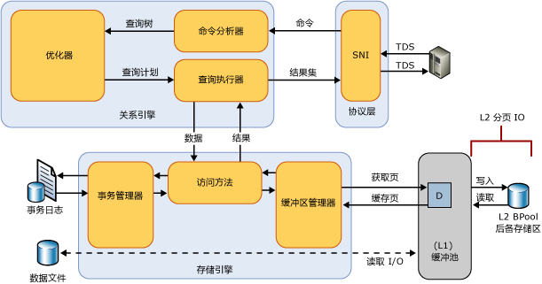

# 缓冲池扩展
[!INCLUDE[appliesto-ss-xxxx-xxxx-xxx-md](../../includes/appliesto-ss-xxxx-xxxx-xxx-md.md)]
  [!INCLUDE[ssSQL14](../../includes/sssql14-md.md)]中引入的缓冲池扩展提供 [!INCLUDE[ssDE](../../includes/ssde-md.md)] 缓冲池的非易失性随机存取内存（即固态硬盘）扩展的无缝集成，从而显著提高 I/O 吞吐量。 并非每个 [!INCLUDE[ssNoVersion](../../includes/ssnoversion-md.md)] 版本均提供了缓冲池扩展。 有关详细信息，请参阅 [SQL Server 2016 各个版本支持的功能](~/sql-server/editions-and-supported-features-for-sql-server-2016.md)。  
  
## 缓冲池扩展的优点  
 [!INCLUDE[ssNoVersion](../../includes/ssnoversion-md.md)] 数据库的主要用途是存储和检索数据，因此，大量磁盘 I/O 是该数据库引擎的一个核心特点。 由于磁盘 I/O 操作可能会占用消耗很多资源并且耗时较长，所以 [!INCLUDE[ssNoVersion](../../includes/ssnoversion-md.md)] 侧重于使 I/O 极为高效。 缓冲池用作 [!INCLUDE[ssNoVersion](../../includes/ssnoversion-md.md)]的主内存分配源。 缓冲区管理是实现高效 I/O 操作的关键环节。 缓冲区管理组件由下列两种机制组成：用于访问及更新数据库页的缓冲区管理器和用于减少数据库文件 I/O 的缓冲池。  
  
 数据和索引页从磁盘读入缓冲池，修改后的页（也称为脏页）写回磁盘。 服务器和数据库检查点上的内存压力会造成缓冲区缓存中的热（活动）脏页被逐出缓存并写入机械磁盘，然后又读回到缓存中。 这些 I/O 操作通常是 4 到 16 KB 数据的小型随机读和写操作。 小型随机 I/O 模式会导致频繁搜索、机械磁盘臂争用、I/O 滞后时间延长以及系统的总 I/O 吞吐量减少。  
  
 解决这些 I/O 瓶颈的典型方法是添加更多 DRAM，或者添加高性能 SAS 主轴。 虽然这些方法很有用，但它们有重大缺点：DRAM 比数据存储驱动器更昂贵，增加主轴数会增加硬件购置的资本支出，并且功耗和部件故障概率都会提高，从而增加运行成本。  
  
 缓冲池扩展功能通过非易失性存储器（通常为 SSD）来扩展缓冲池缓存。 由于这种扩展，缓冲池可以容纳更大的数据库工作集，可强制在 RAM 和 SSD 之间对 I/O 分页。 这会有效地将小型随机 I/O 从机械磁盘卸载到固态硬盘。 由于固态硬盘滞后时间短且具有更佳随机 I/O 性能，缓冲池扩展可显著提高 I/O 吞吐量。  
  
 下面的列表说明了缓冲池扩展功能的优点。  
  
-   随机 I/O 吞吐量提高  
  
-   I/O 滞后时间缩短  
  
-   事务吞吐量提高  
  
-   由于采用更大的混合缓冲池，读取性能提高  
  
-   具有一种可利用现有和将来的低成本内存驱动器的缓存体系结构  
  
### 概念  
 以下术语适用于缓冲池扩展功能。  
  
 固态硬盘 (SSD)  
 固态硬盘将数据永久存储在内存 (RAM) 中。 有关详细信息，请参阅 [此定义](https://en.wikipedia.org/wiki/Solid-state_drive)。  
  
 缓冲区  
 在 [!INCLUDE[ssNoVersion](../../includes/ssnoversion-md.md)]中，一个缓冲区就是一个 8 KB 大小的内存页，其大小与一个数据页或索引页相同。 因此，缓冲区缓存被划分为多个 8-KB 页。 缓冲区缓存中会保留一页，直到缓冲区管理器需要该缓冲区读入更多数据。 数据只有在被修改后才重新写入磁盘。 这些内存中已修改的页称为脏页。 当一页等同于它在磁盘上的数据库映像时，该页就是干净页。 在将缓冲区缓存中的数据写回磁盘之前，可对其进行多次修改。  
  
 缓冲池  
 也称为缓冲区缓存。 缓冲池是一个由所有数据库共享的全局资源，用于存放其缓存数据页。 缓冲池缓存的最大和最小大小是在启动期间或使用 sp_configure 动态重新配置 SQL Server 实例时确定的。 此大小确定了运行的实例中在任何时候都可以缓存在缓冲池中的最大页数。  
  
 缓冲池扩展所能承诺的最大内存在产生很大内存压力的情况下，可能会受到运行在计算机上的其他应用程序的限制。  
  
 检查点  
 检查点会创建一个已知的正常点，在意外关闭或崩溃后的恢复过程中， [!INCLUDE[ssDE](../../includes/ssde-md.md)] 可以从该点开始应用事务日志中包含的更改。 检查点将脏页和事务日志信息从内存写入磁盘，并记录有关事务日志的信息。 有关详细信息，请参阅[数据库检查点 (SQL Server)](../../relational-databases/logs/database-checkpoints-sql-server.md)。  
  
## 缓冲池扩展详细信息  
 SSD 存储用作内存子系统的扩展而不是磁盘存储子系统的扩展。 也就是说，通过缓冲池扩展文件，缓冲池管理器可以使用 DRAM 和 NAND 闪存，在由固态硬盘支持的非易失性随机存取内存中保持一个大得多的温热页缓冲池。 这会在固态硬盘上创建一个多级缓存层次结构，级别 1 (L1) 作为 DRAM，级别 2 (L2) 作为缓冲池扩展文件。 仅将干净页写入 L2 缓存，以帮助确保数据安全。 缓冲区管理器会处理 L1 和 L2 缓存之间的干净页移动。  
  
 下图所示为缓冲池相对于其他 [!INCLUDE[ssNoVersion](../../includes/ssnoversion-md.md)] 组件的高级体系结构概览。  
  
   
  
 启用缓冲池扩展后，该功能会指定固态硬盘上缓冲池缓存文件的大小和文件路径。 此文件是固态硬盘上的一个连续存储范围，是在 [!INCLUDE[ssNoVersion](../../includes/ssnoversion-md.md)]实例启动期间静态配置的。 只有在禁用了缓冲池扩展功能的情况下，才能修改此文件的配置参数。 禁用缓冲池扩展后，将从注册表中删除所有相关的配置设置。 SQL Server 实例关闭时，将会删除缓冲池扩展文件。  
  
## 最佳实践  
 我们建议您遵循以下最佳做法。  
  
-   首次启用缓冲池扩展后，建议重新启动 SQL Server 实例，以获得最大的性能优势。  
  
-   缓冲池扩展大小最大可为 max_server_memory 值的 32 倍。  我们建议物理内存 (max_server_memory) 的大小与缓冲池扩展的大小之比不应超过 1:16。 介于 1:4 至 1:8 之间的比率是最佳的。 有关设置 max_server_memory 选项的信息，请参阅 [服务器内存服务器配置选项](../../database-engine/configure-windows/server-memory-server-configuration-options.md)。  
  
-   在生产环境中实现之前，应彻底测试缓冲池扩展。 处于生产过程中时，请避免对该文件进行配置更改或关闭该功能。 因为禁用该功能时会大大减小缓冲池大小，所以这些活动可能会对服务器性能产生负面影响。 禁用时，不回收用于支持该功能的内存，直到重新启动 SQL Server 的实例。 但是，如果重新启用该功能，将重用内存而不必重新启动实例。  
  
## 返回有关缓冲池扩展的信息  
 您可以使用以下动态管理视图来显示缓冲池扩展的配置并返回有关扩展中的数据页的信息。  
  
-   [sys.dm_os_buffer_pool_extension_configuration (Transact-SQL)](../../relational-databases/system-dynamic-management-views/sys-dm-os-buffer-pool-extension-configuration-transact-sql.md)  
  
-   [sys.dm_os_buffer_descriptors (Transact-SQL)](../../relational-databases/system-dynamic-management-views/sys-dm-os-buffer-descriptors-transact-sql.md)  
  
 SQL Server 缓冲区管理器对象中提供了用于跟踪缓冲池扩展文件中的数据页的性能计数器。 有关详细信息，请参阅 [缓冲池扩展性能计数器](../../relational-databases/performance-monitor/sql-server-buffer-manager-object.md)。  
  
 提供了以下 Xevent：  
  
|XEvent|描述|Parameters|  
|------------|-----------------|----------------|  
|sqlserver.buffer_pool_extension_pages_written|在将页或页组从缓冲池逐出并写入缓冲池扩展文件时激发。|*number_page*   *first_page_id*   *first_page_offset*   *initiator_numa_node_id*|  
|sqlserver.buffer_pool_extension_pages_read|在将页从缓冲池扩展文件读取到缓冲池时激发。|*number_page*   *first_page_id*   *first_page_offset*   *initiator_numa_node_id*|  
|sqlserver.buffer_pool_extension_pages_evicted|在将页从缓冲池扩展文件中逐出时激发。|*number_page*   *first_page_id*   *first_page_offset*   *initiator_numa_node_id*|  
|sqlserver.buffer_pool_eviction_thresholds_recalculated|在计算逐出阈值时激发。|*warm_threshold*   *cold_threshold*   *pages_bypassed_eviction*   *eviction_bypass_reason*   *eviction_bypass_reason_description*|  
  
## Related Tasks  
  
|||  
|-|-|  
|**任务说明**|**主题**|  
|启用和配置缓冲池扩展。|[ALTER SERVER CONFIGURATION (Transact-SQL)](../../t-sql/statements/alter-server-configuration-transact-sql.md)|  
|修改缓冲池扩展配置|[ALTER SERVER CONFIGURATION (Transact-SQL)](../../t-sql/statements/alter-server-configuration-transact-sql.md)|  
|查看缓冲池扩展配置|[sys.dm_os_buffer_pool_extension_configuration (Transact-SQL)](../../relational-databases/system-dynamic-management-views/sys-dm-os-buffer-pool-extension-configuration-transact-sql.md)|  
|监视缓冲池扩展|[sys.dm_os_buffer_descriptors (Transact-SQL)](../../relational-databases/system-dynamic-management-views/sys-dm-os-buffer-descriptors-transact-sql.md)   [性能计数器](../../relational-databases/performance-monitor/sql-server-buffer-manager-object.md)|  
  
  
