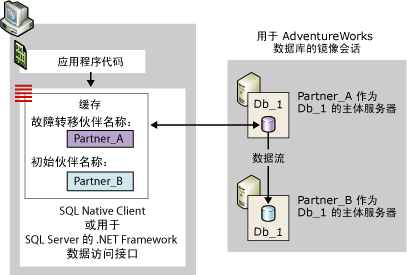
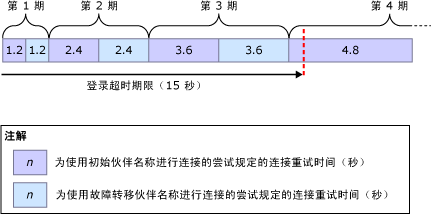
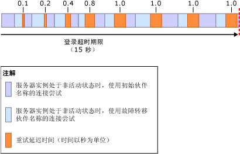

# <a name="connect-clients-to-a-database-mirroring-session-sql-server"></a>将客户端连接到数据库镜像会话 (SQL Server)
[!INCLUDE[appliesto-ss-xxxx-xxxx-xxx-md](../../includes/appliesto-ss-xxxx-xxxx-xxx-md.md)]
  若要连接到数据库镜像会话，客户端可以使用 [!INCLUDE[ssNoVersion](../../includes/ssnoversion-md.md)] Native Client 或 [!INCLUDE[ssNoVersion](../../includes/ssnoversion-md.md)]的 .NET Framework 数据访问接口。 针对 [!INCLUDE[ssCurrent](../../includes/sscurrent-md.md)] 数据库进行配置时，这些数据访问接口完全支持数据库镜像。 有关使用镜像数据库的编程注意事项的信息，请参阅 [Using Database Mirroring](../../relational-databases/native-client/features/using-database-mirroring.md)。 此外，当前主体服务器实例必须可用，并且必须已在服务器实例上创建客户端登录。 有关详细信息，请参阅 [孤立用户故障排除 (SQL Server)](../../sql-server/failover-clusters/troubleshoot-orphaned-users-sql-server.md)。 客户端与数据库镜像会话的连接不涉及见证服务器实例（如果存在）。  
  
  
##  <a name="InitialConnection"></a> 建立到数据库镜像会话的初始连接  
 对于到镜像数据库的初始连接，客户端必须提供一个至少提供服务器实例名称的连接字符串。 这个必需的服务器名称应标识当前主体服务器实例，并称为“初始伙伴名称” 。  
  
 另外，连接字符串还可以提供另一个服务器实例的名称，此名称应标识当前镜像服务器实例，以便在首次连接尝试期间初始伙伴不可用的情况下使用。 第二个名称称为“故障转移伙伴名称” 。  
  
 连接字符串还必须提供数据库名称。 这是数据访问接口启用故障转移尝试所必需的。  
  
 接收连接字符串后，数据访问接口将初始伙伴名称和故障转移伙伴名称（如果提供）存储在客户端易失内存的缓存中（对于托管代码，缓存的作用域限定为应用程序域）。 缓存后，数据访问接口将从不对初始伙伴名称进行更新。 客户端提供故障转移伙伴名称时，数据访问接口还暂时存储此故障转移伙伴名称，以防出现访问接口无法使用初始伙伴名称进行连接的情况。  
  
 数据库镜像会话无法避免与客户端相关的服务器访问问题，例如，客户端计算机出现网络通信问题时。 到镜像数据库的连接尝试也可能会因为各种与数据访问接口无关的原因而失败；例如，连接尝试可能会因为下列情况而失败：主体服务器实例处于不活动状态（如同数据库进行故障转移时发生的情况）或者网络错误。  
  
 尝试连接时，数据访问接口首先使用初始伙伴名称。 如果指定的服务器实例可用并且为当前主体服务器实例，则连接尝试通常都会成功。  
  
> [!NOTE]  
>  如果镜像会话暂停，则客户端通常连接到主体服务器并下载伙伴名称。 但是，在恢复镜像之前，数据库不可用于客户端。  
  
 如果此尝试失败，则数据访问接口将尝试使用故障转移伙伴名称（如果可用）。 如果任一伙伴名称都正确标识了当前主体服务器，则数据访问接口通常都会成功打开初始连接。 完成此连接后，数据访问接口将下载当前镜像服务器的服务器实例名称。 此名称作为故障转移伙伴名称存储在缓存中，从而覆盖客户端提供的故障转移伙伴名称（如果有）。 此后，.NET Framework Data Provider for [!INCLUDE[ssNoVersion](../../includes/ssnoversion-md.md)] 不会更新故障转移伙伴名称。 相反，每当后续连接或连接重置返回不同的伙伴名称时， [!INCLUDE[ssNoVersion](../../includes/ssnoversion-md.md)] Native Client 便会更新高速缓存。  
  
 下图针对名为 **Db_1**的镜像数据库说明了到初始伙伴 **Partner_A**的客户端连接。 此图显示的情况是：客户端提供的初始伙伴名称正确标识了当前主体服务器 **Partner_A**。 初始连接尝试成功，数据访问接口在其本地缓存中将镜像服务器（当前为 **Partner_B**）的名称存储为故障转移伙伴名称。 最后，客户端连接到 **Db_1** 数据库的主体副本。  
  
   
  
 初始连接尝试可能会失败，例如，因为网络错误或不活动的服务器实例。 由于初始伙伴不可用，因此要让数据访问接口尝试连接到故障转移伙伴，客户端必须在连接字符串中提供故障转移伙伴的名称。  
  
 在这种情况下，如果故障转移伙伴名称不可用，则原始连接尝试将继续，直到网络连接超时或返回错误（与非镜像数据库的情况相同）。  
  
 连接字符串中提供故障转移伙伴名称时，数据访问接口的行为取决于网络协议和客户端的操作系统，如下所示：  
  
-   对于 TCP/IP，使用与数据库镜像相关的连接重试算法调整连接尝试。 连接重试算法确定在给定连接尝试中为打开连接所分配的最长时间（重试时间）。  
  
-   对于其他网络协议  
  
     如果发生错误或者初始伙伴不可用，则初始连接尝试将处于等待状态，直到数据访问接口上的网络连接超时期限过期或登录超时期限过期。 通常，此等待时间大约为 20 至 30 秒。 此后，如果数据访问接口尚未超时，则它会尝试连接到故障转移伙伴。 如果连接超时期限过期而未成功连接或者故障转移伙伴不可用，则连接尝试会失败。 如果故障转移伙伴在登录超时期限内可用并且现在为主体服务器，则连接尝试通常都会成功。  
  
  
### <a name="connection-strings-for-a-mirrored-database"></a>镜像数据库的连接字符串  
 客户端提供的连接字符串包含数据访问接口用于连接到数据库的信息。 本部分介绍了与使用 [!INCLUDE[ssNoVersion](../../includes/ssnoversion-md.md)] Native Client ODBC 驱动程序连接连接到镜像数据库特定相关的关键字。  
  
#### <a name="network-attribute"></a>Network 属性  
 连接字符串应包含 **Network** 属性，以指定网络协议。 这可确保到不同伙伴的连接之间存在指定的网络协议。 连接到镜像数据库的最佳协议是 TCP/IP。 为了确保客户端针对每个到伙伴的连接都请求 TCP/IP，连接字符串提供以下属性：  
  
```  
Network=dbmssocn;   
```  
  
> [!IMPORTANT]  
>  建议将 TCP/IP 始终放在客户端协议列表的顶部。 不过，如果连接字符串指定了 **Network** 属性，则会替代列表顺序。  
  
 另外，为了确保客户端针对每个到伙伴的连接都请求 Named Pipes，连接字符串提供以下属性：  
  
```  
Network=dbnmpntw;   
```  
  
> [!IMPORTANT]  
>  由于 Named Pipes 不使用 TCP/IP 重试算法，因此在很多情况下，Named Pipes 连接尝试可能会在连接到镜像数据库之前超时。  
  
#### <a name="server-attribute"></a>Server 属性  
 连接字符串必须包含 **Server** 属性以提供初始伙伴名称，该名称应标识当前主体服务器实例。  
  
 标识服务器实例的最简单方法是指定其名称 <server_name>[\\<SQL_Server_instance_name>]。 例如：  
  
 `Server=Partner_A;`  
  
 或多个  
  
 `Server=Partner_A\Instance_2;`  
  
 但是，使用系统名称时，客户端必须执行 DNS 查找以获取服务器的 IP 地址，执行 SQL Server Browser 查询以获取伙伴所在服务器的端口号。 通过在 **Server** 属性中指定伙伴的 IP 地址和端口号（而不是指定服务器名称），可以绕过这些查找和查询。 建议跳过这些查找和查询，以最大程度地降低连接到此伙伴时出现外部延迟的几率。  
  
> [!NOTE]  
>  如果连接字符串指定命名实例的名称而不是端口，则 SQL Server Browser 查询是必需的。  
  
 若要指定 IP 地址和端口，**Server** 属性采用以下格式：`Server=`<ip_address>`,`\<port>，例如：  
  
```  
Server=123.34.45.56,4724;   
```  
  
> [!NOTE]  
>  IP 地址可以是 IP 版本 4 (IPv4) 或 IP 版本 6 (IPv6)。  
  
#### <a name="database-attribute"></a>Database 属性  
 此外，连接字符串还必须指定 **Database** 属性以提供镜像数据库的名称。 如果客户端尝试连接时指定的数据库不可用，将引发异常。  
  
 例如，若要明确连接到主体服务器 Partner_A 上的 **AdventureWorks** 数据库，客户端应使用以下连接字符串：  
  
 `" Server=Partner_A; Database=AdventureWorks "`  
  
> [!NOTE]  
>  此字符串未包含身份验证信息。  
  
> [!IMPORTANT]  
>  如果将协议前缀和 **Server** 属性 (`Server=tcp:`\<servername>) 绑定在一起，则会导致与 **Network** 属性不兼容；如果在这两个位置都指定了协议，则可能会导致错误。 因此，建议连接字符串使用 **Network** 属性指定协议，并且仅在 **Server** 属性 (`"Network=dbmssocn; Server=`\<servername>`"`) 中指定服务器名称。  
  
#### <a name="failover-partner-attribute"></a>Failover Partner 属性  
 除了初始伙伴名称以外，客户端还可以指定应标识当前镜像服务器实例的故障转移伙伴名称。 故障转移伙伴是由 failover partner 属性的某个关键字指定的。 具体由该属性的哪个关键字指定取决于您所使用的 API。 下表列出了这些关键字：  
  
|API|failover partner 属性的关键字|  
|---------|--------------------------------------------|  
|OLE DB 访问接口|**FailoverPartner**|  
|ODBC 驱动程序|**Failover_Partner**|  
|ActiveX 数据对象 (ADO)|**Failover Partner**|  
  
 标识服务器实例的最简单方法是指定其名称 <server_name>[\\<SQL_Server_instance_name>]。  
  
 另外，也可以在 **Failover Partner** 属性中提供 IP 地址和端口号。 如果首次连接到数据库时初始连接尝试失败，则到故障转移伙伴的连接尝试将不会依赖于 DNS 和 SQL Server Browser。 建立连接后，便会使用故障转移伙伴名称覆盖故障转移伙伴名称，因此，如果发生故障转移，则重定向的连接将需要 DNS 和 SQL Server Browser。  
  
> [!NOTE]  
>  如果仅提供了初始伙伴名称，则应用程序开发人员不需要执行任何操作，也不需要编写除了有关如何重新连接的代码之外的任何代码。  
  
> [!NOTE]  
>  托管代码应用程序开发人员在 **ConnectionString** 对象的 **SqlConnection** 中提供故障转移伙伴名称。 有关使用此连接字符串的信息，请参阅 ADO.NET 文档（ [!INCLUDE[msCoName](../../includes/msconame-md.md)] .NET Framework SDK 中包含此文档）中的“Database Mirroring Support in the .NET Framework Data Provider for SQL Server”。  
  
#### <a name="example-connection-string"></a>连接字符串示例  
 例如，为了使用 TCP/IP 显式连接到 Partner_A 或 Partner_B 上的 **AdventureWorks** 数据库，使用 ODBC 驱动程序的客户端应用程序可能会提供以下连接字符串：  
  
```  
"Server=Partner_A; Failover_Partner=Partner_B; Database=AdventureWorks; Network=dbmssocn"  
```  
  
 另外，客户端还可以使用 IP 地址和端口号标识初始伙伴 Partner_A；例如，如果 IP 地址为 250.65.43.21，端口号为 4734，则连接字符串将为：  
  
```  
"Server=250.65.43.21,4734; Failover_Partner=Partner_B; Database=AdventureWorks; Network=dbmssocn"  
```  
  
##  <a name="RetryAlgorithm"></a> 连接重试算法（用于 TCP/IP 连接）  
 对于 TCP/IP 连接，在两个伙伴名称都在缓存中时，数据访问接口遵循连接重试算法。 不论是初次与会话建立连接，还是在中断已建立连接后重新连接，这都适用。 打开连接之后，还需要一些时间完成预登录和登录的步骤。  
  
> [!NOTE]  
>  打开连接所用的时间可能会超过重试时间，这是由于下列外部因素所致：DNS 查找速度缓慢、域控制器/Kerberos 密钥发行中心 (KDC) 速度缓慢、联系 SQL Server Browser 需要时间、网络阻塞等。 此类外部因素可能会阻止客户端连接到镜像数据库。 此外，外部因素还可能会导致打开连接所用的时间长于分配的重试时间。 有关跳过 DNS 和 SQL Server Browser 以尝试连接到初始伙伴的信息，请参阅本主题前面的 [建立到数据库镜像会话的初始连接](#InitialConnection)。  
  
 如果连接尝试失败或者重试时间过期而未成功重试，则数据访问接口将尝试使用另一个伙伴。 如果此时未打开连接，则数据访问接口还会尝试使用初始伙伴名称和故障转移伙伴名称，直到连接打开或登录期限超时。默认的登录超时期限为 15 秒。 建议登录超时期限至少为 5 秒。 如果指定较短的超时期限，则可能导致连接尝试失败。  
  
 重试时间为登录期限的某个百分比数。 在后续的每轮中，连接尝试的重试时间会逐渐变大。 在第一轮中，两次尝试的每次重试时间都是总登录时间的 8%。 在后续的每轮中，重试算法会按相同的百分比增加最大重试时间。 因此，前八次连接尝试的重试时间如下：  
  
 8%、8%、16%、16%、24%、24%、32%、32%  
  
 重试时间使用以下公式进行计算：  
  
 *RetryTime* **=** *PreviousRetryTime* **+(** 0.08 **\****LoginTimeout***)**  
  
 其中， *PreviousRetryTime* 初始值为 0。  
  
 例如，如果使用默认的登录超时期限 15 秒，则 *LoginTimeout* *= 15*。 在这种情况下，前三轮中分配的重试时间如下：  
  
|舍入|*RetryTime* 计算|每次尝试的重试时间|  
|-----------|-----------------------------|----------------------------|  
|@shouldalert|0 **+(** 0.08 **\*** 15 **)**|1.2 秒|  
|2|1.2 **+(** 0.08 **\*** 15 **)**|2.4 秒|  
|3|2.4 **+(** 0.08 **\*** 15 **)**|3.6 秒|  
|4|3.6 **+(** 0.08 **\*** 15 **)**|4.8 秒|  
  
 下图说明了这些后续连接尝试的重试时间，每个重试时间均超时。  
  
   
  
 对于默认的登录超时期限，分配给前三轮连接尝试的最长时间为 14.4 秒。 如果每次尝试都使用了它的全部分配时间，则在登录期限超时之前仅剩下 0.6 秒的时间。在这种情况下，第四轮的时间会缩短，仅允许使用初始伙伴名称进行最后的快速连接尝试。 但是，连接尝试可能会在其分配的重试时间内失败，尤其是在稍后的轮次中。 例如，接收网络错误可能会导致在重试时间到期之前尝试便已结束。 如果较早的尝试因网络错误而失败，则可以为第四轮（还可能包括更多轮）提供更多的时间。  
  
 尝试失败的另一个原因是服务器实例处于不活动状态，如同服务器实例执行数据库故障转移时发生的情况。 在这种情况下，可以利用重试延迟时间来防止客户端因快速进行后续连接尝试而导致伙伴重载。  
  
> [!NOTE]  
>  当两个伙伴名称均可用时，如果登录超时期限无限大，则客户端会交替使用初始伙伴名称和故障转移伙伴名称，无限期地尝试重新连接到服务器。  
  
  
### <a name="retry-delays-during-failover"></a>故障转移期间的重试延迟时间  
 如果客户端尝试连接到进行故障转移的伙伴，则此伙伴会立即做出响应表明它处于不活动状态。 在这种情况下，每轮连接尝试都会比分配的重试时间更短暂。 也就是说，在登录期限超时之前会发生多轮连接尝试。为了避免在故障转移期间因一系列快速的连接尝试而导致伙伴重载，数据访问接口在每次重试循环之后增加了短暂的重试延迟时间。 给定重试延迟时间的长度由重试延迟时间算法确定。 在第一轮之后，延迟时间为 100 毫秒。 在接下来三轮的每轮之后，重试延迟时间加倍，分别达到 200、400 和 800。 对于所有的稍后轮次，重试延迟时间为 1 秒，直到连接尝试成功或超时。  
  
> [!NOTE]  
>  如果服务器实例停止，则连接请求会立即失败。  
  
 下图说明了在手动故障转移（其中伙伴会切换其角色）期间重试延迟时间如何影响连接尝试。 登录超时期限为 15 秒。  
  
   
  
##  <a name="Reconnecting"></a> 重新连接到数据库镜像会话  
 如果已建立的到数据库镜像会话的连接因某种原因（例如，由于数据库镜像故障转移）而失败，但应用程序尝试重新连接到初始服务器，则数据访问接口可以尝试使用客户端缓存中存储的故障转移伙伴名称进行重新连接。 但是，重新连接不是自动进行的， 应用程序必须能够识别错误。 然后，应用程序需要关闭失败的连接并使用相同的连接字符串属性打开新连接。 此时，数据访问接口将连接重定向到故障转移伙伴。 如果由此名称标识的服务器实例当前为主体服务器，则连接尝试通常都会成功。 如果不确定事务已提交还是回滚，则应用程序必须检查事务的状态，检查方法与重新连接到独立服务器实例时所用的方法相同。  
  
 重新连接类似于连接字符串为其提供故障转移伙伴名称的初始连接。 如果首次连接尝试失败，则连接尝试会反复轮流使用初始伙伴名称和故障转移伙伴名称，直到客户端连接到主体服务器或数据访问接口超时。  
  
> [!NOTE]  
>  [!INCLUDE[ssNoVersion](../../includes/ssnoversion-md.md)] Native Client 验证它是否连接到主体服务器实例，但不验证此实例是否为连接字符串初始伙伴名称中指定的服务器实例的伙伴。  
  
 如果连接使用 TCP/IP，则连接重试算法将确定为每一轮连接尝试所分配的时间。  
  
> [!IMPORTANT]  
>  如果客户端与数据库断开连接，则数据访问接口不会尝试重新连接。 客户端必须发出新的连接请求。 同样，如果应用程序因中断连接而关闭，则会丢失已缓存的伙伴名称。 如果因为主体服务器不可用而中断连接，则应用程序可重新连接到镜像服务器的唯一方法是在其连接字符串中提供故障转移伙伴名称。  
  
  
### <a name="impact-of-redirection-on-a-client-application"></a>重定向对客户端应用程序的影响  
 故障转移之后，数据访问接口将连接重定向到当前主体服务器实例。 但是，重定向对客户端是透明的。 对于客户端，重定向的连接似乎是由初始伙伴名称标识的到服务器实例的连接。 初始伙伴当前为镜像服务器时，客户端似乎可以连接到镜像服务器并更新镜像数据库。 但实际上，客户端已重定向到故障转移伙伴（当前主体数据库）并更新新的主体数据库。  
  
 重定向到故障转移伙伴之后，客户端在通过 [!INCLUDE[tsql](../../includes/tsql-md.md)] USE 语句以使用其他数据库时可能会出现意外结果。 如果当前主体服务器实例（故障转移伙伴）具有不同于原始主体服务器（初始伙伴）的一组数据库，则会出现这种情况。  
  
##  <a name="Benefits"></a>   
  
##  <a name="StalePartnerName"></a> 已过时故障转移伙伴名称的影响  
 数据库管理员可以随时更改故障转移伙伴。 因此，客户端提供的故障转移伙伴名称可能已过时。 例如，假设名为 Partner_B 的故障转移伙伴已由另一个服务器实例 Partner_C 替换。 现在，如果客户端提供 Partner_B 作为故障转移伙伴名称，则该名称已过时。 如果客户端提供的故障转移伙伴名称已过时，数据访问接口的行为与客户端未提供故障转移伙伴名称时的行为相同。  
  
 例如，假设客户端使用一个连接字符串连续进行四次连接尝试。 在此连接字符串中，初始伙伴名称为 Partner_A，故障转移伙伴名称为 Partner_B：  
  
```  
"Server=Partner_A; Failover Partner=Partner_B; Database=AdventureWorks"  
```  
  
 下表显示了四个伙伴配置，并指示了对于每个配置，此连接字符串是否可以用于与客户端进行第一次连接。  
  
> [!NOTE]  
>  应用程序可以跟踪配置更改并相应地更改其连接字符串。 这要求使用额外的代码但同时要求减轻管理负担。  
  
|配置|主体服务器|镜像服务器|尝试与指定的 Partner_A 和 Partner_B 进行连接时的行为|  
|-------------------|----------------------|-------------------|------------------------------------------------------------------------------|  
|原始镜像配置。|Db_1|Partner_B|Partner_A 作为初始伙伴名称保存在缓存中。 客户端成功连接到 Partner_A。 客户端下载镜像服务器的名称 Partner_B 并将其保存在缓存中，同时忽略客户端提供的故障转移伙伴名称。|  
|Partner_A 出现硬件故障，并进行了故障转移（从客户端断开连接）。|Partner_B|none|Partner_A 仍作为初始伙伴名称保存在缓存中，但却使用客户端提供的故障转移伙伴名称 Partner_B 使客户端连接到当前的主体服务器。|  
|数据库管理员停止镜像（从客户端断开连接），用 Partner_C 替换 Partner_A，然后重新启动镜像。|Partner_B|Partner_C|客户端尝试连接到 Partner_A 并且连接失败，然后客户端尝试连接到 Partner_B（当前的主体服务器）并成功连接。 数据访问接口下载当前镜像服务器 Partner_C 的名称，并将其缓存为当前故障转移伙伴名称。|  
|手动将服务故障转移到 Partner_C（从客户端断开连接）。|Partner_C|Partner_B|客户端最初尝试连接到 Partner_A，然后又尝试连接到 Partner_B，但均未成功。 最后，连接请求超时，无法成功连接。|  
  
  
## <a name="see-also"></a>另请参阅  
 [数据库镜像 (SQL Server)](../../database-engine/database-mirroring/database-mirroring-sql-server.md)   
 [数据库镜像期间可能出现的故障](../../database-engine/database-mirroring/possible-failures-during-database-mirroring.md)  
  
  
