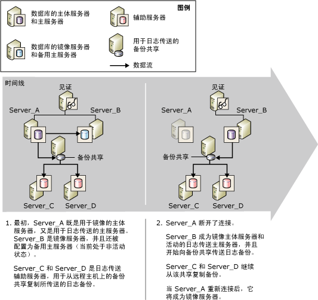

# 数据库镜像和日志传送 (SQL Server)
[!INCLUDE[appliesto-ss-xxxx-xxxx-xxx-md](../../includes/appliesto-ss-xxxx-xxxx-xxx-md.md)]
  可以镜像或使用日志传送给定的数据库；也可以同时镜像并使用日志传送该数据库。 若要选择使用的方法，请考虑下列事项：  
  
-   需要多少个目标服务器？  
  
     如果只需要一个目标数据库，建议使用数据库镜像解决方案。  
  
     如果需要多个目标数据库，则需要使用日志传送（可以单独使用，也可以与数据库镜像一起使用）。 如果将这两种方法组合使用，就既能享有数据库镜像的好处，又能获得日志传送提供的多个目标数据库的支持。  
  
-   如果需要延迟还原目标数据库的日志（通常是为了防止逻辑错误），请使用日志传送（可以单独使用，也可以与数据库镜像一起使用）。  
  
 本主题讨论组合使用日志传送和数据库镜像时的注意事项。  
  
> [!NOTE]  
>  有关这些技术的介绍，请参阅[数据库镜像 (SQL Server)](../../database-engine/database-mirroring/database-mirroring-sql-server.md) 和 [关于日志传送 (SQL Server)](../../database-engine/log-shipping/about-log-shipping-sql-server.md)。  
  
## 组合使用日志传送和数据库镜像  
 当日志传送备份共享保持不变时，镜像会话中的主体数据库也可以担当日志传送配置中的主数据库，反之亦然。 数据库镜像会话可以在任何操作模式下运行，同步（将事务安全性设置为 FULL）或异步（将事务安全性设置为 OFF）模式均可。  
  
> [!NOTE]  
>  若要在数据库中使用数据库镜像，始终需要完整恢复模式。  
  
 通常，组合使用日志传送和数据库镜像时，会先建立镜像会话，然后再建立日志传送（尽管这并不是必需的）。 然后，当前主体数据库将被配置为日志传送主数据库（ *主体/主数据库*），并与一个或多个远程辅助数据库一起使用。 而且，镜像数据库也必须被配置为日志传送主数据库（ *镜像/主数据库*）。 日志传送辅助数据库应该位于非主体/主服务器或非镜像/主服务器的服务器实例上。  
  
> [!NOTE]  
>  日志传送中所涉及的服务器的区分大小写设置应当匹配。  
  
 在日志传送会话期间，主数据库上的备份作业将在备份文件夹中创建日志备份。 辅助服务器的复制作业将从该位置复制备份。 若要使备份作业和复制作业成功，它们必须都能访问日志传送备份文件夹。 若要使主服务器达到最大可用性，我们建议在独立主机上的共享备份位置建立备份文件夹。 确保所有日志传送服务器（包括镜像/主服务器）都能访问共享备份位置（称为“备份共享”  ）。  
  
 若要使日志传送在数据库镜像故障转移后仍能继续进行，还必须使用主体数据库上用于主服务器的配置将镜像服务器配置为主服务器。 镜像数据库处于还原状态，这样可以防止备份作业备份镜像数据库中的日志。 这将确保镜像/主数据库不会影响主体/主数据库，后者的日志备份当前正被辅助服务器复制。 为了防止虚假警报，在镜像/主数据库上执行备份作业之后，备份作业将向**log_shipping_monitor_history_detail** 表中记录一条消息，然后代理作业将返回成功状态。  
  
 镜像/主数据库在日志传送会话中处于非活动状态。 但是，如果镜像进行故障转移，则以前的镜像数据库将作为主体数据库联机。 此时，该数据库也将作为日志传送主数据库变为活动状态。 以前无法在该数据库中传送日志的日志传送备份作业也将开始传送日志。 相反，故障转移将使以前的主体/主数据库成为新的镜像/主数据库并进入还原状态，同时该数据库上的备份作业也将停止备份日志。  
  
> [!NOTE]  
>  如果是自动故障转移，当以前的主体/主数据库重新加入镜像会话时，它将切换到镜像的角色。  
  
 若要在具有自动故障转移功能的高安全性模式下运行，请为镜像会话配置称为“见证服务器”  的附加服务器实例。 如果因为某种原因主体数据库在数据库同步之后丢失，而镜像服务器和见证服务器仍可以互相通信，就会进行自动故障转移。 自动故障转移将导致镜像服务器成为主体角色，并将其数据库作为主体数据库联机。 如果新的主体/主服务器可以访问日志传送备份位置，则其备份作业将开始向该位置传送日志备份。 数据库镜像同步模式可以保证日志链不受镜像故障转移的影响，也可以保证只还原有效的日志。 辅助服务器将继续复制日志备份，而不知道主服务器已经变为不同的服务器实例。  
  
 使用本地日志传送监视器时，此方案没有特别的注意事项。 有关如何对此方案使用远程监视实例的信息，请参阅本主题后面介绍的“数据库镜像对远程监视实例的影响”。  
  
## 从主体数据库向镜像数据库进行故障转移  
 下图显示了镜像在具有自动故障转移功能的高安全性模式下运行时日志传送和数据库镜像如何一起工作。 开始时， **Server_A** 既是用于镜像的主体服务器，也是日志传送的主服务器。 **Server_B** 既是镜像服务器，也被配置为主服务器（当前处于非活动状态）。 **Server_C** 和 **Server_D** 为日志传送辅助服务器。 为了使日志传送会话达到最大可用性，备份位置位于独立主机上的共享目录中。  
  
   
  
 完成镜像故障转移之后，辅助服务器上定义的主服务器名称保持不变。 。  
  
## 数据库镜像对远程监视实例的影响  
 当日志传送与远程监视实例一起使用时，组合使用日志传送会话和数据库镜像会影响监视器表中的信息。 有关主服务器的信息是在主体/主服务器上配置的监视器与在每个辅助服务器上配置的监视器的组合。  
  
 若要尽可能地保持无缝监视，在使用远程监视器时，我们建议您在辅助服务器上配置主服务器时指定原来的主服务器名称。 此方法也可以使更改 Microsoft [!INCLUDE[ssNoVersion](../../includes/ssnoversion-md.md)] 代理中的日志传送配置变得更加方便。 有关监视的详细信息，请参阅[监视日志传送 (Transact-SQL)](../../database-engine/log-shipping/monitor-log-shipping-transact-sql.md)。  
  
## 同时设置镜像和日志传送  
 若要同时设置数据库镜像和日志传送，需要执行下列步骤：  
  
1.  使用 NORECOVERY 将主体/主数据库的备份还原到其他服务器实例，从而在以后作为经过数据库镜像实现的主体/主数据库的镜像数据库使用。 有关详细信息，请参阅[为镜像准备镜像数据库 (SQL Server)](../../database-engine/database-mirroring/prepare-a-mirror-database-for-mirroring-sql-server.md)。  
  
2.  设置数据库镜像。 有关详细信息，请参阅[使用 Windows 身份验证建立数据库镜像会话 (SQL Server Management Studio)](../../database-engine/database-mirroring/establish-database-mirroring-session-windows-authentication.md) 或 [设置数据库镜像 (SQL Server)](../../database-engine/database-mirroring/setting-up-database-mirroring-sql-server.md)。  
  
3.  将主体/主数据库的备份还原到其他服务器实例，后者以后将用作主数据库的日志传送辅助数据库。  
  
4.  在用作一个或多个辅助数据库的主数据库的主体数据库上设置日志传送。  
  
     应当将单个共享设置为备份目录（一个备份共享）。 这可以确保主体服务器和镜像服务器之间进行角色切换后，备份作业能够继续像以前一样写入到同一目录。 最佳方法是确保此共享与镜像和日志传送中所涉及的数据库位于不同的物理服务器上。  
  
     有关详细信息，请参阅[配置日志传送 (SQL Server)](../../database-engine/log-shipping/configure-log-shipping-sql-server.md)。  
  
5.  从主体数据库向镜像数据库手动进行故障转移。  
  
     执行手动故障转移：  
  
    -   [手动故障转移数据库镜像会话 (SQL Server Management Studio)](../../database-engine/database-mirroring/manually-fail-over-a-database-mirroring-session-sql-server-management-studio.md)  
  
    -   [手动故障转移数据库镜像会话 (Transact-SQL)](../../database-engine/database-mirroring/manually-fail-over-a-database-mirroring-session-transact-sql.md)  
  
6.  在用作主数据库的新主体数据库（以前为镜像数据库）上设置日志传送。  
  
    > [!IMPORTANT]  
    >  请不要在辅助数据库上执行任何设置。  
  
     必须使用在步骤 4 中使用的同一备份共享。  
  
     **中的** “事务日志传送” [!INCLUDE[ssManStudioFull](../../includes/ssmanstudiofull-md.md)] 接口对于每个日志传送配置仅支持一个主数据库。 因此，必须使用存储过程来将新主体设置为主数据库。  
  
7.  执行另一手动故障转移以回到原始主体。  
  
  
