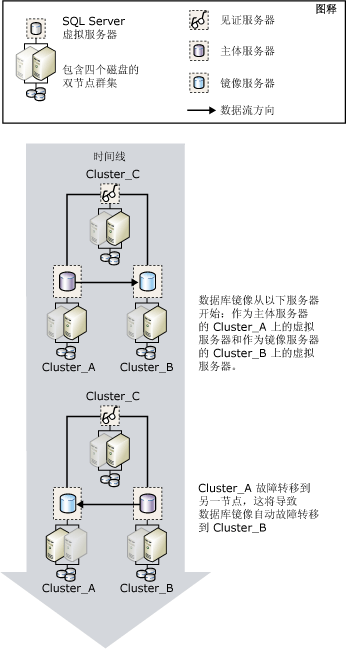

# 数据库镜像和 SQL Server 故障转移群集实例
 [!INCLUDE [SQL Server](../../includes/applies-to-version/sqlserver.md)]
  故障转移群集是 [!INCLUDE[msCoName](../../includes/msconame-md.md)] 群集服务 (MSCS) 群集组（称为资源组）中的一个或多个物理磁盘的组合，这些磁盘是群集的节点。 资源组配置为承载 [!INCLUDE[ssNoVersion](../../includes/ssnoversion-md.md)]实例的故障转移群集实例。 [!INCLUDE[ssNoVersion](../../includes/ssnoversion-md.md)] 故障转移群集实例就好像是网络上的一台计算机，但是它可以提供故障转移服务，当一个节点不可用时，可以从该节点故障转移到另一个节点。 有关详细信息，请参阅 [AlwaysOn 故障转移群集实例 (SQL Server)](../../sql-server/failover-clusters/windows/always-on-failover-cluster-instances-sql-server.md)。  
  
 与为单个数据库提供高可用性支持的数据库镜像相反，故障转移群集可为整个 [!INCLUDE[msCoName](../../includes/msconame-md.md)] [!INCLUDE[ssNoVersion](../../includes/ssnoversion-md.md)] 实例提供高可用性支持。 数据库镜像可以在故障转移群集之间进行，也可以在故障转移群集与非群集计算机之间进行。  
  
> [!NOTE]  
>  有关数据库镜像的介绍，请参阅 [数据库镜像 (SQL Server)](../../database-engine/database-mirroring/database-mirroring-sql-server.md)。  
  
## 镜像和群集  
 通常，当镜像与群集一起使用时，主体服务器与镜像服务器都驻留在群集上，其中，主体服务器在一个群集的故障转移群集实例中运行，镜像服务器在另一个群集的故障转移群集实例中运行。 不过，您可以建立一个镜像会话，其中，一个伙伴驻留在一个群集的故障转移群集实例中，另一个伙伴驻留在一个单独的非群集的计算机中。  
  
 如果群集故障转移使主体服务器暂时不可用，将断开客户端与数据库的连接。 群集故障转移完成之后，根据 [运行模式](../../database-engine/database-mirroring/database-mirroring-operating-modes.md)，客户端可以重新连接到同一群集、不同群集或非群集计算机中的主体服务器。 因此，当决定如何在群集环境中配置数据库镜像时，所使用的镜像运行模式至关重要。  
  
### 具有自动故障转移功能的高安全性模式会话  
 如果想要在具有自动故障转移功能的高安全性模式下镜像数据库，则建议针对伙伴使用双群集配置。 此配置提供最高的可用性。 此见证服务器可以驻留在第三方群集上，也可以驻留在非群集计算机上。  
  
 如果运行当前主体服务器的节点失败，将在几秒钟内开始进行数据库自动故障转移，群集仍然故障转移到另一个节点。 数据库镜像会话故障转移到其他群集或非群集计算机中的镜像服务器，并且先前的镜像服务器变为主体服务器。 新主体服务器将尽快前滚其数据库副本并使其作为主体数据库处于在线状态。 群集故障转移完成（通常需要几分钟）之后，先前作为主体服务器的故障转移群集实例变为镜像服务器。  
  
 下图显示了在具有见证服务器（支持自动故障转移）的高安全性模式下运行的镜像会话中，群集之间的自动故障转移。  
  
   
  
 镜像会话中的三个服务器实例驻留在三个不同的群集上：Cluster_A、Cluster_B 和 Cluster_C  。 每个群集上都有一个 [!INCLUDE[ssNoVersion](../../includes/ssnoversion-md.md)] 默认实例，此实例作为 [!INCLUDE[ssNoVersion](../../includes/ssnoversion-md.md)] 故障转移群集实例在运行。 镜像会话启动时， **Cluster_A** 上的故障转移群集实例是主体服务器， **Cluster_B** 上的故障转移群集实例是镜像服务器， **Cluster_C** 上的故障转移群集实例是镜像会话中的见证服务器。 最终， **Cluster_A** 上的活动节点失败，这将导致主体服务器不可用。  
  
 在群集准备执行故障转移之前，镜像服务器借助见证服务器检测到主体服务器已丢失。 镜像服务器将前滚其数据库，并尽快使该数据库在线以成为新的主体数据库。 当 **Cluster_A** 完成故障转移之后，先前的主体服务器现在成为镜像服务器，并将其数据库与 **Cluster_B**上的当前主体数据库同步。  
  
### 不带自动故障转移功能的高安全性模式会话  
 在不带自动故障转移功能的高安全性模式下镜像数据库时，如果运行当前主体服务器的节点失败，则群集中的其他节点将充当主体服务器。 注意，如果群集不可用，数据库将不可用。  
  
### 高性能模式会话  
 如果想要在高性能模式下镜像数据库，请考虑将主体服务器放置在群集的故障转移群集实例中，将镜像服务器放置在远程位置的非群集服务器上。 如果群集故障转移到另一节点，在镜像会话中，故障转移群集实例将继续作为主体服务器。 如果整个群集出现问题，则可以将服务强制到镜像服务器上。  
  
 **设置新的 SQL Server 故障转移群集**  
  
-   [创建新的 SQL Server 故障转移群集（安装程序）](../../sql-server/failover-clusters/install/create-a-new-sql-server-failover-cluster-setup.md)  
  
 **设置数据库镜像**  
  
-   [设置数据库镜像 (SQL Server)](../../database-engine/database-mirroring/setting-up-database-mirroring-sql-server.md)  
  
-   [使用 Windows 身份验证建立数据库镜像会话 (SQL Server Management Studio)](../../database-engine/database-mirroring/establish-database-mirroring-session-windows-authentication.md)  
  
## 另请参阅  
 [数据库镜像 (SQL Server)](../../database-engine/database-mirroring/database-mirroring-sql-server.md)   
 [数据库镜像运行模式](../../database-engine/database-mirroring/database-mirroring-operating-modes.md)   
 [AlwaysOn 故障转移群集实例 (SQL Server)](../../sql-server/failover-clusters/windows/always-on-failover-cluster-instances-sql-server.md)  
  
  
