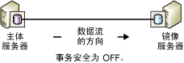
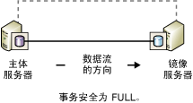
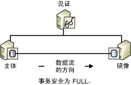

# 数据库镜像运行模式
  本主题说明数据库镜像会话的同步和异步运行模式。  
  
> [!NOTE]  
>  有关数据库镜像的介绍，请参阅[数据库镜像 (SQL Server)](../../database-engine/database-mirroring/database-mirroring-sql-server.md)。  
  
 **本主题内容：**  
  
-   [术语和定义](#TermsAndDefinitions)  
  
-   [异步数据库镜像（高性能模式）](#async)  
  
-   [同步数据库镜像（高安全性模式）](#Sync)  
  
-   [Transact-SQL 设置和数据库镜像运行模式](#TsqlSettingsAndOpModes)  
  
-   [相关任务](#RelatedTasks)  
  
##  <a name="TermsAndDefinitions"></a> 术语和定义  
 此节介绍了几个术语，它们是本主题的核心。  
  
 高性能模式  
 数据库镜像会话异步运行并仅使用主体服务器和镜像服务器。 唯一的角色切换形式是强制服务（可能造成数据丢失）。  
  
 高安全性模式 (High-safety mode)  
 数据库镜像会话同步运行并可以选择使用见证服务器、主体服务器和镜像服务器。  
  
 事务安全  
 一种镜像特定的数据库属性，用于确定数据库镜像会话是同步运行还是异步运行。 有两种安全级别：FULL 和 OFF。  
  
 Witness  
 仅用于高安全性模式，SQL Server 的一个可选实例，它能使镜像服务器识别是否要启动自动故障转移。 与这两个故障转移伙伴不同的是，见证服务器并不能用于数据库。 见证服务器的唯一角色是支持自动故障转移。  
  
## 异步数据库镜像（高性能模式）  
 此节介绍异步数据库镜像的工作原理，何时适合使用高性能模式以及在主体服务器发生故障时如何响应。  
  
> [!NOTE]  
>  大多数 [!INCLUDE[ssCurrent](../../includes/sscurrent-md.md)] 版本仅支持同步数据库镜像（“仅支持‘完全’安全级别”）。 有关完全支持数据库镜像的版本的信息，请参阅 [SQL Server 2016 各个版本支持的功能](../Topic/Features%20Supported%20by%20the%20Editions%20of%20SQL%20Server%202016.md)中的“高可用性 (AlwaysOn)”。  
  
 将事务安全设置为 OFF 时，数据库镜像会话便会异步运行。 异步操作仅支持一种操作模式 - 高性能模式。 此模式可增强性能，但要牺牲高可用性。 高性能模式仅使用主体服务器和镜像服务器。 镜像服务器上出现的问题不会影响主体服务器。 在丢失主体服务器的情况下，镜像数据库将标记为 DISCONNECTED，但仍可以作为备用数据库。  
  
 高性能模式仅支持一种角色切换形式：强制服务（可能造成数据丢失），此服务使用镜像服务器作为备用服务器。 强制服务是可能对主体服务器故障作出的响应之一。 由于可能造成数据丢失，因此，应当在将服务强制到镜像之前考虑其他备选服务器。 有关详细信息，请参阅本主题后面的 [对主体服务器故障的响应](#WhenPrincipalFails)。  
  
 下图显示了使用高性能模式的会话的配置。  
  
   
  
 在高性能模式下，主体服务器向镜像服务器发送事务日志之后，就立即向客户端发送确认，而不会等待镜像服务器的确认。 事务不等待镜像服务器将日志写入磁盘便提交。 异步操作允许主体服务器的运行有一段最短事务滞后时间。  
  
 镜像服务器尝试与主体服务器发送的日志记录保持同步。 但是镜像数据库可能在某种程度上滞后于主体数据库，尽管这两个数据库之间的时间间隔通常很小。 但是，如果主体服务器的工作负荷过高或镜像服务器系统的负荷过高，则时间间隔会增大。  
  
 **本节内容：**  
  
-   [何时适合使用高性能模式？](#WhenUseHighPerf)  
  
-   [见证服务器对高性能模式的影响](#WitnessImpactOnHighPerf)  
  
-   [对主体服务器故障的响应](#WhenPrincipalFails)  
  
###  <a name="WhenUseHighPerf"></a> 何时适合使用高性能模式？  
 高性能模式在灾难恢复方案中非常有用，在这种方案中，主体服务器和镜像服务器之间的距离非常大，并且您不希望小错误影响主体服务器。  
  
> [!NOTE]  
>  日志传送可以作为数据库镜像的补充，最好用其替代异步数据库镜像。 有关日志传送优点的信息，请参阅[高可用性解决方案 (SQL Server)](../../sql-server/failover-clusters/high-availability-solutions-sql-server.md)。 有关配合使用日志传送和数据库镜像的信息，请参阅[数据库镜像和日志传送 (SQL Server)](../../database-engine/database-mirroring/database-mirroring-and-log-shipping-sql-server.md)。  
  
###  <a name="WitnessImpactOnHighPerf"></a> 见证服务器对高性能模式的影响  
 如果使用 Transact-SQL 配置高性能模式，则当 SAFETY 属性设置为 OFF 时，我们极力建议也将 WITNESS 属性设置为 OFF。 见证服务器可以与高性能模式共存，但是见证服务器没有优点并可导致风险。  
  
 当其中任何一个伙伴出现故障而导致见证服务器与会话断开连接时，数据库便无法使用。 这是因为，尽管高性能模式不需要见证服务器，但如果设置了见证服务器，则会话便需要由两个或多个服务器实例组成的仲裁。 如果会话将仲裁丢失，则不能为数据库服务。  
  
 在高性能模式会话中设置了见证服务器后，仲裁的实施便意味着：  
  
-   如果镜像服务器丢失，则主体服务器必须连接到见证服务器。 否则，主体服务器将使其数据库脱机，直到见证服务器或镜像服务器重新加入会话。  
  
-   如果主体服务器丢失，则强制服务到镜像服务器时需要将镜像服务器连接到见证服务器。  
  
> [!NOTE]  
>  有关仲裁类型的信息，请参阅[仲裁：见证服务器如何影响数据库可用性（数据库镜像）](../../database-engine/database-mirroring/quorum-how-a-witness-affects-database-availability-database-mirroring.md)。  
  
###  <a name="WhenPrincipalFails"></a> 对主体服务器故障的响应  
 当主体服务器出现故障时，数据库所有者有多种选择，如下所示：  
  
-   使数据库不可用，直到主体服务器再次变为可用。  
  
     如果主体数据库及其事务日志保持不变，此选择将保留所有已提交的事务，但会牺牲可用性。  
  
-   停止数据库镜像会话，手动更新数据库，然后开始新的数据库镜像会话。  
  
     如果主体数据库丢失但主体服务器仍在运行，它将立即尝试备份主体数据库的日志尾部。 如果结尾日志备份成功，则删除镜像可能是最佳选择。 删除镜像后，可以将日志还原到以前的镜像数据库中，从而保留所有数据。  
  
    > [!NOTE]  
    >  如果结尾日志备份失败并且无法等待主体服务器恢复，则请考虑强制服务，这样做的好处是可以保持会话状态。  
  
-   在镜像服务器上进行强制服务（可能造成数据丢失）。  
  
     严格讲来，强制服务是一种灾难恢复方法，应尽量少使用此方法。 只有当主体服务器关闭，会话为异步会话（事务安全设置为 OFF），并且再满足会话不包含任何见证服务器（WITNESS 属性设置为 OFF）或见证服务器连接到镜像服务器（就是它们包含仲裁）这两个条件中的一个时，便可使用强制服务。  
  
     强制服务会导致镜像服务器成为主体角色，并将其数据库的副本提供给客户端。 进行强制服务后，主体服务器未发送至镜像服务器的所有事务日志都将丢失。 因此，您应将强制服务的使用限制在以下两种情况：可以接受可能造成的数据丢失以及立即使用数据库对您很重要。 有关强制服务工作原理及最佳使用方法的信息，请参阅[数据库镜像会话期间的角色切换 (SQL Server)](../../database-engine/database-mirroring/role-switching-during-a-database-mirroring-session-sql-server.md)。  
  
##  <a name="Sync"></a> 同步数据库镜像（高安全性模式）  
 此节介绍了同步数据库镜像的工作原理，包括替代高安全性模式（带自动故障转移和不带自动故障转移）在内，并且包含有关自动故障转移中见证服务器的角色的信息。  
  
 当事务安全设置为 FULL 时，数据库镜像会话便会在初始同步阶段后以高安全性模式同步运行。 此节介绍了为同步操作配置的数据库镜像会话的详细信息。  
  
 若要实现会话的同步操作，镜像服务器必须将镜像数据库与主体数据库同步。 会话开始时，主体服务器开始将其活动日志发送到镜像服务器。 镜像服务器将所有传入日志记录尽快写入磁盘。 当所有接收到的日志记录写入磁盘后，数据库便会立即进行同步。 只要伙伴保持通信，数据库就保持同步状态。  
  
> [!NOTE]  
>  若要监视数据库镜像会话中的状态更改，请使用 **Database Mirroring State Change** 事件类。 有关详细信息，请参阅 [Database Mirroring State Change Event Class](../../relational-databases/event-classes/database-mirroring-state-change-event-class.md)。  
  
 同步结束后，在主体数据库中提交的每个事务也在镜像服务器上提交，因此确保数据受到保护。 其实现方法是等待在主体数据库中提交事务，直到主体服务器收到来自镜像服务器的消息：镜像服务器已将事务的日志镜像到磁盘。 注意，等待此消息会增加事务的滞后时间。  
  
 同步所需的时间实质上取决于会话开始时镜像数据库滞后于主体数据库的时间（按最初从主体服务器收到的日志记录数计量）、主体数据库的工作负荷和镜像系统的速度。 在会话同步后，镜像数据库中尚未重做的镜像日志仍处于重做队列中。  
  
 镜像数据库同步后，两个数据库副本的状态将立即改为 SYNCHRONIZED。  
  
 同步操作按下列方式维护：  
  
1.  从客户端收到事务时，主体服务器将事务的日志写入事务日志中。  
  
2.  主体服务器将事务写入数据库中，同时将日志记录发送到镜像服务器。 主体服务器等待来自镜像服务器的确认，然后向客户端发送下列任一确认消息：事务提交或回滚。  
  
3.  镜像服务器将日志镜像到磁盘并向主体服务器返回确认。  
  
4.  收到来自镜像服务器的确认时，主体服务器将向客户端发送一条确认消息。  
  
 高安全性模式通过要求数据在两个位置间保持同步来保护数据。 所有提交的事务都保证写入镜像服务器的磁盘上。  
  
 **本节内容：**  
  
-   [不带自动故障转移的高安全性模式](#HighSafetyWithOutAutoFailover)  
  
-   [具有自动故障转移的高安全性模式](#HighSafetyWithAutoFailover)  
  
###  <a name="HighSafetyWithOutAutoFailover"></a> 不带自动故障转移的高安全性模式  
 下图显示了不带自动故障转移的高安全性模式的配置。 配置仅包括两个伙伴。  
  
   
  
 当伙伴连接在一起并且数据库已同步时，支持手动故障转移。 如果镜像服务器实例出现故障，则主体服务器实例不会受到影响并且公开运行（即，未镜像数据）。 如果主体服务器丢失，则镜像会挂起，但可以将服务强制到镜像服务器（可能造成数据丢失）。 有关详细信息，请参阅[数据库镜像会话期间的角色切换 (SQL Server)](../../database-engine/database-mirroring/role-switching-during-a-database-mirroring-session-sql-server.md)。  
  
###  <a name="HighSafetyWithAutoFailover"></a> 具有自动故障转移的高安全性模式  
 自动故障转移通过确保在丢失一个服务器之后仍向数据库提供服务来提供高可用性。 自动故障转移要求会话具有第三个服务器实例（“见证服务器 ”），理想情况是见证服务器驻留在第三台计算机上。 下图显示了支持自动故障转移的高安全性模式会话的配置。  
  
   
  
 与这两个伙伴不同的是，见证服务器并不能用于数据库。 见证服务器通过验证主体服务器是否已启用并运行来仅支持自动故障转移。 只有在镜像服务器和见证服务器与主体服务器断开连接之后而保持相互连接时，镜像服务器才启动自动故障转移。  
  
 设置见证服务器时，会话需要“仲裁 ”（允许数据库可用的至少两个服务器实例之间的关系）。 有关详细信息，请参阅[数据库镜像见证服务器](../../database-engine/database-mirroring/database-mirroring-witness.md)和[仲裁：见证服务器如何影响数据库可用性（数据库镜像）](../../database-engine/database-mirroring/quorum-how-a-witness-affects-database-availability-database-mirroring.md)。  
  
 自动故障转移需要下列条件：  
  
-   数据库已同步。  
  
-   发生故障时所有三个服务器实例均处于连接状态，并且见证服务器和镜像服务器保持连接状态。  
  
 丢失伙伴会产生以下影响：  
  
-   如果主体服务器变得不可用，则在上述条件下将发生自动故障转移。 镜像服务器切换为主体角色，并提供其数据库作为主体数据库。  
  
-   如果主体服务器在这些条件不满足时变得不可用，则可能会强制服务（可能造成数据丢失）。 有关详细信息，请参阅[数据库镜像会话期间的角色切换 (SQL Server)](../../database-engine/database-mirroring/role-switching-during-a-database-mirroring-session-sql-server.md)。  
  
-   如果只有镜像服务器变得不可用，则主体服务器和见证服务器将继续运行。  
  
 如果会话丢失见证服务器，则仲裁需要两个伙伴。 如果任何一个伙伴失去仲裁，两个伙伴都将失去仲裁且在重新建立仲裁之前数据库将不可用。 此仲裁要求确保没有见证服务器时数据库从不“公开” 运行，即从不执行数据镜像。  
  
> [!NOTE]  
>  如果您希望见证服务器在很长一段时间内保持断开，则我们建议您在见证服务器变为可用之前将其从会话中删除。  
  
##  <a name="TsqlSettingsAndOpModes"></a> Transact-SQL 设置和数据库镜像运行模式  
 此节从 ALTER DATABASE 设置和镜像数据库状态以及见证服务器（如果有）状态的角度介绍数据库镜像会话。 它针对主要或专门使用 [!INCLUDE[tsql](../../includes/tsql-md.md)]（而不是使用 [!INCLUDE[ssManStudioFull](../../includes/ssmanstudiofull-md.md)]）管理数据库镜像的用户。  
  
> [!TIP]  
>  除了可以使用 [!INCLUDE[tsql](../../includes/tsql-md.md)]以外，还可以使用 **“数据库属性”** 对话框的 **“镜像”** 页在对象资源管理器中控制会话的运行模式。 有关详细信息，请参阅[使用 Windows 身份验证建立数据库镜像会话 (SQL Server Management Studio)](../../database-engine/database-mirroring/establish database mirroring session - windows authentication.md)。  
  
 **本节内容：**  
  
-   [事务安全设置和见证服务器状态如何影响运行模式](#TxnSafetyAndWitness)  
  
-   [查看安全设置和见证服务器状态](#ViewWitness)  
  
-   [丢失主体服务器时行为的影响因素](#FactorsOnLossOfPrincipal)  
  
###  <a name="TxnSafetyAndWitness"></a> 事务安全设置和见证服务器状态如何影响运行模式  
 会话的运行模式由会话的事务安全设置和见证服务器状态这二者决定。 数据库所有者可随时更改事务安全级别，并可添加或删除见证服务器。  
  
 **本节内容：**  
  
-   [事务安全](#TxnSafety)  
  
-   [见证服务器状态](#WitnessState)  
  
####  <a name="TxnSafety"></a> 事务安全  
 事务安全是镜像特定的数据库属性，用于确定数据库镜像会话是同步运行还是异步运行。 有两种安全级别：FULL 和 OFF。  
  
-   SAFETY FULL  
  
     完整事务安全可使会话在高安全性模式下同步运行。 如果存在见证服务器，则会话支持自动故障转移。  
  
     使用 ALTER DATABASE 语句建立会话时，会话将在 SAFETY 属性设置为 FULL 的情况下开始；即会话将在高安全性模式下开始。 会话开始之后，便可添加见证服务器。  
  
     有关详细信息，请参阅本主题前面的[同步数据库镜像（高安全性模式）](#Sync)。  
  
-   SAFETY OFF  
  
     关闭事务安全可使会话在异步高性能模式下运行。 如果 SAFETY 属性设置为 OFF，则 WITNESS 属性也应该设置为 OFF（默认值）。 有关高性能模式下见证服务器的影响的信息，请参阅本主题后面的[见证服务器状态](#WitnessState)。 有关在关闭事务安全性的情况下运行的详细信息，请参阅本主题前面的[异步数据库镜像（高性能模式）](#async)。  
  
 数据库的事务安全性设置记录在每个伙伴的 **sys.database_mirroring** 目录视图中的 **mirroring_safety_level** 和 **mirroring_safety_level_desc** 列内。 有关详细信息，请参阅 [sys.database_mirroring (Transact-SQL)](../../relational-databases/system-catalog-views/sys-database-mirroring-transact-sql.md)。  
  
 数据库所有者可以随时更改事务安全级别。  
  
####  <a name="WitnessState"></a> 见证服务器状态  
 如果已设置了见证服务器，则需要仲裁，因此见证服务器状态始终很重要。  
  
 如果见证服务器存在，则会具有以下两种状态之一：  
  
-   当见证服务器连接到伙伴时，见证服务器相对于该伙伴处于 CONNECTED 状态，并且和该伙伴具有仲裁。 在此情况下，即使有一个伙伴不可用，也可以使用数据库。  
  
-   如果见证服务器存在，但是未连接到伙伴，则见证服务器相对于该伙伴处于 UNKOWN 或 DISCONNECTED 状态。 在此情况下，见证服务器和该伙伴缺少仲裁，并且如果伙伴双方未彼此连接，则数据库不可用。  
  
 有关仲裁的信息，请参阅[仲裁：见证服务器如何影响数据库可用性（数据库镜像）](../../database-engine/database-mirroring/quorum-how-a-witness-affects-database-availability-database-mirroring.md)。  
  
 服务器实例上每个见证服务器的状态都记录在 **sys.database_mirroring** 目录视图中的 **mirroring_witness_state** 和 **mirroring_witness_state_desc** 列中。 有关详细信息，请参阅 [sys.database_mirroring (Transact-SQL)](../../relational-databases/system-catalog-views/sys-database-mirroring-transact-sql.md)。  
  
 下表总结了会话的事务安全设置和见证服务器的状态是如何决定会话运行模式的。  
  
|运行模式|事务安全|见证服务器状态|  
|--------------------|------------------------|-------------------|  
|高性能模式|OFF|NULL（无见证服务器）**|  
|不带自动故障转移的高安全性模式|FULL|NULL（无见证服务器）|  
|具有自动故障转移的高安全性模式*|FULL|CONNECTED|  
  
 *如果见证服务器断开连接，则建议你设置 WITNESS OFF，直到见证服务器实例变为可用。  
  
 **如果见证服务器处在高性能模式下，它不会参与会话。 但是，若要使数据库可用，必须至少有两个服务器实例保持连接。 因此，建议您在高性能模式会话中，始终将 WITNESS 属性设置为 OFF。 有关详细信息，请参阅[仲裁：见证服务器如何影响数据库可用性（数据库镜像）](../../database-engine/database-mirroring/quorum-how-a-witness-affects-database-availability-database-mirroring.md)。  
  
###  <a name="ViewWitness"></a> 查看安全设置和见证服务器状态  
 若要针对数据库查看安全设置和见证服务器的状态，请使用 **sys.database_mirroring** 目录视图。 相关列如下所示：  
  
|因素|列|说明|  
|------------|-------------|-----------------|  
|事务安全|**mirroring_safety_level** 或 **mirroring_safety_level_desc**|镜像数据库上用于更新的事务安全设置，如下所示：<br /><br /> UNKNOWN<br /><br /> OFF<br /><br /> FULL<br /><br /> NULL= 数据库没有在线。|  
|是否存在见证服务器？|**mirroring_witness_name**|数据库镜像见证服务器的名称或 NULL（指示不存在见证服务器）。|  
|见证服务器状态|**mirroring_witness_state** 或 **mirroring_witness_state_desc**|给定伙伴上的数据库中的见证服务器状态：<br /><br /> UNKNOWN<br /><br /> CONNECTED<br /><br /> DISCONNECTED<br /><br /> NULL = 不存在见证服务器或数据库没有在线。|  
  
 例如，在主体服务器或镜像服务器上，输入：  
  
```  
SELECT mirroring_safety_level_desc, mirroring_witness_name, mirroring_witness_state_desc FROM sys.database_mirroring  
```  
  
 有关此目录视图的详细信息，请参阅 [sys.database_mirroring (Transact-SQL)](../../relational-databases/system-catalog-views/sys-database-mirroring-transact-sql.md)。  
  
###  <a name="FactorsOnLossOfPrincipal"></a> 丢失主体服务器时行为的影响因素  
 下表总结了丢失主体服务器时事务安全设置、数据库的状态以及见证服务器的状态对镜像会话行为的综合影响。  
  
|事务安全|镜像数据库的镜像状态|见证服务器状态|主体丢失时的行为|  
|------------------------|----------------------------------------|-------------------|-------------------------------------|  
|FULL|SYNCHRONIZED|CONNECTED|发生了自动故障转移。|  
|FULL|SYNCHRONIZED|DISCONNECTED|镜像服务器将停止；无法进行故障转移，并且数据库不可用。|  
|OFF|SUSPENDED 或 DISCONNECTED|NULL（无见证服务器）|可以对镜像服务器进行强制服务（可能造成数据丢失）。|  
|FULL|SYNCHRONIZING 或 SUSPENDED|NULL（无见证服务器）|可以对镜像服务器进行强制服务（可能造成数据丢失）。|  
  
##  <a name="RelatedTasks"></a> 相关任务  
  
-   [添加或替换数据库镜像见证服务器 (SQL Server Management Studio)](../../database-engine/database-mirroring/add-or-replace-a-database-mirroring-witness-sql-server-management-studio.md)  
  
-   [使用 Windows 身份验证建立数据库镜像会话 (SQL Server Management Studio)](../../database-engine/database-mirroring/establish database mirroring session - windows authentication.md)  
  
-   [使用 Windows 身份验证添加数据库镜像见证服务器 (Transact-SQL)](../../database-engine/database-mirroring/add-a-database-mirroring-witness-using-windows-authentication-transact-sql.md)  
  
-   [从数据库镜像会话删除见证服务器 (SQL Server)](../../database-engine/database-mirroring/remove-the-witness-from-a-database-mirroring-session-sql-server.md)  
  
-   [更改数据库镜像会话中的事务安全 (Transact-SQL)](../../database-engine/database-mirroring/change-transaction-safety-in-a-database-mirroring-session-transact-sql.md)  
  
## 另请参阅  
 [监视数据库镜像 (SQL Server)](../../database-engine/database-mirroring/monitoring-database-mirroring-sql-server.md)   
 [数据库镜像见证服务器](../../database-engine/database-mirroring/database-mirroring-witness.md)  
  
  