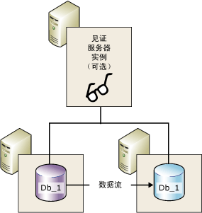
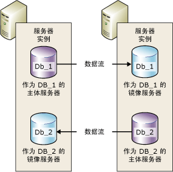

# 数据库镜像 (SQL Server)
[!INCLUDE[appliesto-ss-xxxx-xxxx-xxx-md](../../includes/appliesto-ss-xxxx-xxxx-xxx-md.md)]
    
> [!NOTE]  
>  [!INCLUDE[ssNoteDepFutureAvoid](../../includes/ssnotedepfutureavoid-md.md)] 改为使用 [!INCLUDE[ssHADR](../../includes/sshadr-md.md)]。  
  
 “数据库镜像” 是一种提高 [!INCLUDE[ssNoVersion](../../includes/ssnoversion-md.md)] 数据库的可用性的解决方案。 镜像基于每个数据库实现，并且只适用于使用完整恢复模式的数据库。  
  
> [!IMPORTANT]  
>  有关数据库镜像的支持、限制、先决条件、配置伙伴服务器的建议和部署数据库镜像的建议的信息，请参阅 [数据库镜像的前提条件、限制和建议](../../database-engine/database-mirroring/prerequisites-restrictions-and-recommendations-for-database-mirroring.md)。  
  
  
##   数据库镜像的优点  
 数据库镜像是一种简单的策略，具有下列优点：  
  
-   提高数据库的可用性。  
  
     发生灾难时，在具有自动故障转移功能的高安全性模式下，自动故障转移可快速使数据库的备用副本联机（而不会丢失数据）。 在其他运行模式下，数据库管理员可以选择强制服务（可能丢失数据），以替代数据库的备用副本。 有关详细信息，请参阅本主题后面的 [角色切换](#RoleSwitching)。  
  
-   增强数据保护功能。  
  
     数据库镜像提供完整或接近完整的数据冗余，具体取决于运行模式是高安全性还是高性能。 有关详细信息，请参阅本主题后面的 [运行模式](#OperatingModes)。  
  
     在 [!INCLUDE[ssEnterpriseEd10](../../includes/ssenterpriseed10-md.md)] 或更高版本上运行的数据库镜像伙伴会自动尝试解决某些阻止读取数据页的错误。 无法读取页的伙伴会向其他伙伴请求新副本。 如果此请求成功，则将以新副本替换不可读的页，这通常会解决该错误。 有关详细信息，请参阅本主题后面的 [自动页修复（可用性组：数据库镜像）](../../sql-server/failover-clusters/automatic-page-repair-availability-groups-database-mirroring.md)。  
  
-   提高生产数据库在升级期间的可用性。  
  
     为了尽量减少镜像服务器的停机时间，您可以按顺序升级承载故障转移伙伴的 [!INCLUDE[ssNoVersion](../../includes/ssnoversion-md.md)] 实例。 这样只会导致一个故障转移的停机时间。 这种形式的升级称为“滚动升级 ”。 有关详细信息，请参阅 [Upgrading Mirrored Instances](../../database-engine/database-mirroring/upgrading-mirrored-instances.md)。  
  
  
##   数据库镜像术语和定义  
 自动故障转移 (automatic failover)  
 一种过程，当主体服务器不可用时，该过程将导致镜像服务器接管主体服务器的角色，并使其数据库的副本联机以作为主体数据库。  
  
 故障转移伙伴 (failover partners)  
 充当镜像数据库的角色切换伙伴的两个服务器实例（主体服务器或镜像服务器）。  
  
 强制服务 (forced service)  
 是指在负责将服务传输到镜像数据库（但它处于未知状态）的主体服务器出现故障时数据库所有者启动的故障转移。  
  
 高性能模式  
 数据库镜像会话异步运行并仅使用主体服务器和镜像服务器。 唯一的角色切换形式是强制服务（可能造成数据丢失）。  
  
 高安全性模式 (High-safety mode)  
 数据库镜像会话同步运行并可以选择使用见证服务器、主体服务器和镜像服务器。  
  
 手动故障转移 (manual failover)  
 是指在负责将服务从主体数据库传输到镜像数据库（处于同步状态）的主体服务器仍在运行时数据库所有者启动的故障转移。  
  
 镜像数据库 (mirror database)  
 通常与主体数据库完全同步的数据库副本。  
  
 镜像服务器 (mirror server)  
 在数据库镜像配置中，镜像数据库所在的服务器实例。  
  
 主体数据库 (principal database)  
 数据库镜像中的一种读写数据库，其事务日志记录将应用到数据库的只读副本（镜像数据库）。  
  
 主体服务器 (principal server)  
 在数据库镜像中，是指当前作为主体数据库的数据库所属于的伙伴。  
  
 重做队列 (redo queue)  
 收到的等待镜像服务器磁盘的事务日志记录。  
  
 角色 (role)  
 主体服务器和镜像服务器担任互补的主体角色和镜像角色。 也可以由第三个服务器实例来担任见证服务器角色。  
  
 角色切换  
 镜像接管主体角色。  
  
 发送队列 (send queue)  
 在主体服务器的日志磁盘累积的未发送的事务日志记录。  
  
 会话  
 是指主体服务器、镜像服务器和见证服务器（如果存在）之间进行数据库镜像期间形成的关系。  
  
 镜像会话启动或继续后，将累积在主体服务器上的主体数据库日志记录发送给镜像服务器的过程，此过程将这些日志记录尽快写入磁盘，以便与主体服务器保持同步。  
  
 事务安全  
 一种镜像特定的数据库属性，用于确定数据库镜像会话是同步运行还是异步运行。 有两种安全级别：FULL 和 OFF。  
  
 Witness  
 仅用于高安全性模式，SQL Server 的一个可选实例，它能使镜像服务器识别何时要启动自动故障转移。 与这两个故障转移伙伴不同的是，见证服务器并不能用于数据库。 见证服务器的唯一角色是支持自动故障转移。  
  
  
##   数据库镜像概述  
 数据库镜像维护一个数据库的两个副本，这两个副本必须驻留在不同的 [!INCLUDE[ssDEnoversion](../../includes/ssdenoversion-md.md)]服务器实例上。 通常，这些服务器实例驻留在不同位置的计算机上。 启动数据库上的数据库镜像操作时，在这些服务器实例之间形成一种关系，称为“数据库镜像会话” 。  
  
 其中一个服务器实例使数据库服务于客户端（主体服务器）。 另一个服务器实例则根据镜像会话的配置和状态，充当热备用或温备用服务器（镜像服务器）。 同步数据库镜像会话时，数据库镜像提供热备用服务器，可支持在已提交事务不丢失数据的情况下进行快速故障转移。 未同步会话时，镜像服务器通常用作热备用服务器（可能造成数据丢失）。  
  
 在“数据库镜像会话  ”中，主体服务器和镜像服务器作为“伙伴 ”进行通信和协作。 两个伙伴在会话中扮演互补的角色：“主体角色”  和“镜像角色” 。 在任何给定的时间，都是一个伙伴扮演主体角色，另一个伙伴扮演镜像角色。 每个伙伴拥有  其当前角色。 拥有主体角色的伙伴称为“主体服务器” ，其数据库副本为当前的主体数据库。 拥有镜像角色的伙伴称为“镜像服务器” ，其数据库副本为当前的镜像数据库。 如果数据库镜像部署在生产环境中，则主体数据库即为“生产数据库 ”。  
  
 数据库镜像涉及尽快将对主体数据库执行的每项插入、更新和删除操作“重做  ”到镜像数据库中。 重做通过将活动事务日志记录的流发送到镜像服务器来完成，这会尽快将日志记录按顺序应用到镜像数据库中。 与逻辑级别执行的复制不同，数据库镜像在物理日志记录级别执行。 从 [!INCLUDE[ssKatmai](../../includes/sskatmai-md.md)]开始，在事务日志记录的流发送到镜像服务器之前，主体服务器会先将其压缩。 在所有镜像会话中都会进行这种日志压缩。  
  
> [!NOTE]  
>  给定的服务器实例可以参与到多个具有相同或不同伙伴的并发数据库镜像会话中。 某个服务器实例可能在某些会话中是伙伴，而在其他会话中则是见证服务器。 镜像服务器实例必须正在运行 [!INCLUDE[ssNoVersion](../../includes/ssnoversion-md.md)]的相同版本。  
  
 **本节内容：**  
  
-   [运行模式](#OperatingModes)  
  
-   [角色切换](#RoleSwitching)  
  
-   [并发会话](#ConcurrentSessions)  
  
-   [客户端连接](#ClientConnections)  
  
-   [暂停会话对主体事务日志的影响](#ImpactOfPausing)  
  
  
###   运行模式  
 数据库镜像会话以同步操作或异步操作运行。 在异步操作下，事务不需要等待镜像服务器将日志写入磁盘便可提交，这样可最大程度地提高性能。 在同步操作下，事务将在伙伴双方处提交，但会延长事务滞后时间。  
  
 有两种镜像运行模式。 一种是高安全性模式，它支持同步操作。 在高安全性模式下，当会话开始时，镜像服务器将使镜像数据库尽快与主体数据库同步。 一旦同步了数据库，事务将在伙伴双方处提交，这会延长事务滞后时间。  
  
 第二种运行模式，即高性能模式，以异步方式运行。 镜像服务器尝试与主体服务器发送的日志记录保持同步。 镜像数据库可能稍微滞后于主体数据库。 但是，数据库之间的时间间隔通常很小。 但是，如果主体服务器的工作负荷过高或镜像服务器系统的负荷过高，则时间间隔会增大。  
  
 在高性能模式中，主体服务器向镜像服务器发送日志记录之后，会立即再向客户端发送一条确认消息。 它不会等待镜像服务器的确认。 这意味着事务不需要等待镜像服务器将日志写入磁盘便可提交。 此异步操作允许主体服务器在事务滞后时间最小的条件下运行，但可能会丢失某些数据。  
  
 所有数据库镜像会话都只支持一台主体服务器和一台镜像服务器。 下图显示了该配置。  
  
   
  
 具有自动故障转移功能的高安全性模式要求使用第三个服务器实例，称为见证服务器。 与这两个伙伴不同的是，见证服务器并不能用于数据库。 见证服务器通过验证主体服务器是否已启用并运行来支持自动故障转移。 只有在镜像服务器和见证服务器与主体服务器断开连接之后而保持相互连接时，镜像服务器才启动自动故障转移。  
  
 下图显示了包含见证服务器的配置。  
  
   
  
 有关详细信息，请参阅本主题后面的 [角色切换](#RoleSwitching)。  
  
> [!NOTE]  
>  建立新的镜像会话或将见证服务器添加到现有镜像配置要求涉及的所有服务器实例运行相同版本的 [!INCLUDE[ssNoVersion](../../includes/ssnoversion-md.md)]。 但是，当升级到 [!INCLUDE[ssKatmai](../../includes/sskatmai-md.md)] 或更高版本时，所涉及的实例的版本可以不同。 有关详细信息，请参阅 [Upgrading Mirrored Instances](../../database-engine/database-mirroring/upgrading-mirrored-instances.md)。  
  
  
####   事务安全与运行模式  
 运行模式是异步还是同步取决于事务安全设置。 如果专门使用 [!INCLUDE[ssManStudioFull](../../includes/ssmanstudiofull-md.md)] 来配置数据库镜像，则在您选择运行模式时，将自动配置事务安全设置。  
  
 如果使用 [!INCLUDE[tsql](../../includes/tsql-md.md)] 配置数据库镜像，则必须了解如何设置事务安全。 事务安全由 ALTER DATABASE 语句的 SAFETY 属性控制。 在正在镜像的数据库中，SAFETY 为 FULL 或 OFF。  
  
-   如果将 SAFETY 选项设置为 FULL，则在初始同步阶段后，数据库镜像操作将同步执行。 如果在高安全性模式下设置见证服务器，则会话支持自动故障转移。  
  
-   如果将 SAFETY 选项设置为 OFF，则数据库镜像操作将异步执行。 会话在高性能模式下运行，并且 WITNESS 选项也应设置为 OFF。  
  
 有关详细信息，请参阅 [Database Mirroring Operating Modes](../../database-engine/database-mirroring/database-mirroring-operating-modes.md)。  
  
  
###   角色切换  
 在数据库镜像会话上下文中，通常可以使用一个称为“角色切换” 的过程来互换主体角色和镜像角色。 角色切换涉及将主体角色转换给镜像服务器的操作。 在角色切换中，镜像服务器充当主体服务器的“故障转移伙伴  ”。 进行角色切换时，镜像服务器将接管主体角色，并使其数据库的副本联机以作为新的主体数据库。 以前的主体服务器（如果有）将充当镜像角色，并且其数据库将变为新的镜像数据库。 这些角色可以反复地来回切换。  
  
 存在以下三种角色切换形式。  
  
-   *Automatic failover*  
  
     这要求使用高安全性模式并具有镜像服务器和见证服务器。 数据库必须已同步，并且见证服务器必须连接到镜像服务器。  
  
     见证服务器的作用是验证给定的伙伴服务器是否已启动并运行。 如果镜像服务器与主体服务器断开连接，但见证服务器仍与主体服务器保持连接，则镜像服务器无法启动故障转移。 有关详细信息，请参阅 [数据库镜像见证服务器](../../database-engine/database-mirroring/database-mirroring-witness.md)。  
  
-   *Manual failover*  
  
     这要求使用高安全性模式。 伙伴双方必须互相连接，并且数据库必须已同步。  
  
-   强制服务（可能造成数据丢失）  
  
     在高性能模式和不带自动故障转移功能的高安全性模式下，如果主体服务器出现故障而镜像服务器可用，则可以强制服务运行。  
  
    > [!IMPORTANT]  
    >  高性能模式用于在没有见证服务器的情况下运行。 但如果存在见证服务器，则强制服务将要求见证服务器连接到镜像服务器。  
  
 在任何一种角色切换情况下，一旦新的主体数据库联机，客户端应用程序便会通过重新连接到数据库来快速恢复。  
  
  
###   并发会话  
 给定的服务器实例可以参与到多个具有相同或不同服务器实例的并发数据库镜像会话（每个镜像数据库发生一次）中。 通常，服务器实例专门用作其所有数据库镜像会话中的伙伴或见证服务器。 但是，由于每个会话都独立于其他会话，因此服务器实例可以在某些会话中充当伙伴，而在其他会话中充当见证服务器。 例如，请看三个服务器实例（`SSInstance_1`、 `SSInstance_2`和 `SSInstance_3`）中的下列四个会话。 每个服务器实例都可在某些会话中作为伙伴，而在其他会话中作为见证服务器：  
  
|服务器实例|数据库 A 的会话|数据库 B 的会话|数据库 C 的会话|数据库 D 的会话|  
|---------------------|----------------------------|----------------------------|----------------------------|----------------------------|  
|`SSInstance_1`|Witness|Partner|Partner|Partner|  
|`SSInstance_2`|Partner|Witness|Partner|Partner|  
|`SSInstance_3`|Partner|Partner|Witness|Witness|  
  
 下图说明了都作为伙伴参与两个镜像会话的两个服务器实例。 一个会话用于名为 **Db_1**的数据库，另一个会话用于名为 **Db_2**的数据库。  
  
   
  
 每个数据库独立于其他数据库。 例如，服务器实例最初可能是两个数据库的镜像服务器。 如果其中一个数据库发生故障转移，则服务器实例将变为已发生故障转移的数据库的主体服务器，同时为其他数据库保留镜像服务器。  
  
 再举一个例子，假设有一个服务器实例，它是两个或多个以具有自动故障转移功能的高安全性模式运行的数据库的主体服务器，如果此服务器实例失败，则所有数据库将自动故障转移到其相应的镜像数据库。  
  
 如果将一个服务器实例设置成既作为伙伴又作为见证服务器参与会话，请确保数据库镜像终结点能够支持两种角色（有关详细信息，请参阅 [数据库镜像终结点 (SQL Server)](../../database-engine/database-mirroring/the-database-mirroring-endpoint-sql-server.md)）中的下列四个会话。 同时，还要确保系统具有足够资源以减少资源争用。  
  
> [!NOTE]  
>  由于镜像数据库相互独立，因此这些数据库不能作为一个组来进行故障转移。  
  
###   客户端连接  
 [!INCLUDE[msCoName](../../includes/msconame-md.md)] .NET Data Provider for [!INCLUDE[ssNoVersion](../../includes/ssnoversion-md.md)]提供了对数据库镜像会话的客户端连接支持。 有关详细信息，请参阅本主题后面的 [将客户端连接到数据库镜像会话 (SQL Server)](../../database-engine/database-mirroring/connect-clients-to-a-database-mirroring-session-sql-server.md)。  
  
  
###   暂停会话对主体事务日志的影响  
 数据库所有者可以随时暂停会话。 执行暂停操作将保留在删除镜像时的会话状态。 暂停会话时，主体服务器不会向镜像服务器发送任何新的日志记录。 所有这些记录将保持活动状态，并堆积在主体数据库的事务日志中。 只要数据库镜像会话保持暂停状态，事务日志就不会被截断。 因此，如果数据库镜像会话暂停时间过长，则可能会使该日志填满。  
  
 有关详细信息，请参阅本主题后面的 [暂停和恢复数据库镜像 (SQL Server)](../../database-engine/database-mirroring/pausing-and-resuming-database-mirroring-sql-server.md)。  
  
##   设置数据库镜像会话  
 开始镜像会话之前，数据库所有者或系统管理员必须创建镜像数据库，设置端点和登录名。在某些情况下，还要创建并设置证书。 有关详细信息，请参阅本主题后面的 [设置数据库镜像 (SQL Server)](../../database-engine/database-mirroring/setting-up-database-mirroring-sql-server.md)。  
  
##   与其他数据库引擎功能的互操作性和共存  
 数据库镜像可以与 [!INCLUDE[ssNoVersion](../../includes/ssnoversion-md.md)]的下列功能或组件一起使用。  
  
-   [日志传送](../../database-engine/database-mirroring/database-mirroring-and-log-shipping-sql-server.md)  
  
-   [全文目录](../../database-engine/database-mirroring/database-mirroring-and-full-text-catalogs-sql-server.md)  
  
-   [数据库快照](../../database-engine/database-mirroring/database-mirroring-and-database-snapshots-sql-server.md)  
  
-   [复制](../../database-engine/database-mirroring/database-mirroring-and-replication-sql-server.md)  
  
##   本节内容  
 [数据库镜像的前提条件、限制和建议](../../database-engine/database-mirroring/prerequisites-restrictions-and-recommendations-for-database-mirroring.md)  
 说明了设置数据库镜像的前提条件和建议。  
  
 [Database Mirroring Operating Modes](../../database-engine/database-mirroring/database-mirroring-operating-modes.md)  
 包含有关数据库镜像会话的同步和异步运行模式的信息，以及有关在数据库镜像会话期间切换伙伴角色的信息。  
  
 [数据库镜像见证服务器](../../database-engine/database-mirroring/database-mirroring-witness.md)  
 说明数据库镜像中见证服务器的角色、如何在多个镜像会话中使用单个见证服务器、见证服务器的软件和硬件建议以及自动故障转移中见证服务器的角色。 它还包含有关添加或删除见证服务器的信息。  
  
 [数据库镜像会话期间的角色切换 (SQL Server)](../../database-engine/database-mirroring/role-switching-during-a-database-mirroring-session-sql-server.md)  
 包含有关在数据库镜像会话期间切换伙伴角色的信息，其中包括自动故障转移、手动故障转移和强制服务（可能发生数据丢失）。 此外，还包含有关估计在角色切换过程中服务中断的信息。  
  
 [数据库镜像期间可能出现的故障](../../database-engine/database-mirroring/possible-failures-during-database-mirroring.md)  
 介绍了可能导致数据库镜像会话失败的物理故障、操作系统故障和 [!INCLUDE[ssNoVersion](../../includes/ssnoversion-md.md)] 故障，包括硬错误和软错误。 介绍了镜像超时机制如何响应软错误。  
  
 [数据库镜像终结点 (SQL Server)](../../database-engine/database-mirroring/the-database-mirroring-endpoint-sql-server.md)  
 介绍了数据库镜像端点的工作方式。  
  
 [设置数据库镜像 (SQL Server)](../../database-engine/database-mirroring/setting-up-database-mirroring-sql-server.md)  
 包含有关设置数据库镜像的前提条件、建议和步骤的主题。  
  
 [将客户端连接到数据库镜像会话 (SQL Server)](../../database-engine/database-mirroring/connect-clients-to-a-database-mirroring-session-sql-server.md)  
 包含涉及到将客户端连接和重新连接到镜像数据库所用的客户端连接字符串属性和算法的主题。  
  
 [暂停和恢复数据库镜像 (SQL Server)](../../database-engine/database-mirroring/pausing-and-resuming-database-mirroring-sql-server.md)  
 介绍了在数据库镜像暂停时发生什么事件（包括对事务日志截断的影响），并说明如何暂停和继续数据库镜像。  
  
 [删除数据库镜像 (SQL Server)](../../database-engine/database-mirroring/removing-database-mirroring-sql-server.md)  
 介绍了删除镜像的影响，并包含有关如何结束会话的说明  
  
 [监视数据库镜像 (SQL Server)](../../database-engine/database-mirroring/monitoring-database-mirroring-sql-server.md)  
 包含有关使用数据库镜像监视器或 **dbmmonitor** 存储过程来监视数据库镜像或会话的信息。  
  
  
##   相关任务  
  
### 配置任务  
 **使用 SQL Server Management Studio**  
  
-   [启动配置数据库镜像安全向导 (SQL Server Management Studio)](../../database-engine/database-mirroring/start-the-configuring-database-mirroring-security-wizard.md)  
  
-   [使用 Windows 身份验证建立数据库镜像会话 (SQL Server Management Studio)](../../database-engine/database-mirroring/establish-database-mirroring-session-windows-authentication.md)  
  
 **使用 Transact-SQL**  
  
-   [允许使用 Windows 身份验证对数据库镜像终结点进行网络访问 (SQL Server)](../../database-engine/database-mirroring/database-mirroring-allow-network-access-windows-authentication.md)  
  
-   [允许数据库镜像终结点使用证书进行出站连接 (Transact-SQL)](../../database-engine/database-mirroring/database-mirroring-use-certificates-for-outbound-connections.md)  
  
-   [允许数据库镜像终结点将证书用于入站连接 (Transact-SQL)](../../database-engine/database-mirroring/database-mirroring-use-certificates-for-inbound-connections.md)  
  
-   [为 Windows 身份验证创建数据库镜像终结点 (Transact-SQL)](../../database-engine/database-mirroring/create-a-database-mirroring-endpoint-for-windows-authentication-transact-sql.md)  
  
-   [使用 Windows 身份验证建立数据库镜像会话 (Transact-SQL)](../../database-engine/database-mirroring/database-mirroring-establish-session-windows-authentication.md)  
  
-   [使用 Windows 身份验证添加数据库镜像见证服务器 (Transact-SQL)](../../database-engine/database-mirroring/add-a-database-mirroring-witness-using-windows-authentication-transact-sql.md)  
  
-   [将镜像数据库设置为使用 Trustworthy 属性 (Transact-SQL)](../../database-engine/database-mirroring/set-up-a-mirror-database-to-use-the-trustworthy-property-transact-sql.md)  
  
 **使用 Transact-SQL 或 SQL Server Management Studio**  
  
-   [Upgrading Mirrored Instances](../../database-engine/database-mirroring/upgrading-mirrored-instances.md)  
  
-   [为镜像准备镜像数据库 (SQL Server)](../../database-engine/database-mirroring/prepare-a-mirror-database-for-mirroring-sql-server.md)  
  
  
### 管理任务  
 **Transact-SQL**  
  
-   [更改数据库镜像会话中的事务安全 (Transact-SQL)](../../database-engine/database-mirroring/change-transaction-safety-in-a-database-mirroring-session-transact-sql.md)  
  
-   [手动故障转移数据库镜像会话 (Transact-SQL)](../../database-engine/database-mirroring/manually-fail-over-a-database-mirroring-session-transact-sql.md)  
  
-   [在数据库镜像会话中强制服务 (Transact-SQL)](../../database-engine/database-mirroring/force-service-in-a-database-mirroring-session-transact-sql.md)  
  
-   [暂停或恢复数据库镜像会话 (SQL Server)](../../database-engine/database-mirroring/pause-or-resume-a-database-mirroring-session-sql-server.md)  
  
-   [从数据库镜像会话删除见证服务器 (SQL Server)](../../database-engine/database-mirroring/remove-the-witness-from-a-database-mirroring-session-sql-server.md)  
  
-   [删除数据库镜像 (SQL Server)](../../database-engine/database-mirroring/remove-database-mirroring-sql-server.md)  
  
 **SQL Server Management Studio**  
  
-   [添加或替换数据库镜像见证服务器 (SQL Server Management Studio)](../../database-engine/database-mirroring/add-or-replace-a-database-mirroring-witness-sql-server-management-studio.md)  
  
-   [手动故障转移数据库镜像会话 (SQL Server Management Studio)](../../database-engine/database-mirroring/manually-fail-over-a-database-mirroring-session-sql-server-management-studio.md)  
  
-   [暂停或恢复数据库镜像会话 (SQL Server)](../../database-engine/database-mirroring/pause-or-resume-a-database-mirroring-session-sql-server.md)  
  
-   [从数据库镜像会话删除见证服务器 (SQL Server)](../../database-engine/database-mirroring/remove-the-witness-from-a-database-mirroring-session-sql-server.md)  
  
-   [删除数据库镜像 (SQL Server)](../../database-engine/database-mirroring/remove-database-mirroring-sql-server.md)  
  
  
## 另请参阅  
 [数据库镜像终结点 (SQL Server)](../../database-engine/database-mirroring/the-database-mirroring-endpoint-sql-server.md)   
 [自动页修复（可用性组：数据库镜像）](../../sql-server/failover-clusters/automatic-page-repair-availability-groups-database-mirroring.md)   
 [数据库镜像配置故障排除 (SQL Server)](../../database-engine/database-mirroring/troubleshoot-database-mirroring-configuration-sql-server.md)   
 [数据库镜像：互操作性和共存 (SQL Server)](../../database-engine/database-mirroring/database-mirroring-interoperability-and-coexistence-sql-server.md)   
 [数据库镜像的先决条件、限制和建议](../../database-engine/database-mirroring/prerequisites-restrictions-and-recommendations-for-database-mirroring.md)   
 [AlwaysOn 可用性组概述 (SQL Server)](../../database-engine/availability-groups/windows/overview-of-always-on-availability-groups-sql-server.md)   
 [关于日志传送 (SQL Server)](../../database-engine/log-shipping/about-log-shipping-sql-server.md)  
  
  
