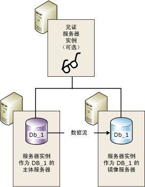
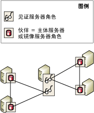

# 数据库镜像见证服务器
  若要支持自动故障转移，必须在高安全性模式下配置数据库镜像会话，并且还要具有第三个服务器实例（也称为“见证服务器”）。 见证服务器是 [!INCLUDE[ssNoVersion](../../includes/ssnoversion-md.md)] 的可选实例，它能使高安全性模式会话中的镜像服务器识别出是否要启动自动故障转移。 与这两个伙伴不同的是，见证服务器并不能用于数据库。 见证服务器的唯一角色是支持自动故障转移。  
  
> [!NOTE]  
>  在高性能模式下，见证服务器对可用性会有不利影响。 如果见证服务器是针对数据库镜像会话而配置，则主体服务器必须至少连接到一个其他服务器实例，即镜像服务器或见证服务器，或者是连接到这两个服务器。 否则，将无法使用数据库，并且不能进行强制服务（可能丢失数据）。 因此，对于高性能模式，我们极力建议您始终将见证服务器设置为 OFF。 有关见证服务器对高性能模式影响的信息，请参阅[数据库镜像运行模式](../../database-engine/database-mirroring/database-mirroring-operating-modes.md)。  
  
 下图显示了使用见证服务器的高安全性模式会话。  
  
   
  
 **本主题内容：**  
  
-   [在多会话中使用见证服务器](#InMultipleSessions)  
  
-   [关于软件和硬件的建议](#SwHwRecommendations)  
  
-   [自动故障转移中见证服务器的角色](#InAutoFo)  
  
-   [添加或删除见证服务器](#AddRemoveWitness)  
  
##   在多会话中使用见证服务器  
 特定的服务器实例可以在并发数据库镜像会话中充当见证服务器，每个会话都针对不同的数据库。 不同的会话可能有不同的伙伴。 下图显示了在两个具有不同伙伴的数据库镜像会话中充当见证服务器的服务器实例。  
  
   
  
 此外，一个服务器实例还可以既作为某些会话中的见证服务器，同时又作为其他会话中的伙伴。 但实际上，服务器实例通常是要么作为见证服务器，要么作为伙伴。 这是因为伙伴需要具有足够硬件的高级计算机来支持生产数据库，但是见证服务器可以在支持 [!INCLUDE[ssCurrent](../../includes/sscurrent-md.md)]的任何可用 Windows 系统中运行。  
  
##   关于软件和硬件的建议  
 我们极力建议将见证服务器置于独立于伙伴的单独计算机中。 只有 [!INCLUDE[ssNoVersion](../../includes/ssnoversion-md.md)] Standard Edition 和 [!INCLUDE[ssNoVersion](../../includes/ssnoversion-md.md)] Enterprise Edition 支持数据库镜像伙伴。 相反， [!INCLUDE[ssNoVersion](../../includes/ssnoversion-md.md)] Workgroup 和 [!INCLUDE[ssNoVersion](../../includes/ssnoversion-md.md)] Express 也支持见证服务器。 除了从早期版本的 [!INCLUDE[ssNoVersion](../../includes/ssnoversion-md.md)]升级期间之外，镜像会话中的服务器实例必须都运行相同版本的 [!INCLUDE[ssNoVersion](../../includes/ssnoversion-md.md)]。 例如，从 [!INCLUDE[ssKatmai](../../includes/sskatmai-md.md)] 镜像配置升级时支持 [!INCLUDE[ssKatmai](../../includes/sskatmai-md.md)] 见证服务器，但是不能添加到现有或新的 [!INCLUDE[ssKilimanjaro](../../includes/sskilimanjaro-md.md)] 或更高版本的镜像配置中。  
  
 见证服务器可以在支持 [!INCLUDE[ssNoVersion](../../includes/ssnoversion-md.md)]的这些版本之一的任意可靠计算机系统上运行。 然而，我们建议用作见证服务器的每个服务器实例都符合所运行的 [!INCLUDE[ssNoVersion](../../includes/ssnoversion-md.md)] Standard 版本所需的最低配置。 有关这些要求的详细信息，请参阅[安装 SQL Server 2016 的硬件和软件要求](../../sql-server/install/hardware-and-software-requirements-for-installing-sql-server-2016.md)。  
  
##   自动故障转移中见证服务器的角色  
 在整个数据库镜像会话过程中，所有服务器实例都会监视它们的连接状态。 如果伙伴相互之间断开，它们会依赖见证服务器来确保它们当中只有一个正在操作数据库。 如果有同步镜像服务器断开了与主体服务器的连接，但仍与见证服务器保持连接，镜像服务器就会联系见证服务器，以确定见证服务器是否已与主体服务器断开连接：  
  
-   如果主体服务器仍与见证服务器保持连接，则不会发生自动故障转移。 主体服务器会继续为数据库提供服务，同时累积日志记录，从而在伙伴重新连接时发送给镜像服务器。  
  
-   如果见证服务器也与主体服务器断开连接，则镜像服务器知道主体数据库已不可用。 在这种情况下，镜像服务器立即启动自动故障转移。  
  
-   如果镜像服务器与见证服务器和主体服务器都断开连接，则不论主体服务器状态如何都无法进行自动故障转移。  
  
 至少要连接到两个服务器实例的要求称为“仲裁 ”。 仲裁可以确保数据库一次仅可由一个伙伴提供服务。 有关仲裁的工作原理以及它对会话的影响的详细信息，请参阅[仲裁：见证服务器如何影响数据库可用性（数据库镜像）](../../database-engine/database-mirroring/quorum-how-a-witness-affects-database-availability-database-mirroring.md)。  
  
##   添加或删除见证服务器  
 **添加见证服务器**  
  
-   [添加或替换数据库镜像见证服务器 (SQL Server Management Studio)](../../database-engine/database-mirroring/add-or-replace-a-database-mirroring-witness-sql-server-management-studio.md)  
  
-   [使用 Windows 身份验证添加数据库镜像见证服务器 (Transact-SQL)](../../database-engine/database-mirroring/add-a-database-mirroring-witness-using-windows-authentication-transact-sql.md)  
  
 **删除见证服务器**  
  
-   [从数据库镜像会话删除见证服务器 (SQL Server)](../../database-engine/database-mirroring/remove-the-witness-from-a-database-mirroring-session-sql-server.md)  
  
## 另请参阅  
 [数据库镜像会话期间的角色切换 (SQL Server)](../../database-engine/database-mirroring/role-switching-during-a-database-mirroring-session-sql-server.md)   
 [数据库镜像运行模式](../../database-engine/database-mirroring/database-mirroring-operating-modes.md)   
 [仲裁：见证服务器如何影响数据库可用性（数据库镜像）](../../database-engine/database-mirroring/quorum-how-a-witness-affects-database-availability-database-mirroring.md)   
 [数据库镜像期间可能出现的故障](../../database-engine/database-mirroring/possible-failures-during-database-mirroring.md)   
 [镜像状态 (SQL Server)](../../database-engine/database-mirroring/mirroring-states-sql-server.md)  
  
  