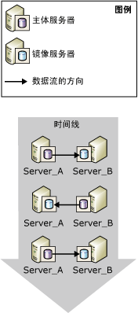
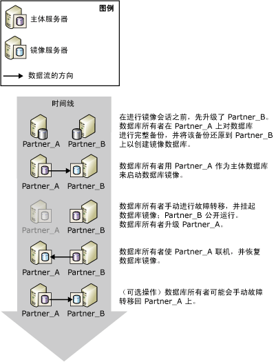
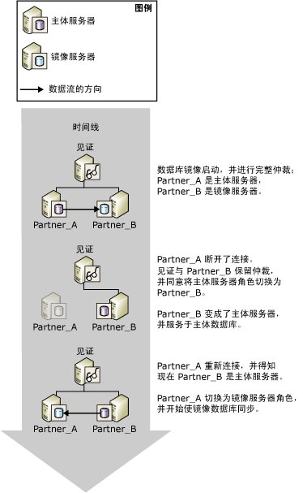
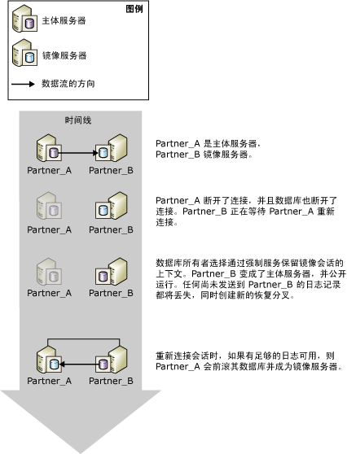

# 数据库镜像会话期间的角色切换 (SQL Server)
[!INCLUDE[appliesto-ss-xxxx-xxxx-xxx-md](../../includes/appliesto-ss-xxxx-xxxx-xxx-md.md)]
  在数据库镜像会话上下文中，通常可以使用一个称为“角色切换” 的过程来互换主体角色和镜像角色。 在角色切换中，镜像服务器充当主体服务器的“故障转移伙伴  ”，接管主体角色，恢复其数据库副本并使其联机以作为新的主体数据库。 以前的主体服务器将作为镜像角色（如果可用），并且其数据库将成为新的镜像数据库。 在可能的情况下，这些角色可以来回切换，以应对多次失败或满足管理的需要。  
  
> [!NOTE]  
>  本主题假定您熟悉数据库镜像运行模式。 有关详细信息，请参阅 [Database Mirroring Operating Modes](../../database-engine/database-mirroring/database-mirroring-operating-modes.md)。  
  
 下图显示了镜像伙伴（ **Partner_A** 和 **Partner_B**）在一系列自动或手动故障转移间切换主体和镜像角色。  
  
   
  
> [!IMPORTANT]  
>  在角色切换之后，运行于以前主体数据库上的作业必须在新的主体服务器中重新创建，以便能够在新的主体服务器中运行。 有关详细信息，请参阅[角色切换后登录名和作业的管理 (SQL Server)](../../sql-server/failover-clusters/management-of-logins-and-jobs-after-role-switching-sql-server.md)。  
  
 有三种角色切换类型：自动故障转移、手动故障转移和强制服务（可能造成数据丢失）。 对每种形式的支持取决于会话的运行模式。  
  
> [!NOTE]  
>  如果不熟悉这些运行模式，请参阅 [数据库镜像运行模式](../../database-engine/database-mirroring/database-mirroring-operating-modes.md)。  
  
-   **手动故障转移**  
  
     高安全性模式支持手动故障转移。 数据库同步后，数据库所有者可以启动手动故障转移。  
  
     手动故障转移是为进行管理提供的。 有关详细信息，请参阅本主题后面的 [手动故障转移](#ManualFailover)。  
  
-   **自动故障转移**  
  
     如果存在见证服务器，则高安全性模式支持自动故障转移。 如果见证服务器和镜像服务器仍然彼此连接，并且数据库已同步，则仅在丢失主体服务器时才发生自动故障转移。 有关详细信息，请参阅本主题后面的 [自动故障转移](#AutomaticFailover)。  
  
-   **强制服务（可能造成数据丢失）**  
  
     未设置见证服务器或见证服务器不在高性能模式下时，高安全性模式支持强制服务。 主体服务器丢失时，数据库所有者可以通过强制在镜像服务器上服务以使数据库可用（可能造成数据丢失）。  
  
    > [!NOTE]  
    >  建议您在高性能模式下，将 WITNESS 属性设置为 OFF。 否则，若要使数据库联机，镜像服务器必须连接到见证服务器。  
  
     有关详细信息，请参阅本主题后面的 [强制服务（可能造成数据丢失）](#ForcedService)。  
  
 下表概述了在每种运行模式下支持的故障转移形式。  
  
||高性能|没有见证服务器的高安全性模式|具有见证服务器的高安全性模式|  
|-|----------------------|-----------------------------------------|--------------------------------------|  
|自动故障转移 (automatic failover)|否|否|用户帐户控制|  
|手动故障转移 (manual failover)|否|是|用户帐户控制|  
|强制服务|用户帐户控制|是|否|  
  
 在角色切换之后，某些元数据必须存在于伙伴双方上，以确保所有的数据库用户均可访问新的主体数据库。 此外，必须对新的主体服务器创建备份作业，以确保数据库继续进行定期备份。 有关详细信息，请参阅[角色切换后登录名和作业的管理 (SQL Server)](../../sql-server/failover-clusters/management-of-logins-and-jobs-after-role-switching-sql-server.md)。  
  
 在角色切换过程中，数据库镜像功能中断服务的时间取决于角色切换的类型和原因。 有关详细信息，请参阅 [估计在角色切换期间服务的中断（数据库镜像）](../../database-engine/database-mirroring/estimate-the-interruption-of-service-during-role-switching-database-mirroring.md)。  
  
##   Manual Failover  
 手动故障转移断开客户端与数据库的连接，并反转伙伴的角色。 仅高安全性模式支持手动故障转移。  
  
 **本节内容：**  
  
-   [升级期间维护可用性](#AvailabilityDuringUpgrades)  
  
-   [手动故障转移所需条件](#ConditionsForManualFo)  
  
-   [手动故障转移的原理](#HowManualFoWorks)  
  
###   升级期间维护可用性  
 数据库管理员可使用手动故障转移升级硬件或软件，同时不会牺牲可用性。 若要使用数据库镜像进行软件升级，镜像服务器和/或系统必须已接收到升级程序。  
  
> [!NOTE]  
>  数据库镜像应该能够执行滚动升级，但是不能保证可执行此操作，因为将来的更改是未知的。 有关详细信息，请参阅 [Upgrading Mirrored Instances](../../database-engine/database-mirroring/upgrading-mirrored-instances.md)。  
  
 下图说明了升级数据库服务器实例时使用手动故障转移维护数据库可用性的实例。 完成升级后，管理员可以选择重新向原始服务器实例执行故障转移。 如果管理员希望停止镜像会话并在其他位置使用镜像服务器时，这很有用。 这样，在更新一系列数据库服务器实例时，可以反复使用一个服务器实例。  
  
   
  
###   手动故障转移所需条件  
 手动故障转移需要将事务安全设置为 FULL（即，高安全模式）。 当伙伴连接在一起并且数据库已同步时，支持手动故障转移。  
  
###   手动故障转移的原理  
 手动故障转移会启动下列一组操作：  
  
1.  主体服务器将断开客户端与主体数据库的连接，将日志尾部发送到镜像服务器，并且为了准备切换到镜像角色而将镜像状态设置为 SYNCHRONIZING。  
  
2.  镜像服务器将从主体数据库接收到的最后一个日志记录的日志序列号 (LSN) 记录为故障转移 LSN。  
  
    > [!NOTE]  
    >  若要查看此 LSN，请从 [sys.database_mirroring (Transact-SQL)](../../relational-databases/system-catalog-views/sys-database-mirroring-transact-sql.md) 中选择 **mirroring_failover_lsn** 列。  
  
3.  如果重做队列中有任何等待的日志，则镜像服务器将完成前滚镜像数据库的操作。 所需时间取决于系统速度、最新工作负荷以及重做队列中的日志量。 对于同步运行模式，可通过限制重做队列的大小调整故障转移时间。 不过，这会导致主体服务器的速度下降，以便镜像服务器能够与其同步。  
  
    > [!NOTE]  
    >  若要了解重做队列的当前大小，请使用数据库镜像性能对象中的 **Redo Queue** 性能计数器（有关详细信息，请参阅[监视数据库镜像(SQL Server)](../../database-engine/database-mirroring/monitoring-database-mirroring-sql-server.md)）。  
  
4.  镜像服务器成为新的主体服务器，而以前的主体服务器成为新的镜像服务器。  
  
5.  新的主体服务器回滚所有未提交的事务并使其数据库副本作为主体数据库联机。  
  
6.  以前的主体角色成为镜像角色，以前的主体数据库成为镜像数据库。 新的镜像服务器快速重新同步新的镜像数据库与新的主体数据库。  
  
    > [!NOTE]  
    >  新的镜像服务器重新同步数据库后，就可以再次执行故障转移，但按反向执行。  
  
 执行故障转移后，客户端必须重新连接到当前的主体数据库。 有关详细信息，请参阅 [将客户端连接到数据库镜像会话 (SQL Server)](../../database-engine/database-mirroring/connect-clients-to-a-database-mirroring-session-sql-server.md)。  
  
 **启动手动故障转移**  
  
-   [手动故障转移数据库镜像会话 (SQL Server Management Studio)](../../database-engine/database-mirroring/manually-fail-over-a-database-mirroring-session-sql-server-management-studio.md)  
  
-   [手动故障转移数据库镜像会话 (Transact-SQL)](../../database-engine/database-mirroring/manually-fail-over-a-database-mirroring-session-transact-sql.md)。  
  
##   Automatic Failover  
 只有在高安全性模式（*具有自动故障转移功能的高安全性模式*）下运行并且具有见证服务器的数据库镜像会话支持自动故障转移。 在具有自动故障转移功能的高安全性模式下，同步数据库后，如果主体数据库变得不可用，则会发生自动故障转移。 自动故障转移将导致镜像服务器接管主体服务器的角色，并使其数据库的副本联机以作为主体数据库。 因为每个在主体数据库中提交的事务同时也在镜像数据库中提交，所以需要使数据库保持同步以防止在故障转移过程中丢失数据。  
  
> [!IMPORTANT]  
>  为了增强自动故障转移的可靠性，镜像数据库和主体数据库必须驻留在不同的计算机上。  
  
 **本节内容：**  
  
-   [自动故障转移所需条件](#ConditionsForAutoFo)  
  
-   [自动故障转移的原理](#HowAutoFoWorks)  
  
-   [禁用自动故障转移 (SQL Server Management Studio)](#DisableAutoSSMS)  
  
-   [禁用自动故障转移（使用 Transact-SQL）](#DisableAutoTsql)  
  
###   自动故障转移所需条件  
 自动故障转移需要下列条件：  
  
-   数据库镜像会话必须在高安全性模式下运行，并且必须处理见证服务器。 有关详细信息，请参阅 [Database Mirroring Operating Modes](../../database-engine/database-mirroring/database-mirroring-operating-modes.md)。  
  
-   镜像数据库必须已经同步。 这将保证发送到镜像服务器的所有日志都已写入磁盘。  
  
-   主体服务器已中断了与其余数据库镜像配置的通信，而镜像服务器和见证服务器将保留仲裁。 但是，如果所有服务器实例都已中断通信，而见证服务器和镜像服务器稍后重新建立通信，则不会发生自动故障转移。  
  
    > [!NOTE]  
    >  有关详细信息，请参阅[仲裁：见证服务器如何影响数据库可用性（数据库镜像）](../../database-engine/database-mirroring/quorum-how-a-witness-affects-database-availability-database-mirroring.md)。  
  
-   镜像服务器已检测到丢失了主体服务器。  
  
     镜像服务器检测主体服务器故障的方式取决于故障是硬故障还是软故障。 有关详细信息，请参阅 [Possible Failures During Database Mirroring](../../database-engine/database-mirroring/possible-failures-during-database-mirroring.md)。  
  
###   自动故障转移的原理  
 在上述条件下，自动故障转移将启动以下操作顺序：  
  
1.  如果主体服务器仍在运行中，则将主体数据库的状态更改为 DISCONNECTED 并断开所有客户端与主体数据库的连接。  
  
2.  见证服务器和镜像服务器将主体服务器注册为不可用。  
  
3.  如果重做队列中有任何等待的日志，则镜像服务器将完成前滚镜像数据库的操作。  
  
    > [!NOTE]  
    >  应用日志所需的时间取决于系统的速度、最近的工作负载以及重做队列中的日志量。  
  
4.  前一个镜像数据库作为新的联机主体数据库，恢复通过尽快回滚未提交的事务将这些事务全部清除。 锁将隔离这些事务。  
  
5.  当前一个主体服务器重新联接到会话时，它将认定其故障转移伙伴现在拥有主体角色。 前一个主体服务器接管镜像角色，并将其数据库作为镜像数据库。 新的镜像服务器会尽快将新的镜像数据库与主体数据库同步。 新的镜像服务器重新同步数据库后，就可以再次执行故障转移，但按反向执行。  
  
 下图说明了自动故障转移的一个实例。  
  
   
  
 最初，所有三个服务器都已连接（会话具有完全仲裁）。 **Partner_A** 为主体服务器， **Partner_B** 为镜像服务器。 **Partner_A** （或 **Partner_A**上的主体数据库）变得不可用。 见证服务器和 **Partner_B** 都将认定主体服务器不可用，会话保留仲裁。 **Partner_B** 变为主体服务器，并将其数据库的副本用作新的主体数据库。 最后， **Partner_A** 重新连接到会话并发现 **Partner_B** 现在拥有主体角色。 **Partner_A** 接下来将接管镜像角色。  
  
 执行故障转移后，客户端必须重新连接到当前的主体数据库。 有关详细信息，请参阅 [将客户端连接到数据库镜像会话 (SQL Server)](../../database-engine/database-mirroring/connect-clients-to-a-database-mirroring-session-sql-server.md)。  
  
> [!NOTE]  
>  当发生故障转移时，使用 [!INCLUDE[msCoName](../../includes/msconame-md.md)] 分布式事务处理协调器准备就绪但尚未提交的事务被认为在数据库故障转移后已中止。  
  
###   禁用自动故障转移 (SQL Server Management Studio)  
 打开“数据库属性镜像”页，并通过选择下列选项之一更改操作模式：  
  
-   **不带自动故障转移功能的高安全(同步)**  
  
     在此模式下，数据库继续进行同步，并且可以进行手动故障转移。  
  
-   **高性能(异步)**  
  
     在此模式下，镜像数据库可能稍微滞后于主体数据库，并且不可能再进行手动故障转移。  
  
###   禁用自动故障转移（使用 Transact-SQL）  
 在数据库镜像会话过程中，数据库所有者可以随时通过关闭见证服务器来禁用自动故障转移。  
  
 **关闭见证服务器**  
  
-   [从数据库镜像会话删除见证服务器 (SQL Server)](../../database-engine/database-mirroring/remove-the-witness-from-a-database-mirroring-session-sql-server.md)  
  
    > [!NOTE]  
    >  关闭见证服务器而保留完整事务安全，会将会话置于不带自动故障转移功能的高安全性模式中。  
  
##   Forced Service (with Possible Data Loss)  
 数据库镜像提供强制服务（可能造成数据丢失）作为灾难恢复方法，以允许将镜像服务器用作温备用服务器。 仅当主体服务器在镜像会话中与镜像服务器断开连接时，才能强制服务运行。 因为强制服务运行存在数据丢失的风险，所以应该谨慎使用。  
  
 是否支持强制服务取决于会话的运行模式和状态，如下所示：  
  
-   通常，当主体服务器断开连接时，高性能模式支持强制服务。 但是，高性能模式会话可能存在见证服务器（虽然并非必需）。 在这种情况下，强制服务要求镜像服务器和见证服务器相互连接。  
  
-   当主体服务器断开连接时，不带自动故障转移功能的高安全性模式支持强制服务。  
  
-   当镜像服务器和见证服务器相互连接并且它们都未连接到主体服务器时，具有自动故障转移功能的高安全性模式支持强制服务（只要当镜像服务器上次连接到主体服务器时，不回滚镜像数据库）。  
  
 建议仅当您必须立即还原数据库服务并愿意承担数据丢失的风险时，才能强制服务运行。 强制服务的结果相当于删除镜像，但强制服务在恢复镜像时便于重新同步数据库，并且可能存在数据丢失的风险。 强制服务将把主体角色平滑转换给镜像数据库。 镜像服务器将担当主体服务器角色并立即向客户端提供数据库的副本。 新的主体数据库在没有镜像的情况下运行（即公开运行）。  
  
> [!IMPORTANT]  
>  如果主体服务器仅与数据库镜像会话断开连接并且仍在运行，则某些客户端可以继续访问原始主体数据库。 强制服务之前，必须防止客户端访问原始主体服务器。 否则，强制服务之后，原始主体数据库和当前主体数据库便会分别进行更新。  
  
 **本节内容：**  
  
-   [强制服务的典型事例](#TypicalCaseFS)  
  
-   [强制服务的风险](#FSrisks)  
  
-   [管理潜在的数据丢失](#ManageDataLoss)  
  
-   [与管理强制故障转移相关的任务](#RelatedTasksForFS)  
  
###   强制服务的典型事例  
 下图说明了强制服务（可能造成数据丢失）的典型事例。  
  
   
  
 在图中，原始主体服务器 **Partner_A**不可用于镜像服务器 **Partner_B**，从而导致镜像数据库断开连接。 确定 **Partner_A** 不可用于客户端之后，数据库管理员对 **Partner_B** 进行强制服务，这可能会造成数据丢失。 **Partner_B** 变为主体服务器，并在数据库公开（也就是未镜像）的情况下运行。 此时，客户端可以重新连接到 **Partner_B**。  
  
 当 **Partner_A** 变得可用时，它会重新连接到新的主体服务器，从而重新加入会话并担当镜像角色。 镜像会话便会立即挂起，而尚未同步新的镜像数据库。 会话挂起之后，数据库管理员可以确定是恢复会话，还是在极特殊情况下删除镜像并尝试对以前主体数据库中的数据进行补救。 在此事例中，数据库管理员选择恢复镜像。 此时， **Partner_A** 接管镜像服务器的角色并将以前的主体数据库回滚到上次成功同步事务的时间点；如果在强制服务之前，未将所有提交的事务写入镜像服务器上的磁盘，则这些事务将丢失。 然后，**Partner_A** 通过应用自以前镜像服务器变为新主体服务器以来对新主体数据库所做的所有更改，前滚新的镜像数据库。  
  
> [!NOTE]  
>  虽然高性能模式不需要见证服务器，但如果配置了一个见证服务器，则仅当见证服务器当前连接到镜像服务器时，才可以强制服务运行。  
  
###   强制服务的风险  
 一定要注意，强制服务可能会造成数据丢失。 数据可能会丢失，因为镜像服务器无法与主体服务器进行通信，从而不能保证两个数据库同步。 强制服务还启动新的恢复分叉。 因为原始主体数据库和镜像数据库位于不同的恢复分叉上，每个数据库现在包含其他数据库不包含的数据：原始主体数据库包含任何尚未从其发送队列发送到以前的镜像数据库（未发送的日志）的更改；以前的镜像数据库包含任何强制服务之后发生的更改。  
  
 如果因为主体服务器出现故障而强制服务，则潜在的数据丢失取决于是否在出现故障之前已将所有事务日志发送到镜像服务器。 在高安全性模式下，可能仅在镜像数据库同步之前会出现这种情况。 在高性能模式下，可能会始终存在累积的未发送日志。  
  
 强制服务的影响在某种程度上取决于会话是否具有见证服务器：  
  
-   没有见证服务器时，如果伙伴断开连接（例如，因为伙伴网络连接断开），则可以强制服务运行。 如果原始主体服务器仍在运行，则两个伙伴都拥有主体角色。 连接到新主体服务器的客户端将访问当前版本的数据库，而连接到原始主体服务器的客户端将访问原始主体数据库。 这种情况增大了数据丢失的可能性。 如果允许伙伴进行重新连接，则原始主体服务器担当镜像角色，并在镜像挂起之前将其数据库的状态更改为“正在恢复”。 如果恢复会话，则原始主体数据库中日志在最近断开连接以来已在发送队列中的事务将丢失。 此外，强制服务之后发生的所有事务也将丢失。  
  
-   存在见证服务器时，如果镜像服务器与主体服务器和见证服务器断开连接，则只要主体服务器和见证服务器保持相互连接，主体服务器便会公开运行。 如果主体服务器与见证服务器断开连接，则它会停止为数据库提供服务。 此后，如果镜像服务器重新连接到见证服务器，则可以强制服务运行。 如果强制服务，则在重新连接原始主体服务器时，在原始主体服务器公开运行时所做的所有更改都将丢失。  
  
 有关详细信息，请参阅本主题后面的 [管理潜在的数据丢失](#ManageDataLoss)。  
  
###   管理潜在的数据丢失  
 强制服务之后，如果以前的主体服务器可用，并假设其数据库没有损坏，则可以尝试管理潜在的数据丢失。 管理潜在数据丢失的可用方法取决于原始主体服务器是否已重新连接到其伙伴并重新加入镜像会话。 假设原始主体服务器可以访问新的主体实例，则会自动透明地进行重新连接。  
  
#### 已重新连接原始主体服务器  
 通常，出现故障后，原始主体服务器在重新启动时便会迅速重新连接到其伙伴。 重新连接后，原始主体服务器变为镜像服务器。 其数据库变为镜像数据库，并且在会话挂起之前进入恢复状态。 除非恢复镜像，否则不回滚镜像数据库。  
  
 但是，无法访问恢复数据库；因此，不能对其进行检查以确定恢复镜像时可能丢失的数据。 因此，确定是恢复镜像还是删除镜像取决于您是否能够完全接受数据丢失。  
  
-   如果数据丢失不可接受，则应该删除镜像以对数据进行补救。  
  
     通过删除镜像，数据库管理员可以恢复原始主体数据库，并尝试恢复可能已丢失的数据。 但是，如果以前的镜像数据库在线，则以前的伙伴将为同名的不同数据库提供服务。 数据库管理员需要使客户端无法访问其中一个数据库，以免数据库产生进一步分歧并防止出现客户端故障转移问题。  
  
-   如果数据丢失可以接受，则可以恢复镜像。  
  
     恢复镜像会导致新的镜像数据库如同步数据库第一步所述那样回滚。 如果出现故障时日志记录在发送队列中等待，则相应的事务将会丢失，即使已提交这些事务也会如此。  
  
#### 尚未重新连接原始主体服务器  
 如果可以暂时阻止原始主体服务器通过网络重新连接到新的主体服务器，则可以检查原始主体数据库以确定恢复镜像时可能丢失的数据。  
  
-   如果潜在的数据丢失可以接受  
  
     允许原始主体服务器重新连接到其伙伴。 重新连接会导致镜像挂起。 若要继续镜像，只需恢复会话。 以前的主体服务器担当镜像角色。 新的镜像服务器会删除原始恢复分叉，从而丢失从未发送到以前的镜像服务器或由其接收的所有事务。  
  
-   如果数据丢失不可接受  
  
     如果原始主体数据库包含在恢复会话时可能丢失的重要数据，则可以删除镜像以保留原始主体服务器中的数据。 建议在此时尝试备份主体数据库的日志尾部。 然后，通过从原始主体数据库中导出要补救的数据，并将其导入当前主体数据库来更新当前主体数据库（以前的镜像数据库）。 建议尽快对已更新的数据库执行完整数据库备份。  
  
     若要使用已更新的数据库作为初始主体数据库来重新建立镜像，请使用此备份（以及至少一个后续日志备份）创建新的镜像数据库。 必须应用删除镜像之后执行的每个日志备份。 因此，建议在启动新的镜像会话之前延迟主体数据的其他日志备份。  
  
###   与管理强制故障转移相关的任务  
 **强制服务**  
  
-   [在数据库镜像会话中强制服务 (Transact-SQL)](../../database-engine/database-mirroring/force-service-in-a-database-mirroring-session-transact-sql.md)。  
  
 **恢复数据库镜像**  
  
-   [暂停或恢复数据库镜像会话 (SQL Server)](../../database-engine/database-mirroring/pause-or-resume-a-database-mirroring-session-sql-server.md)  
  
 **创建新的镜像数据库**  
  
 [为镜像准备镜像数据库 (SQL Server)](../../database-engine/database-mirroring/prepare-a-mirror-database-for-mirroring-sql-server.md)  
  
 **启动数据库镜像**  
  
-   [设置数据库镜像 (SQL Server)](../../database-engine/database-mirroring/setting-up-database-mirroring-sql-server.md)  
  
-   [使用 Windows 身份验证建立数据库镜像会话 (SQL Server Management Studio)](../../database-engine/database-mirroring/establish-database-mirroring-session-windows-authentication.md)  
  
## 另请参阅  
 [估计在角色切换期间服务的中断（数据库镜像）](../../database-engine/database-mirroring/estimate-the-interruption-of-service-during-role-switching-database-mirroring.md)   
 [数据库镜像期间可能出现的故障](../../database-engine/database-mirroring/possible-failures-during-database-mirroring.md)   
 [将客户端连接到数据库镜像会话 (SQL Server)](../../database-engine/database-mirroring/connect-clients-to-a-database-mirroring-session-sql-server.md)   
 [数据库镜像见证服务器](../../database-engine/database-mirroring/database-mirroring-witness.md)   
 [完整数据库还原（完整恢复模式）](../../relational-databases/backup-restore/complete-database-restores-full-recovery-model.md)   
 [数据库镜像运行模式](../../database-engine/database-mirroring/database-mirroring-operating-modes.md)   
 [镜像状态 (SQL Server)](../../database-engine/database-mirroring/mirroring-states-sql-server.md)  
  
  
