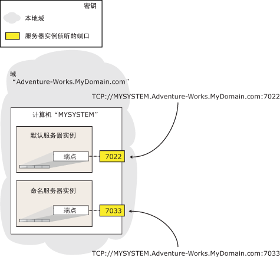

# <a name="specify-a-server-network-address-database-mirroring"></a>指定服务器网络地址（数据库镜像）
[!INCLUDE[appliesto-ss-xxxx-xxxx-xxx-md](../../includes/appliesto-ss-xxxx-xxxx-xxx-md.md)]
  设置数据库镜像会话要求每个服务器实例都有一个服务器网络地址。 服务器实例的服务器网络地址必须通过提供系统地址和实例侦听的端口号来明确标识该实例。  
  
 在服务器网络地址中指定一个端口之前，服务器实例上必须具有数据库镜像端点。 有关详细信息，请参阅 [为 Windows 身份验证创建数据库镜像终结点 (Transact-SQL)](../../database-engine/database-mirroring/create-a-database-mirroring-endpoint-for-windows-authentication-transact-sql.md)。  
  
  
##  <a name="Syntax"></a> 服务器网络地址的语法  
 服务器网络地址的语法格式如下：  
  
 TCP<strong>://</strong> *\<system-address>* <strong>:</strong> *\<port>*  
  
 其中  
  
-   *system-address> 是明确标识目标计算机系统的字符串\<* 。 通常，服务器地址是系统名称（如果各系统都在同一个域中）、完全限定域名或 IP 地址：  
  
    -   如果各系统都在同一个域中，则可以使用计算机系统的名称；例如， `SYSTEM46`。  
  
    -   若要使用 IP 地址，则该地址在您环境中必须是唯一的。 建议只使用静态的 IP 地址。 IP 地址可以是 IP 版本 4 (IPv4) 或 IP 版本 6 (IPv6)。 必须用方括号将 IPv6 地址括起，例如： **[** _<IPv6_address>_ **]** 。  
  
         若要了解系统的 IP 地址，则在 Windows 命令提示符处，输入 **ipconfig** 命令。  
  
    -   保证完全限定域名的有效性。 它是在不同位置具有不同形式的本地定义的地址字符串。 通常（但并不总是），完全限定域名是一个复合名称，包含计算机名称和一系列句点分隔的域段，其格式为：  
  
         computer_name .   _domain_segment_[... **.** _domain_segment_]  
  
         其中， *computer_name*是运行服务器实例的计算机的网络名称， *domain_segment*[... **.** _domain_segment_] 是服务器的其余域信息；例如： `localinfo.corp.Adventure-Works.com`。  
  
         在公司或组织内确定域段的内容和数量。 如果您不知道服务器的完全限定域名，请与系统管理员联系。  
  
        > [!NOTE]  
        >  有关如何查找完全限定域名的信息，请参阅本主题后面的“查找完全限定域名”。  
  
-   *port> 是合作伙伴服务器实例的镜像终结点所使用的端口号\<* 。 有关指定终结点的信息，请参阅 [为 Windows 身份验证创建数据库镜像终结点 (Transact-SQL)](../../database-engine/database-mirroring/create-a-database-mirroring-endpoint-for-windows-authentication-transact-sql.md)。  
  
     数据库镜像端点可以使用计算机系统上的任意可用端口。 计算机系统上的每个端口号只能与一个端点相关联，而每个端点与一个服务器实例相关联；这样，同一服务器上的不同服务器实例便可使用不同端口来侦听各个端点。 因此，设置数据库镜像会话时在服务器网络地址中指定的端口会始终将会话定向到其端点与该端口关联的服务器实例。  
  
     在服务器实例的服务器网络地址中，只有通过与其镜像端点关联的端口号才能将实例与计算机上的所有其他实例区分开来。 下图显示了一台计算机上两个服务器实例的服务器网络地址。 默认实例使用端口 `7022` ，命名实例使用端口 `7033`。 这两个服务器实例的服务器网络地址分别为： `TCP://MYSYSTEM.Adventure-works.MyDomain.com:7022` 和 `TCP://MYSYSTEM.Adventure-works.MyDomain.com:7033`。 请注意，地址中不包含服务器实例名。  
  
       
  
     若要标识当前与服务器实例的数据库镜像端点关联的端口，请使用以下 [!INCLUDE[tsql](../../includes/tsql-md.md)] 语句：  
  
    ```  
    SELECT type_desc, port FROM sys.tcp_endpoints  
    ```  
  
     找到 **type_desc** 值为“DATABASE_MIRRORING”的行，然后使用对应的端口号。  
  
### <a name="examples"></a>示例  
  
#### <a name="a-using-a-system-name"></a>A. 使用系统名称  
 以下服务器网络地址指定系统名称 `SYSTEM46`和端口 `7022`。  
  
```  
ALTER DATABASE AdventureWorks SET PARTNER ='tcp://SYSTEM46:7022';  
```  
  
#### <a name="b-using-a-fully-qualified-domain-name"></a>B. 使用完全限定域名  
 以下服务器网络地址指定完全限定域名 `DBSERVER8.manufacturing.Adventure-Works.com`和端口 `7024`。  
  
```  
ALTER DATABASE AdventureWorks SET PARTNER ='tcp://DBSERVER8.manufacturing.Adventure-Works.com:7024';  
```  
  
#### <a name="c-using-ipv4"></a>C. 使用 IPv4  
 以下服务器网络地址指定 IPv4 地址 `10.193.9.134`和端口 `7023`。  
  
```  
ALTER DATABASE AdventureWorks SET PARTNER ='tcp://10.193.9.134:7023';  
```  
  
#### <a name="d-using-ipv6"></a>D. 使用 IPv6  
 以下服务器网络地址包含 IPv6 地址 `2001:4898:23:1002:20f:1fff:feff:b3a3`和端口 `7022`。  
  
```  
ALTER DATABASE AdventureWorks SET PARTNER ='tcp://[2001:4898:23:1002:20f:1fff:feff:b3a3]:7022';  
```  
  
## <a name="finding-the-fully-qualified-domain-name"></a>查找完全限定域名  
 若要查找系统的完全限定域名，请在该系统的 Windows 命令提示符下，输入：  
  
 **IPCONFIG /ALL**  
  
 若要形成完全限定的域名，请将 *<host_name>* 和 *<Primary_Dns_Suffix>* 的值连接一起，如下所示：  
  
 <host_name> .   _<Primary_Dns_Suffix>_  
  
 例如，IP 配置  
  
 `Host Name  .  .  .  .  .  .  : MYSERVER`  
  
 `Primary Dns Suffix  .  .  .  : mydomain.Adventure-Works.com`  
  
 等同于以下完全限定域名：  
  
 `MYSERVER.mydomain.Adventure-Works.com`  
  
##  <a name="Examples"></a> 示例  
 以下示例显示了其他域中名为 `REMOTESYSTEM3` 的计算机系统上的某个服务器实例的服务器网络地址。 域信息为 `NORTHWEST.ADVENTURE-WORKS.COM`，数据库镜像端点的端口为 `7025`。 假设具有这些示例组件，则服务器网络地址将为：  
  
 `TCP://REMOTESYSTEM3.NORTHWEST.ADVENTURE-WORKS.COM:7025`  
  
 以下示例显示了名为 `DBSERVER1`的计算机系统上的某个服务器实例的服务器网络地址。 此系统位于本地域中，并由其系统名称明确标识。 数据库镜像端点的端口为 `7022`。  
  
 `TCP://DBSERVER1:7022`  
  
##  <a name="RelatedTasks"></a> 相关任务  
  
-   [为 Windows 身份验证创建数据库镜像终结点 (Transact-SQL)](../../database-engine/database-mirroring/create-a-database-mirroring-endpoint-for-windows-authentication-transact-sql.md)  
  
## <a name="see-also"></a>另请参阅  
 [数据库镜像 (SQL Server)](../../database-engine/database-mirroring/database-mirroring-sql-server.md)   
 [数据库镜像终结点 (SQL Server)](../../database-engine/database-mirroring/the-database-mirroring-endpoint-sql-server.md)  
  
  
