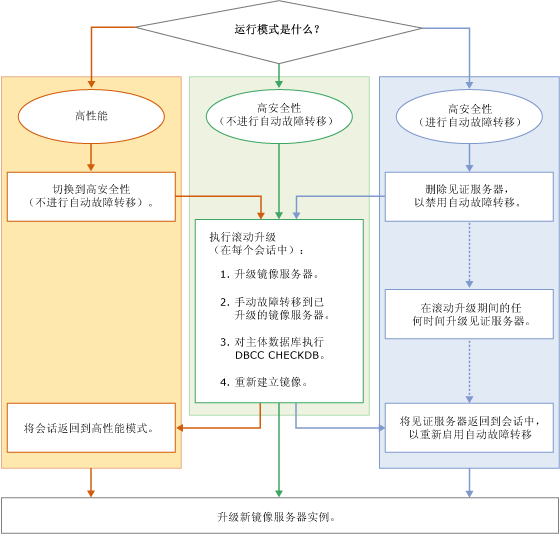

# 升级镜像实例
 [!INCLUDE [SQL Server](../../includes/applies-to-version/sqlserver.md)]
  在将 [!INCLUDE[ssNoVersion](../../includes/ssnoversion-md.md)] 镜像实例升级到新 [!INCLUDE[ssCurrent](../../includes/sscurrent-md.md)] 版本、新 [!INCLUDE[ssNoVersion](../../includes/ssnoversion-md.md)]服务包或积累更新，或升级到新 Windows 服务包或积累更新时，可以通过执行滚动升级将每个镜像数据库的停机时间降低到仅需一次手动故障转移（如果无法故障转移回原始的主要副本，则需两次手动故障转移）。 滚动升级是一个多阶段过程，其最简单的形式如下：升级当前在镜像会话中充当镜像服务器的 [!INCLUDE[ssCurrent](../../includes/sscurrent-md.md)] 实例，然后对镜像数据库进行手动故障转移，升级以前的主体 [!INCLUDE[ssCurrent](../../includes/sscurrent-md.md)] 实例，并恢复镜像。 实际上，确切过程将取决于运行模式以及在所升级的 [!INCLUDE[ssCurrent](../../includes/sscurrent-md.md)] 实例上运行的镜像会话的编号和布局。  
  
> [!NOTE]  
>  有关在迁移过程中使用数据库镜像与日志传送的信息，请下载此 [数据库镜像和日志传送白皮书](https://t.co/RmO6ruCT4J)。  
  
## 先决条件  
 开始之前，请仔细阅读以下重要信息：  
  
-   [支持的版本和版本升级](../../database-engine/install-windows/supported-version-and-edition-upgrades.md)：验证是否可以从你的 Windows 操作系统版本和 SQL Server 版本升级到 SQL Server 2016。 例如，不能直接从 SQL Server 2005 实例升级到 [!INCLUDE[ssCurrent](../../includes/sscurrent-md.md)]。  
  
-   [选择数据库引擎升级方法](../../database-engine/install-windows/choose-a-database-engine-upgrade-method.md)：检查支持的版本和版本升级以及环境中安装的其他组件，并据此选择适当的升级方法和步骤，按正确顺序升级组件。  
  
-   [计划并测试数据库引擎升级计划](../../database-engine/install-windows/plan-and-test-the-database-engine-upgrade-plan.md)：查看发行说明和已知升级问题、预升级清单，并制定和测试升级计划。  
  
-   [安装 SQL Server 2016 的硬件和软件要求](../../sql-server/install/hardware-and-software-requirements-for-installing-sql-server.md)：查看安装 [!INCLUDE[ssCurrent](../../includes/sscurrent-md.md)] 的软件要求。 如果需要其他软件，则应在升级过程开始之前在每个节点上安装该软件，从而最大程度减少故障时间。  
  
## 建议的准备工作（最佳实践）  
 在开始滚动升级之前，建议您：  
  
1.  至少对一个镜像会话执行实际手动故障转移：  
  
    -   [手动故障转移数据库镜像会话 (SQL Server Management Studio)](../../database-engine/database-mirroring/manually-fail-over-a-database-mirroring-session-sql-server-management-studio.md)  
  
    -   [手动故障转移数据库镜像会话 (Transact-SQL)](../../database-engine/database-mirroring/manually-fail-over-a-database-mirroring-session-transact-sql.md)。  
  
    > [!NOTE]  
    >  有关手动故障转移如何实现的详细信息，请参阅[数据库镜像会话期间的角色切换 (SQL Server)](../../database-engine/database-mirroring/role-switching-during-a-database-mirroring-session-sql-server.md) 。  
  
2.  保护数据：  
  
    1.  对每个主体数据库执行完整数据库备份：  
  
         [创建完整数据库备份 (SQL Server)](../../relational-databases/backup-restore/create-a-full-database-backup-sql-server.md)。  
  
    2.  在每个主体服务器上运行 [DBCC CHECKDB](../../t-sql/database-console-commands/dbcc-checkdb-transact-sql.md) 命令。  
  
## 滚动升级的阶段  
 滚动升级的具体步骤取决于镜像配置的运行模式。 不过基本阶段是相同的。  
  
> [!NOTE]  
>  有关运行模式的详细信息，请参阅 [数据库镜像运行模式](../../database-engine/database-mirroring/database-mirroring-operating-modes.md)。  
  
 下图是显示各个运行模式的滚动升级基本阶段的流程图。 该图后面的内容介绍了对应的步骤。  
  
   
  
> [!IMPORTANT]  
>  在并发镜像会话中，一个服务器实例可能扮演不同的镜像角色（主体服务器、镜像服务器或见证服务器）。 在这种情况下，必须相应地调整基本滚动升级过程。 有关详细信息，请参阅 [数据库镜像会话期间的角色切换 (SQL Server)](../../database-engine/database-mirroring/role-switching-during-a-database-mirroring-session-sql-server.md)的各版本中均未提供见证服务器实例。  
  
> [!NOTE]  
>  在许多情况下，滚动升级完成后，将会故障回复到原始主体服务器。  
  
### 将会话从高性能模式更改为高安全模式  
  
1.  如果镜像会话在高性能模式下运行，则在执行滚动升级之前，将运行模式更改为不带自动故障转移功能的高安全模式。  
  
    > [!IMPORTANT]  
    >  如果镜像服务器与主体服务器在地理位置上存有一定距离，则可能不适宜进行滚动升级。  
  
    -   在 [!INCLUDE[ssManStudioFull](../../includes/ssmanstudiofull-md.md)] 中：使用“数据库属性”对话框中的[镜像页](../../relational-databases/databases/database-properties-mirroring-page.md)将“操作模式”选项更改为“不带自动故障转移功能的高安全(同步)”  。 有关如何访问此页的详细信息，请参阅[启动配置数据库镜像安全向导 (SQL Server Management Studio)](../../database-engine/database-mirroring/start-the-configuring-database-mirroring-security-wizard.md)。  
  
    -   在 [!INCLUDE[tsql](../../includes/tsql-md.md)] 中：将事务安全设置为 FULL。 有关详细信息，请参阅[更改数据库镜像会话中的事务安全 (Transact-SQL)](../../database-engine/database-mirroring/change-transaction-safety-in-a-database-mirroring-session-transact-sql.md)  
  
### 从会话中删除见证服务器  
  
1.  如果镜像会话包括见证服务器，则建议您在执行滚动升级之前删除该见证服务器。 否则，在升级镜像服务器实例时，数据库的可用性将取决于仍然连接至主体服务器实例的见证服务器。 删除见证服务器之后，可以在滚动升级过程中随时对其进行升级，而不会有数据库停机的风险。  
  
    > [!NOTE]  
    >  有关详细信息，请参阅[仲裁：见证服务器如何影响数据库可用性（数据库镜像）](../../database-engine/database-mirroring/quorum-how-a-witness-affects-database-availability-database-mirroring.md)。  
  
    -   [从数据库镜像会话删除见证服务器 (SQL Server)](../../database-engine/database-mirroring/remove-the-witness-from-a-database-mirroring-session-sql-server.md)  
  
### 执行滚动升级  
  
1.  为了最大限度地减少停机时间，我们建议：通过更新任何当前在其所有镜像会话中均为镜像服务器的镜像伙伴开始滚动升级。 此时，可能需要更新多个服务器实例。  
  
    > [!NOTE]  
    >  在滚动升级过程中可以随时升级见证服务器。 例如，如果某个服务器实例在会话 1 中为镜像服务器，在会话 2 中为见证服务器，则可以立即升级此服务器实例。  
  
     要首先升级的服务器实例是由镜像会话的当前配置决定的，如下所示：  
  
    -   如果任何服务器实例在其所有镜像会话中均已为镜像服务器，则将此服务器实例升级为新版本。  
  
    -   如果在任何镜像会话中所有服务器实例当前都是主体服务器，则选择一个要首先升级的服务器实例。 然后，对其每个主体数据库进行手动故障转移并升级该服务器实例。  
  
     升级完成后，服务器实例将自动重新加入其每个镜像会话。  
  
2.  对于其镜像服务器实例刚完成升级的每个镜像会话，请等待会话进行同步。 然后，连接到主体服务器实例并对会话进行手动故障转移。 故障转移后，已升级的服务器实例成为该会话的主体服务器，而以前的主体服务成为镜像服务器。  
  
     此步骤的目的是让其他服务器实例在其作为伙伴的每个镜像会话中成为镜像服务器。  
  
     **在出现故障时转移到已升级的服务器实例后的限制。**  
  
     在从早期服务器实例故障转移到 [!INCLUDE[ssCurrent](../../includes/sscurrent-md.md)] 服务器实例后，数据库会话将挂起。 直到升级完其他伙伴后，此会话才能继续。 但主体服务器仍然接受连接，并允许对主体数据库进行数据访问和修改。  
  
    > [!NOTE]  
    >  如果建立新镜像会话，则要求所有服务器实例运行相同版本的 [!INCLUDE[ssNoVersion](../../includes/ssnoversion-md.md)]。  
  
3.  完成故障转移后，我们建议您在主体数据库上运行 [DBCC CHECKDB](../../t-sql/database-console-commands/dbcc-checkdb-transact-sql.md) 命令。  
  
4.  升级在其作为伙伴的所有镜像会话中目前为镜像服务器的每个服务器实例。 此时，可能需要更新多个服务器。  
  
    > [!IMPORTANT]  
    >  在复杂的镜像配置中，某个服务器实例在一个或多个镜像会话中可能仍作为原始主体服务器。 对这些服务器实例重复步骤 2-4，直至涉及的所有实例均已升级。  
  
5.  继续镜像会话。  
  
    > [!NOTE]  
    >  升级完见证服务器并将其重新添加到镜像会话中之后，自动故障转移功能才会起作用。  
  
6.  升级在其所有镜像会话中为见证服务器的任何剩余服务器实例。 在已升级的见证服务器重新加入镜像会话之后，自动故障转移功能将重新变为可用。 此时，可能需要更新多个服务器。  
  
### 将会话恢复为高性能模式  
  
1.  可以选择使用下列方法之一返回高性能模式：  
  
    -   在 [!INCLUDE[ssManStudioFull](../../includes/ssmanstudiofull-md.md)] 中：使用“数据库属性”对话框中的[镜像页](../../relational-databases/databases/database-properties-mirroring-page.md)将“操作模式”选项更改为“高性能(同步)”  。  
  
    -   在 [!INCLUDE[tsql](../../includes/tsql-md.md)] 中：使用 [ALTER DATABASE](../../t-sql/statements/alter-database-transact-sql-database-mirroring.md) 将事务安全设置为 OFF。  
  
### 将见证服务器重新添加到镜像会话中  
  
1.  在高安全模式下，可以选择让见证服务器重新回到每个镜像会话中。  
  
     **返回见证服务器**  
  
    -   [添加或替换数据库镜像见证服务器 (SQL Server Management Studio)](../../database-engine/database-mirroring/add-or-replace-a-database-mirroring-witness-sql-server-management-studio.md)  
  
    -   [使用 Windows 身份验证添加数据库镜像见证服务器 (Transact-SQL)](../../database-engine/database-mirroring/add-a-database-mirroring-witness-using-windows-authentication-transact-sql.md)  
  
## 另请参阅  
 [使用安装向导（安装程序）升级到 SQL Server 2016](../../database-engine/install-windows/upgrade-sql-server-using-the-installation-wizard-setup.md)   
 [从命令提示符安装 SQL Server 2016](../install-windows/install-sql-server-from-the-command-prompt.md)   
 [ALTER DATABASE 数据库镜像 (Transact-SQL)](../../t-sql/statements/alter-database-transact-sql-database-mirroring.md)   
 [BACKUP (Transact-SQL)](../../t-sql/statements/backup-transact-sql.md)   
 [查看镜像数据库的状态 (SQL Server Management Studio)](../../database-engine/database-mirroring/view-the-state-of-a-mirrored-database-sql-server-management-studio.md)   
 [数据库镜像 (SQL Server)](../../database-engine/database-mirroring/database-mirroring-sql-server.md)   
 [数据库镜像会话期间的角色切换 (SQL Server)](../../database-engine/database-mirroring/role-switching-during-a-database-mirroring-session-sql-server.md)   
 [在数据库镜像会话中强制服务 (Transact-SQL)](../../database-engine/database-mirroring/force-service-in-a-database-mirroring-session-transact-sql.md)   
 [启动数据库镜像监视器 (SQL Server Management Studio)](../../database-engine/database-mirroring/start-database-mirroring-monitor-sql-server-management-studio.md)   
 [数据库镜像运行模式](../../database-engine/database-mirroring/database-mirroring-operating-modes.md)  
  
