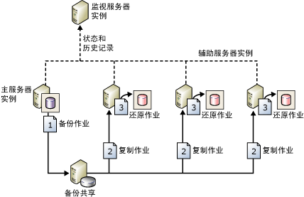

# 关于日志传送 (SQL Server)
[!INCLUDE[appliesto-ss-xxxx-xxxx-xxx-md](../../includes/appliesto-ss-xxxx-xxxx-xxx-md.md)]
  [!INCLUDE[ssNoVersion](../../includes/ssnoversion-md.md)]使用日志传送，可以自动将“主服务器”实例上“主数据库”内的事务日志备份发送到单独“辅助服务器”实例上的一个或多个“辅助数据库”。 事务日志备份分别应用于每个辅助数据库。 可选的第三个服务器实例（称为“监视服务器 ”）记录备份和还原操作的历史记录及状态，还可以在无法按计划执行这些操作时引发警报。  
  
 **本主题内容：**  
  
-   [优势](#Benefits)  
  
-   [术语和定义](#TermsAndDefinitions)  
  
-   [日志传送概述](#ComponentsAndConcepts)  
  
-   [互操作性](#Interoperability)  
  
-   [相关任务](#RelatedTasks)  
  
##   优点  
  
-   为单个主数据库以及一个或多个辅助数据库（每个数据库都位于单独的 [!INCLUDE[ssNoVersion](../../includes/ssnoversion-md.md)]实例上）提供灾难恢复解决方案。  
  
-   支持对辅助数据库的受限的只读访问权限（在还原作业之间的间隔期间）。  
  
-   允许用户将延迟时间定义为：从主服务器备份主数据库日志到辅助服务器必须还原（应用）日志备份之间的时间。 例如，如果主数据库上的数据被意外更改，则较长的延迟会很有用。 如果很快发现意外更改，则通过延迟，您可以在辅助数据库反映此更改之前从其中检索仍未更改的数据。  
  
##   术语和定义  
 主服务器 (primary server)  
 位于生产服务器上的 [!INCLUDE[ssNoVersion](../../includes/ssnoversion-md.md)] 实例。  
  
 主数据库 (primary database)  
 希望备份到其他服务器的主服务器上的数据库。 通过 [!INCLUDE[ssManStudioFull](../../includes/ssmanstudiofull-md.md)] 进行的所有日志传送配置管理都是在主数据库中执行的。  
  
 辅助服务器 (secondary server)  
 想要在其中保留主数据库的热备用副本的 [!INCLUDE[ssNoVersion](../../includes/ssnoversion-md.md)] 实例。  
  
 辅助数据库 (secondary database)  
 主数据库的热备用副本。 辅助数据库可以处于 RECOVERING 状态或 STANDBY 状态，这将使数据库可用于受限的只读访问。  
  
 监视服务器 (monitor server)  
 跟踪日志传送的所有详细信息的 [!INCLUDE[ssNoVersion](../../includes/ssnoversion-md.md)] 的可选实例，包括：  
  
-   主数据库中事务日志最近一次备份的时间。  
  
-   辅助服务器最近一次复制和还原备份文件的时间。  
  
-   有关任何备份失败警报的信息。  
  
> [!IMPORTANT]  
>  配置监视服务器之后，只有先删除日志传送才能对其进行更改。  
  
 备份作业  
 一种 [!INCLUDE[ssNoVersion](../../includes/ssnoversion-md.md)] 代理作业，它执行备份操作，将历史记录信息记录到本地服务器和监视服务器上，并删除旧的备份文件和历史记录信息。 启用日志传送后，将在主服务器实例上创建作业类别“日志传送备份”。  
  
 复制作业  
 一种 [!INCLUDE[ssNoVersion](../../includes/ssnoversion-md.md)] 代理作业，它将备份文件从主服务器复制到辅助服务器中的可配置目标，并在辅助服务器和监视服务器中记录历史记录。 在数据库上启用日志传送后，将在日志传送配置中在各辅助服务器上创建作业类别“日志传送复制”。  
  
 还原作业  
 一种 [!INCLUDE[ssNoVersion](../../includes/ssnoversion-md.md)] 代理作业，它将复制的备份文件还原到辅助数据库。 它将历史记录信息记录在本地服务器和监视服务器上，并删除旧文件和旧历史记录信息。 在数据库上启用日志传送后，在辅助服务器实例上会创建作业类别“日志传送还原”。  
  
 警报作业  
 一种 [!INCLUDE[ssNoVersion](../../includes/ssnoversion-md.md)] 代理作业，它在备份或还原操作在指定阈值内未成功完成时为主数据库和辅助数据库引发警报。 在数据库上启用日志传送后，在监视服务器实例上会创建作业类别“日志传送警报”。  
  
> [!TIP]  
>  对于每个警报，您需要指定警报编号。 此外，请确保配置警报以便在引发警报时通知操作员。  
  
##   日志传送概述  
 日志传送由三项操作组成：  
  
1.  在主服务器实例中备份事务日志。  
  
2.  将事务日志文件复制到辅助服务器实例。  
  
3.  在辅助服务器实例中还原日志备份。  
  
 日志可传送到多个辅助服务器实例。 在这些情况下，将针对每个辅助服务器实例重复执行操作 2 和操作 3。  
  
 日志传送配置不会自动从主服务器故障转移到辅助服务器。 如果主数据库变为不可用，可手动使任意辅助数据库联机。  
  
 您可以为了实现报表目的而使用辅助数据库。  
  
 此外，可以针对日志传送配置来配置警报。  
  
### 典型日志传送配置  
 下图显示了具有主服务器实例、三个辅助服务器实例和一个监视服务器实例的日志传送配置。 此图阐释了备份作业、复制作业以及还原作业所执行步骤，如下所示：  
  
1.  主服务器实例执行备份作业以在主数据库上备份事务日志。 然后，该服务器实例将日志备份放入主日志备份文件（此文件将被发送到备份文件夹中）。  在此图中，备份文件夹位于共享目录（“备份共享 ”）下。  
  
2.  全部三个辅助服务器实例都执行其各自的复制作业，以将主日志备份文件复制到它本地的目标文件夹中。  
  
3.  每个辅助服务器实例都执行其还原作业，以将日志备份从本地目标文件夹还原到本地辅助数据库中。  
  
 主服务器实例和辅助服务器实例将它们自己的历史记录和状态发送到监视服务器实例。  
  
   
  
##   互操作性  
 日志传送功能可以与下列 [!INCLUDE[ssNoVersion](../../includes/ssnoversion-md.md)]功能或组件一起使用：  
  
-   [从日志传送迁移到 AlwaysOn 可用性组的先决条件 (SQL Server)](../../database-engine/availability-groups/windows/prereqs-migrating-log-shipping-to-always-on-availability-groups.md)  
  
-   [数据库镜像和日志传送 (SQL Server)](../../database-engine/database-mirroring/database-mirroring-and-log-shipping-sql-server.md)  
  
-   [日志传送和复制 (SQL Server)](../../database-engine/log-shipping/log-shipping-and-replication-sql-server.md)  
  
> [!NOTE]  
>  [!INCLUDE[ssHADR](../../includes/sshadr-md.md)] 和数据库镜像是互斥的。 不能将数据库配置为同时用于这些互斥的功能。  
  
##   相关任务  
  
-   [将日志传送升级至 SQL Server 2016 (Transact-SQL)](../../database-engine/log-shipping/upgrading-log-shipping-to-sql-server-2016-transact-sql.md)  
  
-   [配置日志传送 (SQL Server)](../../database-engine/log-shipping/configure-log-shipping-sql-server.md)  
  
-   [向日志传送配置添加辅助数据库 (SQL Server)](../../database-engine/log-shipping/add-a-secondary-database-to-a-log-shipping-configuration-sql-server.md)  
  
-   [从日志传送配置中删除辅助数据库 (SQL Server)](../../database-engine/log-shipping/remove-a-secondary-database-from-a-log-shipping-configuration-sql-server.md)  
  
-   [删除日志传送 (SQL Server)](../../database-engine/log-shipping/remove-log-shipping-sql-server.md)  
  
-   [查看日志传送报告 (SQL Server Management Studio)](../../database-engine/log-shipping/view-the-log-shipping-report-sql-server-management-studio.md)  
  
-   [监视日志传送 (Transact-SQL)](../../database-engine/log-shipping/monitor-log-shipping-transact-sql.md)  
  
-   [故障转移到日志传送辅助服务器 (SQL Server)](../../database-engine/log-shipping/fail-over-to-a-log-shipping-secondary-sql-server.md)  
  
-   [故障转移到日志传送辅助服务器 (SQL Server)](../../database-engine/log-shipping/fail-over-to-a-log-shipping-secondary-sql-server.md)  
  
-   [角色切换后登录名和作业的管理 (SQL Server)](../../sql-server/failover-clusters/management-of-logins-and-jobs-after-role-switching-sql-server.md)  
  
## 另请参阅  
 [AlwaysOn 可用性组概述 (SQL Server)](../../database-engine/availability-groups/windows/overview-of-always-on-availability-groups-sql-server.md)  
  
  
