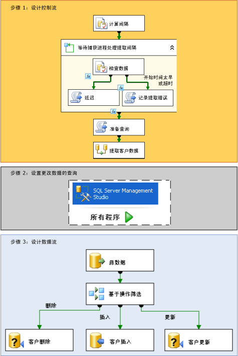

# 变更数据捕获 (SSIS)

[!INCLUDE[sqlserver-ssis](../../includes/applies-to-version/sqlserver-ssis.md)]

  在 [!INCLUDE[ssNoVersion](../../includes/ssnoversion-md.md)] 中，变更数据捕获为有效地执行从源表到数据市场和数据仓库的增量加载提供了一种颇有成效的解决方案。  
  
## 什么是变更数据捕获？  
 源表随时间而变化。 基于这些表的数据市场或数据仓库需要反映这些变更。 但是，定期复制整个源的快照的过程要耗费大量时间和资源。 而包括时间戳列、触发器或复杂查询在内的其他方法通常会损害性能和增加复杂性。 用户所需要的是结构化的可靠更改数据流，以便使用者可以轻松地将其应用到数据的目标表示形式。 [!INCLUDE[ssNoVersion](../../includes/ssnoversion-md.md)] 中的变更数据捕获提供此种解决方案。  
  
 [!INCLUDE[ssDE](../../includes/ssde-md.md)] 的变更数据捕获功能捕获应用到 [!INCLUDE[ssNoVersion](../../includes/ssnoversion-md.md)] 表的插入、更新和删除活动，并以易于使用的关系格式提供这些变更的详细信息。 变更数据捕获所使用的变更表中包含镜像所跟踪源表列结构的列，同时还包含了解逐行发生的变更所需的元数据。  
  
> [!NOTE]
>  并非在 [!INCLUDE[msCoName](../../includes/msconame-md.md)][!INCLUDE[ssNoVersion](../../includes/ssnoversion-md.md)]的每个版本中均提供变更数据捕获功能。 有关 [!INCLUDE[ssNoVersion](../../includes/ssnoversion-md.md)]各版本支持的功能列表，请参阅 [SQL Server 2016 各个版本支持的功能](~/sql-server/editions-and-supported-features-for-sql-server-2016.md)。  
  
## 变更数据捕获在集成服务中的工作原理  
 [!INCLUDE[ssISnoversion](../../includes/ssisnoversion-md.md)] 包很容易捕获 [!INCLUDE[ssNoVersion](../../includes/ssnoversion-md.md)] 数据库中的更改数据，以便向数据仓库执行有效的增量加载。 但是，在可以使用 [!INCLUDE[ssISnoversion](../../includes/ssisnoversion-md.md)] 加载更改数据之前，管理员必须在要从中捕获更改的数据库和表上启用变更数据捕获。 有关如何在数据库上配置变更数据捕获的详细信息，请参阅[启用和禁用变更数据捕获 (SQL Server)](../../relational-databases/track-changes/enable-and-disable-change-data-capture-sql-server.md)。  
  
 管理员在数据库上启用变更数据捕获后，即可以创建执行变更数据增量加载的包。 下面的关系图显示的步骤用于创建一个从单表执行增量加载的包：  
  
   
  
 如上面的关系图所示，创建执行变更数据的增量加载的包涉及下列步骤：  
  
 **步骤 1：设计控制流**  
 在包的控制流中，需要定义下列任务：  
  
-   计算要检索的源数据更改间隔的起始和结束 **datetime** 值。  
  
     若要计算这些值，请使用执行 SQL 任务或包含 [!INCLUDE[ssISnoversion](../../includes/ssisnoversion-md.md)] datetime **函数的** 表达式。 然后将这些端点存储在包变量中以供以后在包中使用。  
  
     **有关详细信息：** [指定变更数据的间隔](../../integration-services/change-data-capture/specify-an-interval-of-change-data.md)  
  
-   确定所选间隔内的变更数据是否已准备就绪。 此步骤是必需的，因为异步捕获进程可能尚未到达所选端点。  
  
     若要确定数据是否已准备就绪，可启动 For 循环容器来延迟执行，直到所选间隔内的更改数据准备就绪（如果需要）。 在循环容器内，使用执行 SQL 任务来查询由变更数据捕获维护的时间映射表。 然后，使用调用 **Thread.Sleep** 方法的脚本任务或通过 **WAITFOR** 语句使用其他执行 SQL 任务来临时延迟对包的执行（如果需要）。 也可以使用其他脚本任务来记录错误情况或超时。  
  
     **有关详细信息：** [确定变更数据是否已准备就绪](../../integration-services/change-data-capture/determine-whether-the-change-data-is-ready.md)  
  
-   准备将用于查询变更数据的查询字符串。  
  
     使用脚本任务或执行 SQL 任务汇集将用于查询变更的 SQL 语句。  
  
     **有关详细信息：** [准备查询变更数据](../../integration-services/change-data-capture/prepare-to-query-for-the-change-data.md)  
  
 **步骤 2：设置对变更数据的查询**  
 创建将查询数据的表值函数。  
  
 使用 [!INCLUDE[ssManStudioFull](../../includes/ssmanstudiofull-md.md)] 开发并保存查询。  
  
 **有关详细信息：** [检索和了解变更数据](../../integration-services/change-data-capture/retrieve-and-understand-the-change-data.md)  
  
 **步骤 3：设计数据流**  
 在包的数据流中，需要定义下列任务：  
  
-   从变更表中检索变更数据。  
  
     若要检索数据，请使用源组件来查询变更表中在所选间隔内发生的变更。 该源组件调用以前创建的 Transact-SQL 表值函数。  
  
     **有关详细信息：** [检索和了解变更数据](../../integration-services/change-data-capture/retrieve-and-understand-the-change-data.md)  
  
-   将更改拆分为插入、更新和删除进行处理。  
  
     若要拆分更改，可使用有条件拆分转换将插入、更新和删除定向到不同的输出，以便于进行适当的处理。  
  
     **有关详细信息：** [处理插入、更新和删除](../../integration-services/change-data-capture/process-inserts-updates-and-deletes.md)  
  
-   将插入、删除和更新应用到目标。  
  
     若要将更改应用到目标，可使用目标组件将插入应用到目标。 还可通过参数化的 UPDATE 和 DELETE 语句使用 OLE DB 命令转换，以将更新和删除应用到目标。 也可使用目标组件应用更新和删除，以便将行保存到临时表中。 然后，使用执行 SQL 任务对临时表中的目标执行大容量更新和大容量删除操作。  
  
     **有关详细信息：** [将变更应用到目标](../../integration-services/change-data-capture/apply-the-changes-to-the-destination.md)  
  
### 来自多个表的变更数据  
 前面的关系图和步骤中介绍的过程涉及从单表进行增量加载。 当必须从多表执行增量加载时，整个过程是相同的。 但是，包的设计需要更改为满足多表处理。 有关如何创建从多个表执行增量加载的包的详细信息，请参阅 [执行多个表的增量加载](../../integration-services/change-data-capture/perform-an-incremental-load-of-multiple-tables.md)。  
  
## 变更数据捕获包的示例  
 [!INCLUDE[ssISnoversion](../../includes/ssisnoversion-md.md)] 提供了两个示例来演示如何使用包中的变更数据捕获。 有关详细信息，请参阅下列主题：  
  
-   [Readme_Change Data Capture for Specified Interval Package Sample（关于指定间隔的变更数据捕获包示例的自述文件）](https://go.microsoft.com/fwlink/?LinkId=133507)  
  
-   [关于自上次请求以来的变更数据捕获包示例的自述文件](https://go.microsoft.com/fwlink/?LinkId=133508)  
  
## Related Tasks  
  
-   [指定变更数据的间隔](../../integration-services/change-data-capture/specify-an-interval-of-change-data.md)  
  
-   [确定变更数据是否已准备就绪](../../integration-services/change-data-capture/determine-whether-the-change-data-is-ready.md)  
  
-   [准备查询变更数据](../../integration-services/change-data-capture/prepare-to-query-for-the-change-data.md)  
  
-   [创建函数以检索变更数据](../../integration-services/change-data-capture/create-the-function-to-retrieve-the-change-data.md)  
  
-   [检索和了解变更数据](../../integration-services/change-data-capture/retrieve-and-understand-the-change-data.md)  
  
-   [处理插入、更新和删除](../../integration-services/change-data-capture/process-inserts-updates-and-deletes.md)  
  
-   [将变更应用到目标](../../integration-services/change-data-capture/apply-the-changes-to-the-destination.md)  
  
-   [执行多个表的增量加载](../../integration-services/change-data-capture/perform-an-incremental-load-of-multiple-tables.md)  
  
## 相关内容  
 sqlblog.com 上的博客文章 [SSIS 设计模式 - 增量加载](https://go.microsoft.com/fwlink/?LinkId=217679)  
  
  
