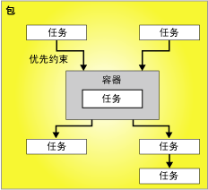

# “控制流”

[!INCLUDE[ssis-appliesto](../../includes/ssis-appliesto-ssvrpluslinux-asdb-asdw-xxx.md)]

  包由一个控制流以及一个或多个数据流（可选）组成。 [!INCLUDE[ssNoVersion](../../includes/ssnoversion-md.md)] [!INCLUDE[ssISnoversion](../../includes/ssisnoversion-md.md)] 提供了三种不同类型的控制流元素：提供包中结构的容器、提供功能的任务以及将可执行文件、容器和任务连接为已排序控制流的优先约束。  
  
 有关详细信息，请参阅 [Precedence Constraints](../../integration-services/control-flow/precedence-constraints.md)、 [Integration Services Containers](../../integration-services/control-flow/integration-services-containers.md)和 [Integration Services Tasks](../../integration-services/control-flow/integration-services-tasks.md)。  
  
 下面的关系图显示具有一个容器和六项任务的控制流。 这些任务中有五项定义于包级别，还有一项定义于容器级别。 任务位于容器内。  
  
   
  
 [!INCLUDE[ssISnoversion](../../includes/ssisnoversion-md.md)] 体系结构支持容器的嵌套，且一个控制流可以包含多级嵌套容器。 例如，一个包可以包含一个容器（如 Foreach 循环容器），此容器转而又能包含另一个 Foreach 循环容器，如此逐层嵌套。  
  
 事件处理程序也具有控制流，而这些控制流是使用同类控制流元素生成的。  
  
## 控制流实现  
 通过使用 **设计器中的** “控制流” [!INCLUDE[ssIS](../../includes/ssis-md.md)] 选项卡，在包中创建控制流。 在 **“控制流”** 选项卡处于活动状态时，工具箱将列出您可以添加到控制流的任务和容器。  
  
 下面的关系图显示了控制流设计器中简单包的控制流。 此关系图中显示的控制流由三个包级任务和一个包含三个任务的包级容器组成。 通过使用优先约束将任务和容器连接起来。  
  
   
  
 创建控制流包含下列任务：  
  
-   添加在包中实现重复的工作流或将控制流划分为子集的容器。  
  
-   添加支持数据流、准备数据、执行工作流和商业智能功能以及实现脚本的任务。  
  
     [!INCLUDE[ssISnoversion](../../includes/ssisnoversion-md.md)] 包含了多种任务，可以用其创建满足包的业务要求的控制流。 如果包必须使用数据，则控制流必须包含至少一个数据流任务。 例如，包可能必须提取数据、聚合数据值，然后将结果写入到数据源。  有关详细信息，请参阅 [Integration Services 任务](../../integration-services/control-flow/integration-services-tasks.md) 和 [在控制流中添加或删除任务或容器](../../integration-services/control-flow/add-or-delete-a-task-or-a-container-in-a-control-flow.md)。  
  
-   使用优先约束把容器和任务连接为有序控制流。  
  
     将任务或容器添加到 **“控制流”** 选项卡的设计图面后， [!INCLUDE[ssIS](../../includes/ssis-md.md)] 设计器自动将连接线添加到项。 如果包中包含两个或更多项、任务或容器，则可以通过将它们的连接线从一项拖动到其他项而将它们联接成控制流。  
  
     两个项之间的连接器表示优先约束。 优先约束定义了两个连接项之间的关系。 它指定了运行时任务和容器的执行顺序以及任务和容器的运行条件。 例如，优先约束可以指定某任务必须成功，才能运行控制流中的下一个任务。 有关详细信息，请参阅 [Precedence Constraints](../../integration-services/control-flow/precedence-constraints.md)。  
  
-   添加连接管理器。  
  
     多个任务需要连接到数据源，因此必须将任务需要的连接管理器添加到包。 根据所使用的枚举器类型，Foreach 循环容器可能也需要连接管理器。 可以在逐项构造控制流时或开始构造控制流前添加连接管理器。 有关详细信息，请参阅 [Integration Services (SSIS) 连接](../../integration-services/connection-manager/integration-services-ssis-connections.md)和[创建连接管理器](https://msdn.microsoft.com/library/6ca317b8-0061-4d9d-b830-ee8c21268345)。  
  
 [!INCLUDE[ssIS](../../includes/ssis-md.md)] 设计器也包含多个设计时功能，这些功能可用于管理设计图面以及使控制流自文档化。  
  
## Related Tasks  
  
-   [在控制流中添加或删除任务或容器](../../integration-services/control-flow/add-or-delete-a-task-or-a-container-in-a-control-flow.md)  
  
-   [设置任务或容器的属性](https://msdn.microsoft.com/library/52d47ca4-fb8c-493d-8b2b-48bb269f859b)  
  
-   [对组件分组或取消分组](../../integration-services/group-or-ungroup-components.md)  
  
  
