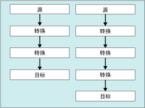

# 数据流任务
  数据流任务封装数据流引擎，该引擎在源和目标之间移动数据，使用户可以在移动数据时转换、清除和修改数据。 将数据流任务添加到包控制流使得包可以提取、转换和加载数据。  
  
 数据流至少由一个数据流组件组成，但通常由一组已连接的数据流组件组成：提取数据的源；修改、路由或汇总数据的转换；加载数据的目标。  
  
 运行时，数据流任务从数据流生成执行计划，而数据流引擎执行该计划。 可以创建无数据流的数据流任务，但任务只有在其包含至少一个数据流时才执行。  
  
 若要从文本文件向 [!INCLUDE[ssNoVersion](../../includes/ssnoversion-md.md)] 数据库大容量插入数据，可以使用大容量插入任务代替数据流任务和数据流。 但是，大容量插入任务无法转换数据。 有关详细信息，请参阅 [Bulk Insert Task](../../integration-services/control-flow/bulk-insert-task.md)。  
  
## 多个流  
 数据流任务可以包含多个数据流。 如果任务复制多组数据，而且复制数据的顺序并不重要，则可以更方便地在数据流任务中包含多个数据流。 例如，可以创建五个数据流，每个数据流都将数据从平面文件复制到数据仓库星形架构中的不同维度表中。  
  
 但是，如果一个数据流任务中存在多个数据流，则由数据流引擎决定执行顺序。 因此，当顺序很重要时包应该使用多个数据流任务，每个任务包含一个数据流。 然后可以应用优先约束来控制任务的执行顺序。  
  
 以下关系图显示具有多个数据流的数据流任务。  
  
   
  
## 日志项  
 [!INCLUDE[ssISnoversion](../../includes/ssisnoversion-md.md)] 提供了可用于所有任务的一组日志事件。 [!INCLUDE[ssISnoversion](../../includes/ssisnoversion-md.md)] 还提供了可用于多个任务的自定义日志条目。 有关详细信息，请参阅 [Integration Services (SSIS) 日志记录](../../integration-services/performance/integration-services-ssis-logging.md)。 数据流任务包括下列自定义日志项：  
  
|日志项|Description|  
|---------------|-----------------|  
|**BufferSizeTuning**|指示数据流任务更改了缓冲区的大小。 日志条目描述了大小更改的原因，并列出了临时的新缓冲区大小。|  
|**OnPipelinePostEndOfRowset**|表示组件已经给出它的行集结束信号，该信号由对 **ProcessInput** 方法的最后一次调用设置。 对于数据流中处理输入的每个组件，都会写入一项。 该项包括组件的名称。|  
|**OnPipelinePostPrimeOutput**|指示组件已经完成它对 **PrimeOutput** 方法的最后一次调用。 取决于数据流，可能写入多个日志条目。 如果组件是源组件，此日志条目表示该组件已经完成对行的处理。|  
|**OnPipelinePreEndOfRowset**|指示组件将要接收它的行集结束信号，该信号由对 **ProcessInput** 方法的最后一次调用设置。 对于数据流中处理输入的每个组件，都会写入一项。 该项包括组件的名称。|  
|**OnPipelinePrePrimeOutput**|指示组件将从 **PrimeOutput** 方法接收它的调用。 取决于数据流，可能写入多个日志条目。|  
|**OnPipelineRowsSent**|报告对 **ProcessInput** 方法的调用为组件输入所提供的行数。 此日志条目包括组件名。|  
|**PipelineBufferLeak**|提供在缓冲区管理器退出之后使缓冲区保持活动状态的任何组件的相关信息。 如果缓冲区仍保持活动状态，则没有释放缓冲区资源并且可能导致内存泄漏。 日志条目提供组件的名称和缓冲区的 ID。|  
|**PipelineComponentTime**|报告组件在其五个主要处理步骤（Validate、PreExecute、PostExecute、ProcessInput 和 ProcessOutput）中的每个步骤所用的时间长短（毫秒）。|  
|**PipelineExecutionPlan**|报告数据流的执行计划。 执行计划提供有关缓冲区将如何发送到组件的信息。 此信息与 PipelineExecutionTrees 日志条目组合，一起描述在数据流任务中所发生的事情。|  
|**PipelineExecutionTrees**|报告数据流中的布局的执行树。 数据流引擎的计划程序使用这些树生成数据流的执行计划。|  
|**PipelineInitialization**|提供有关任务的初始化信息。 此信息包括要用来临时存储 BLOB 数据、默认缓冲区大小和缓冲区行数的目录。 取决于数据流任务的配置，可能写入多个日志条目。|  
  
 每次运行包时，这些日志条目都提供有关数据流任务执行的丰富信息。 重复运行包时，可以捕获信息，这些信息随着时间的变化提供有关任务所执行的处理、可能影响性能的问题以及任务处理的数据量的重要历史信息。  
  
 有关如何使用这些日志条目监视和改进数据流的性能的详细信息，请参阅下列主题之一：  
  
-   [性能计数器](../../integration-services/performance/performance-counters.md)  
  
-   [数据流性能特点](../../integration-services/data-flow/data-flow-performance-features.md)  
  
### 来自数据流任务的示例消息  
 下表列出了非常简单的包的日志条目示例消息。 该包使用 OLE DB 源来从表中提取数据，使用排序转换来排序数据，并使用 OLE DB 目标将数据写入其他表。  
  
|日志项|消息|  
|---------------|--------------|  
|**BufferSizeTuning**|`Rows in buffer type 0 would cause a buffer size greater than the configured maximum. There will be only 9637 rows in buffers of this type.`   `Rows in buffer type 2 would cause a buffer size greater than the configured maximum. There will be only 9497 rows in buffers of this type.`   `Rows in buffer type 3 would cause a buffer size greater than the configured maximum. There will be only 9497 rows in buffers of this type.`|  
|**OnPipelinePostEndOfRowset**|`A component will be given the end of rowset signal. : 1180 : Sort : 1181 : Sort Input`   `A component will be given the end of rowset signal. : 1291 : OLE DB Destination : 1304 : OLE DB Destination Input`|  
|**OnPipelinePostPrimeOutput**|`A component has returned from its PrimeOutput call. : 1180 : Sort`   `A component has returned from its PrimeOutput call. : 1 : OLE DB Source`|  
|**OnPipelinePreEndOfRowset**|`A component has finished processing all of its rows. : 1180 : Sort : 1181 : Sort Input`   `A component has finished processing all of its rows. : 1291 : OLE DB Destination : 1304 : OLE DB Destination Input`|  
|**OnPipelinePrePrimeOutput**|`PrimeOutput will be called on a component. : 1180 : Sort`   `PrimeOutput will be called on a component. : 1 : OLE DB Source`|  
|**OnPipelineRowsSent**|`Rows were provided to a data flow component as input. :  : 1185 : OLE DB Source Output : 1180 : Sort : 1181 : Sort Input : 76`   `Rows were provided to a data flow component as input. :  : 1308 : Sort Output : 1291 : OLE DB Destination : 1304 : OLE DB Destination Input : 76`|  
|**PipelineComponentTime**|`The component "Calculate LineItemTotalCost" (3522) spent 356 milliseconds in ProcessInput.`   `The component "Sum Quantity and LineItemTotalCost" (3619) spent 79 milliseconds in ProcessInput.`   `The component "Calculate Average Cost" (3662) spent 16 milliseconds in ProcessInput.`   `The component "Sort by ProductID" (3717) spent 125 milliseconds in ProcessInput.`   `The component "Load Data" (3773) spent 0 milliseconds in ProcessInput.`   `The component "Extract Data" (3869) spent 688 milliseconds in PrimeOutput filling buffers on output "OLE DB Source Output" (3879).`   `The component "Sum Quantity and LineItemTotalCost" (3619) spent 141 milliseconds in PrimeOutput filling buffers on output "Aggregate Output 1" (3621).`   `The component "Sort by ProductID" (3717) spent 16 milliseconds in PrimeOutput filling buffers on output "Sort Output" (3719).`|  
|**PipelineExecutionPlan**|`SourceThread0`   `Drives: 1`   `Influences: 1180 1291`   `Output Work List`   `CreatePrimeBuffer of type 1 for output ID 11.`   `SetBufferListener: "WorkThread0" for input ID 1181`   `CreatePrimeBuffer of type 3 for output ID 12.`   `CallPrimeOutput on component "OLE DB Source" (1)`   `End Output Work List`   `End SourceThread0`   `WorkThread0`   `Drives: 1180`   `Influences: 1180 1291`   `Input Work list, input ID 1181 (1 EORs Expected)`   `CallProcessInput on input ID 1181 on component "Sort" (1180) for view type 2`   `End Input Work list for input 1181`   `Output Work List`   `CreatePrimeBuffer of type 4 for output ID 1182.`   `SetBufferListener: "WorkThread1" for input ID 1304`   `CallPrimeOutput on component "Sort" (1180)`   `End Output Work List`   `End WorkThread0`   `WorkThread1`   `Drives: 1291`   `Influences: 1291`   `Input Work list, input ID 1304 (1 EORs Expected)`   `CallProcessInput on input ID 1304 on component "OLE DB Destination" (1291) for view type 5`   `End Input Work list for input 1304`   `Output Work List`   `End Output Work List`   `End WorkThread1`|  
|**PipelineExecutionTrees**|`begin execution tree 0`   `output "OLE DB Source Output" (11)`   `input "Sort Input" (1181)`   `end execution tree 0`   `begin execution tree 1`   `output "OLE DB Source Error Output" (12)`   `end execution tree 1`   `begin execution tree 2`   `output "Sort Output" (1182)`   `input "OLE DB Destination Input" (1304)`   `output "OLE DB Destination Error Output" (1305)`   `end execution tree 2`|  
|**PipelineInitialization**|`No temporary BLOB data storage locations were provided. The buffer manager will consider the directories in the TEMP and TMP environment variables.`   `The default buffer size is 10485760 bytes.`   `Buffers will have 10000 rows by default`   `The data flow will not remove unused components because its RunInOptimizedMode property is set to false.`|  
  
 许多日志事件都写入多个项，并且多个日志条目的消息都包含复杂的数据。 为了便于理解和交流复杂消息的内容，可以对消息文本进行分析。 根据日志的位置，可以使用 Transact-SQL 语句或脚本组件用列或其他更有用的格式来分离复杂文本。  
  
 例如，下表包含消息“已经为数据流组件提供了若干行作为输入。 :  : 1185 : OLE DB 源输出 : 1180 : 排序 : 1181 : 对输入进行排序 : 76”，并解析为列。 该消息由 **OnPipelineRowsSent** 事件在将行从 OLE DB 源发送到排序转换时写入。  
  
|“列”|Description|ReplTest1|  
|------------|-----------------|-----------|  
|**PathID**|OLE DB 源和排序转换之间的路径中的 **ID** 属性值。|1185|  
|**PathName**|路径的 **Name** 属性值。|OLE DB 源输出|  
|**ComponentID**|排序转换的 **ID** 属性值。|1180|  
|**ComponentName**|排序转换的 **Name** 属性值。|排序|  
|**InputID**|排序转换的输入的 **ID** 属性值。|1181|  
|**InputName**|排序转换的输入的 **Name** 属性值。|对输入进行排序|  
|**RowsSent**|向排序转换的输入发送的行数。|76|  
  
## 配置数据流任务  
 可以在 **“属性”** 窗口中或以编程方式设置属性。  
  
 有关如何在 **“属性”** 窗口中设置这些属性的详细信息，请单击下列主题：  
  
-   [设置任务或容器的属性](http://msdn.microsoft.com/library/52d47ca4-fb8c-493d-8b2b-48bb269f859b)  
  
## 数据流任务的编程配置  
 有关以编程方式向包中添加数据流任务并设置数据流属性的详细信息，请单击下列主题：  
  
-   [以编程方式添加数据流任务](../../integration-services/building-packages-programmatically/adding-the-data-flow-task-programmatically.md)  
  
## Related Tasks  
 [设置任务或容器的属性](http://msdn.microsoft.com/library/52d47ca4-fb8c-493d-8b2b-48bb269f859b)  
  
## 相关内容  
 technet.microsoft.com 上的视频 [平衡的数据分发服务器](http://go.microsoft.com/fwlink/?LinkID=226278&clcid=0x409)。  
  
  
