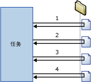

# Foreach 循环容器

[!INCLUDE[sqlserver-ssis](../../includes/applies-to-version/sqlserver-ssis.md)]

  Foreach 循环容器定义包中的重复控制流。 循环的实现与编程语言中的 **Foreach** 循环结构类似。 在包中，通过使用 Foreach 枚举器启用循环。  Foreach 循环容器将重复指定枚举器的每个成员的控制流。  
  
 [!INCLUDE[ssNoVersion](../../includes/ssnoversion-md.md)] [!INCLUDE[ssISnoversion](../../includes/ssisnoversion-md.md)] 提供了下列枚举器类型：  
  
-   Foreach ADO 枚举器，用于枚举表中的行。 例如，可以获取 ADO 记录集中的行。  
  
     数据集目标将数据保存在內存中的一个记录集中，该记录集存储在数据类型为 **Object** 的包变量中。 您通常使用具有 Foreach ADO 枚举器的 Foreach 循环容器来每次处理记录集的一行。 为 Foreach ADO 枚举器指定的变量必须为 Object 数据类型。 有关记录集目标的详细信息，请参阅[使用记录集目标](../../integration-services/data-flow/use-a-recordset-destination.md)。  
  
-   Foreach ADO.NET 架构行集枚举器，用于枚举有关数据源的架构信息。 例如，可枚举并获取一组 [!INCLUDE[ssSampleDBnormal](../../includes/sssampledbnormal-md.md)] [!INCLUDE[ssNoVersion](../../includes/ssnoversion-md.md)] 数据库中的表。  
  
-   Foreach 文件枚举器，用于枚举文件夹中的文件。 该枚举器可遍历子文件夹。 例如，可读取 Windows 文件夹及其子文件夹中所有具有 *.log 文件扩展名的文件。 请注意，无法指定文件检索顺序。  
  
-   Foreach 源变量枚举器，用于枚举指定变量包含的可枚举对象。 可枚举对象可以是数组、ADO.NET **DataTable**和 [!INCLUDE[ssISnoversion](../../includes/ssisnoversion-md.md)] 枚举器等。 例如，可以枚举包含服务器名称的数组中的值。  
  
-   Foreach 项枚举器，用于枚举集合项。 例如，可以枚举执行进程任务所使用的可执行文件和工作目录的名称。  
  
-   Foreach Nodelist 枚举器，用于枚举 XML Path 语言 (XPath) 表达式的结果集。 例如，此表达式可枚举并获取古代的所有作者： `/authors/author[@period='classical']`。  
  
-   Foreach SMO 枚举器，用于枚举 [!INCLUDE[ssNoVersion](../../includes/ssnoversion-md.md)] 管理对象 (SMO) 对象。 例如，可枚举并获取 [!INCLUDE[ssNoVersion](../../includes/ssnoversion-md.md)] 数据库中的视图列表。  
  
-   用于枚举位于指定 HDFS 位置的 HDFS 文件的 Foreach HDFS 文件枚举器。  
  
-   用于在 Azure 存储中的 blob 容器中枚举 Blob 的 Foreach Azure Blob 枚举器。  

-   Foreach ADLS 文件枚举器，用于枚举 Azure Data Lake Store 的目录中的文件。

-   Foreach Data Lake Storage Gen2 文件枚举器，用于枚举 Azure Data Lake Store Gen2 的目录中的文件。
  
 以下关系图显示了一个具有文件系统任务的 Foreach 循环容器。 该 Foreach 循环使用了 Foreach 文件枚举器，并将文件系统任务配置为复制文件。 如果枚举器指定的文件夹包含四个文件，则循环将重复四次，复制四个文件。  
  
   
  
 可以使用变量和属性表达式的组合，用枚举器集合值更新包对象的属性。 首先，将集合值映射到用户定义变量；然后，对使用该变量的属性执行一个属性表达式。 例如，将 Foreach 文件枚举器的集合值映射到名为 **MyFile** 的变量，然后在发送邮件任务的 Subject 属性的属性表达式中使用该变量。 如果运行该包，则每次重复循环时，都会用一个文件名更新 Subject 属性。 有关详细信息，请参阅 [在包中使用属性表达式](../../integration-services/expressions/use-property-expressions-in-packages.md)。  
  
 映射到枚举器集合值的变量也可用于表达式和脚本。  
  
 Foreach 循环容器可以包含多个任务和容器，但只能使用一种类型的枚举器。 如果 Foreach 循环容器包含多个任务，则可将枚举器集合值映射到每个任务的多个属性。  
  
 可以设置 Foreach 循环容器的事务属性，从而为包控制流的子集定义事务。 通过这种方式，可以在 Foreach 循环级别而不是包级别管理事务。 例如，如果 Foreach 循环容器重复了星形架构中的维度表和事实数据表的更新控制流，则可以配置事务以确保成功更新所有事实数据表，或者不更新任何事实数据表。 有关详细信息，请参阅 [Integration Services 事务](../../integration-services/integration-services-transactions.md)。  
  
## 枚举器类型  
 枚举器可以配置，您必须为不同的枚举器提供不同的信息。  
  
 下表汇总了每种枚举器类型需要的信息。  
  
|枚举器|配置要求|  
|----------------|--------------------------------|  
|Foreach ADO|指定 ADO 对象源变量和枚举器模式。 该变量必须是 Object 数据类型。|  
|Foreach ADO.NET 架构行集|指定与数据库的连接和要枚举的架构。|  
|Foreach 文件|指定要枚举的文件夹和文件、检索到的文件的文件名格式，以及是否要遍历子文件夹。|  
|Foreach 源变量|指定包含要枚举的对象的变量。|  
|Foreach 项|定义 Foreach 项集合中的项，包括列和列数据类型。|  
|Foreach Nodelist|指定 XML 文档的源并配置 XPath 操作。|  
|Foreach SMO|指定与数据库的连接以及要枚举的 SMO 对象。|  
|Foreach HDFS 文件枚举器|指定要枚举的文件夹和文件、检索到的文件的文件名格式，以及是否要遍历子文件夹。|  
|Foreach Azure Blob|指定要枚举容器 blob 的 Azure blob 容器。|  
|Foreach ADLS 文件|指定包含要枚举的文件的 Azure Data Lake Store 目录。|
|Foreach Data Lake Storage Gen2 文件|指定包含要枚举的文件以及其他选项的 Azure Data Lake Storage Gen2 目录。|

## 使用 Foreach 循环容器将枚举添加到控制流
 [!INCLUDE[ssISnoversion](../../includes/ssisnoversion-md.md)] 包含 Foreach 循环容器，此容器是一个控制流元素，利用它可以轻松地将枚举文件和对象的循环构造包括到包的控制流中。 有关详细信息，请参阅 [Foreach 循环容器](../../integration-services/control-flow/foreach-loop-container.md)。  
  
 Foreach 循环容器不提供任何功能，只提供用以生成可重复的控制流、指定枚举器类型以及配置枚举器的结构。 若要提供容器功能，Foreach Loop 循环容器中必须包含至少一个任务。 有关详细信息，请参阅 [Integration Services Tasks](../../integration-services/control-flow/integration-services-tasks.md)。  
  
 Foreach 循环容器可包含具有多个任务和其他容器的控制流。 除了要将任务和容器拖动到 Foreach 循环容器而不是拖放到包以外，将任务和容器添加到 Foreach 循环容器的过程与将其添加到包的过程相似。 如果 Foreach 循环容器包含多个任务或容器，可以使用优先约束连接它们，这与在包中的操作一样。 有关详细信息，请参阅 [优先约束](../../integration-services/control-flow/precedence-constraints.md)。  
  
### 添加和配置 Foreach 循环容器
  
1.  将 Foreach 循环容器添加到包。 有关详细信息，请参阅 [在控制流中添加或删除任务或容器](../../integration-services/control-flow/add-or-delete-a-task-or-a-container-in-a-control-flow.md)。  
  
2.  将任务和容器添加到 Foreach 循环容器。 有关详细信息，请参阅 [在控制流中添加或删除任务或容器](../../integration-services/control-flow/add-or-delete-a-task-or-a-container-in-a-control-flow.md)。  
  
3.  使用优先约束连接 Foreach 循环容器中的任务和容器。 有关详细信息，请参阅 [使用默认优先约束来连接任务和容器](https://msdn.microsoft.com/library/8f31f15f-98ff-4c35-b41f-8b8cfd148d75)。  
  
4.  配置 Foreach 循环容器。 有关详细信息，请参阅 [配置 Foreach 循环容器](https://msdn.microsoft.com/library/519c6f96-5e1f-47d2-b96a-d49946948c25)。  

## 配置 Foreach 循环容器
此过程介绍如何配置 Foreach 循环容器，包括如何在枚举器级和容器级上配置属性表达式。  
  
1.  在 [!INCLUDE[ssBIDevStudioFull](../../includes/ssbidevstudiofull-md.md)]中，打开包含所需包的 [!INCLUDE[ssISnoversion](../../includes/ssisnoversion-md.md)] 项目。  
  
2.  单击“控制流”  选项卡，然后双击 Foreach 循环。  
  
3.  在 **“Foreach 循环编辑器”** 对话框中，单击 **“常规”** ，并且，根据需要还可以修改 Foreach 循环的名称和说明。  
  
4.  单击 **“集合”** ，然后从 **“枚举器”** 列表中选择一个枚举器类型。  
  
5.  指定一个枚举器并对枚举器选项进行如下设置：  
  
    -   若要使用 Foreach 文件枚举器，请提供包含要枚举的文件的文件夹，指定文件名和文件类型筛选器，并指定是否返回完全限定的文件名。 另外，还请指定是否包含子文件夹，以枚举更多文件。  
  
    -   若要使用 Foreach 项枚举器，请单击 **“列”** ，然后在 **“For Each Item 列”** 对话框中，单击 **“添加”** 来添加列。 在 **“数据类型”** 列表中为每个列选择一个数据类型，然后单击 **“确定”** 。  
  
         在列中键入值或从列表中选择值。  
  
        > [!NOTE]  
        >  若要添加新行，请在刚才输入的单元格之外，单击任一位置。  
  
        > [!NOTE]  
        >  如果值与列数据类型不兼容，文本将突出显示。  
  
    -   若要使用 Foreach ADO 枚举器，请选择一个现有的变量，或在 **“ADO 对象源变量”** 列表，单击 **“新建变量”** 来指定一个变量（包含要枚举的 ADO 对象的名称），然后选择一个枚举模式选项。  
  
         如果要创建新变量，请在 **“添加变量”** 对话框中设置该变量的属性。  
  
    -   若要使用 Foreach ADO.NET 架构行集枚举器，请选择一个现有的 ADO.NET 连接，或在 **“连接”** 列表中，单击 **“新建连接”** ，然后选择一个架构。  
  
         也可以单击 **“设置限制”** ，选择架构限制，选择包含限制值的变量，或键入限制值，然后单击 **“确定”** 。  
  
    -   若要使用 Foreach 源变量枚举器，请在 **“变量”** 列表中选择变量。  
  
    -   若要使用 Foreach NodeList 枚举器，请单击 DocumentSourceType 并从列表中选择源类型，然后单击 DocumentSource。 根据为 DocumentSourceType 选择的值，请从列表中选择变量或文件连接，或创建新变量或文件连接，或在“文档源编辑器”  中键入 XML 源代码。  
  
         接下来，单击 EnumerationType 并从列表中选择枚举类型。 如果 EnumerationType 是 **Navigator、Node 或 NodeText**，则单击 OuterXPathStringSourceType 并选择源类型，然后单击 OuterXPathString。 根据为 OuterXPathStringSourceType 设置的值，请从列表中选择变量或文件连接，或创建新的变量或文件连接，或键入外部 XML 路径语言 (XPath) 表达式的字符串。  
  
         如果 EnumerationType 是 **ElementCollection**，则按上文所述设置 OuterXPathStringSourceType 和 OuterXPathString。 然后，单击 InnerElementType 并选择内部元素的枚举类型，然后单击 InnerXPathStringSourceType。 根据为 InnerXPathStringSourceType 设置的值，请选择变量或文件连接，创建新的变量或文件连接，或键入内部 XPath 表达式的字符串。  
  
    -   若要使用 Foreach SMO 枚举器，请选择一个现有的 ADO.NET 连接，或在 **“连接”** 列表中，单击 **“新建连接”** ，然后键入需要的字符串或单击 **“浏览”** 。 如果选择单击 **“浏览”** ，则请在 **“选择 SMO 枚举”** 对话框中，选择要枚举的对象类型和枚举类型，然后单击 **“确定”** 。  
  
6.  也可单击“集合”页上的“表达式”文本框中的浏览按钮 (…) 来创建可用于更新属性值的表达式    。 有关详细信息，请参阅 [添加或更改属性表达式](../../integration-services/expressions/add-or-change-a-property-expression.md)。  
  
    > [!NOTE]  
    >  在“属性”  列表中列出的属性因枚举器而异。  
  
7.  （可选）单击“变量映射”  ，将对象属性映射到集合值，然后执行以下操作：  
  
    1.  在“变量”列表中选择变量，或单击“\<New Variable>”创建新变量 。  
  
    2.  如果要添加新变量，那么请在 **“添加变量”** 对话框中设置该变量的属性，然后单击 **“确定”** 。  
  
    3.  如果使用 For Each Item 枚举器，可以在 **“索引”** 列表中来更新索引值。  
  
        > [!NOTE]  
        >  该索引值指示项中哪个列将映射到变量。 只有 For Each Item 枚举器可以使用 0 以外的索引值。  
  
8.  也可以单击 **“表达式”** ，然后在 **“表达式”** 页上，为 Foreach 循环容器的属性创建属性表达式。 有关详细信息，请参阅 [添加或更改属性表达式](../../integration-services/expressions/add-or-change-a-property-expression.md)。  
  
9. 单击“确定”。  

## “常规”页 - Foreach 循环编辑器
可以使用 **“Foreach 循环编辑器”** 对话框的 **“常规”** 页，对 Foreach 循环容器进行命名和说明，该容器使用指定的枚举器重复集合中每个成员的工作流。  
  
 若要了解有关 Foreach 循环容器以及如何对其进行配置的信息，请参阅 [Foreach 循环容器](../../integration-services/control-flow/foreach-loop-container.md) 和 [配置 Foreach 循环容器](https://msdn.microsoft.com/library/519c6f96-5e1f-47d2-b96a-d49946948c25)。  
  
### 选项  
 **名称**  
 为 Foreach 循环容器提供唯一的名称。 此名称在任务图标和日志中用作标签。  
  
> [!NOTE]  
>  对象名称在一个包内必须是唯一的。  
  
 **说明**  
 键入对 Foreach 循环容器的说明。  

## “集合”页 - Foreach 循环编辑器
 可以使用“Foreach 循环编辑器”  对话框的“集合”  页，指定枚举器类型以及配置枚举器。  
  
 若要了解有关 Foreach 循环容器以及如何对其进行配置的信息，请参阅 [Foreach 循环容器](../../integration-services/control-flow/foreach-loop-container.md) 和 [配置 Foreach 循环容器](https://msdn.microsoft.com/library/519c6f96-5e1f-47d2-b96a-d49946948c25)。  
  
### 静态选项  
 **枚举器**  
 从列表中选择枚举器类型。 此属性具有下表所列的选项：  
  
|值|说明|  
|-----------|-----------------|  
|**Foreach 文件枚举器**|枚举文件。 选择此值将显示 **“Foreach 文件枚举器”** 部分中的动态选项。|  
|**Foreach 项枚举器**|枚举项中的值。 选择此值将显示 **“Foreach Item 枚举器”** 部分中的动态选项。|  
|**Foreach ADO 枚举器**|枚举表或表中的行。 选择此值将显示 **“Foreach ADO 枚举器”** 部分中的动态选项。|  
|**Foreach ADO.NET 架构行集枚举器**|枚举架构。 选择此值将显示 **“Foreach ADO.NET 枚举器”** 部分中的动态选项。|  
|**Foreach 源变量枚举器**|枚举变量中的值。 选择此值将显示 **“Foreach 源变量枚举器”** 部分中的动态选项。|  
|**Foreach Nodelist 枚举器**|枚举 XML 文档中的节点。 选择此值将显示 **“Foreach Nodelist 枚举器”** 部分中的动态选项。|  
|**Foreach SMO 枚举器**|枚举 SMO 对象。 选择此值将显示 **“Foreach SMO 枚举器”** 部分中的动态选项。|  
|**Foreach HDFS 文件枚举器**|在指定的 HDFS 位置枚举 HDFS 文件。 选择此值将显示“Foreach HDFS 文件枚举器”  部分中的动态选项。|  
|**Foreach Azure Blob 枚举器**|枚举指定 blob 位置中的 blob 文件。 选择此值将显示 **“Foreach Azure Blob 枚举器”** 部分中的动态选项。|  
|**Foreach ADLS 文件枚举器**|枚举指定 Data Lake Store 目录中的文件。 选择此值会显示“Foreach ADLS 文件枚举器”  部分中的动态选项。|
|Foreach Data Lake Storage Gen2 文件枚举器|枚举指定的 Data Lake Storage Gen2 目录中的文件。 选择此值会显示“Foreach Data Lake Storage Gen2 文件枚举器”部分中的动态选项  。|
  
 **表达式**  
 单击或展开 **表达式** 可以查看现有属性表达式的列表。 单击省略号按钮 (…) 可以添加枚举器属性的属性表达式，或编辑并计算现有属性表达式  。  
  
 **相关主题：** [Integration Services &#40;SSIS&#41; 表达式](../../integration-services/expressions/integration-services-ssis-expressions.md)、[属性表达式编辑器](../../integration-services/expressions/property-expressions-editor.md)、[表达式生成器](../../integration-services/expressions/expression-builder.md)  
  
### 枚举器动态选项  
  
#### Enumerator = Foreach 文件枚举器  
 您可以使用 Foreach 文件枚举器枚举文件夹中的文件。 例如，如果 Foreach 循环包括执行 SQL 任务，则可以使用 Foreach 文件枚举器枚举包含执行 SQL 任务运行的 SQL 语句的文件。 可以将枚举器配置为包括子文件夹。  
  
 Foreach 文件枚举器枚举的文件夹和子文件夹的内容可能在执行循环时发生更改，因为循环中的外部进程或任务会在执行循环时添加、重命名或删除文件。 这些更改可能导致大量意外情况：  
  
-   如果删除文件，则 Foreach 循环中某个任务的操作可能会影响一组与后续任务所用文件不同的文件。  
  
-   如果重命名文件并且外部进程自动添加文件以替换重命名的文件，则 Foreach 循环中任务的操作可能会影响相同的文件两次。  
  
-   如果添加文件，则可能很难确定 Foreach 循环影响的文件。  
  
 **文件夹**  
 提供要枚举的根文件夹的路径。  
  
 **“浏览”**  
 浏览以定位到根文件夹。  
  
 **文件**  
 指定要枚举的文件。  
  
> [!NOTE]  
>  使用通配符 (*) 可以指定要包括在集合中的文件。 例如，要包括名称包含“abc”的文件，请使用下面的筛选器：abc\*\*。  
>   
>  当指定文件扩展名时，枚举器还会返回与所追加的附加字符具有相同扩展名的文件。 （这与操作系统中的 **dir** 命令的行为相同，该命令也会比较 8.3 文件名以检查是否具有向后兼容性。）枚举器的这种行为可能会导致意外的结果。 例如，您只想枚举 Excel 2003 文件且指定了“*.xls”。 但是，枚举器还会返回 Excel 2007 文件，因为这些文件具有扩展名“.xlsx”。  
>   
>  可以通过在“集合”页上展开“表达式”，选择 FileSpec 属性，然后单击省略号按钮 (…) 来添加属性表达式，从而使用表达式指定要在集合中包含的文件    。  
  
 **完全限定的**  
 选择此项可以检索文件名的完全限定路径。 如果在“文件”选项中指定通配符，则返回的完全限定路径与该筛选条件匹配。  
  
 **仅名称**  
 选择此项可以只检索文件名。 如果在“文件”选项中指定了通配符，则返回的文件名与该筛选条件匹配。  
  
 **名称和扩展名**  
 选择此项可以检索文件名及其文件扩展名。 如果在“文件”选项中指定通配符，则返回的文件名和文件扩展名与该筛选条件匹配。  
  
 **遍历子文件夹**  
 选择此项可以在枚举中包括子文件夹。  
  
#### Enumerator = Foreach Item 枚举器  
 您可以使用 Foreach Item 枚举器枚举集合中的项。 您将通过指定一个和多个列的值来定义集合中的项。 一行中的列将定义一个项。 例如，指定执行进程任务运行的可执行文件以及此任务所用的工作目录的项包含两列，一列列出可执行文件的名称，另一列列出工作目录。 行数决定循环重复的次数。 如果表有 10 行，则循环重复 10 次。  
  
 若要更新执行进程任务的属性，可以使用列索引将变量映射到项列。 枚举器项中定义的第一列的索引值为 0，第二列的索引值为 1，依次类推。 变量值将随着循环的每次重复而更新。 然后，可以通过使用这些变量的属性表达式更新执行进程任务的 **Executable** 和 **WorkingDirectory** 属性。  
  
 **定义 For Each 项集合中的项**  
 为表中的每个列提供值。  
  
> [!NOTE]  
>  在行列中输入值后，新行将自动添加到表中。  
  
> [!NOTE]  
>  如果所提供的值与列数据类型不兼容，则文本以红色显示。  
  
 **列数据类型**  
 列出活动列的数据类型。  
  
 **删除**  
 选择项，再单击 **“删除”** ，即可从列表中删除它。  
  
 **“列”**  
 单击此项可以配置项中的列的数据类型。  
  
 **相关主题：** [“For Each Item 列”对话框 UI 参考](https://msdn.microsoft.com/library/ea76aae0-8798-4677-8ab8-4a579de4957c)  
  
#### Enumerator = Foreach ADO 枚举器  
 您可以使用 Foreach ADO 枚举器枚举变量中存储的 ADO 或 ADO.NET 对象中的行或表。 例如，如果 Foreach 循环包括可将数据集写入变量的脚本任务，则可以使用 Foreach ADO 枚举器枚举数据集中的行。 如果变量包含 ADO.NET 数据集，则可以将枚举器配置为枚举多个表中的行或枚举表。  
  
 **ADO 对象源变量**  
 从列表中选择用户定义的变量，或单击“\<**New variable...**>”创建新变量。  
  
> [!NOTE]  
>  变量必须有 Object 数据类型，否则会发生错误。  
  
 **相关主题：** [Integration Services &#40;SSIS&#41; 变量](../../integration-services/integration-services-ssis-variables.md)、[添加变量](https://msdn.microsoft.com/library/d09b5d31-433f-4f7c-8c68-9df3a97785d5)  
  
 **第一个表中的行**  
 选择此项将只枚举第一个表中的行。  
  
 **所有表中的行(仅限于 ADO.NET 数据集)**  
 选择此项将枚举所有表中的行。 只有当要枚举的对象是同一 ADO.NET 数据集的所有成员时，此选项才可用。  
  
 **所有表(仅限于 ADO.NET 数据集)**  
 选择此项将只枚举表。  
  
#### Enumerator = Foreach ADO.NET 架构行集枚举器  
 您可以使用 Foreach ADO.NET 架构行集枚举器枚举指定数据源的架构。 例如，如果 Foreach 循环包括执行 SQL 任务，则可以使用 Foreach ADO.NET 架构行集枚举器枚举架构（例如， **AdventureWorks** 数据库中的列），使用执行 SQL 任务获取架构权限。  
  
 **Connection**  
 从列表中选择 ADO.NET 连接管理器，或单击“\<**New connection...**>”创建新的 ADO.NET 连接管理器。  
  
> [!IMPORTANT]  
>  ADO.NET 连接管理器必须使用 .NET provider for OLE DB。 如果连接到 SQL Server，则建议使用的访问接口为 [!INCLUDE[ssNoVersion](../../includes/ssnoversion-md.md)] **“连接管理器”** 对话框的 **.Net Providers for OleDb** 部分中列出的  Native Client。  
  
 **相关主题：** [ADO 连接管理器](../../integration-services/connection-manager/ado-connection-manager.md)、[配置 ADO.NET 连接管理器](../../integration-services/connection-manager/configure-ado-net-connection-manager.md)  
  
 **架构**  
 选择要枚举的架构。  
  
 **设置限制**  
 设置要应用于指定架构的限制。  
  
 **相关主题：** [“架构限制”对话框](https://msdn.microsoft.com/library/92e5fd32-4944-4f7c-a448-b458df93d0d5)  
  
#### Enumerator = Foreach 源变量枚举器  
 您可以使用 Foreach 源变量枚举器枚举指定变量中的可枚举对象。 例如，如果 Foreach 循环包括运行查询并在变量中存储结果的执行 SQL 任务，则可以使用 Foreach 源变量枚举器枚举查询结果。  
  
 **变量**  
 在列表中选择变量，或单击“\<**New variable...**>创建一个新变量。  
  
 **相关主题：** [Integration Services &#40;SSIS&#41; 变量](../../integration-services/integration-services-ssis-variables.md)、[添加变量](https://msdn.microsoft.com/library/d09b5d31-433f-4f7c-8c68-9df3a97785d5)  
  
#### Enumerator = Foreach NodeList 枚举器  
 您可以使用 Foreach Nodelist 枚举器枚举一组通过将 XPath 表达式应用到 XML 文件而生成的 XML 节点。 例如，如果 Foreach 循环包括脚本任务，则可以使用 Foreach NodeList 枚举器将满足 XPath 表达式条件的值从 XML 文件传递到脚本任务。  
  
 应用到 XML 文件的 XPath 表达式为外部 XPath 运算，存储于 OuterXPathString 属性中。 如果 XPath 枚举类型设置为 **ElementCollection**，则 Foreach NodeList 枚举器可以将内部 XPath 表达式（存储于 InnerXPathString 属性中）应用到元素的集合。  
  
 若要了解有关使用 XML 文档和数据的详细信息，请参阅 MSDN Library 中的“[Employing XML in the .NET Framework](https://go.microsoft.com/fwlink/?LinkId=56214)”。  
  
 **DocumentSourceType**  
 选择 XML 文档的源类型。 此属性具有下表所列的选项：  
  
|值|说明|  
|-----------|-----------------|  
|**直接输入**|将源设置为 XML 文档。|  
|**文件连接**|选择包含 XML 文档的文件。|  
|**变量**|将源设置为包含 XML 文档的变量。|  
  
 **DocumentSource**  
 如果将 DocumentSourceType 设置为“直接输入”，请提供 XML 代码，或单击省略号按钮 (…) 以通过使用“文档源编辑器”对话框来提供 XML    。  
  
 如果 DocumentSourceType 设置为“文件连接”，请选择“文件连接管理器”，或单击“\<**New connection...**>”创建新的连接管理器 。  
  
 **相关主题：** [文件连接管理器](../../integration-services/connection-manager/file-connection-manager.md)、[文件连接管理器编辑器](../../integration-services/connection-manager/file-connection-manager-editor.md)  
  
 如果 DocumentSourceType 设置为“变量”，请选择现有变量，或单击“\<**New variable...**>”创建新变量 。  
  
 **相关主题：** [Integration Services &#40;SSIS&#41; 变量](../../integration-services/integration-services-ssis-variables.md)、[添加变量](https://msdn.microsoft.com/library/d09b5d31-433f-4f7c-8c68-9df3a97785d5)。  
  
 **EnumerationType**  
 从列表中选择枚举类型。 此属性具有下表所列的选项：  
  
|值|说明|  
|-----------|-----------------|  
|**Navigator**|使用 XPathNavigator 进行枚举。|  
|**Node**|枚举 XPath 运算返回的节点。|  
|**NodeText**|枚举 XPath 运算返回的文本节点。|  
|**ElementCollection**|枚举 XPath 运算返回的元素节点。|  
  
 **OuterXPathStringSourceType**  
 选择 XPath 字符串的源类型。 此属性具有下表所列的选项： 
  
|值|说明|  
|-----------|-----------------|  
|**直接输入**|将源设置为 XML 文档。|  
|**文件连接**|选择包含 XML 文档的文件。|  
|**变量**|将源设置为包含 XML 文档的变量。|  
  
 **OuterXPathString**  
 如果将 **OuterXPathStringSourceType** 设置为“直接输出”  ，请提供 XPath 字符串。  
  
 如果 OuterXPathStringSourceType 设置为“文件连接”，请选择“文件连接管理器”，或单击“\<**New connection...**>创建新的连接管理器 。  
  
 **相关主题：** [文件连接管理器](../../integration-services/connection-manager/file-connection-manager.md)、[文件连接管理器编辑器](../../integration-services/connection-manager/file-connection-manager-editor.md)  
  
 如果 OuterXPathStringSourceType 设置为“变量”，请选择现有变量，或单击“\<**New variable...**>创建新的变量 。  
  
 **相关主题：** [Integration Services &#40;SSIS&#41; 变量](../../integration-services/integration-services-ssis-variables.md)、[添加变量](https://msdn.microsoft.com/library/d09b5d31-433f-4f7c-8c68-9df3a97785d5)。  
  
 **InnerElementType**  
 如果将 **EnumerationType** 设置为 **ElementCollection**，请从列表中选择内部元素的类型。  
  
 **InnerXPathStringSourceType**  
 选择内部 XPath 字符串的源类型。 此属性具有下表所列的选项：  
  
|值|说明|  
|-----------|-----------------|  
|**直接输入**|将源设置为 XML 文档。|  
|**文件连接**|选择包含 XML 文档的文件。|  
|**变量**|将源设置为包含 XML 文档的变量。|  
  
 **InnerXPathString**  
 如果将 **InnerXPathStringSourceType** 设置为“直接输入”  ，请提供 XPath 字符串。  
  
 如果 InnerXPathStringSourceType 设置为“文件连接”，请选择“文件连接管理器”，或单击“\<**New connection...**>创建新的连接管理器 。  
  
 **相关主题：** [文件连接管理器](../../integration-services/connection-manager/file-connection-manager.md)、[文件连接管理器编辑器](../../integration-services/connection-manager/file-connection-manager-editor.md)  
  
 如果 InnerXPathStringSourceType 设置为“变量”，请选择现有变量，或单击“\<**New variable...**>创建新的变量 。  
  
 **相关主题：** [Integration Services &#40;SSIS&#41; 变量](../../integration-services/integration-services-ssis-variables.md)、[添加变量](https://msdn.microsoft.com/library/d09b5d31-433f-4f7c-8c68-9df3a97785d5)。  
  
#### Enumerator = Foreach SMO 枚举器  
 您可以使用 Foreach SMO 枚举器枚举 SQL Server 管理对象 (SMO) 对象。 例如，如果 Foreach 循环包括执行 SQL 任务，则可以使用 Foreach SMO 枚举器枚举 **AdventureWorks** 数据库中的表并运行计算每个表中行数的查询。  
  
 **Connection**  
 选择现有 ADO.NET 连接管理器，或单击“\<**New connection...**>”以创建新的连接管理器。  
  
 相关主题：[ADO.NET 连接管理器](../../integration-services/connection-manager/ado-net-connection-manager.md)、[配置 ADO.NET 连接管理器](../../integration-services/connection-manager/configure-ado-net-connection-manager.md)  
  
 **枚举**  
 指定要枚举的 SMO 对象。  
  
 **“浏览”**  
 选择 SMO 枚举。  
  
 **相关主题：** [“选择 SMO 枚举”对话框](https://msdn.microsoft.com/library/64ada1fe-21a2-4675-98fc-d5c803aa32f0)  
  
####   枚举器 = Foreach HDFS 文件枚举器  
 “Foreach HDFS 文件枚举器”  允许 SSIS 包在指定的 HDFS 位置枚举 HDFS 文件。 每个 HDFS 文件名都可以存储在变量中并用于 Foreach 循环容器内的任务。  
  
 **Hadoop 连接管理器**  
 指定现有的一个 Hadoop 连接管理器，或新建一个 Hadoop 连接管理器，用于指向在其中托管 HDFS 文件的位置。 有关详细信息，请参阅 [Hadoop Connection Manager](../../integration-services/connection-manager/hadoop-connection-manager.md)。  
  
 **目录路径**  
 指定包含要枚举的 HDFS 文件的 HDFS 目录名称。  
  
 **文件名筛选器**  
 指定用于选择具有特定名称模式的文件的名称筛选器。 例如，MySheet*.xls\* 包括 MySheet001.xls 和 MySheetABC.xlsx 等文件。  
  
 **检索文件名**  
 指定由 SSIS 检索的文件名类型。  
  
-   “完全限定名称”  表示包含目录路径和文件名的完整名称。  
  
-   “仅名称”  表示仅检索文件名而不检索路径。  
  
 **遍历子文件夹**  
 指定是否要以递归方式遍历子文件夹。  
  
 在编辑器中的“变量映射”  页上，选择或创建一个变量来存储枚举的 HDFS 文件的名称。  
  
####   枚举器 = Foreach Azure Blob 枚举器  
 “Azure Blob 枚举器”   允许 SSIS 包在指定的 blob 位置枚举 blob 文件。 枚举的 blob 文件名可以存储在变量中并用于 Foreach 循环容器内的任务。  
  
 **Azure Blob 枚举器** 是适用于 Azure for [!INCLUDE[ssSQL15](../../includes/sssql15-md.md)]的 SQL Server Integration Services (SSIS) 功能包的组件。 从 [此处](https://go.microsoft.com/fwlink/?LinkID=626967)下载功能包。  
  
 **Azure 存储连接管理器**  
 选择一个现有的 Azure 存储连接管理器或创建一个新的、引用 Azure 存储帐户的连接管理器。  
  
 相关主题：[Azure 存储连接管理器](../../integration-services/connection-manager/azure-storage-connection-manager.md)。  
  
 **Blob 容器名称**  
 指定包含要枚举的 blob 文件的 blob 容器名称。
  
 **Blob 目录**  
 指定包含要枚举的 blob 文件的 blob 目录。 该 blob 目录是一个虚拟层次结构。  
  
 以递归方式搜索  
 指定是否在子目录中以递归方式搜索。

 **Blob 名称筛选器**  
 指定用于枚举具有特定名称模式的文件的名称筛选器。 例如，`MySheet*.xls\*` 包括 MySheet001.xls 和 MySheetABC.xlsx 等文件。  
  
 **Blob 时间范围(自/至)筛选器**  
 指定时间范围筛选器。 将枚举在 **TimeRangeFrom** 之后以及 **TimeRangeTo** 之前修改的文件。 

####   枚举器 = Foreach ADLS 文件枚举器 
借助 ADLS 文件枚举器  ，SSIS 包可枚举 Azure Data Lake Store 中的文件。 可将枚举的文件的完整路径（以斜杠 `/` 为前缀）存储在变量中，然后在 Foreach 循环容器内的任务中使用此文件路径。
  
**AzureDataLakeConnection**  
指定 Azure Data Lake 连接管理器，或创建一个引用 ADLS 帐户的新连接管理器。   
  
**AzureDataLakeDirectory**  
指定包含要枚举的文件的 ADLS 目录。
  
**FileNamePattern**  
指定文件名筛选器。 仅枚举名称与指定模式匹配的文件。 支持 `*` 和 `?` 通配符。 
  
**SearchRecursively**  
指定是否在指定目录中以递归方式搜索。  

####   枚举器 = Foreach Data Lake Storage Gen2 文件枚举器 
借助 Foreach Data Lake Storage Gen2 文件枚举器，SSIS 包可枚举 Azure Data Lake Storage Gen2 中的文件  。

AzureStorageConnection  
指定现有的 Azure 存储连接管理器，或者新建一个引用 Data Lake Storage Gen2 服务的 Azure 存储连接管理器。

FolderPath  
指定要枚举其所含文件的文件夹的路径。

**SearchRecursively**  
指定是否在指定文件夹中以递归方式搜索。

***有关服务主体权限配置的说明***

Data Lake Storage Gen2 由 [RBAC](https://docs.microsoft.com/azure/storage/common/storage-auth-aad-rbac-portal#assign-rbac-roles-using-the-azure-portal) 和 [ACL](https://docs.microsoft.com/azure/storage/blobs/data-lake-storage-how-to-set-permissions-storage-explorer) 共同决定权限。
请注意，ACL 使用用于注册应用的服务主体对象 ID (OID) 进行配置，如[此处](https://docs.microsoft.com/azure/storage/blobs/data-lake-storage-access-control#how-do-i-set-acls-correctly-for-a-service-principal)所述。
这与用于 RBAC 配置的应用程序（客户端）ID 有所不同。
通过内置角色或自定义角色向安全主体授予 RBAC 数据权限时，将首先根据请求的授权来评估这些权限。
如果请求的操作已获得安全主体的 RBAC 分配的授权，则授权会立即得到解决，且不会执行任何其他 ACL 检查。
或者，如果安全主体没有 RBAC 分配，或请求的操作与分配的权限不匹配，则会执行 ACL 检查来确定是否已授权安全主体执行请求的操作。
要使枚举器有效，请从根文件系统开始授予至少“执行”权限，并授予目标文件夹的“读取”权限   。
或者，通过 RBAC 授予至少“存储 Blob 数据读取器”角色  。
有关详细信息，请参阅[此](https://docs.microsoft.com/azure/storage/blobs/data-lake-storage-access-control)文章。

## “变量映射”页 - Foreach 循环编辑器
 可以使用 **“Foreach 循环编辑器”** 对话框的 **“变量映射”** 页，将变量映射到集合值。 循环每次迭代时，都会用集合值更新变量的值。  
  
 若要了解如何在 Integration Services 包中使用 Foreach 循环容器，请参阅 [Foreach 循环容器](../../integration-services/control-flow/foreach-loop-container.md)。 若要了解如何配置该循环容器，请参阅 [配置 Foreach 循环容器](https://msdn.microsoft.com/library/519c6f96-5e1f-47d2-b96a-d49946948c25)。  
  
 [!INCLUDE[msCoName](../../includes/msconame-md.md)] [!INCLUDE[ssNoVersion](../../includes/ssnoversion-md.md)] [!INCLUDE[ssISnoversion](../../includes/ssisnoversion-md.md)] 教程“创建简单 ETL 包教程”包括一节介绍如何添加和配置 Foreach 循环的课程。  
  
### 选项  
 **变量**  
 选择现有变量，或单击 **“新建变量...”** 创建新变量。  
  
> [!NOTE]  
>  映射一个变量之后，“变量”  列表中会自动增加一行。  
  
 **相关主题**：[Integration Services &#40;SSIS&#41; 变量](../../integration-services/integration-services-ssis-variables.md)、[添加变量](https://msdn.microsoft.com/library/d09b5d31-433f-4f7c-8c68-9df3a97785d5)  
  
 **Index**  
 如果使用的是 Foreach Item 枚举器，请指定集合值中要映射到变量的列的索引。 对于其他枚举器类型，索引是只读的。  
  
> [!NOTE]  
>  索引以 0 为基数。  
  
**删除**  
 选择一个变量，再单击“删除”  。  

## “架构限制”对话框 (ADO.NET)
可以使用 **“架构限制”** 对话框设置要应用于 Foreach ADO.NET 架构行集枚举器的架构限制。  
  
### 选项  
 **限制**  
 选择要应用于该架构的约束。  
  
 **变量**  
 使用变量来定义限制。 从列表中选择变量，或单击“新建变量...”以创建新的变量。  
  
 **相关主题：** [Integration Services &#40;SSIS&#41; 变量](../../integration-services/integration-services-ssis-variables.md)、[添加变量](https://msdn.microsoft.com/library/d09b5d31-433f-4f7c-8c68-9df3a97785d5)  
  
 **Text**  
 提供文本来定义限制。  
 
## “For Each Item 列”对话框
可以使用 **“For Each Item 列”** 对话框定义 Foreach Item 枚举器枚举的项中的列。  
  
### 选项  
 **列**  
 列出各列。  
  
 **数据类型**  
 选择数据类型。  
  
 **添加**  
 添加新列。  
  
 **删除**  
 选择某列，再单击“删除”  。  
 
 ## “选择 SMO 枚举”对话框
可以使用“选择 SMO 枚举”  对话框，指定要在指定的 [!INCLUDE[ssNoVersion](../../includes/ssnoversion-md.md)] 实例上枚举的 [!INCLUDE[ssNoVersion](../../includes/ssnoversion-md.md)] 管理对象 (SMO) 并选择枚举类型。  
  
### 选项  
 **枚举**  
 展开服务器，再选择 SMO 对象。  
  
 **对象**  
 使用“对象”枚举类型。  
  
 **预填充**  
 为“对象”枚举类型使用“预填充”  选项。  
  
 **名称**  
 使用“名称”枚举类型。  
  
 **URN**  
 使用 URN 枚举类型。  
  
 **位置**  
 使用“位置”枚举类型。 此选项仅适用于文件。  

## 配合使用属性表达式和 Foreach 循环容器  
 可以将包配置为并发运行多个可执行文件。 如果包中包含实现属性表达式的 Foreach 循环容器，则应当小心使用此配置。  
  
 通常需要实现属性表达式以便设置 Foreach 循环枚举器所使用的连接管理器的 ConnectionString 属性的值。 ConnectionString 的属性表达式是由映射到枚举器的集合值的变量来设置的，并在每个循环迭代中被更新。  
  
 若要避免在循环中并行执行任务时遇到不可确定的定时导致的负数结果，应当将包配置为每次只运行一个可执行文件。 例如，如果包可以并发运行多个任务，那么当一个 Foreach 循环容器枚举文件夹中的文件，然后检索文件名，然后使用执行 SQL 任务将文件名插入表中时，如果在两个执行 SQL 任务实例都试图同时写入，就有可能导致写入冲突。 有关详细信息，请参阅 [在包中使用属性表达式](../../integration-services/expressions/use-property-expressions-in-packages.md)。  

## 另请参阅  
 [控制流](../../integration-services/control-flow/control-flow.md)   
 [Integration Services 容器](../../integration-services/control-flow/integration-services-containers.md)  
  
  
