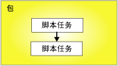

# 优先约束
  优先约束在控制流中链接包中的可执行文件、容器和任务，并指定决定可执行文件是否运行的条件。 可执行文件可以是 For 循环容器、Foreach 循环容器、序列容器、任务或事件处理程序。 事件处理程序也使用优先约束将其可执行文件链接为控制流。  
  
 优先约束链接两个可执行文件：优先可执行文件和受约束的可执行文件。 优先可执行文件先于受约束的可执行文件运行，而优先可执行文件的执行结果可能决定受约束的可执行文件是否运行。 下列关系图显示由优先约束链接的两个可执行文件。  
  
   
  
 在线性控制流（即不分支的控制流）中，优先约束独自控制任务运行的顺序。 如果控制流有分支，则由 [!INCLUDE[ssISnoversion](../../includes/ssisnoversion-md.md)] 运行时引擎决定紧随分支之后的任务和容器的执行顺序。 运行时引擎还决定着控制流中未连接的工作流的执行顺序。  
  
 [!INCLUDE[ssISnoversion](../../includes/ssisnoversion-md.md)] 的嵌套容器体系结构使得所有容器（除仅封装单个任务的任务宿主容器之外）均可包含其他容器，且每个容器都有自己的控制流。 For 循环容器、Foreach 循环容器和序列容器可以包含多个任务和其他容器，而这些任务和容器又可以包含多个任务和容器，如此逐层嵌套。 例如，带有脚本任务和序列容器的包具有链接该脚本任务和序列容器的优先约束。 序列容器包含三个脚本任务，且容器的优先约束将此三个脚本任务链接为控制流。 下列关系图显示包中带有两级嵌套的优先约束。  
  
   
  
 由于包位于 [!INCLUDE[ssIS](../../includes/ssis-md.md)] 容器层次结构的顶部，因此优先约束不能链接多个包；但是可以向包添加执行包任务并间接地将其他包链接到控制流中。  
  
 可以使用下列方式配置优先约束：  
  
-   指定求值运算。 优先约束同时使用约束值和表达式，或者使用其中任一个来决定受约束的可执行文件是否运行。  
  
-   如果优先约束使用执行结果，则您可以指定执行结果成功、失败或完成。  
  
-   如果优先约束使用计算结果，则您可以提供计算结果为布尔值的表达式。  
  
-   指定优先约束是单独计算还是与应用于受约束可执行文件的其他约束一起计算。  
  
## 求值运算  
 [!INCLUDE[ssISnoversion](../../includes/ssisnoversion-md.md)] 提供下列求值运算：  
  
-   仅使用优先可执行文件的执行结果来决定受约束的可执行文件是否运行的约束。 优先可执行文件的执行结果可以为完成、成功或失败。 这是默认操作。  
  
-   求值以决定受约束的可执行文件是否运行的表达式。 如果表达式计算结果为 true，则受约束的可执行文件运行。  
  
-   组合了对优先可执行文件执行结果以及对计算表达式返回结果的要求的表达式和约束。  
  
-   使用优先可执行文件执行结果或使用计算表达式返回结果的表达式或约束。  
  
 [!INCLUDE[ssIS](../../includes/ssis-md.md)] 设计器用颜色标识优先约束的类型。 “成功”约束为绿色，“失败”约束为红色，而“完成”约束为蓝色。 若要在 [!INCLUDE[ssIS](../../includes/ssis-md.md)] 设计器中显示表明约束类型的文本标签，则必须配置 [!INCLUDE[ssIS](../../includes/ssis-md.md)] 设计器的可访问性功能。  
  
 表达式必须是有效的 [!INCLUDE[ssIS](../../includes/ssis-md.md)] 表达式，且可以包含函数、运算符以及系统和自定义变量。 有关详细信息，请参阅 [Integration Services (SSIS) 表达式](../../integration-services/expressions/integration-services-ssis-expressions.md)和 [Integration Services (SSIS) 变量](../../integration-services/integration-services-ssis-variables.md)。  
  
## 执行结果  
 优先约束可以单独使用下列执行结果或将这些结果与表达式结合使用。  
  
-   完成仅要求优先可执行文件完成而不考虑结果，受约束的执行文件便可运行。  
  
-   成功要求优先可执行文件必须成功完成，受约束的可执行文件才能运行。  
  
-   失败要求优先可执行文件失败，受约束的可执行文件便可运行。  
  
> [!NOTE]  
>  优先约束必须为相同 **Precedence Constraint** 集合的成员，才能组成逻辑与条件。 例如，不能组合来自两个 Foreach 循环容器的优先约束。  
  
## 使用优先约束编辑器设置优先约束的属性  
  
1.  在 [!INCLUDE[ssBIDevStudioFull](../../includes/ssbidevstudiofull-md.md)]中，打开包含所需包的 [!INCLUDE[ssISnoversion](../../includes/ssisnoversion-md.md)] 项目。  
  
2.  在解决方案资源管理器中，双击该包将其打开。  
  
3.  单击 **“控制流”** 选项卡。  
  
4.  双击优先约束。  
  
     **“优先约束编辑器”** 将打开。  
  
5.  在“求值运算”下拉列表中，选择求值运算。  
  
6.  在“值”下拉列表中，选择优先可执行文件的执行结果。  
  
7.  如果求值运算使用表达式，请在 **“表达式”** 框中键入表达式，并单击 **“测试”** 来计算该表达式。  
  
    > [!NOTE]  
    >  变量名称区分大小写。  
  
8.  如果将多个任务或容器连接到受约束的可执行文件，选择 **“逻辑与”** 可以指定前面所有可执行文件的执行结果必须为 **true**。 选择 **“逻辑或”** 可以指定只有一个执行结果的值必须为 **true**。  
  
9. 单击 **“确定”** ，关闭 **“优先约束编辑器”**。  
  
10. 若要保存更新后的包，请单击 **“文件”** 菜单上的 **“保存选定项”** 。  

## 优先约束编辑器
可以使用 **“优先约束编辑器”** 对话框配置优先约束。  
  
### 选项  
 **求值运算**  
 指定优先约束使用的求值运算。 运算包括：“约束”、“表达式”、“表达式和约束”和“表达式或约束”。  
  
 **ReplTest1**  
 指定约束值：“成功”、“失败”或“完成”。  
  
> [!NOTE]  
>  优先约束线的含义：绿色表示“成功”，突出显示表示“失败”，蓝色表示“完成”。  
  
 **表达式**  
 如果使用运算“表达式”、“表达式和约束”或“表达式或约束”，则键入一个表达式或启动表达式生成器来创建表达式。 表达式的计算结果必须为布尔值。  
  
 **测试**  
 验证表达式。  
  
 **逻辑与**  
 选择此选项可以指定：同一个可执行文件的多个优先约束必须一起计算。 所有约束的计算结果都必须为 **True**。  
  
> [!NOTE]  
>  这种类型的优先约束显示为绿色、突出显示或蓝色实线。  
  
 **逻辑或**  
 选择此选项可以指定：同一个可执行文件的多个优先约束必须一起计算。 至少必须有一个约束的计算结果为 **True**。  
  
> [!NOTE]  
>  这种类型的优先约束显示为绿色、突出显示或蓝色点线。  
  
## 在“属性”窗口中设置优先约束的属性  
  
1.  在 [!INCLUDE[ssBIDevStudioFull](../../includes/ssbidevstudiofull-md.md)]中，打开包含要修改的包的 [!INCLUDE[ssISnoversion](../../includes/ssisnoversion-md.md)] 项目。  
  
2.  在解决方案资源管理器中，双击该包将其打开。  
  
3.  单击 **“控制流”** 选项卡。在“控制流”选项卡的设计图面上，右键单击优先约束，再单击“属性”。 在“属性”窗口中修改属性值。  
  
4.  在“属性”窗口中，设置优先约束的下列读/写属性：  
  
    |读/写属性|配置操作|  
    |--------------------------|--------------------------|  
    |描述|提供说明。|  
    |EvalOp|选择一个求值运算。 如果选择了 **Expression**、 **ExpressionAndConstant**或 **ExpressionOrConstant** 运算，则可指定一个表达式。|  
    |表达式|如果求值运算包含 and 表达式，则请提供一个表达式。 表达式的计算结果必须为布尔值。 有关表达式语言的详细信息，请参阅 [Integration Services (SSIS) 表达式](../../integration-services/expressions/integration-services-ssis-expressions.md)。|  
    |LogicalAnd|设置 **LogicalAnd** ，以指定当有多个可执行文件优先于并且链接到受约束的可执行文件时，是否将此优先约束与其他优先约束一起计算。|  
    |“属性”|更新优先约束的名称。|  
    |ShowAnnotation|指定要使用的批注类型。 选择 **Never** 可以禁用批注；选择 **AsNeeded** 可以启用按需批注；选择 **ConstraintName** 可以使用 Name 属性的值自动进行批注；选择 **ConstraintDescription** 可以使用 Description 属性的值自动进行批注；选择 **ConstraintOptions** 可以使用 Value 和 Expression 属性的值自动进行批注。|  
    |ReplTest1|如果在 EvalOP 属性中指定的求值运算包含约束，请选择受约束的可执行文件的执行结果。|  
  
5.  关闭“属性”窗口。  
  
6.  若要保存更新后的包，请单击 **“文件”** 菜单上的 **“保存选定项”** 。  

## 使用快捷菜单设置优先约束的值  
  
1.  在 [!INCLUDE[ssBIDevStudioFull](../../includes/ssbidevstudiofull-md.md)]中，打开包含所需包的 [!INCLUDE[ssISnoversion](../../includes/ssisnoversion-md.md)] 项目。  
  
2.  在解决方案资源管理器中，双击该包将其打开。  
  
3.  单击 **“控制流”** 选项卡。  
  
4.  在“控制流”选项卡的设计图面上，右键单击优先约束，然后单击“成功”、“失败”或“完成”。  
  
5.  若要保存更新后的包，请单击 **“文件”** 菜单上的 **“保存选定项”** 。  

## 将表达式添加到优先约束
 优先约束可用表达式定义两个可执行文件之间的约束：优先可执行文件和受约束的可执行文件。 可执行文件可以是任务或容器。 表达式可以单独使用，也可以与优先可执行文件的执行结果结合使用。 可执行文件的执行结果或者为成功，或者为失败。 配置优先约束的执行结果时，可以将执行结果设置为 **Success**、 **Failure**或 **Completion**。 **Success** 要求优先可执行文件成功； **Failure** 要求优先可执行文件失败；而 **Completion** 则指示无论优先任务成功或失败，受约束的可执行文件都应运行。 有关详细信息，请参阅 [优先约束](../../integration-services/control-flow/precedence-constraints.md)。  
  
 表达式的值必须为 **True** 或 **False** ，并且此表达式必须为有效的 [!INCLUDE[ssISnoversion](../../includes/ssisnoversion-md.md)] 表达式。 此表达式可以使用文字、系统变量和自定义变量以及 [!INCLUDE[ssIS](../../includes/ssis-md.md)] 表达式语法提供的函数和运算符。 例如，表达式 `@Count == SQRT(144) + 10` 使用了变量 **Count**、SQRT 函数以及等号 (==) 和加号 (+) 运算符。 有关详细信息，请参阅 [Integration Services (SSIS) 表达式](../../integration-services/expressions/integration-services-ssis-expressions.md)。  
  
 在下图中，使用一个执行结果和一个表达式的优先约束将任务 A 和任务 B 链接在一起。 此约束值设置为 **Success** ，表达式为  `@X >== @Z`。 仅当任务 A 成功完成且变量 **X** 的值大于或等于变量 **Z**的值时，受约束的任务 B 才运行。  
  
   
  
 也可以用包含不同表达式的多个优先约束来链接可执行文件。 例如，在下图中，使用执行结果和表达式的优先约束将任务 B 和任务 C 链接到任务 A。 这两个约束的值都设置为 **Success**。 ，一个优先约束包含表达式 `@X >== @Z`，而另一个优先约束包含表达式 `@X < @Z`。 变量 **X** 和变量 **Z**的值决定是任务 C 运行还是任务 B 运行。  
  
   
  
 可使用 **设计器中的** “优先约束编辑器” [!INCLUDE[ssIS](../../includes/ssis-md.md)] 和 [!INCLUDE[ssBIDevStudioFull](../../includes/ssbidevstudiofull-md.md)] 提供的“属性”窗口来添加或修改表达式。 但是，“属性”窗口不提供表达式语法验证。  
  
 如果优先约束包含表达式，那么在 **“控制流”** 选项卡的设计图面上会有一个图标出现在该优先约束旁边，图标上的 ToolTip 显示此表达式。  

### 将表达式添加到优先约束  
  
1.  在 [!INCLUDE[ssBIDevStudioFull](../../includes/ssbidevstudiofull-md.md)]中，打开包含所需包的 [!INCLUDE[ssISnoversion](../../includes/ssisnoversion-md.md)] 项目。  
  
2.  在解决方案资源管理器中，双击该包将其打开。  
  
3.  单击 **“控制流”** 选项卡。  
  
4.  在“控制流”选项卡的设计图面上双击优先约束。 **“优先约束编辑器”** 将打开。  
  
5.  在 **“求值运算”** 列表中选择 **“表达式”**、 **“表达式和约束”** 或者 **“表达式或约束”** 。  
  
6.  在 **“表达式”** 文本框中键入表达式，或启动表达式生成器来创建表达式。  
  
7.  若要验证表达式语法，请单击 **“测试”**。  
  
8.  若要保存更新后的包，请单击 **“文件”** 菜单上的 **“保存选定项”** 。  
 
### 将执行值和表达式组合起来  
 下表介绍把执行值约束和表达式组合在优先约束中的效果。  
  
|求值运算|约束的计算结果为|表达式的计算结果为|受约束的可执行文件运行|  
|--------------------------|-----------------------------|-----------------------------|---------------------------------|  
|约束|True|N/A|True|  
|约束|False|N/A|False|  
|表达式|N/A|True|True|  
|表达式|N/A|False|False|  
|约束和表达式|True|True|True|  
|约束和表达式|True|False|False|  
|约束和表达式|False|True|False|  
|约束和表达式|False|False|False|  
|约束或表达式|True|True|True|  
|约束或表达式|True|False|True|  
|约束或表达式|False|True|True|  
|约束或表达式|False|False|False|  

## 具有多个优先约束的复杂约束方案 
一个优先约束连接两个可执行文件：两个任务、两个容器或一个任务和一个容器。 它们被称为优先可执行文件和受约束的可执行文件。 受约束的可执行文件可具有多个优先约束。 有关详细信息，请参阅 [Precedence Constraints](../../integration-services/control-flow/precedence-constraints.md)。  
  
 对约束进行分组以组合成复杂的约束方案，可使您在包中实现复杂的控制流。 例如，在下图中，一个 **Success** 约束将任务 D 链接到任务 A，一个 **Failure** 约束将任务 D 链接到任务 B，而一个 **Success** 约束将任务 D 链接到任务 C。 任务 D 和任务 A 之间、任务 D 和任务 B 之间，以及任务 D 和任务 C 之间的优先约束参与逻辑与  关系。 因此，任务 A 必须运行成功，任务 B 必须失败，并且任务 C 必须运行成功才能运行任务 D。  
  
   
  
### LogicalAnd 属性  
 如果任务或容器具有多个约束，则 **LogicalAnd** 属性指定一个优先约束是单独计算还是与其他约束一起计算。  
  
 可以使用 [!INCLUDE[ssIS](../../includes/ssis-md.md)] 设计器中的“优先约束编辑器”设置 **LogicalAnd** 属性，也可以在 [!INCLUDE[ssBIDevStudioFull](../../includes/ssbidevstudiofull-md.md)] 提供的“属性”窗口中设置。  

## 设置优先约束的默认值  
首次使用 [!INCLUDE[ssIS](../../includes/ssis-md.md)] 设计器时，优先约束的默认值为 **Success**。 按照下列步骤将 [!INCLUDE[ssIS](../../includes/ssis-md.md)] 设计器配置为使用不同的优先约束默认值。
  
1.  打开 [!INCLUDE[ssBIDevStudioFull](../../includes/ssbidevstudiofull-md.md)]。  
  
2.  在“工具”  菜单上，单击“选项” 。  
  
3.  在 **“选项”** 对话框中，展开 **“商业智能设计器”** ，再展开 **“Integration Services 设计器”**。  
  
4.  单击 **“控制流自动连接”** ，并选择 **“将新形状连接到默认选中的形状”**。  
  
5.  在下拉列表中，选择“对新形状使用‘失败’约束”或“对新形状使用‘完成’约束”。  
  
6.  单击“确定” 。  
  
## 创建默认优先约束  
  
1.  在 [!INCLUDE[ssBIDevStudioFull](../../includes/ssbidevstudiofull-md.md)]中，打开包含所需包的 [!INCLUDE[ssISnoversion](../../includes/ssisnoversion-md.md)] 项目。  
  
2.  在解决方案资源管理器中，双击该包将其打开。  
  
3.  单击 **“控制流”** 选项卡。  
  
4.  在 **“控制流”** 选项卡的设计图面上，单击任务或容器，并将其连接线拖动到要将优先约束应用到其上的可执行文件。  
  
5.  若要保存更新后的包，请单击 **“文件”** 菜单上的 **“保存选定项”** 。  
