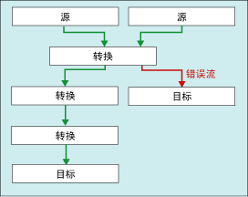

# <a name="error-handling-in-data"></a>数据中的错误处理
  数据流组件将转换应用到列数据、从源提取数据或将数据加载到目标中时，可能会发生错误。 错误常因意外数据值而发生。 例如，如果列包含字符串而不是数字，数据转换将失败；在数据库列中执行插入操作时，如果数据是日期而列的数据类型为数值，此操作将失败；如果因列值为零而导致数学运算无效，表达式将无法计算。  
  
 错误通常属于下列类别之一：  
  
-   数据转换错误，其在转换导致重要数字丢失、非重要数字丢失和字符串截断时发生。 如果不支持请求的转换，也会发生数据转换错误。  
  
-   表达式计算错误，其在运行时计算的表达式执行无效运算，或因数据值丢失或错误而出现语法错误时发生。  
  
-   查找错误，其在查找操作在查找表中找不到匹配时发生。  
  
 有关 Integration Services 的错误、警告和其他消息的列表，请参阅 [Integration Services Error and Message Reference](../../integration-services/integration-services-error-and-message-reference.md)。  
  
## <a name="use-error-outputs-to-capture-row-level-errors"></a>使用错误输出捕获行级错误  
 许多数据流组件支持错误输出，这使得您可以控制组件处理传入和传出数据中行级错误的方式。 通过设置输入或输出中各个列的选项，可以指定发生截断或错误时组件的行为。 例如，可以指定组件应在客户名称数据被截断时失败，但忽略另一包含不太重要数据的列上的错误。  
  
 错误输出可以连接到另一个转换的输入，或者加载到非错误输出以外的目标。 例如，错误输出可以连接到为空白列提供字符串的派生列转换。  
  
 下列关系图显示包含错误输出的简单数据流。  
  
   
  
 有关详细信息，请参阅 [数据流](../../integration-services/data-flow/data-flow.md) 和 [Integration Services 路径](../../integration-services/data-flow/integration-services-paths.md)。  

## <a name="configure-error-output-dialog-box"></a>“配置错误输出”对话框
可以使用 **“配置错误输出”** 对话框，为支持错误输出的数据流转换配置错误处理选项。  
  
 若要了解有关使用错误输出的详细信息，请参阅 [数据中的错误处理](../../integration-services/data-flow/error-handling-in-data.md)。  
  
### <a name="options"></a>“常规”  
 **输入或输出**  
 查看输出的名称。  
  
 **列**  
 查看转换编辑器对话框中所选的输出列。  
  
 **错误**  
 如果适用，指定发生错误时应执行的操作：忽略失败、重定向行或使组件失败。  
  
 **相关主题：**[数据中的错误处理](../../integration-services/data-flow/error-handling-in-data.md)  
  
 **截断**  
 如果适用，指定发生截断时应执行的操作：忽略失败、重定向行或使组件失败。  
  
 **相关主题：**[数据中的错误处理](../../integration-services/data-flow/error-handling-in-data.md)  
  
 **Description**  
 查看操作的说明。  
  
 **将此值设置到选定的单元格**  
 指定发生错误或截断时应对所有选定单元格执行的操作：忽略失败、重定向行或使组件失败。  
  
 **应用**  
 将错误处理选项应用到选定的单元格。  
  
## <a name="errors-are-either-failures-or-truncations"></a>错误为失败或截断  
 错误属于两个类别之一：错误或截断。  
  
 **“错误”**。 错误指示确定的失败，并且生成 NULL 结果。 此类错误可以包括数据转换错误或表达式计算错误。 例如，尝试将包含字母字符的字符串转换为数字将导致错误。 数据转换、表达式计算和对变量、属性和数据列的表达式结果分配可能会由于非法转换和不兼容的数据类型而失败。 有关详细信息，请参阅[转换 (SSIS 表达式)](../../integration-services/expressions/cast-ssis-expression.md)、[表达式中的 Integration Services 数据类型](../../integration-services/expressions/integration-services-data-types-in-expressions.md)和 [Integration Services 数据类型](../../integration-services/data-flow/integration-services-data-types.md)。  
  
 **截断**。 截断的严重程度小于错误。 截断生成的结果可能是有用的甚至是所希望的。 您可以将截断视为错误或可接受的情况。 例如，如果将 15 个字符的字符串插入只有一个字符宽度的列，您可以截断该字符串。  
  
## <a name="select-an-error-handling-option"></a>选择一个错误处理选项  
 可以配置源、转换和目标处理错误和截断的方式。 下表对这些选项进行说明：  
  
|选项|描述|  
|------------|-----------------|  
|组件失败|发生错误或截断时数据流任务失败。 失败是错误或截断的默认选项。|  
|忽略失败|忽略错误或截断，并且将数据行定向到转换或源的输出。|  
|重定向行|将错误或截断的数据行定向到源、转换或目标的错误输出。|  
  
## <a name="get-more-info-about-the-error"></a>获取有关错误的详细信息  
 除数据列外，错误输出还包含 **ErrorCode** 列和 **ErrorColumn** 列。 **ErrorCode** 列标识错误，而 **ErrorColumn** 列则包含错误列的沿袭标识符。  
  
 在某些环境下， **ErrorColumn** 列的值会设置为零。 当错误条件影响到整行而不是单列时，就会发生该情况。 例如，在查找转换中的查找失败时。  
  
 如果没有相应的错误说明和列名，这两个数值可能没有多大用处。 下面是一些用于获取错误说明和列名的方法。  
  
-   可以通过将“数据查看器”附加到错误输出查看错误说明和列名。 在 SSIS 设计器中，右键单击通向错误输出的红色箭头，然后选择“启用数据查看器”。  
  
-   可以通过启用日志记录并选择 **DiagnosticEx** 事件来查找列名称。 此事件将数据流列映射写入日志。 然后可以在此列映射中从其标识符查找列名称。 请注意，为了缩减日志大小， **DiagnosticEx** 事件不在其 XML 输出中保留空白。 若要提高可读性，请将日志复制到支持 XML 格式和语法突出显示的 XML 编辑器中 - 例如 Visual Studio 中的 XML 编辑器。 有关日志记录的详细信息，请参阅 [Integration Services (SSIS) 日志记录](../../integration-services/performance/integration-services-ssis-logging.md)。  
  
     下面是数据流列映射的示例。  
  
    ```xml  
  
    \<DTS:PipelineColumnMap xmlns:DTS="www.microsoft.com/SqlServer/Dts">  
        \<DTS:Pipeline DTS:Path="\Package\Data Flow Task">  
            \<DTS:Column DTS:ID="11" DTS:IdentificationString="ADO NET Source.Outputs[ADO NET Source Output].Columns[Customer]"/>  
            \<DTS:Column DTS:ID="12" DTS:IdentificationString="ADO NET Source.Outputs[ADO NET Source Output].Columns[Product]"/>  
            \<DTS:Column DTS:ID="13" DTS:IdentificationString="ADO NET Source.Outputs[ADO NET Source Output].Columns[Price]"/>  
            \<DTS:Column DTS:ID="14" DTS:IdentificationString="ADO NET Source.Outputs[ADO NET Source Output].Columns[Timestamp]"/>  
            \<DTS:Column DTS:ID="20" DTS:IdentificationString="ADO NET Source.Outputs[ADO NET Source Error Output].Columns[Customer]"/>  
            \<DTS:Column DTS:ID="21" DTS:IdentificationString="ADO NET Source.Outputs[ADO NET Source Error Output].Columns[Product]"/>  
            \<DTS:Column DTS:ID="22" DTS:IdentificationString="ADO NET Source.Outputs[ADO NET Source Error Output].Columns[Price]"/>  
            \<DTS:Column DTS:ID="23" DTS:IdentificationString="ADO NET Source.Outputs[ADO NET Source Error Output].Columns[Timestamp]"/>  
            \<DTS:Column DTS:ID="24" DTS:IdentificationString="ADO NET Source.Outputs[ADO NET Source Error Output].Columns[ErrorCode]"/>  
            \<DTS:Column DTS:ID="25" DTS:IdentificationString="ADO NET Source.Outputs[ADO NET Source Error Output].Columns[ErrorColumn]"/>  
            \<DTS:Column DTS:ID="31" DTS:IdentificationString="Flat File Destination.Inputs[Flat File Destination Input].Columns[Customer]"/>  
            \<DTS:Column DTS:ID="32" DTS:IdentificationString="Flat File Destination.Inputs[Flat File Destination Input].Columns[Product]"/>  
            \<DTS:Column DTS:ID="33" DTS:IdentificationString="Flat File Destination.Inputs[Flat File Destination Input].Columns[Price]"/>  
            \<DTS:Column DTS:ID="34" DTS:IdentificationString="Flat File Destination.Inputs[Flat File Destination Input].Columns[Timestamp]"/>  
        \</DTS:Pipeline>  
    \</DTS:PipelineColumnMap>  
  
    ```  
  
-   还可使用脚本组件将错误说明和列名称包含在错误输出的其他列中。 有关示例，请参阅 [使用脚本组件增强错误输出](../../integration-services/extending-packages-scripting-data-flow-script-component-examples/enhancing-an-error-output-with-the-script-component.md)。  
  
    -   通过使用脚本的单独一行来调用 <xref:Microsoft.SqlServer.Dts.Pipeline.Wrapper.IDTSComponentMetaData100.GetErrorDescription%2A> 接口的 <xref:Microsoft.SqlServer.Dts.Pipeline.Wrapper.IDTSComponentMetaData100> 方法，来包括其他列中的错误说明。  
  
    -   通过使用脚本的单独一行来调用 <xref:Microsoft.SqlServer.Dts.Pipeline.Wrapper.IDTSComponentMetaData100.GetIdentificationStringByID%2A> 接口的 <xref:Microsoft.SqlServer.Dts.Pipeline.Wrapper.IDTSComponentMetaData100> 方法，来包括其他列中的错误说明。  
  
     可以从想要捕获其错误的数据流组件的下游的任意位置将脚本组件添加到数据流的错误段。 通常应在错误行写入到目标之前立即放入脚本组件。 这样，脚本只查找已写入的错误行的说明。 数据流的错误段可能纠正某些错误，并且不将这些行写入错误目标。  

## <a name="see-also"></a>另请参阅  
 [数据流](../../integration-services/data-flow/data-flow.md)   
 [使用转换对数据进行转换](../../integration-services/data-flow/transformations/transform-data-with-transformations.md)   
 [使用路径连接组件](http://msdn.microsoft.com/library/05633e4c-1370-4b05-802b-f36b07dd71c8)   
 [数据流任务](../../integration-services/control-flow/data-flow-task.md)   
 [数据流](../../integration-services/data-flow/data-flow.md)  
  
  
