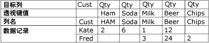
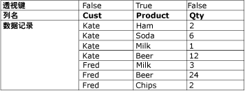

# 逆透视转换

[!INCLUDE[sqlserver-ssis](../../../includes/applies-to-version/sqlserver-ssis.md)]

  逆透视转换将来自单个记录中多个列的值扩展为单个列中具有同样值的多个记录，使得非规范的数据集成为较规范的版本。 例如，每个客户在列出客户名的数据集中各占一行，在该行的各列中显示购买的产品和数量。 逆透视转换将数据集规范之后，客户购买的每种产品在该数据集中各占一行。  
  
 下面的关系图显示对 Product 列逆透视数据之前的数据集。  
  
   
  
 下面的关系图显示对 Product 列逆透视数据之后的数据集。  
  
   
  
 在某些情况下，逆透视结果可能包含具有意外值的行。 例如，如果关系图中显示的要逆透视的示例数据在 Fred 的所有 Qty 列中都具有空值，则输出将只包括 Fred 的一行，而非五行。 Qty 列将为空或包含零，具体取决于列数据类型。  
  
## 配置逆透视转换  
 逆透视转换包括 **PivotKeyValue** 自定义属性。 加载包时，可以通过属性表达式更新此属性。 有关详细信息，请参阅 [Integration Services (SSIS) 表达式](../../../integration-services/expressions/integration-services-ssis-expressions.md)、[在包中使用属性表达式](../../../integration-services/expressions/use-property-expressions-in-packages.md)和[转换自定义属性](../../../integration-services/data-flow/transformations/transformation-custom-properties.md)。  
  
 此转换有一个输入和一个输出。 它没有错误输出。  
  
 可以通过 [!INCLUDE[ssIS](../../../includes/ssis-md.md)] 设计器或以编程方式来设置属性。  
  
 有关可以在 **“高级编辑器”** 对话框中或以编程方式设置的属性的详细信息，请单击下列主题之一：  
  
-   [Common Properties](https://msdn.microsoft.com/library/51973502-5cc6-4125-9fce-e60fa1b7b796)  
  
-   [转换自定义属性](../../../integration-services/data-flow/transformations/transformation-custom-properties.md)  
  
 有关如何设置属性的详细信息，请参阅 [设置数据流组件的属性](../../../integration-services/data-flow/set-the-properties-of-a-data-flow-component.md)。  
  
## “逆透视转换编辑器”
  可以使用 **“逆透视转换编辑器”** 对话框，选择要透视到行中的列以及指定数据列和新的透视值输出列。  
  
> [!NOTE]  
>  本主题围绕 [Unpivot Transformation](../../../integration-services/data-flow/transformations/unpivot-transformation.md) 中所述的“逆透视”应用场景，举例说明各选项的使用方法。  
  
### 选项  
 **可用输入列**  
 使用复选框指定要透视到行中的列。  
  
 **名称**  
 查看可用输入列的名称。  
  
 **传递**  
 指示是否在逆透视的输出中包括该列。  
  
 **输入列**  
 从每行的可用输入列的列表中选择。 通过选中 **“可用输入列”** 表中的复选框来选择列。  
  
 在 [Unpivot Transformation](../../../integration-services/data-flow/transformations/unpivot-transformation.md)所述的“逆透视”应用场景中，输入列为 **Ham**, **Soda**, **Milk**, **Beer**和 **Chips** 列。  
  
 **目标列**  
 提供数据列的名称。  
  
 在 [逆透视转换](../../../integration-services/data-flow/transformations/unpivot-transformation.md)所述的“逆透视”应用场景中，目标列为数量 (**Qty**) 列。  
  
 **透视键值**  
 提供透视值的名称。 默认值为输入列的名称；不过，您也可以任选一个唯一的描述性名称。  
  
 此属性的值可以使用属性表达式来指定。  
  
 在 [Unpivot Transformation](../../../integration-services/data-flow/transformations/unpivot-transformation.md)所述的“逆透视”应用场景中，透视值将显示为由 **“透视键值列名”** 选项指定的新 Product 列中的文本值，即 **Ham**, **Soda**, **Milk**, **Beer**和 **Chips**。  
  
 **“透视键值列名”**  
 提供透视值列的名称。 默认名称为“Pivot Key Value”；不过，您也可以任选一个唯一的描述性名称。  
  
 在 [Unpivot Transformation](../../../integration-services/data-flow/transformations/unpivot-transformation.md)所述的“逆透视”应用场景中，“透视键值列名”为 **Product** ，并指定新的 **Product** 列， **Ham**, **Soda**, **Milk**, **Beer**和 **Chips** 列将逆向透视到该列。  
  
## 另请参阅  
 [Integration Services 错误和消息引用](../../../integration-services/integration-services-error-and-message-reference.md)   
 [透视转换](../../../integration-services/data-flow/transformations/pivot-transformation.md)  
  
  
