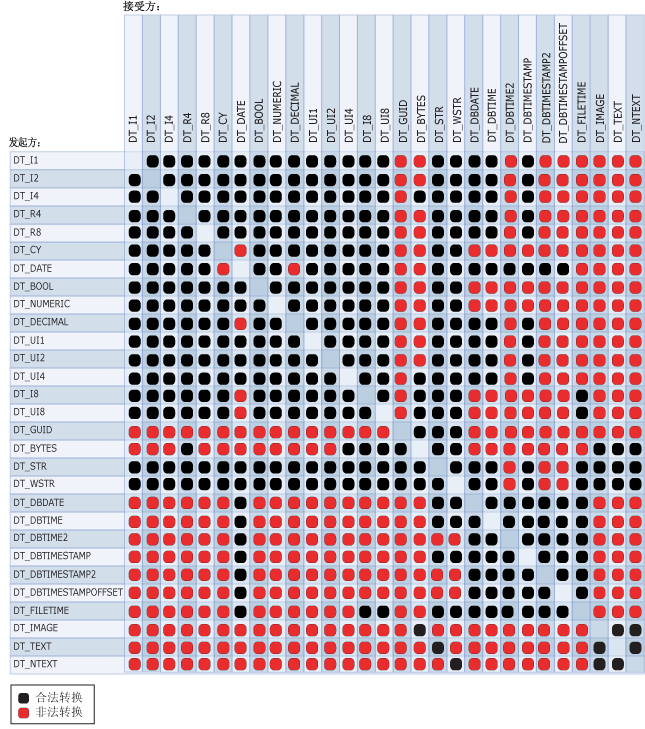

# <a name="cast-ssis-expression"></a>Cast（SSIS 表达式）

[!INCLUDE[sqlserver-ssis](../../includes/applies-to-version/sqlserver-ssis.md)]


  将表达式从一种数据类型显式转换为另一种数据类型。 转换运算符还可以用作截断运算符。  
  
## <a name="syntax"></a>语法  
  
```  
  
(type_spec) expression  
  
```  
  
## <a name="arguments"></a>参数  
 *type_spec*  
 是有效的 [!INCLUDE[ssIS](../../includes/ssis-md.md)] 数据类型。  
  
 *expression*  
 有效的表达式。  
  
## <a name="result-types"></a>结果类型  
 *type_spec*数据类型。 有关详细信息，请参阅 [Integration Services 数据类型](../../integration-services/data-flow/integration-services-data-types.md)。  
  
## <a name="remarks"></a>备注  
 以下关系图显示了合法的转换运算。  
  
   
  
 转换为某些数据类型时需要参数。 下表列出了这些数据类型及其参数。  
  
|数据类型|参数|示例|  
|---------------|---------------|-------------|  
|DT_STR|*charcount*<br /><br /> *codepage*|(DT_STR,30,1252) 将 30 个字节（即 30 个单字符）转换为使用 1252 代码页的 DT_STR 数据类型。|  
|DT_WSTR|*Charcount*|(DT_WSTR,20) 将 20 个字节对（即 20 个 Unicode 字符）转换为 DT_WSTR 数据类型。|  
|DT_BYTES|*Bytecount*|(DT_BYTES,50) 将 50 个字节的数据转换为 DT_BYTES 数据类型。|  
|DT_DECIMAL|*缩放*|(DT_DECIMAL,2) 将数值转换为带 2 位小数的 DT_DECIMAL 数据类型。|  
|DT_NUMERIC|*精度*<br /><br /> *缩放*|(DT_NUMERIC,10,3) 将数值转换为带 3 位小数且精度为 10 的 DT_NUMERIC 数据类型。|  
|DT_TEXT|*Codepage*|(DT_TEXT,1252) 将值转换为使用 1252 代码页的 DT_TEXT 数据类型。|  
  
 字符串和 DT_DATE 间相互转换时，将使用转换的区域设置。 但是，无论区域设置首选项是否使用 YYYY-MM-DD 这一 ISO 格式，日期均采用该 ISO 格式。  
  
> [!NOTE]  
>  若要将字符串转换为 DT_DATE 以外的日期数据类型，请参阅 [Integration Services 数据类型](../../integration-services/data-flow/integration-services-data-types.md)。  
  
 如果代码页为多字节字符代码页，则字节数和字符数可能会有所不同。 将具有相同的 *charcount* 值的 DT_WSTR 转换为 DT_STR 时，可能导致转换后的字符串的最后字符被截断。 如果在目标表的列中有足够的存储区，则可设置 *charcount* 参数的值以反映多字节代码页所需的字节数。 例如，如果将字符数据转换为使用 936 代码页的 DT_STR 数据类型，则应将 *charcount* 的值设置为希望数据包含的字符数的两倍；如果要转换使用 UTF-8 代码页字符数据，则应将 *charcount* 值设置为四倍以上。  
  
 有关日期数据类型结构的详细信息，请参阅 [Integration Services Data Types](../../integration-services/data-flow/integration-services-data-types.md)。  
  
## <a name="ssis-expression-examples"></a>SSIS 表达式示例  
 以下示例将一个数值转换为整数。  
  
```  
(DT_I4) 3.57  
```  
  
 以下示例将整数转换为使用 1252 代码页的字符串。  
  
```  
(DT_STR,1,1252)5  
```  
  
 以下示例将三字符字符串转换为双字节字符。  
  
```  
(DT_WSTR,3)"Cat"  
```  
  
 以下示例将整数转换为带两位小数的十进制数。  
  
```  
(DT_DECIMAl,2)500  
```  
  
 此示例将整数转换为带 3 位小数且精度为 7 的数值。  
  
```  
(DT_NUMERIC,7,3)4000  
```  
  
 以下示例将 **FirstName** 列中的值（定义为 **nvarchar** 数据类型且长度 50）转换为使用 1252 代码页的字符串。  
  
```  
(DT_STR,50,1252)FirstName  
```  
  
 本示例将类型为 DT_DBDATE 的 **DateFirstPurchase** 列中的值转换为长度为 20 的 Unicode 字符串。  
  
```  
(DT_WSTR,20)DateFirstPurchase  
```  
  
 以下示例将字符串文字“True”转换为布尔值。  
  
```  
(DT_BOOL)"True"  
```  
  
 下面的示例将字符串文字转换为 DT_DBDATE。  
  
```  
(DT_DBDATE) "1999-10-11"  
```  
  
 下面的示例将字符串文字转换为使用 5 位小数秒的 DT_DBTIME2 数据类型。 （对于 DT_DBTIME2 数据类型可以指定 0 到 7 位小数秒。）  
  
```  
(DT_DBTIME2, 5) "16:34:52.12345"  
```  
  
 下面的示例将字符串文字转换为使用 4 位小数秒的 DT_DBTIMESTAMP2 数据类型。 （对于 DT_DBTIMESTAMP2 数据类型可以指定 0 到 7 位小数秒。）  
  
```  
(DT_DBTIMESTAMP2, 4) "1999-10-11 16:34:52.1234"  
```  
  
 下面的示例将字符串文字转换为使用 7 位小数秒的 DT_DBTIMESTAMPOFFSET 数据类型。 （对于 DT_DBTIMESTAMPOFFSET 数据类型可以指定 0 到 7 位小数秒。）  
  
```  
(DT_DBTIMESTAMPOFFSET, 7) "1999-10-11 16:34:52.1234567 + 5:35"  
```  
  
## <a name="see-also"></a>另请参阅  
 [运算符优先级和结合性](../../integration-services/expressions/operator-precedence-and-associativity.md)   
 [运算符（SSIS 表达式）](../../integration-services/expressions/operators-ssis-expression.md)   
 [Integration Services (SSIS) 表达式](../../integration-services/expressions/integration-services-ssis-expressions.md)   
 [表达式中的 Integration Services 数据类型](../../integration-services/expressions/integration-services-data-types-in-expressions.md)  
  
  
