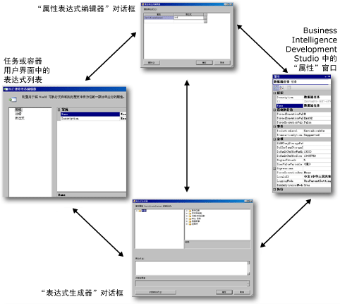

# 在包中使用属性表达式
  属性表达式是分配给属性以便能够在运行时对该属性进行动态更新的表达式。 例如，属性表达式可以通过插入存储在变量中的电子邮件地址来更新发送邮件任务所使用的“收件人”行。  
  
 表达式可以添加到包、任务、Foreach 循环、For 循环、序列、Foreach 枚举器、事件处理程序、包或项目级别连接管理器，或添加到日志提供程序。 这些对象的任何读/写属性都可以实现属性表达式。 [!INCLUDE[ssISnoversion](../../includes/ssisnoversion-md.md)] 还支持在数据流组件的某些自定义属性中使用属性表达式。 变量和优先约束不支持属性表达式，但它们包含可以使用表达式的特殊属性。  
  
 属性表达式可以通过不同的方式进行更新：  
  
-   用户定义的变量可以包括在包配置中，在部署包时可以更新这些变量。 在运行时，使用更新后的变量值计算属性表达式。  
  
-   表达式中包含的系统变量在运行时更新，这样可以更改属性求值的结果。  
  
-   日期和时间函数在运行时计算，并将更新后的值提供给属性表达式。  
  
-   表达式中的变量可以由脚本任务和脚本组件运行的脚本进行更新。  
  
 表达式是使用 [!INCLUDE[msCoName](../../includes/msconame-md.md)] [!INCLUDE[ssISnoversion](../../includes/ssisnoversion-md.md)] 表达式语言生成的。 表达式可以使用系统变量或用户定义的变量以及表达式语言提供的运算符、函数和类型转换。  
  
> [!NOTE]  
>  用户定义的变量名和系统变量名区分大小写。  
  
 有关详细信息，请参阅 [Integration Services (SSIS) 表达式](../../integration-services/expressions/integration-services-ssis-expressions.md)。  
  
 属性表达式的一个重要用途是为包的每个已部署的实例自定义配置。 这使得可以动态更新不同环境的包属性。 例如，您可以创建将变量分配给连接管理器的连接字符串的属性表达式，然后在部署包时更新该变量，从而确保了在运行时连接字符串是正确的。 在计算属性表达式之前加载包配置。  
  
 一个属性只能使用一个属性表达式，一个属性表达式只能应用于一个属性。 但是，您可以生成多个相同的属性表达式，并将它们分配给不同的属性。  
  
 某些属性是通过使用来自枚举器的值来设置的。 在属性表达式中引用枚举器成员时，必须使用与枚举器成员的友好名称等价的数值。 例如，如果属性表达式设置 **LoggingMode** 属性，而该属性使用来自 **DTSLoggingMode** 枚举的值，则属性表达式必须使用 0、1 或 2 而不是友好名称 **Enabled**、 **Disabled**或 **UseParentSetting**。 有关详细信息，请参阅 [属性表达式中的枚举常量](../../integration-services/expressions/enumerated-constants-in-property-expressions.md)。  
  
## 属性表达式用户界面  
 [!INCLUDE[ssISnoversion](../../includes/ssisnoversion-md.md)] 提供了一组用于生成和管理属性表达式的工具。  
  
-   **“表达式”** 页，在任务、For 循环容器和 Foreach 容器的自定义编辑器中提供。 利用 **“表达式”** 页可以编辑表达式，查看任务、Foreach 循环或 For 循环所使用的属性表达式的列表。  
  
-   **“属性”** 窗口，用于编辑表达式和查看包或包对象所使用的属性表达式的列表。  
  
-   **“属性表达式编辑器”** 对话框，用于创建、更新和删除属性表达式。  
  
-   **“表达式生成器”** 对话框，用于使用图形工具生成表达式。 **“表达式生成器”** 对话框可以计算表达式，以便于您查看，而不将计算结果分配给属性。  
  
 以下关系图显示了用来添加、更改和删除属性表达式的用户界面。  
  
   
  
 在“属性”窗口和“表达式”页中，单击“表达式”集合级别中的浏览按钮 “(…)”，以打开“属性表达式编辑器”对话框。 属性表达式编辑器允许将属性映射到表达式，也允许键入属性表达式。 如果希望使用图形表达式工具来创建表达式，然后对其进行验证，请在表达式级别单击浏览按钮 **(…)** 以打开“表达式生成器”对话框，然后进行创建或修改，并（可选）验证表达式。  
  
 还可以从 **“属性表达式编辑器”** 对话框打开 **“表达式生成器”** 对话框。  
  
#### 使用属性表达式  
  
-   [添加或更改属性表达式](../../integration-services/expressions/add-or-change-a-property-expression.md)  
  
### 设置数据流组件的属性表达式  
 如果在 [!INCLUDE[ssBIDevStudioFull](../../includes/ssbidevstudiofull-md.md)]中构造包，则支持属性表达式的数据流组件的属性将显示在它们所属的“数据流”任务上。 若要添加、更改和删除数据流组件的属性表达式，请右键单击数据流组件所属的数据流的“数据流”任务，并单击“属性”。 “属性”窗口将列出可以对其使用属性表达式的数据流组件的属性。 例如，若要在名为 SampleCustomer 的数据流中创建或修改“行抽样”转换的 SamplingValue 属性的属性表达式，请右键单击“行抽样”转换所属的数据流的“数据流”任务，然后单击“属性”。 SamplingValue 属性将在“属性”窗口中列出，其格式为 [SampleCustomer].[SamplingValue]。  
  
 在“属性”窗口中，可以添加、更改和删除数据流组件的属性表达式，具体方式与对其他 [!INCLUDE[ssISnoversion](../../includes/ssisnoversion-md.md)] 对象类型执行属性表达式操作时相同。 通过“属性”窗口，还可以访问用于添加、更改或删除数据流组件的属性表达式的各种对话框和生成器。 有关可以用属性表达式更新的数据流组件属性的详细信息，请参阅 [Transformation Custom Properties](../../integration-services/data-flow/transformations/transformation-custom-properties.md)。  
  
## 加载属性表达式  
 无法指定或控制何时加载属性表达式。 属性表达式将在包和包对象通过验证后被计算并加载。 保存包、在 [!INCLUDE[ssIS](../../includes/ssis-md.md)] 设计器中打开包以及运行包时，将发生验证。  
  
 因此，在添加属性表达式之后，只有在保存包、运行包或重新打开包以后，才能在 [!INCLUDE[ssIS](../../includes/ssis-md.md)] 设计器中看到使用属性表达式的包对象的更新后的属性值。  
  
 如果调用特定于该对象类型的方法，那么也会加载与不同对象类型（连接管理器、日志提供程序和枚举器）关联的属性表达式。 例如，连接管理器的属性将在 [!INCLUDE[ssISnoversion](../../includes/ssisnoversion-md.md)] 创建连接实例之前加载。  
  
 属性表达式将在加载包配置之后加载。 例如，变量首先由它们的配置进行更新，然后计算并加载使用这些变量的属性表达式。 这意味着属性表达式始终使用由配置所设置的变量的值。  
  
> [!NOTE]  
>  不能使用 **dtexec** 实用工具的“设置”选项填充属性表达式。  
  
 下表总结了何时计算并加载 [!INCLUDE[ssISnoversion](../../includes/ssisnoversion-md.md)] 的属性表达式。  
  
|对象类型|加载并计算|  
|-----------------|-----------------------|  
|包、Foreach 循环、For 循环、序列、任务和数据流组件|加载配置之后   验证之前   执行之前|  
|连接管理器|加载配置之后   验证之前   执行之前   创建连接实例之前|  
|日志提供程序|加载配置之后   验证之前   执行之前   打开日志之前|  
|Foreach 枚举器|加载配置之后   验证之前   执行之前   每个循环枚举之前|  
  
## 在 Foreach 循环中使用属性表达式  
 通常需要实现属性表达式来设置 Foreach 循环容器内部使用的连接管理器的 **ConnectionString** 属性值。 在枚举器将其当前值映射到与每个循环迭代有关的某个变量后，属性表达式可以使用此变量的值动态更新 **ConnectionString** 属性的值。  
  
 如果希望将属性表达式与 Foreach 循环所使用的文件、多个文件、平面文件和多平面文件连接管理器的 **ConnectionString** 属性一起使用，则应当考虑以下情况。 通过将 **MaxConcurrentExecutables** 属性设置为大于 1 的值或值 -1，可以将包配置为同时运行多个可执行文件。 值为 -1 将使得可同时运行的可执行文件最大数目等于处理器数加 2。 若要避免并行执行可执行文件时出现负面结果，值 **MaxConcurrentExecutables** 应设置为 1。 如果 **MaxConcurrentExecutables** 不设置为 1，则无法保证 **ConnectionString** 属性的值正确无误，结果将是不可预测的。  
  
 例如，请考虑使用一个 Foreach 循环枚举文件夹中的文件，检索文件名，然后使用“执行 SQL 任务”将每个文件名插入表中。 如果 **MaxConcurrentExecutables** 不设置为 1，那么如果两个“执行 SQL 任务”实例试图同时写入表中，则会发生写入冲突。  
  
## 示例属性表达式  
 下列示例表达式说明如何在属性表达式中使用系统变量、运算符、函数和字符串文字。  
  
### 包的 LoggingMode 属性的属性表达式  
 下面的属性表达式可用于设置包的 LoggingMode 属性。 表达式使用 DAY 和 GETDATE 函数来获得日期中表示“日”日期部分的整数。 如果日是 1 号或 15 号，则启用日志记录；否则，禁用日志记录。 值 1 是 LoggingMode 枚举器成员 **已启用**的整数等价值，而值 2 则是成员 **已禁用**的整数等价值。 在表达式中，必须使用数值而不是枚举器成员名称。  
  
 `DAY((DT_DBTIMESTAMP)GETDATE())==1||DAY((DT_DBTIMESTAMP)GETDATE())==15?1:2`  
  
### 电子邮件主题的属性表达式  
 下面的属性表达式可用于设置发送邮件任务的 Subject 属性并提供了有用的电子邮件主题。 该表达式使用字符串文字、系统变量、串联 (+) 和转换运算符以及 DATEDIFF 和 GETDATE 函数的组合。 系统变量是 `PackageName` 和 `StartTime` 变量。  
  
 `"PExpression-->Package: (" + @[System::PackageName] + ") Started:"+  (DT_WSTR, 30) @[System::StartTime] + " Duration:"  +  (DT_WSTR,10) (DATEDIFF( "ss", @[System::StartTime] , GETDATE()  )) + " seconds"`  
  
 如果包名称为 EmailRowCountPP，曾经在 2005 年 3 月 4 日运行，运行的持续时间为 9 秒钟，则该表达式的求值结果为下面的字符串。  
  
 PExpression-->Package: (EmailRowCountPP) Started:3/4/2005 11:06:18 AM Duration:9 seconds.  
  
### 电子邮件正文的属性表达式  
 下面的属性表达式可用于设置发送邮件任务的 MessageSource 属性。 该表达式使用字符串文字、用户定义的变量和串联 (+) 运算符的组合。 用户定义变量命名为 `nasdaqrawrows`、 `nyserawrows`和 `amexrawrows`。 字符串“\n”指明是一个回车符。  
  
 `"Rows Processed: "  +   "\n" +"   NASDAQ: "  +   (dt_wstr,9)@[nasdaqrawrows]   + "\n" + "   NYSE: "  +  (dt_wstr,9)@[nyserawrows]  + "\n" + "   Amex: "  +  (dt_wstr,9)@[amexrawrows]`  
  
 如果 `nasdaqrawrows` 为 7058， `nyserawrows` 为 3528，并且 `amexrawrows` 为 1102，则表达式计算结果为下列字符串。  
  
 Rows Processed:  
  
 NASDAQ: 7058  
  
 NYSE: 3528  
  
 AMEX: 1102  
  
### 执行进程任务的可执行文件属性的属性表达式  
 下面的属性表达式可以用于设置执行进程任务的 Executable 属性。 该表达式使用字符串文字、运算符和函数的组合。 该表达式使用 DATEPART 和 GETDATE 函数以及条件运算符。  
  
 `DATEPART("weekday", GETDATE()) ==2?"notepad.exe":"mspaint.exe"`  
  
 如果是每周的第二天，则执行进程任务运行 notepad.exe，如果是其他时间，则该任务运行 mspaint.exe。  
  
### 平面文件连接管理器 ConnectionString 属性的属性表达式  
 下面的属性表达式可以用于设置平面文件连接管理器的 ConnectionString 属性。 该表达式使用一个用户定义变量 `myfilenamefull`，该变量包含指向一个文本文件的路径。  
  
 `@[User::myfilenamefull]`  
  
> [!NOTE]  
>  连接管理器的属性表达式只能使用“属性”窗口进行访问。 若要查看连接管理器的属性，必须在“属性”窗口打开时在 [!INCLUDE[ssIS](../../includes/ssis-md.md)] 设计器的“连接管理器”区域中选择连接管理器，或右键单击连接管理器并选择“属性”。  
  
### 文本文件日志提供程序的 ConfigString 属性的属性表达式  
 下面的属性表达式可以用于设置文本文件日志提供程序的 ConfigString 属性。 该表达式使用一个用户定义变量 `varConfigString`，该变量包含要使用的文件连接管理器的名称。 文件连接管理器指定将在其中写入日志项的文本文件的路径。  
  
 `@[User::varConfigString]`  
  
> [!NOTE]  
>  日志提供程序的属性表达式只能通过“属性”窗口访问。 若要查看某日志提供程序的属性，必须在“属性”窗口打开的情况下在 [!INCLUDE[ssIS](../../includes/ssis-md.md)] 设计器的“包资源管理器”选项卡中选择相应的日志提供程序；或者在包资源管理器中右键单击该日志提供程序，再单击“属性”。  
  
## 外部资源  
  
-   [表达式和配置荧光笔 (CodePlex Project)](http://go.microsoft.com/fwlink/?LinkId=146625)  
  
-   social.technet.microsoft.com 上的技术文章 [SSIS 表达式示例](http://go.microsoft.com/fwlink/?LinkId=220761)  
  
## 另请参阅  
 [在包中使用变量](http://msdn.microsoft.com/library/7742e92d-46c5-4cc4-b9a3-45b688ddb787)  
  
  
