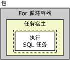
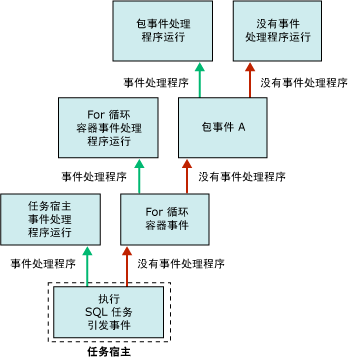

# Integration Services (SSIS) 事件处理程序

[!INCLUDE[ssis-appliesto](../includes/ssis-appliesto-ssvrpluslinux-asdb-asdw-xxx.md)]

  在运行时，可执行文件（包以及 Foreach 循环容器、For 循环容器、序列容器和任务宿主容器）会引发事件。 例如，错误发生时会引发 OnError 事件。 可以为这些事件创建自定义事件处理程序，以扩展包的功能并使包在运行时更容易管理。 事件处理程序可以执行诸如下列任务：  
  
-   当包或任务运行完成时清除临时数据存储。  
  
-   在包运行前检索系统信息，以便评估资源可用性。  
  
-   在引用表中的查找失败时刷新表中的数据。  
  
-   当发生错误或警告时，或者当任务失败时，发送电子邮件。  
  
 如果事件没有事件处理程序，则将该事件提升到包中容器层次结构中的上一级容器。 如果此容器具有事件处理程序，则该事件处理程序当事件发生时运行。 如果没有，则将该事件提升到容器层次结构中的上一级容器。  
  
 以下关系图显示具有 For 循环容器的简单包，该容器包含一个执行 SQL 任务。  
  
   
  
 只有包具有事件处理程序，用于处理其 **OnError** 事件。 如果执行 SQL 任务运行时发生错误，包的 **OnError** 事件处理程序就会运行。 以下关系图显示导致包的 **OnError** 事件处理程序执行的调用序列。  
  
   
  
 事件处理程序是事件处理程序集的成员，所有容器都包含此事件处理程序集。 如果使用 [!INCLUDE[ssIS](../includes/ssis-md.md)] 设计器创建包，就可以在 **设计器的** “包资源管理器” **选项卡上的** “事件处理程序” [!INCLUDE[ssIS](../includes/ssis-md.md)] 文件夹中看到事件处理程序集的成员。  
  
 可以采用下列方法配置事件处理程序容器：  
  
-   指定事件处理程序的名称和说明。  
  
-   指示事件处理程序是否运行，事件处理程序失败时包是否失败，以及事件处理程序失败前可发生的错误数。  
  
-   指定返回执行结果，而不是事件处理程序在运行时返回的实际执行结果。  
  
-   指定事件处理程序的事务选项。  
  
-   指定事件处理程序使用的日志记录模式。  
  
## 事件处理程序内容  
 创建事件处理程序与生成包类似；事件处理程序具有多个任务和容器，这些任务和容器按照一定顺序组织成控制流，事件处理程序也可以包含多个数据流。 [!INCLUDE[ssIS](../includes/ssis-md.md)] 设计器包含 **“事件处理程序”** 选项卡，用于创建自定义事件处理程序。  
  
 还可以采用编程方式创建事件处理程序。 有关详细信息，请参阅 [以编程方式处理事件](../integration-services/building-packages-programmatically/handling-events-programmatically.md)。  
  
## 运行时事件  
 下表列出 [!INCLUDE[ssISnoversion](../includes/ssisnoversion-md.md)] 提供的事件处理程序，并介绍导致事件处理程序运行的运行时事件。  
  
|事件处理程序|事件|  
|-------------------|-----------|  
|**OnError**|**OnError** 事件的事件处理程序。 此事件在发生错误时由可执行文件引发。|  
|**OnExecStatusChanged**|**OnExecStatusChanged** 事件的事件处理程序。 此事件在其执行状态更改时由可执行文件引发。|  
|**OnInformation**|**OnInformation** 事件的事件处理程序。 此事件在可执行文件的验证和执行期间引发以报告信息。 此事件仅传递信息，不传递错误或警告。|  
|**OnPostExecute**|**OnPostExecute** 事件的事件处理程序。 此事件由可执行文件在其运行完成后立即引发。|  
|**OnPostValidate**|**OnPostValidate** 事件的事件处理程序。 此事件由可执行文件在其验证完成时引发。|  
|**OnPreExecute**|**OnPreExecute** 事件的事件处理程序。 此事件由可执行文件在其运行前引发。|  
|**OnPreValidate**|**OnPreValidate** 事件的事件处理程序。 此事件由可执行文件在其验证开始时引发。|  
|**OnProgress**|**OnProgress** 事件的事件处理程序。 此事件由可执行文件在其完成可度量的进度时引发。|  
|**OnQueryCancel**|**OnQueryCancel** 事件的事件处理程序。 此事件由可执行文件引发，以确定它是否应停止运行。|  
|**OnTaskFailed**|**OnTaskFailed** 事件的事件处理程序。 此事件由任务在其失败时引发。|  
|**OnVariableValueChanged**|**OnVariableValueChanged** 事件的事件处理程序。 此事件在变量值更改时由可执行文件引发。 此事件由此变量的可执行文件引发。 如果将变量的 **RaiseChangeEvent** 属性设置为 **False**，则不引发此事件。 有关详细信息，请参阅 [Integration Services (SSIS) 变量](../integration-services/integration-services-ssis-variables.md)。|  
|**OnWarning**|**OnWarning** 事件的事件处理程序。 此事件在发生警告时由可执行文件引发。|  

## 在包中添加事件处理程序
在运行时，容器和任务引发事件。 您可以创建自定义事件处理程序，这些程序在事件被引发时运行工作流，以对事件做出响应。 例如，您可创建一个事件处理程序，在任务失败时发送电子邮件。  
  
 事件处理程序与包类似。 事件处理程序可以像包一样为变量提供作用域，并且包含控制流和可选数据流。 您可以为包、Foreach 循环容器、For 循环容器和序列容器以及所有的任务生成事件处理程序。  
  
 您可以使用 **设计器中的** “事件处理程序” [!INCLUDE[ssIS](../includes/ssis-md.md)] 选项卡的设计图面来创建事件处理程序。  
  
 当 **“事件处理程序”** 选项卡活动时， **设计器中的工具箱的** “控制流项” **和** “维护计划中的任务” [!INCLUDE[ssIS](../includes/ssis-md.md)] 节点包含用于生成事件处理程序中控制流的任务和容器。 **“数据流源”** 、 **“转换”** 和 **“数据流目标”** 节点包含用于生成事件处理程序中数据流的数据源、转换和目标。 有关详细信息，请参阅 [Control Flow](../integration-services/control-flow/control-flow.md) 和 [Data Flow](../integration-services/data-flow/data-flow.md)。  
  
 **“事件处理程序”** 选项卡也包含 **“连接管理器”** 区域，在这里可创建并修改事件处理程序用来连接到服务器和数据源的连接管理器。 有关详细信息，请参阅 [创建连接管理器](https://msdn.microsoft.com/library/6ca317b8-0061-4d9d-b830-ee8c21268345)。  
  
### 在“事件处理程序”选项卡上添加事件处理程序  
  
1.  在 [!INCLUDE[ssBIDevStudioFull](../includes/ssbidevstudiofull-md.md)]中，打开包含所需包的 [!INCLUDE[ssISnoversion](../includes/ssisnoversion-md.md)] 项目。  
  
2.  在解决方案资源管理器中，双击该包将其打开。  
  
3.  单击 **“事件处理程序”** 选项卡。  
  
       
  
     在事件处理程序中创建控制流和数据流类似于在包中创建控制流和数据流。 有关详细信息，请参阅 [Control Flow](../integration-services/control-flow/control-flow.md) 和 [Data Flow](../integration-services/data-flow/data-flow.md)。  
  
4.  在 **“可执行文件”** 列表中，选择要为其创建事件处理程序的可执行文件。  
  
5.  在 **“事件处理程序”** 列表中，选择要生成的事件处理程序。  
  
6.  单击 **“事件处理程序”** 选项卡的设计图面上的链接。  
  
7.  将控制流项添加到事件处理程序，并且通过将优先约束从一个控制流项拖到另一控制流项，使用该约束来连接这些控制流项。 有关详细信息，请参阅 [Control Flow](../integration-services/control-flow/control-flow.md)。  
  
8.  还可以根据需要添加数据流任务，并且在 **“数据流”** 选项卡的设计图面上，为事件处理程序创建数据流。 有关详细信息，请参阅 [Data Flow](../integration-services/data-flow/data-flow.md)。  
  
9. 在 **“文件”** 菜单上，单击 **“保存选定项”** 以保存包。  

## 设置事件处理程序的属性  
 可以在 **的** “属性” [!INCLUDE[ssBIDevStudioFull](../includes/ssbidevstudiofull-md.md)] 窗口中设置属性，或以编程方式设置属性。  
  
 有关如何在 [!INCLUDE[ssBIDevStudioFull](../includes/ssbidevstudiofull-md.md)]中设置这些属性的信息，请参阅 [设置任务或容器的属性](https://msdn.microsoft.com/library/52d47ca4-fb8c-493d-8b2b-48bb269f859b)。  
  
 有关如何以编程方式设置这些属性的信息，请参阅 <xref:Microsoft.SqlServer.Dts.Runtime.DtsEventHandler>。  
  
## Related Tasks  
 有关如何向包中添加事件处理程序的信息，请参阅[在包中添加事件处理程序](https://msdn.microsoft.com/library/5e56885d-8658-480a-bed9-3f2f8003fd78)。  
  
  
