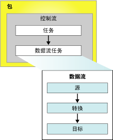

# Integration Services (SSIS) 包
  包是一个有组织的集合，其中可包括连接、控制流元素、数据流元素、事件处理程序、变量、参数和配置，您可使用 [!INCLUDE[ssNoVersion](../includes/ssnoversion-md.md)] [!INCLUDE[ssISnoversion](../includes/ssisnoversion-md.md)] 提供的图形设计工具将这些对象组合到包中，或以编程方式生成包含这些对象的包。  然后将完成的包保存到 [!INCLUDE[ssNoVersion](../includes/ssnoversion-md.md)]、 [!INCLUDE[ssIS](../includes/ssis-md.md)] 包存储区或文件系统中，还可以将 ssISnoversion 项目部署到 [!INCLUDE[ssIS](../includes/ssis-md.md)] 服务器。 包是可被检索、执行和保存的工作单元。  
  
 首次创建包后，包是一个空对象，不能实现任何功能。 若要向包添加功能，可向包添加一个控制流，还可选择添加一个或多个数据流。  
  
 以下关系图显示了一个简单包，其中包含一个带有数据流任务的控制流，而数据流任务中又包含数据流。  
  
   
  
 创建基本包后，可添加高级功能（如日志记录和变量）来扩展包功能。 有关详细信息，请参阅“扩展包功能的对象”部分。  
  
 然后，可对完成的包进行配置，通过设置包级属性来实现安全性、从检查点重新启动包或将事务合并到包工作流中等功能。 有关详细信息，请参阅“支持扩展功能的属性”部分。  
  
## 包的内容  
 **任务和容器（控制流）。** 控制流包含一个或多个在包运行时执行的任务和容器。 若要控制包控制流中的任务或容器的运行顺序或定义运行条件，可使用优先约束来连接包中的任务和容器。 还可以将任务和容器分组为子集，并在包控制流中将其作为一个单元重复运行。 有关详细信息，请参阅 [Control Flow](../integration-services/control-flow/control-flow.md)。  
  
 **数据源和目标（数据流）。** 数据流包含提取和加载数据的源和目标、修改和扩展数据的转换，以及链接源、转换和目标的路径。 包控制流中必须包含数据流任务，您才能将数据流添加到包中。 数据流任务是 [!INCLUDE[ssIS](../includes/ssis-md.md)] 包中用来创建数据流、对数据流进行排序及运行数据流的可执行文件。 对于包中的每个数据流任务，都为其打开了一个单独的数据流引擎实例。 有关详细信息，请参阅 [Data Flow Task](../integration-services/control-flow/data-flow-task.md) 和 [Data Flow](../integration-services/data-flow/data-flow.md)。  
  
 **连接管理器（连接）。** 包通常至少包含一个连接管理器。 连接管理器是包和数据源之间的链接，用于定义连接字符串以便访问包中的任务、转换和事件处理程序所使用的数据。 [!INCLUDE[ssISnoversion](../includes/ssisnoversion-md.md)] 包含多种数据源连接类型，例如文本和 XML 文件、关系数据库以及 [!INCLUDE[ssASnoversion](../includes/ssasnoversion-md.md)] 数据库和项目。 有关详细信息，请参阅 [Integration Services (SSIS) 连接](../integration-services/connection-manager/integration-services-ssis-connections.md)。  
  
## 扩展包功能的对象  
 包中还可包含其他提供高级功能或扩展现有功能的对象，如事件处理程序、配置、日志记录和变量。  
  
### 事件处理程序  
 事件处理程序是为响应包、任务或容器所引发的事件而运行的工作流。 例如，当发生预执行事件或出现错误时，可使用一个事件处理程序来检查磁盘空间，并向管理员发送电子邮件来报告可用的空间或错误信息。 事件处理程序的构造方式与包类似，它具有控制流和数据流（可选）。 事件处理程序可添加到包中的各个任务或容器。 有关详细信息，请参阅 [Integration Services (SSIS) 事件处理程序](../integration-services/integration-services-ssis-event-handlers.md)。  
  
### 配置  
 配置是一组属性值对，它定义当包运行时包及其任务、容器、变量、连接和事件处理程序的属性。 使用配置，不必对包进行修改即可更新属性。 包运行时，将加载配置信息并更新属性值。 例如，配置可更新连接的连接字符串。  
  
 将包安装到另一台不同的计算机时，系统会先保存配置，然后将配置与包一起进行部署。 当安装包时可更新配置中的值以支持不同环境中的该包。 有关详细信息，请参阅 [创建包配置](../integration-services/packages/create-package-configurations.md)。  
  
### 日志记录和日志提供程序  
 日志是在包运行时所收集的有关包的信息集合。 例如，日志可提供包运行的起始时间和结束时间。 日志提供程序定义了包及其容器和任务在记录运行时信息时可使用的目标类型和格式。 日志与包相关联，但包中的任务和容器可将信息记录到任何包日志中。 [!INCLUDE[ssISnoversion](../includes/ssisnoversion-md.md)] 包含了多种用于日志记录的内置日志提供程序。 例如， [!INCLUDE[ssISnoversion](../includes/ssisnoversion-md.md)] 中包含了用于 [!INCLUDE[ssNoVersion](../includes/ssnoversion-md.md)] 和文本文件的日志提供程序。 您还可以创建自定义日志提供程序并将其用于日志记录。 有关详细信息，请参阅 [Integration Services (SSIS) 日志记录](../integration-services/performance/integration-services-ssis-logging.md)。  
  
### 变量  
 [!INCLUDE[ssISnoversion](../includes/ssisnoversion-md.md)] 支持系统变量和用户定义的变量。 系统变量在运行时提供有关包对象的有用信息；用户定义的变量支持包中的自定义方案。 两种类型的变量都可在表达式、脚本和配置中使用。  
  
 包级变量包括可供包使用的预定义系统变量以及作用域为包的用户定义变量。 有关详细信息，请参阅 [Integration Services (SSIS) 变量](../integration-services/integration-services-ssis-variables.md)。  
 
### Parameters  
 [!INCLUDE[ssISnoversion](../includes/ssisnoversion-md.md)] 参数可用于在包执行时向包内的属性赋值。  您可以在项目级别创建“项目参数”  ，在包级别创建“包参数”。 项目参数可用于向项目中的一个或多个包提供项目接收的任何外部输入。 利用包参数，您不必编辑和重新部署包就可以修改包执行。 有关详细信息，请参阅 [Integration Services (SSIS) 参数](../integration-services/integration-services-ssis-package-and-project-parameters.md)。  
 
## 支持扩展功能的包属性  
 可对包对象进行配置以支持更多功能（如在检查点重新启动包、使用数字证书对包进行签名、设置包保护级别和通过使用事务确保数据完整性）。  
  
### 重新启动包  
 包中包含检查点属性，在包的一个或多个任务失败时，您可以使用该属性来重新启动包。 例如，如果包中有两个用于更新两个不同的表的数据流任务，若第二个任务失败了，则您可重新运行包且不重复第一个数据流任务。 重新启动包可为长时间运行的包节省时间。 重新启动意味着可从失败的任务启动包，而无需重新运行整个包。 有关详细信息，请参阅 [Restart Packages by Using Checkpoints](../integration-services/packages/restart-packages-by-using-checkpoints.md)。  
  
### 保护包的安全  
 可使用数字签名对包进行签名，并使用密码或用户密钥对包进行加密。 数字签名可以验证包源的身份。 但是，还必须将 [!INCLUDE[ssISnoversion](../includes/ssisnoversion-md.md)] 配置为在加载包时检查数字签名。 有关详细信息，请参阅 [使用数字签名标识包的源](../integration-services/security/identify-the-source-of-packages-with-digital-signatures.md) 和 [对包中敏感数据的访问控制](../integration-services/security/access-control-for-sensitive-data-in-packages.md)。  
  
### 支持事务  
 为包设置一个事务属性可使包中的任务、容器和连接加入到该事务中。 事务属性可确保包及其元素作为一个单元成功或失败。 包还可运行其他包并可在事务中注册其他包，这样便可将多个包作为单个工作单元运行。 有关详细信息，请参阅 [Integration Services 事务](../integration-services/integration-services-transactions.md)。  
  
## 包可用的自定义日志项  
 下表列出了包的自定义日志项。 有关详细信息，请参阅 [Integration Services (SSIS) 日志记录](../integration-services/performance/integration-services-ssis-logging.md)。  
  
|日志项|Description|  
|---------------|-----------------|  
|**PackageStart**|指示包开始运行。   注意：此日志项自动写入日志。 无法排除它。|  
|**PackageEnd**|指示包已完成。   注意：此日志项自动写入日志。 无法排除它。|  
|**诊断**|提供影响包执行的系统配置的相关信息，例如，可并发运行的可执行文件数。|  
  
## 设置包的属性  
 可以在 **的** “属性” [!INCLUDE[ssBIDevStudioFull](../includes/ssbidevstudiofull-md.md)] 窗口中设置属性，或以编程方式设置属性。  
  
 有关如何使用 [!INCLUDE[ssBIDevStudioFull](../includes/ssbidevstudiofull-md.md)]设置这些属性的信息，请参阅 [设置包属性](../integration-services/set-package-properties.md)。  
  
 有关如何以编程方式设置这些属性的信息，请参阅 <xref:Microsoft.SqlServer.Dts.Runtime.Package>。  

## 重用现有的包作为模板  
 包经常用作模板，以便通过它生成可共享基本功能的包。 可以生成基本包然后复制它，也可以将包指定为模板。 例如，一个下载并复制文件然后提取数据的包可能会在枚举文件夹内文件的 Foreach 循环中包括 FTP 和文件系统任务。 它还可能包括平面文件连接管理器以访问数据，并包括平面文件源以提取数据。 数据的目标会发生变化，在从基本包复制之后，目标会添加到每个新包中。 还可以创建包，然后使用它们作为添加到 [!INCLUDE[ssISnoversion](../includes/ssisnoversion-md.md)] 项目中的新包的模板。 有关详细信息，请参阅 [Create Packages in SQL Server Data Tools](../integration-services/create-packages-in-sql-server-data-tools.md)。  
  
 通过编程或使用 SSIS 设计器第一次创建包时，会将 GUID 添加到它的 **ID** 属性中，并在它的 **Name** 属性中添加名称。 如果通过复制现有包或使用模板包来创建新包，那么也会复制名称和 GUID。 如果使用日志记录，则这可能是个问题，因为包的 GUID 和名称将写入日志，以标识被记录的信息所属的包。 因此，应当更新新包的名称和 GUID，以便帮助将它们与源包区分开来，并且能够在日志数据中的区分彼此。  
  
 若要更改包 GUID，需要在 [!INCLUDE[ssBIDevStudioFull](../includes/ssbidevstudiofull-md.md)]的“属性”窗口中的“ID”属性内重新生成 GUID。 若要更改包名称，可以在“属性”窗口中更新 **Name** 属性的值。 还可以使用 **dtutil** 命令提示符，或通过编程更新 GUID 和名称。 有关详细信息，请参阅 [设置包属性](../integration-services/set-package-properties.md) 和 [dtutil 实用工具](../integration-services/dtutil-utility.md)。  
  
## Related Tasks  
 [!INCLUDE[ssISnoversion](../includes/ssisnoversion-md.md)] 对象模型之外， [!INCLUDE[ssIS](../includes/ssis-md.md)] 还包含了两个图形工具： [!INCLUDE[ssNoVersion](../includes/ssnoversion-md.md)] 设计器和 [!INCLUDE[ssIS](../includes/ssis-md.md)] 导入和导出向导。 有关详细信息，请参阅下列主题。  
  
-   [使用 SQL Server 导入和导出向导导入和导出数据](../integration-services/import-export-data/import-and-export-data-with-the-sql-server-import-and-export-wizard.md)  
  
-   [在 SQL Server Data Tools 中创建包](../integration-services/create-packages-in-sql-server-data-tools.md)  
  
-   请参阅开发者指南中的[以编程方式生成包](../integration-services/building-packages-programmatically/building-packages-programmatically.md)。 
  
  
