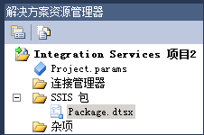

# Integration Services (SSIS) 项目和解决方案
  [!INCLUDE[ssNoVersion](../includes/ssnoversion-md.md)] 提供 [!INCLUDE[ssBIDevStudioFull](../includes/ssbidevstudiofull-md.md)] 用于开发 [!INCLUDE[ssISnoversion](../includes/ssisnoversion-md.md)] 包。  
  
[!INCLUDE[ssISnoversion](../includes/ssisnoversion-md.md)] 包驻留在项目中。 若要创建和使用 [!INCLUDE[ssISnoversion](../includes/ssisnoversion-md.md)] 项目，必须安装 [!INCLUDE[ssBIDevStudioFull](../includes/ssbidevstudiofull-md.md)] 环境。 有关详细信息，请参阅 [安装 Integration Services](../integration-services/install-windows/install-integration-services.md)。  
  
 在 [!INCLUDE[ssISnoversion](../includes/ssisnoversion-md.md)] 中创建新的 [!INCLUDE[ssBIDevStudioFull](../includes/ssbidevstudiofull-md.md)]项目时， **“新建项目”** 对话框包含一个 **“Integration Services 项目”** 模板。 此项目模板创建包含一个包的新项目。  
  
## “项目和解决方案”  
 项目存储在解决方案中。 可以先创建解决方案，然后向该解决方案添加 [!INCLUDE[ssISnoversion](../includes/ssisnoversion-md.md)] 项目。 如果不存在解决方案， [!INCLUDE[ssBIDevStudioFull](../includes/ssbidevstudiofull-md.md)] 将在您首次创建项目时自动创建解决方案。 解决方案可以包含多个不同类型的项目。  
  
> [!TIP]  
>  默认情况下，在 [!INCLUDE[ssBIDevStudio](../includes/ssbidevstudio-md.md)] 中创建新项目时，“解决方案资源管理器”窗格不会显示该解决方案。 若要更改此默认行为，请在 **“工具”** 菜单上单击 **“选项”**。 在 **“选项”** 对话框中，展开 **“项目和解决方案”**，然后单击 **“常规”**。 在 **“常规”** 页上，选择 **“总是显示解决方案”**。  

## 解决方案包含项目  
 解决方案是对开发端到端商业解决方案时所使用的项目进行分组和管理的容器。 使用解决方案，您可以将多个项目作为一个单元处理，并将构成商业解决方案的一个或多个相关项目组合在一起。  
  
 解决方案可以包含不同类型的项目。 如果要用 [!INCLUDE[ssIS](../includes/ssis-md.md)] 设计器创建 [!INCLUDE[ssISnoversion](../includes/ssisnoversion-md.md)] 包，请使用 [!INCLUDE[ssISnoversion](../includes/ssisnoversion-md.md)] 所提供的解决方案中的 [!INCLUDE[ssBIDevStudioFull](../includes/ssbidevstudiofull-md.md)]项目。  
  
 创建新的解决方案时， [!INCLUDE[ssBIDevStudioFull](../includes/ssbidevstudiofull-md.md)] 将在解决方案资源管理器中添加一个解决方案文件夹，并创建扩展名为 .sln 和 .suo 的文件：  
  
-   *.sln 文件包含有关解决方案配置的信息，并列出解决方案中的项目。  
  
-   *.suo 文件包含有关使用解决方案的首选项的信息。  
  
 当您创建新项目时 [!INCLUDE[ssBIDevStudioFull](../includes/ssbidevstudiofull-md.md)] 将自动创建解决方案，但您也可创建空解决方案，然后再添加项目。  
   
## Integration Services 项目包含包  
 项目是您开发 [!INCLUDE[ssISnoversion](../includes/ssisnoversion-md.md)] 包的容器。  
  
 在 [!INCLUDE[ssBIDevStudioFull](../includes/ssbidevstudiofull-md.md)]中， [!INCLUDE[ssISnoversion](../includes/ssisnoversion-md.md)] 项目可以存储与该包相关的文件并对这些文件进行分组。 例如，项目包括创建特定提取、传输和加载 (ETL) 解决方案所需的文件。  
  
 在创建 [!INCLUDE[ssISnoversion](../includes/ssisnoversion-md.md)] 项目之前，应熟悉此类项目的基本内容。 在了解项目包含的内容之后，即可开始创建和使用 [!INCLUDE[ssISnoversion](../includes/ssisnoversion-md.md)] 项目。  
  
## Integration Services 项目中的文件夹  
 下面的关系图显示 [!INCLUDE[ssISnoversion](../includes/ssisnoversion-md.md)] 中一个 [!INCLUDE[ssBIDevStudioFull](../includes/ssbidevstudiofull-md.md)]项目中的文件夹。  
  
   
  
 下表介绍 [!INCLUDE[ssISnoversion](../includes/ssisnoversion-md.md)] 项目中出现的文件夹。  
  
|文件夹|Description|  
|------------|-----------------|  
|[!INCLUDE[ssIS](../includes/ssis-md.md)] 包|包含包。 有关详细信息，请参阅 [Integration Services (SSIS) 包](../integration-services/integration-services-ssis-packages.md)。|  
|杂项|包含除包文件以外的文件。|  
  
## Integration Services 项目中的文件  
 向解决方案添加新的或现有 [!INCLUDE[ssISnoversion](../includes/ssisnoversion-md.md)] 项目时， [!INCLUDE[ssBIDevStudioFull](../includes/ssbidevstudiofull-md.md)] 创建具有扩展名 .dtproj 、.dtproj.user 和 .database 的项目文件。  
  
-   *.dtproj 文件包含有关项目配置以及像包这类项的信息。  
  
-   *.dtproj.user 文件包含有关使用项目的首选项的信息。  
  
-   *.database 文件包含 [!INCLUDE[ssBIDevStudioFull](../includes/ssbidevstudiofull-md.md)] 打开 [!INCLUDE[ssISnoversion](../includes/ssisnoversion-md.md)] 项目所需的信息。  
  
## Integration Services 项目中面向的版本  
 在 [!INCLUDE[ssBIDevStudioFull](../includes/ssbidevstudiofull-md.md)]中，可以创建、维护和运行面向 SQL Server 2016、SQL Server 2014 或 SQL Server 2012 的包。  
  
 在解决方案资源管理器中，右键单击 Integration Services 项目并选择“属性”以打开该项目的属性页。 在“配置属性”  的“常规” 选项卡上，选择“TargetServerVersion”  属性，然后选择 SQL Server 2016、SQL Server 2014 或 SQL Server 2012。  
  
   
 
## 创建新的 Integration Services 项目  
  
1.  打开 [!INCLUDE[ssBIDevStudioFull](../includes/ssbidevstudiofull-md.md)]。  
  
2.  在 **“文件”** 菜单上，指向 **“新建”**，再单击 **“项目”**。  
  
3.  在 **“新建项目”** 对话框中，从 **“模板”** 窗格选择 **“Integration Services 项目”** 模板。  
  
     **“Integration Services 项目”** 模板创建包含单个空包的 [!INCLUDE[ssISnoversion](../includes/ssisnoversion-md.md)] 项目。  
  
4.  （可选）编辑项目名称和位置。  
  
     解决方案名称被自动更新，以匹配项目名称。  
  
5.  若要为解决方案文件创建单独的文件夹，请选择 **“创建解决方案的目录”**。 这是默认选项。  
  
6.  如果计算机上安装了源代码管理软件，请选择 **“添加到源代码管理”**  ，以将项目与源代码管理关联起来。  
  
7.  如果源代码管理软件是 [!INCLUDE[msCoName](../includes/msconame-md.md)] Visual SourceSafe， **“Visual SourceSafe 登录”** 对话框就会打开。 在 **“Visual SourceSafe 登录”**对话框中，提供用户名、密码和 [!INCLUDE[msCoName](../includes/msconame-md.md)] Visual SourceSafe 数据库的名称。 单击 **“浏览”** 查找数据库。  
  
    > **注意：**若要查看和更改选定的源代码管理插件以及配置源代码管理环境，请单击“工具”菜单上的“选项”，然后展开“源代码管理”节点。  
  
8.  单击“确定”  ，将解决方案添加到 **解决方案资源管理器** ，并将项目添加到解决方案。  
  
## 选择项目的目标版本及其包  
  
1.  在解决方案资源管理器中，右键单击 Integration Services 项目并选择“属性”  以打开该项目的属性页。  
  
2.  在“配置属性”  的“常规” 选项卡上，选择“TargetServerVersion”  属性，然后选择 SQL Server 2016、SQL Server 2014 或 SQL Server 2012。  
  
       
  
 你可以创建、维护和运行面向 SQL Server 2016、SQL Server 2014 或 SQL Server 2012 的包。  

## 使用导入项目向导导入现有项目
  
1.  在 [!INCLUDE[vsprvs](../includes/vsprvs-md.md)] 中的“文件”菜单上，单击“新建” > “项目”。  
  
2.  在 **“新建项目”** 窗口的 **“已安装的模板”** 区域中，展开 **“商业智能”**，然后单击 **“Integration Services”**。  
  
3.  从项目类型列表中选择 **“Integration Services 导入项目向导”** 。  
  
4.  在 **“名称”** 文本框中为即将创建的新项目键入名称。  
  
5.  在 **“位置”** 文本框中键入项目的路径或位置，或者单击 **“浏览”** 选择一个位置。  
  
6.  在 **“解决方案名称”** 文本框中键入解决方案的名称。  
  
7.  单击 **“确定”** 启动 **“Integration Services 导入项目向导”** 对话框。  
  
8.  单击 **“下一步”** 切换到 **“选择源”** 页。  
  
9. 如果要从 **.ispac** 文件导入，请在 **“路径”** 文本框中键入包含文件名的路径。 单击 **“浏览”** 导航到要存储解决方案的文件夹，在 **“文件名”** 文本框中键入文件名，然后单击 **“打开”**。  
  
     如果要从 **“Integration Services 目录”**导入，请在 **“服务器名称”** 文本框中键入数据库实例名称，或者单击 **“浏览”** 选择包含该目录的数据库实例。  
  
     单击 **“路径”** 文本框旁边的 **“浏览”** ，展开目录中的文件夹，选择要导入的项目，然后单击 **“确定”**。  
  
     单击 **“下一步”** 切换到 **“查看”** 页。  
  
10. 查看信息，然后单击 **“导入”** 以基于您所选的现有项目创建一个项目。  
  
11. 可选：单击 **“保存报表”** 将结果保存到文件中。  
  
12. 单击 **“关闭”** 以关闭 **“Integration Services 导入项目向导”** 对话框。  

## 向解决方案添加项目 
 在添加项目时，可以让 [!INCLUDE[ssISnoversion](../includes/ssisnoversion-md.md)] 创建新的空白项目，或者你可以添加已为其他解决方案创建的项目。 仅当现有解决方案在 [!INCLUDE[ssBIDevStudioFull](../includes/ssbidevstudiofull-md.md)]中可见时，才能向该解决方案中添加项目。  
  
### 向解决方案添加新项目  
  
1.  在 [!INCLUDE[ssBIDevStudioFull](../includes/ssbidevstudiofull-md.md)]中，打开要添加新 [!INCLUDE[ssISnoversion](../includes/ssisnoversion-md.md)] 项目的解决方案，然后进行下列操作之一：  
  
    -   右键单击该解决方案，单击“添加”，再单击“新建项目”。  
  
    -   在 **“文件”** 菜单上，指向 **“添加”**，再单击 **“新建项目”**。  
  
2.  在 **“添加新项目”** 对话框中，单击 **“模板”** 窗格中的 **“Integration Services 项目”** 。  
  
3.  或者，编辑项目的名称和位置。  
  
4.  单击“确定” 。  
  
### 向解决方案添加现有项目  
  
1.  在 [!INCLUDE[ssBIDevStudioFull](../includes/ssbidevstudiofull-md.md)]中打开要把现有 [!INCLUDE[ssISnoversion](../includes/ssisnoversion-md.md)] 项目添加到其中的解决方案，并且执行下列操作之一：  
  
    -   右键单击该解决方案，指向“添加”，然后单击“现有项目”。  
  
    -   在 **“文件”** 菜单上，单击 **“添加”**，然后单击 **“现有项目”**。  
  
2.  在 **“添加现有项目”** 对话框中，浏览并找到要添加的项目，然后单击 **“打开”**。  
  
3.  此项目即添加到 **解决方案资源管理器**中的解决方案文件夹中。  
  
## 从解决方案中删除项目
 仅当解决方案在 [!INCLUDE[ssBIDevStudioFull](../includes/ssbidevstudiofull-md.md)]中可见时，才能从解决方案中删除项目。 解决方案可见后，则可以保留一个项目而删除其余所有项目。 只要仅剩余一个项目， [!INCLUDE[ssBIDevStudioFull](../includes/ssbidevstudiofull-md.md)] 就不再显示解决方案文件夹，并且您无法删除最后一个项目。  
   
1.  在 [!INCLUDE[ssBIDevStudioFull](../includes/ssbidevstudiofull-md.md)]中，打开要删除 [!INCLUDE[ssISnoversion](../includes/ssisnoversion-md.md)] 项目的解决方案。  
  
2.  在解决方案资源管理器中，右键单击该项目，然后单击“卸载项目”。  
  
3.  单击 **“确定”** 以确认删除。  

## 向项目添加项  
  
1.  在 [!INCLUDE[ssBIDevStudioFull](../includes/ssbidevstudiofull-md.md)]中，打开包含要添加项的 [!INCLUDE[ssISnoversion](../includes/ssisnoversion-md.md)] 项目的解决方案。  
  
2.  在解决方案资源管理器中，右键单击项目，指向“添加”，并执行下列操作之一：  
  
    -   单击 **“新建项”**，然后从 **“添加新项”** 对话框的 **“模板”** 窗格中选择模板。  
  
    -   单击 **“现有项”**，在 **“添加现有项”** 对话框中浏览，找到要添加到项目中的项，然后单击 **“添加”**。  
  
3.  新项即出现在解决方案资源管理器的相应文件夹中。  

## 复制项目项  
可以在 [!INCLUDE[ssISnoversion](../includes/ssisnoversion-md.md)] 项目内或 [!INCLUDE[ssISnoversion](../includes/ssisnoversion-md.md)] 项目之间复制对象。 您还可以在其他类型的 [!INCLUDE[ssBIDevStudioFull](../includes/ssbidevstudiofull-md.md)] 项目（ [!INCLUDE[ssRSnoversion](../includes/ssrsnoversion-md.md)] 和 [!INCLUDE[ssASnoversion](../includes/ssasnoversion-md.md)]）之间复制对象。 若要在项目之间进行复制，则项目必须是同一个 [!INCLUDE[ssBIDevStudioFull](../includes/ssbidevstudiofull-md.md)] 解决方案的一部分。

1.  在 [!INCLUDE[ssBIDevStudioFull](../includes/ssbidevstudiofull-md.md)]中，打开希望处理的 [!INCLUDE[ssISnoversion](../includes/ssisnoversion-md.md)] 项目或解决方案。  
  
2.  展开要从中复制对象的项目和项文件夹。  
  
3.  右键单击该项，然后单击“复制”。  
  
4.  右键单击要复制到其中的 [!INCLUDE[ssISnoversion](../includes/ssisnoversion-md.md)] 项目，然后单击“粘贴”。  
  
     这些项会自动复制到正确的文件夹中。 如果将项复制到不是包的 [!INCLUDE[ssISnoversion](../includes/ssisnoversion-md.md)] 项目中，则该项将复制到 **“杂项”** 文件夹中。  
     
