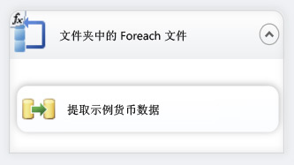
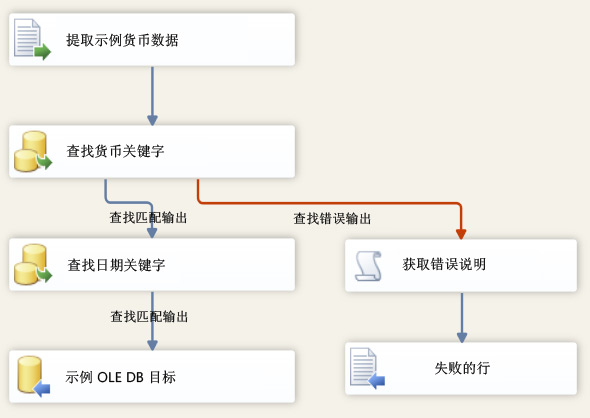

# 课程 6-3-测试第 6 课包
在运行时，包从 VarFolderName 参数获取 Directory 属性的值。  
  
若要验证该包在运行时是否使用新值更新了 Directory 属性，只需执行该包。 由于只向新目录中复制了三个示例数据文件，因此该数据流将只运行三次，而不遍历原始文件夹中的 14 个文件。  
  
## 检查包布局  
测试包之前，应当确保 Lesson 6 包中的控制流和数据流包含下列关系图中显示的对象。 控制流应与第 5 课中的控制流相同。 数据流应与第 5 课中的数据流相同。  
  
**控制流**  
  
  
  
**数据流**  
  
  
  
### 测试第 6 课教程包  
  
1.  在“调试”菜单上，单击“启动调试”。  
  
2.  该包运行完成后，请在“调试”菜单上单击“停止调试”。  
  
## 课程中的下一个任务  
[步骤 4：部署第 6 课包](../integration-services/lesson-6-4-deploying-the-lesson-6-package.md)  
  
  
  

