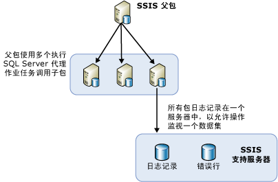

# 使用 SQL Server 代理在远程服务器上平衡包的负载
  在必须运行很多包时，方便的做法是使用其他可用的服务器。 这种当所有包都处于一个父包控制下时使用其他服务器来运行这些包的方法称为负载平衡。 在 [!INCLUDE[ssNoVersion](../../includes/ssnoversion-md.md)] [!INCLUDE[ssISnoversion](../../includes/ssisnoversion-md.md)]中，负载平衡是必须由包的所有者构建的手动过程。 服务器不自动执行负载平衡。 而且，在远程服务器上运行的包必须是整个包，而不能是其他包中的单个任务。  
  
 负载平衡在以下情形下是有用的：  
  
-   包可以同时运行。  
  
-   包很大，并且如果按顺序运行，其运行时间可能超过为处理所留出的时间。  
  
 管理员和体系结构设计师可以确定使用其他服务器来执行处理是否有益于他们的处理过程。  
  
## 负载平衡的图例  
 以下关系图显示了服务器上的父包。 父包包含多个“执行 SQL 作业代理”任务。 父包中的每项任务都会调用远程服务器上的 SQL Server 代理。 这些远程服务器包含 SQL Server 代理作业，而作业中包括调用该服务器上的包的步骤。  
  
   
  
 在此体系结构中的负载平衡所需的步骤不是新的概念。 实际上，负载平衡是通过一种新的方式使用现有概念和通用 SSIS 对象实现的。  
  
## 使用 SQL Server 代理在远程实例上执行包  
 在用于执行远程包的基本体系结构中，中心包驻留在控制其他远程包的 SQL Server 实例上。 关系图显示了此中心包，它的名称是“SSIS Parent”。 驻留此父包的实例控制运行子包的 SQL Server 代理作业的执行。 子包不按受远程服务器上的 SQL Server 代理所控制的固定计划来运行。 实际上，子包在被父包调用时由 SQL Server 代理启动，并运行于 SQL Server 代理所驻留的同一个 SQL Server 实例上。  
  
 必须先配置父包和子包并设置控制子包的 SQL Server 代理作业，然后才能通过使用 SQL Server 代理来运行远程包。 以下部分提供了有关如何创建、配置、运行和维护在远程服务器上运行的包的详细信息。 该过程有下面几个步骤：  
  
-   创建子包并将它们安装在远程服务器上。  
  
-   在将运行包的远程实例上创建 SQL Server 代理作业。  
  
-   创建父包。  
  
-   确定子包的日志记录方案。  
  
 下表提供的链接所指向的主题可引导您完成此过程。  
  
|主题|Description|  
|-----------|-----------------|  
|[子包的实现](../../integration-services/packages/implementation-of-child-packages.md)|介绍包的安装以及将要运行这些包的 SQL Server 代理作业的创建。|  
|[父包的实现](../../integration-services/packages/implementation-of-the-parent-package.md)|介绍如何创建包含很多“执行 SQL Server 代理作业”任务的父包。 每个任务各自运行一个子包。|  
|[远程服务器上的负载平衡包的日志记录](../../integration-services/packages/logging-for-load-balanced-packages-on-remote-servers.md)|介绍远程包的日志记录方案。|  
  
## 相关任务  
 [使用 SQL Server 代理计划包](../../integration-services/packages/schedule-a-package-by-using-sql-server-agent.md)  
  
  