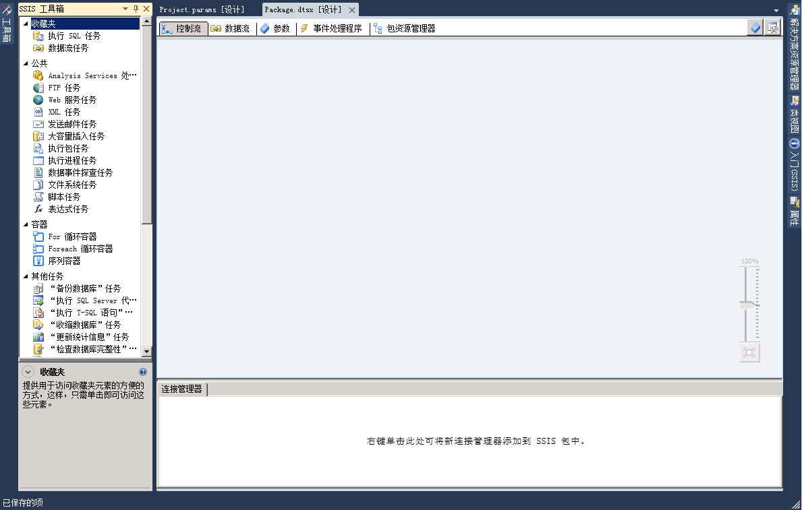

# SSIS 设计器
  [!INCLUDE[ssIS](../includes/ssis-md.md)] 设计器是用于创建和维护 [!INCLUDE[ssISnoversion](../includes/ssisnoversion-md.md)] 包的图形工具。 [!INCLUDE[ssIS](../includes/ssis-md.md)] 设计器作为 [!INCLUDE[ssBIDevStudioFull](../includes/ssbidevstudiofull-md.md)] 项目的一部分，位于 [!INCLUDE[ssISnoversion](../includes/ssisnoversion-md.md)] 中。  
  
 可以使用 [!INCLUDE[ssIS](../includes/ssis-md.md)] 设计器执行下列任务：  
  
-   在包中构造控制流。  
  
-   在包中构造数据流。  
  
-   将事件处理程序添加到包和包对象。  
  
-   查看包内容。  
  
-   在运行时查看包的执行进度。  
  
 下面的关系图显示 [!INCLUDE[ssIS](../includes/ssis-md.md)] 设计器和 **“工具箱”** 窗口。  
  
   
  
 [!INCLUDE[ssISnoversion](../includes/ssisnoversion-md.md)] 还有其他一些用于将功能添加到包的对话框和窗口，而 [!INCLUDE[ssBIDevStudioFull](../includes/ssbidevstudiofull-md.md)] 提供用于配置开发环境及对包进行操作的窗口和对话框。 有关详细信息，请参阅 [Integration Services 用户界面](../integration-services/integration-services-user-interface.md)。  
  
 [!INCLUDE[ssIS](../includes/ssis-md.md)] 设计器不依赖于 [!INCLUDE[ssISnoversion](../includes/ssisnoversion-md.md)] 服务（即管理和监视包的服务），而且在 [!INCLUDE[ssIS](../includes/ssis-md.md)] 设计器中创建或修改包也不需要该服务处于运行状态。 但是，如果在 [!INCLUDE[ssIS](../includes/ssis-md.md)] 设计器打开的情况下停止该服务，则您无法再打开 [!INCLUDE[ssIS](../includes/ssis-md.md)] 设计器提供的对话框，并且可能收到“RPC 服务器不可用”的错误消息。 若要重置 [!INCLUDE[ssIS](../includes/ssis-md.md)] 设计器并继续对包进行操作，就必须关闭设计器，退出 [!INCLUDE[ssBIDevStudioFull](../includes/ssbidevstudiofull-md.md)]，然后重新打开 [!INCLUDE[ssBIDevStudioFull](../includes/ssbidevstudiofull-md.md)]、 [!INCLUDE[ssISnoversion](../includes/ssisnoversion-md.md)] 项目和包。  
  
## 撤消和重做  
 您可以在 [!INCLUDE[ssIS](../includes/ssis-md.md)] 设计器中撤消或重做最多 20 个操作。 对于包，可以在“控制流”、“数据流”、“事件处理程序”和“参数”选项卡以及“变量”窗口中进行撤消/重做。 对于项目，可以在“项目参数”窗口中进行撤消/重做。  
  
 不能撤消/重做对新的“SSIS 工具箱”所做的更改。  
  
 使用组件编辑器更改组件时，可以将更改作为一个组来撤消和重做，而不是撤消和重做单个更改。 更改组在撤消和重做下拉列表中显示为单个操作。  
  
 若要撤消操作，请单击撤消工具栏按钮、“编辑/撤消”菜单项，或按 Ctrl+Z。 若要恢复操作，请单击恢复工具栏按钮、“编辑/恢复”菜单项或按 CTRL + Y。若要撤消和恢复多项操作，可以单击相应工具栏按钮旁边的箭头，在下拉列表中选中多项操作，然后在该列表中单击。  
  
## SSIS 设计器的部件  
 [!INCLUDE[ssIS](../includes/ssis-md.md)] 设计器有五个永久选项卡：其中四个选项卡分别用于生成包控制流、数据流、参数和事件处理程序，另外一个选项卡用于查看包的内容。 运行时将出现第六个选项卡，显示包在运行时的执行进度以及完成后的执行结果。  
  
 此外， [!INCLUDE[ssIS](../includes/ssis-md.md)] 设计器还包括连接管理器区域，用于添加和配置包连接到数据所使用的连接管理器。  
  
### “控制流”选项卡  
 若要构造包中的控制流，即可在 **“控制流”** 选项卡的设计图面进行。先将所需项从 **“工具箱”** 逐个拖动到设计图面上，然后单击项的图标，将箭头从一项拖动到另一项，如此反复，将这些项连成一个控制流。  
  
 有关详细信息，请参阅 [Control Flow](../integration-services/control-flow/control-flow.md)。  
  
### “数据流”选项卡  
 如果包中包含数据流任务，则可以将数据流添加到包。 在 **“数据流”** 选项卡设计图面上的包中构造数据流。先将所需项从 **“工具箱”** 逐个拖动到设计图面上，然后单击项的图标，将一项的箭头拖动到另一项，如此反复，将这些项连成一个数据流。  
  
 有关详细信息，请参阅 [Data Flow](../integration-services/data-flow/data-flow.md)。  
  
### “参数”选项卡  
 Integration Services (SSIS) 参数可用于在包执行时向包内的属性赋值。 您可以在项目级别创建项目参数，在包级别创建包参数。 项目参数可用于向项目中的一个或多个包提供项目接收的任何外部输入。 利用包参数，您不必编辑和重新部署包就可以修改包执行。 您可以利用此选项卡来管理包参数。  
  
 有关参数的详细信息，请参阅 [Integration Services (SSIS) 参数](integration-services-ssis-package-and-project-parameters.md)。  
  
> **重要说明!!**  参数仅可用于为项目部署模型开发的项目。 因此，仅对于属于配置为使用项目部署模型的项目一部分的包，您才会看到“参数”选项卡。  
  
### “事件处理程序”选项卡  
 在 **“事件处理程序”** 选项卡设计图面上构造包中的事件。在 **“事件处理程序”** 选项卡上选择要为之创建事件处理程序的包或包对象，再选择要与事件处理程序相关联的事件。 一个事件处理程序有一个控制流，如果需要，还可以有多个可选的数据流。  
  
 有关详细信息，请参阅 [Add an Event Handler to a Package](http://msdn.microsoft.com/library/5e56885d-8658-480a-bed9-3f2f8003fd78)。  
  
### “包资源管理器”选项卡  
 包可以很复杂，包括多项任务、连接管理器、变量和其他元素。 在包的资源管理器视图中，可以查看完整的包元素列表。  
  
 有关详细信息，请参阅 [查看包对象](../integration-services/view-package-objects.md)。  
  
### “进度/执行结果”选项卡  
 在包运行过程中， **“进度”** 选项卡显示包的执行进度。 在包运行完毕后， **“执行结果”** 选项卡上就一直显示执行结果。  
  
> **注意：**若要允许或禁止在“进度”选项卡上显示消息，请在“SSIS”菜单上切换“调试进度报告”选项。  
  
#### 连接管理器区域  
 **“连接管理器”** 区域用于添加和修改包使用的连接管理器。 [!INCLUDE[ssISnoversion](../includes/ssisnoversion-md.md)] 包括连接到多种数据源（如文本文件、OLE DB 数据库和 .Net 提供程序）的连接管理器。  
  
 有关详细信息，请参阅 [Integration Services (SSIS) 连接](../integration-services/connection-manager/integration-services-ssis-connections.md)和[创建连接管理器](http://msdn.microsoft.com/library/6ca317b8-0061-4d9d-b830-ee8c21268345)。  
 
## “控制流”选项卡
可以使用 **设计器的** “控制流” [!INCLUDE[ssIS](../includes/ssis-md.md)] 选项卡在 [!INCLUDE[ssISnoversion](../includes/ssisnoversion-md.md)] 包中生成控制流。  
  
 通过将代表 [!INCLUDE[ssIS](../includes/ssis-md.md)] 任务和容器的图形对象从 **“工具箱”** 拖至 **“控制流”** 选项卡的设计图面，再通过将一个对象的连接器拖至另一个对象来连接这些对象，即可创建控制流。 每条连线均代表一个指定任务和容器的运行顺序的优先约束。  
  
 此外，还可以使用 [!INCLUDE[ssIS](../includes/ssis-md.md)] 设计器从 **“控制流”** 选项卡中添加以下功能：  
  
-   执行日志记录  
  
-   创建包配置  
  
-   使用证书对包进行签名  
  
-   管理变量  
  
-   添加批注  
  
-   配置断点  
  
 若要在 [!INCLUDE[ssIS](../includes/ssis-md.md)] 设计器中为单个任务或容器添加这些功能，请在设计图面上右键单击相应的对象，再选择该选项。  
 
## “数据流”选项卡
可以使用 **设计器的** “数据流” [!INCLUDE[ssIS](../includes/ssis-md.md)] 选项卡在 [!INCLUDE[ssISnoversion](../includes/ssisnoversion-md.md)] 包中创建数据流。  
  
 通过将表示源、转换和目标的图形对象从 **“工具箱”** 拖至 **“数据流”** 选项卡的设计图面，再连接这些对象以创建确定转换运行顺序的路径，即可创建数据流。  
  
 右键单击某个路径，再单击“数据查看器”，可以添加数据查看器来查看每个数据流对象前后的数据。  
  
 您还可以使用 [!INCLUDE[ssIS](../includes/ssis-md.md)] 设计器从 **“数据流”** 选项卡中添加以下功能：  
  
-   管理变量  
  
-   添加批注  
  
 若要在 [!INCLUDE[ssIS](../includes/ssis-md.md)] 设计器中添加这些函数，请右键单击设计图面，再选择所需选项。  
 
## “事件处理程序”选项卡
  可以使用 **设计器的** “事件处理程序” [!INCLUDE[ssIS](../includes/ssis-md.md)] 选项卡在 [!INCLUDE[ssISnoversion](../includes/ssisnoversion-md.md)] 包中生成控制流。 事件处理程序可因响应由包、包中的任务或容器所引发的事件而运行。  
  
## 选项  
 **可执行文件**  
 选择要为其生成事件处理程序的可执行文件。 可执行文件可以是包、包中的任务或容器。  
  
 **事件处理程序**  
 选择事件处理程序的类型。 通过从 **“工具箱”**中拖动相应项即可创建事件处理程序。  
  
 **删除**  
 选择一个事件处理程序，再通过单击“删除”将其从包中删除。  
  
 单击此处为可执行文件 \<可执行文件名称\> 创建 \<事件处理程序名称\>  
 单击此项可创建事件处理程序。  
  
 通过将代表 [!INCLUDE[ssIS](../includes/ssis-md.md)] 任务和容器的图形对象从 **“工具箱”** 拖至 **“事件处理程序”** 选项卡的设计图面，再通过使用优先约束定义其运行顺序来连接这些对象，即可创建控制流。  
  
 此外，通过右键单击设计图面，然后在菜单上单击“添加批注”，以添加批注。  
 
## “包资源管理器”选项卡
可以使用 **设计器的** “包资源管理器” [!INCLUDE[ssIS](../includes/ssis-md.md)] 选项卡查看包中的所有元素的层次结构视图，这些元素包括：配置、连接、事件处理程序、可执行对象（例如任务和容器）、日志提供程序、优先约束和变量。 如果包中包含数据流任务， **“包资源管理器”** 选项卡将包括一个包含数据流组件的层次结构视图的节点。  
  
 可以右键单击某个包元素，再单击“属性”，以在“属性”窗口中显示该元素的属性；或者，也可以右键单击某个包元素，再单击“删除”，以删除该元素。 
 
## “进度”选项卡
在 **中运行** 包时，可以使用 [!INCLUDE[ssIS](../includes/ssis-md.md)] 设计器的 [!INCLUDE[ssISnoversion](../includes/ssisnoversion-md.md)] “进度” [!INCLUDE[ssBIDevStudioFull](../includes/ssbidevstudiofull-md.md)]选项卡查看该包的执行进度。 **“进度”** 选项卡将列出以下内容：验证和执行该包及其可执行文件的开始时间、完成时间和已用时间；包的所有信息和警告；进度通知；包是否成功或失败以及在执行包的过程中生成的所有错误信息。  
  
 若要允许或禁止在 **“进度”** 选项卡上显示消息，请在 **SSIS** 菜单上切换 **“调试进度报告”** 选项。 禁用进度报告有助于在 [!INCLUDE[ssBIDevStudio](../includes/ssbidevstudio-md.md)]中运行复杂包时改进性能。  
  
 包停止运行之后， **“进度”** 选项卡将变为 **“执行结果”** 选项卡。  
 
## 连接管理器区域
包使用连接管理器连接到文件、关系数据库和服务器等数据源。  
  
 使用 **设计器的** 连接管理器 [!INCLUDE[ssIS](../includes/ssis-md.md)] 区域可以添加、删除、修改、重命名以及复制和粘贴连接管理器。  
  
 右键单击此区域，然后在菜单上单击与要执行的任务相应的选项。
 
## 相关任务  
  
-   [在 SQL Server Data Tools 中创建包](../integration-services/create-packages-in-sql-server-data-tools.md)  
  
## 另请参阅  
 [Integration Services 用户界面](../integration-services/integration-services-user-interface.md)  
  
  

