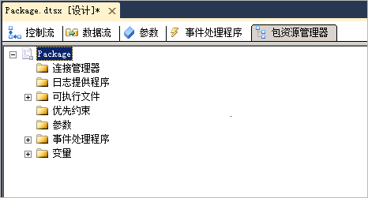

# 查看包对象
  在 [!INCLUDE[ssIS](../includes/ssis-md.md)] 设计器中， **“包资源管理器”** 选项卡提供包的资源管理器视图。 该视图反映了 [!INCLUDE[ssISnoversion](../includes/ssisnoversion-md.md)] 体系结构的容器层次结构。 包容器位于层次结构的顶层，您可以展开包来查看连接、可执行文件、事件处理程序、日志提供程序、优先约束和包中的变量。  
  
 可执行文件（包中的容器和任务）可以包含事件处理程序、优先约束和变量。 [!INCLUDE[ssISnoversion](../includes/ssisnoversion-md.md)] 支持嵌套的容器层次结构，而 For 循环容器、Foreach 循环容器以及序列容器可包含其他可执行文件。  
  
 如果包包含数据流， **包资源管理器** 将列出数据流任务，并包含列有数据流组件的 **“组件”** 文件夹。  
  
 可以从 **“包资源管理器”** 选项卡中删除包中的对象，并访问 **“属性”** 窗口来查看对象属性。  
  
 下面的关系图显示一个简单包的树视图。  
  
   
  
## 查看包的结构和内容  
  
1.  在 [!INCLUDE[ssBIDevStudioFull](../includes/ssbidevstudiofull-md.md)]中打开包含要在 [!INCLUDE[ssISnoversion](../includes/ssisnoversion-md.md)] 包资源管理器 **中查看的包的**项目。  
  
2.  单击 **“包资源管理器”** 选项卡。  
  
3.  若要查看 **“变量”**、 **“优先约束”**、 **“事件处理程序”**、 **“连接管理器”**、 **“日志提供程序”**或 **“可执行文件”** 文件夹的内容，请展开每个相应的文件夹。  
  
4.  根据包的结构，展开所有次级文件夹。  
  
## 查看包对象的属性
  
-   右键单击对象，再单击“属性”，打开“属性”窗口。  
  
## 删除包中的对象  
  
-   右键单击对象，再单击“删除”。 
 
## 另请参阅  
 [Integration Services 任务](../integration-services/control-flow/integration-services-tasks.md)   
 [Integration Services 容器](../integration-services/control-flow/integration-services-containers.md)   
 [优先约束](../integration-services/control-flow/precedence-constraints.md)   
 [Integration Services (SSIS) 变量](../integration-services/integration-services-ssis-variables.md)   
 [Integration Services &#40;SSIS &#41;事件处理程序](../integration-services/integration-services-ssis-event-handlers.md)   
 [Integration Services &#40;SSIS &#41;日志记录](../integration-services/performance/integration-services-ssis-logging.md)  
  
  

