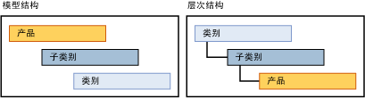

# 派生层次结构 (Master Data Services)
  [!INCLUDE[ssMDSshort](../includes/ssmdsshort-md.md)] 派生层次结构从在模型的实体之间已存在的基于域的属性关系中派生。  
  
 您可以创建一个派生层次结构，以便突出显示模型中任何现有的基于域的属性关系。  
  
## 叶成员将其他叶成员分组  
 在派生层次结构中，一个实体的叶成员用于对其他实体的叶成员进行分组。 派生层次结构基于这些实体之间的关系。 显式层次结构正相反，它仅基于来自一个实体的成员，并且以您指定的任何方式结构化。  
  
 可以更改派生层次结构的结构而不会影响基础数据。 只要关系仍存在于模型中，删除派生层次结构就不会影响您的主数据。  
  
## 显式层次结构与派生层次结构  
 下表显示显式层次结构与派生层次结构之间的一些区别。  
  
> [!NOTE]  
>  此版本的 [!INCLUDE[ssMDSshort](../includes/ssmdsshort-md.md)]已弃用显式层次结构。  
  
|显式层次结构|派生层次结构|  
|--------------------------|-------------------------|  
|结构是由用户定义的|结构是从基于域的属性间的关系派生的|  
|包含单个实体的成员|包含多个实体的成员|  
|使用合并成员对其他成员进行分组|使用来自一个实体的叶成员对其他实体的叶成员进行分组|  
  
## 创建可变深度层次结构  
 有两种建议的方法可创建可变深度层次结构：  
  
-   如果需要所有级别具有相同的属性，请创建一个实体，然后使用基于该实体的基于域的属性创建此实体的递归层次结构。  
  
-   如果需要叶成员一组属性，上级另一组属性，请创建两个实体来生成一个派生层次结构。 对于叶实体，请使用基于父实体的基于域的属性。 对于父实体，请使用基于其自身的基于域的属性。  
  
## 派生层次结构示例  
 在下面的示例中，Product 实体的叶成员按 Subcategory 实体的叶成员进行分组，后者又按 Category 实体的叶成员进行分组。 此层次结构是可能的，因为 Product 实体具有名为 Subcategory 的基于域的属性，并且 Subcategory 实体具有名为 Category 的基于域的属性。  
  
 该层次结构显示如何对成员进行分组。 具有最多成员的实体位于底部。  
  
   
  
 在派生层次结构中，可以突出显示 Product 和 Subcategory 之间的关系，然后突出显示 Subcategory 和 Category 之间的关系。 当您查看此层次结构中的成员时，在树的每个级别中包含同一实体中的成员。  
  
   
  
 这种类型的层次结构防止将成员移到无效的级别。 例如，可以将 Road-650 自行车从子类别“公路自行车”移到另一个子类别“山地车”。 不能直接将 Road-650 移到某个类别下，如 1 {自行车}。 每次在层次结构树中移动成员时，将更改该成员基于域的属性值以反映移动。  
  
## 说明  
 派生层次结构树中的所有成员都按代码排序。 不能更改排序顺序。  
  
 如果成员基于域的属性为空且该属性用于派生层次结构，则该成员不会显示在层次结构中。 创建业务规则来要求填充属性。 有关详细信息，请参阅[需要属性值 &#40;Master Data Services &#41;](../master-data-services/require-attribute-values-master-data-services.md).  
  
## 相关任务  
  
|任务说明|主题|  
|----------------------|-----------|  
|创建新的派生层次结构。|[创建派生层次结构 &#40;Master Data Services &#41;](../master-data-services/create-a-derived-hierarchy-master-data-services.md)|  
|隐藏或删除现有派生层次结构中的级别。|[隐藏或删除派生层次结构 &#40; 中的级别Master Data Services &#41;](../master-data-services/hide-or-delete-levels-in-a-derived-hierarchy-master-data-services.md)|  
|更改现有派生层次结构的名称。|[更改派生层次结构名称 &#40;Master Data Services &#41;](../master-data-services/change-a-derived-hierarchy-name-master-data-services.md)|  
|删除现有派生层次结构。|[删除派生层次结构 &#40;Master Data Services &#41;](../master-data-services/delete-a-derived-hierarchy-master-data-services.md)|  
  
## 相关内容  
  
-   [基于域的属性 &#40;Master Data Services &#41;](../master-data-services/domain-based-attributes-master-data-services.md)  
  
-   [显式层次结构 &#40;Master Data Services &#41;](../master-data-services/explicit-hierarchies-master-data-services.md)  
  
-   [递归层次结构 &#40;Master Data Services &#41;](../master-data-services/recursive-hierarchies-master-data-services.md)  
  
-   [具有显式顶端 &#40; 派生层次结构Master Data Services &#41;](../master-data-services/derived-hierarchies-with-explicit-caps-master-data-services.md)  
  
-   [在派生层次结构 &#40; 中显示多对多关系Master Data Services &#41;](../master-data-services/show-many-to-many-relationships-in-derived-hierarchies-master-data-services.md)  
  
-   [集合 &#40;Master Data Services &#41;](../master-data-services/collections-master-data-services.md)  
  
  
