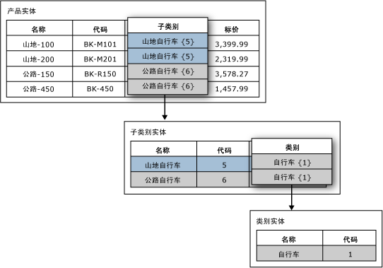

# 基于域的属性 (Master Data Services)

[!INCLUDE [SQL Server - Windows only ASDBMI  ](../includes/applies-to-version/sql-windows-only-asdbmi.md)]

  在 [!INCLUDE[ssMDSshort](../includes/ssmdsshort-md.md)]中，基于域的属性是具有另一个实体成员填充的值的属性。 可以将基于域的属性视为受限制列表，基于域的属性防止用户输入无效的属性值。 若要选择某一属性值，用户必须从列表中进行选择。  
  
## 基于域的属性示例  
 在下图中，Product 实体具有名为 Subcategory 的基于域的属性。 该 Subcategory 属性用来自 Subcategory 实体的值填充。  
  
 Subcategory 实体具有名为 Category 的基于域的属性。 该 Category 属性用来自 Category 实体的值填充。  
  
   
  
## 将同一实体用于多个基于域的属性  
 您可以将同一实体用作多个实体的基于域的属性。 例如，您可以创建名为 YesNoIndicator 的一个实体，该实体具有成员 Yes、No 和 Maybe。 您可以创建名为 InStock 的基于域的属性并且使用 YesNoIndicator 实体作为源。 还可以创建名为 Approved 的另一个基于域的属性并且使用 YesNoIndicator 实体作为源。 只要您希望用户从 YesNoIndicator 实体的成员列表中进行选择，就可以将该实体用作基于域的属性。  
  
## 基于域的属性构成派生层次结构  
 基于域的属性关系是用于派生层次结构的基础。 有关详细信息，请参阅 [派生层次结构 (Master Data Services)](../master-data-services/derived-hierarchies-master-data-services.md)。  
  
## Related Tasks  
  
|任务说明|主题|  
|----------------------|-----------|  
|创建来自现有实体的基于域的新属性。|[创建基于域的属性 (Master Data Services)](../master-data-services/create-a-domain-based-attribute-master-data-services.md)|  
|创建新实体。|[创建实体 (Master Data Services)](../master-data-services/create-an-entity-master-data-services.md)|  
  
## 相关内容  
  
-   [派生层次结构 (Master Data Services)](../master-data-services/derived-hierarchies-master-data-services.md)  
  
-   [属性 (Master Data Services)](../master-data-services/attributes-master-data-services.md)  
  
-   [实体 (Master Data Services)](../master-data-services/entities-master-data-services.md)  
  
  
