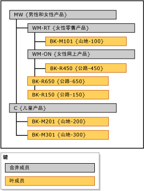

# 显式层次结构 (Master Data Services)
  在 [!INCLUDE[ssMDSshort](../includes/ssmdsshort-md.md)]中，显式层次结构以您指定的任意方式组织一个实体中的成员。 显式层次结构可以是不规则的，并且与派生层次结构不同，该结构不依据基于域的属性关系。  
  
> [!NOTE]  
>  显式层次结构已弃用。  
  
## 合并成员将其他成员分组  
 显式层次结构使用您为将其他成员分组而创建的合并成员。 这些合并成员一次只能属于一个显式层次结构。 显式层次结构还包括关联的实体中的所有叶成员。  
  
 显式层次结构可以是不规则的，这意味着层次结构可以同时在不同级别结束。 每个合并成员下面可以有不限数目的合并成员和叶成员，也可以没有任何成员。 叶成员可以在单个合并成员下，也可以在多个级别的合并成员下。  
  
> [!NOTE]  
>  在创建显式层次结构前，必须为显式层次结构启用了实体。  
  
## 显式层次结构的类型  
 显式层次结构有两种类型：强制和非强制。  
  
### 强制显式层次结构  
 强制显式层次结构要求所有叶成员必须包含在层次结构树中。 默认情况下，所有成员都包含在该树的根上。 您可以根据需要重新排列成员。  
  
### 非强制显式层次结构  
 非强制显式层次结构是所有叶成员都处于系统创建的“未使用”节点中的层次结构。 可以根据需要将成员移出此节点。 其余成员可以保留在 **“未使用”** 节点中。  
  
 使用非强制显式层次结构时，对层次结构所做的任何报告或分析可能与对强制层次结构所做的报告或分析不一致。  
  
## 规则  
 下列规则适用于（强制和非强制）的显式层次结构：  
  
-   每个叶成员只能在层次结构中包含一次。  
  
-   必须在层次结构中包含所有合并成员。  
  
-   合并成员不能在多个显式层次结构中。  
  
-   层次结构树中的合并成员不要求其下面还包含叶成员。  
  
-   如果删除显式层次结构，将删除该层次结构中使用的所有合并成员。  
  
-   如果删除显式层次结构中的合并成员，则将按该合并成员分组的所有叶成员移到根部。  
  
## 显式层次结构与派生层次结构  
 下表显示显式层次结构与派生层次结构之间的一些区别。  
  
|显式层次结构|派生层次结构|  
|--------------------------|-------------------------|  
|结构是由用户定义的|结构是从基于域的属性间的关系派生的|  
|包含单个实体的成员|包含多个实体的成员|  
|使用合并成员对其他成员进行分组|使用来自一个实体的叶成员对其他实体的叶成员进行分组|  
|可以是不规则的|始终包含一致的级别数|  
  
## 显式层次结构示例  
 在下面的示例中，Product 实体包含以下叶成员：BK-M101 {Mountain-100}、BK-M201 {Mountain-200}、BK-M301 {Mountain-300}、BK-R150 {Road-150}、BK-R450 {Road-450} 和 BK-R650 {Road-650}。  
  
 若要在特定的合并点汇总这些叶成员，您可以在 Product 实体中创建合并成员。 在要汇总叶成员的层次结构树的级别中插入合并成员。 对插入合并成员的位置没有限制，但是每个成员（叶成员或合并成员）只能使用一次。  
  
   
  
 合并成员可用于将任何级别的成员分组，叶成员和合并成员按您确定的顺序排序。  
  
## 相关任务  
  
|任务说明|主题|  
|----------------------|-----------|  
|创建新的显式层次结构。|[创建显式层次结构 &#40;Master Data Services &#41;](../master-data-services/create-an-explicit-hierarchy-master-data-services.md)|  
|更改现有显式层次结构的名称。|[更改显式层次结构名称 &#40;Master Data Services &#41;](../master-data-services/change-an-explicit-hierarchy-name-master-data-services.md)|  
|删除现有显式层次结构。|[删除显式层次结构 &#40;Master Data Services &#41;](../master-data-services/delete-an-explicit-hierarchy-master-data-services.md)|  
|||  
  
## 相关内容  
  
-   [派生层次结构 &#40;Master Data Services &#41;](../master-data-services/derived-hierarchies-master-data-services.md)  
  
-   [集合 &#40;Master Data Services &#41;](../master-data-services/collections-master-data-services.md)  
  
  

