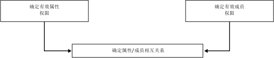
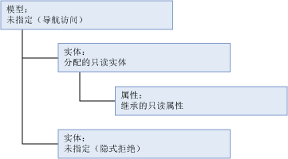
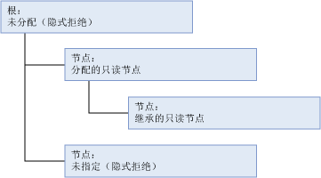
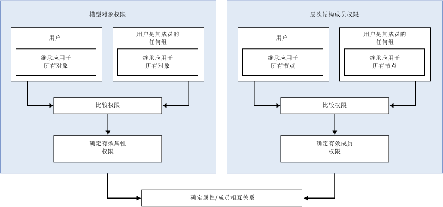

# 如何确定权限 (Master Data Services)

[!INCLUDE[appliesto-ss-xxxx-xxxx-xxx-md-winonly](../includes/appliesto-ss-xxxx-xxxx-xxx-md-winonly.md)]

  在 [!INCLUDE[ssMDSshort](../includes/ssmdsshort-md.md)]中，配置安全性的最简单方式是向用户所属的组分配模型对象权限。  
  
 在以下情况下安全设置变得较为复杂：  
  
-   同时分配了模型对象权限和层次结构成员权限。  
  
-   用户属于多个组，且同时向该用户和多个组分配了权限。  
  
-   用户属于多个组，而且向多个组分配了权限。  
  
## 向单个组或用户分配了权限  
 如果向单个组或用户分配了权限，将基于以下工作流确定权限。  
  
   
  
### 步骤 1：确定有效属性权限。  
 下面的列表说明如何确定有效属性权限：  
  
-   分配给模型对象的权限确定用户可以访问哪些属性。  
  
-   所有模型对象都自动继承模型结构中较高级别上最近对象的权限。  
  
-   与该实体同级的所有对象都被隐式拒绝。  
  
-   级别较高的所有对象都会被授予“推断读取”权限。 有关“推断读取”的详细信息，请参阅[导航访问权限 (Master Data Services)](../master-data-services/navigational-access-master-data-services.md)。  
  
 在此示例中，某实体分配到了“读取”  权限，此权限由该实体的属性（在模型结构中的级别较低）继承。 模型为该实体及其属性提供“推断读取”权限。 模型中的另一实体未分配显式权限，并且未继承任何权限，所以被隐式拒绝。  
  
   
  
### 步骤 2：如果分配了层次结构成员权限，则需要确定有效的成员权限。  
 下面的列表说明如何确定有效的层次结构成员权限：  
  
-   分配给层次结构节点的权限确定用户可以访问哪些成员。  
  
-   层次结构中的所有节点都自动继承层次结构中较高级别上最近对象的权限。  
  
-   同级的所有节点都被隐式拒绝。  
  
-   较高级别上未分配权限的所有节点都被隐式拒绝。  
  
 在此示例中，层次结构中的一个节点分配到了“读取”  权限，此权限由层次结构中级别较低的某个节点继承。 没有向根分配权限，所以根被隐式拒绝。 层次结构中的另一节点未分配显式权限，并且未继承任何权限，所以被隐式拒绝。  
  
   
  
### 步骤 3：确定属性权限与成员权限的交集。  
 如果有效属性权限不同于有效成员权限，必须为每个单独的属性值确定权限。 有关详细信息，请参阅 [重叠的模型和成员权限 (Master Data Services)](../master-data-services/overlapping-model-and-member-permissions-master-data-services.md)。  
  
## 向多个组分配了权限  
 如果用户属于一个或多个组并且同时向用户和组分配了权限，则工作流会变得更为复杂。  
  
   
  
 在这种情况下，对模型对象权限和层次结构成员权限进行比较之前，必须先解决重叠的用户和组权限。 有关详细信息，请参阅 [重叠的用户和组权限 (Master Data Services)](../master-data-services/overlapping-user-and-group-permissions-master-data-services.md)。  
  
## 另请参阅  
 [重叠的用户和组权限 (Master Data Services)](../master-data-services/overlapping-user-and-group-permissions-master-data-services.md)   
 [重叠的模型和成员权限 (Master Data Services)](../master-data-services/overlapping-model-and-member-permissions-master-data-services.md)  
  
  
