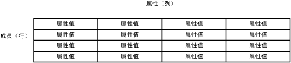
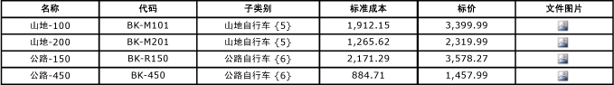

# 成员 (Master Data Services)
  在 [!INCLUDE[ssMDSshort](../includes/ssmdsshort-md.md)]中，成员是物理主数据。 例如，成员可以是 Product 实体中的 Road-150 自行车或 Customer 实体中的特定客户。  
  
## 成员如何与其他模型对象关联  
 可以将成员看作一个表中的行。 相关成员包含在一个实体中，每个成员由属性值进行定义。  
  
 在此示例中，该表表示实体，表中的行表示成员，表中的列表示属性。 每个单元表示特定成员的属性值。  
  
   
  
## 成员类型  
 存在三种类型的成员：叶成员、合并成员和集合成员。  
  
 叶成员是实体中的默认成员。  
  
-   在派生层次结构中，叶成员是唯一的成员类型。 来自一个实体的叶成员用作来自其他实体的叶成员的父级。  
  
-   在显式层次结构中，叶成员位于最低级别并且不能具有子级。  
  
 只有为实体启用显式层次结构和集合时，合并成员才存在。  
  
-   派生层次结构不包含合并成员。  
  
-   在显式层次结构中，合并成员可以是层次结构中其他成员的父级，也可以是子级。  
  
## 使用层次结构和集合组织成员  
 层次结构和集合可用于分组成员便于报告或分析。 有关详细信息，请参阅 [层次结构 (Master Data Services)](../master-data-services/hierarchies-master-data-services.md) 和 [集合 (Master Data Services)](../master-data-services/collections-master-data-services.md)。  
  
## 成员示例  
 在下面的示例中，每个成员均包含 Name、Code、Subcategory、StandardCost、ListPrice 和 FilePhoto 属性值。  
  
   
  
## 相关任务  
  
|任务说明|主题|  
|----------------------|-----------|  
|创建新的叶成员。|[创建叶成员 (Master Data Services)](../master-data-services/create-a-leaf-member-master-data-services.md)|  
|创建新的合并成员。|[创建合并成员 (Master Data Services)](../master-data-services/create-a-consolidated-member-master-data-services.md)|  
|删除现有成员或集合。|[删除成员或集合 (Master Data Services)](../master-data-services/delete-a-member-or-collection-master-data-services.md)|  
|重新激活已删除的成员或集合。|[重新激活成员或集合 (Master Data Services)](../master-data-services/reactivate-a-member-or-collection-master-data-services.md)|  
|更新成员的属性值。|[更改属性类型（用于 Excel 的 MDS 外接程序）](../master-data-services/microsoft-excel-add-in/change-the-attribute-type-mds-add-in-for-excel.md)|  

  
## 相关内容  
  
-   [Master Data Services 概述 (MDS)](../master-data-services/master-data-services-overview-mds.md)  
  
-   [实体 (Master Data Services)](../master-data-services/entities-master-data-services.md)  
  
-   [属性 (Master Data Services)](../master-data-services/attributes-master-data-services.md)  
  
-   [层次结构 (Master Data Services)](../master-data-services/hierarchies-master-data-services.md)  
  
-   [集合 (Master Data Services)](../master-data-services/collections-master-data-services.md)  
  
-   [叶权限 (Master Data Services)](../master-data-services/leaf-permissions-master-data-services.md)  
  
 
-   [Filter 运算符 (Master Data Services)](../master-data-services/filter-operators-master-data-services.md)  
  
  
