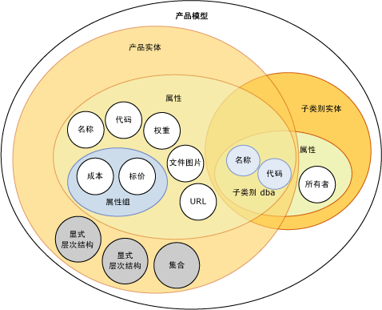
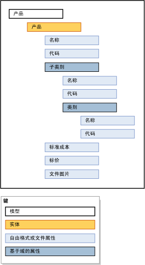

# 模型 (Master Data Services)

[!INCLUDE[appliesto-ss-xxxx-xxxx-xxx-md-winonly](../includes/appliesto-ss-xxxx-xxxx-xxx-md-winonly.md)]

  模型是 [!INCLUDE[ssMDSshort](../includes/ssmdsshort-md.md)]中最高级别的数据组织。 模型定义了您的主数据管理解决方案中的数据结构。 模型包含以下对象：  
  
-   实体  
  
-   属性和属性组  
  
-   显式层次结构和派生层次结构  
  
-   集合  
  
 模型组织您的主数据的结构。 你的 [!INCLUDE[ssMDSshort](../includes/ssmdsshort-md.md)] 实现可能有一个或多个模型，每个模型都会将相似类型的数据组合在一起。 通常，可通过以下四种方式之一划分主数据：人员、地点、事件或概念。 例如，可以创建 Product 模型来包含与产品有关的数据，或创建 Customer 模型来包含与客户有关的数据。  
  
 可以分配用户和组权限来查看和更新模型中的对象。 如果您不授予对模型的权限，则它不显示。  
  
 您随时都可以创建模型中主数据的副本。 这些副本称为版本。  
  
 在测试环境中定义一个模型后，可以带或不带相应数据将它从测试环境部署到生产环境。 这样就不必在生产环境中重新创建您的模型。  
  
## 模型如何与其他对象关联  
 模型包含实体。 实体包含属性、显式层次结构和集合。 属性可以包含在属性组中。 在某一实体用作其他实体的属性时，存在基于域的属性。  
  
 下图显示模型中对象之间的关系。  
  
   
  
> [!NOTE]  
>  派生层次结构也是模型对象，但它们不显示在图像中。 派生层次结构从在实体之间存在的基于域的属性关系中派生。 有关详细信息，请参阅[派生层次结构 &#40;Master Data Services&#41;](../master-data-services/derived-hierarchies-master-data-services.md)。  
  
 主数据是在模型对象中包含的数据。 在 [!INCLUDE[ssMDSshort](../includes/ssmdsshort-md.md)]中，主数据作为实体中的成员存储。  
  
 模型对象在 **用户界面的** “系统管理” [!INCLUDE[ssMDSmdm](../includes/ssmdsmdm-md.md)] 功能区域中维护。  
  
## 模型示例  
 在下面的示例中，Product 模型中的对象以逻辑方式对与产品相关的数据进行分组。  
  
   
  
 其他常见的模型有：  
  
-   科目，它可能包含资产负债表科目、损益表科目、统计信息和科目类型等实体。  
  
-   客户，它可能包含性别、教育、职业和婚姻状况等实体。  
  
-   地理信息，它可能包含邮政编码、城市、县、州、省、区域、国家/地区和洲等实体。  
  
## Related Tasks  
  
|任务说明|主题|  
|----------------------|-----------|  
|创建模型来组织您的主数据。|[创建模型 (Master Data Services)](../master-data-services/create-a-model-master-data-services.md)|  
|更改现有模型的名称。|[编辑模型 &#40;Master Data Services&#41;](../master-data-services/edit-model-master-data-services.md)|  
|删除现有模型。|[删除模型 &#40;Master Data Services&#41;](../master-data-services/delete-a-model-master-data-services.md)|  
  
## 相关内容  
  
-   [Master Data Services 概述 (MDS)](../master-data-services/master-data-services-overview-mds.md)  
  
-   [实体 (Master Data Services)](../master-data-services/entities-master-data-services.md)  
  
-   [属性 (Master Data Services)](../master-data-services/attributes-master-data-services.md)  
  
-   [部署模型 (Master Data Services)](../master-data-services/deploying-models-master-data-services.md)  
  
-   [模型对象权限 (Master Data Services)](../master-data-services/model-object-permissions-master-data-services.md)  
  
  
