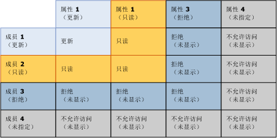
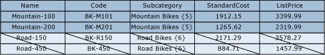
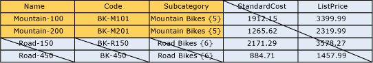

# 重叠的模型和成员权限（主数据服务）

[!INCLUDE[appliesto-ss-xxxx-xxxx-xxx-md-winonly](../includes/appliesto-ss-xxxx-xxxx-xxx-md-winonly.md)]

  分配给成员的权限可与分配给模型对象的权限重叠。 出现重叠时，限制性更强的权限将生效。  
  
 如果成员具有不同于其相应模型对象的权限，适用以下规则：  
  
-   **“拒绝”** 覆盖所有其他权限。  
  
-   模型级别的 **“管理员”** 权限可覆盖所有其他权限，并将更改为子级别上的所有 (CRUD) 访问权限。  
  
-   有效访问权限与成员和属性权限相交。  
  
     例如，如果成员权限包括 **“创建”** 和 **“更新”**，则属性的权限是 **“更新”**。 有效权限是 **“更新”**。  
  
 下图显示在属性权限不同于成员权限时，哪些权限对单个属性值有效。  
  
   
  
## 示例 1  
   
  
 在 **“模型”** 选项卡上，Product 实体分配有 **“更新”** 权限。 该实体中的所有属性都继承该权限。  
  
 在 **“层次结构成员”** 选项卡上，派生的层次结构中的“山地车”子类别节点分配有 **“更新”** 权限。  
  
 结果：在“资源管理器”中，用户对“山地车”节点中所有成员的所有属性值都具有“更新”权限。 所有其他成员和属性均隐藏。  
  
   
  
## 示例 2  
   
  
 在 **“模型”** 选项卡上，Subcategory 属性分配有 **“更新”** 权限。  
  
 在 **“层次结构成员”** 选项卡上，派生的层次结构中的“山地车”子类别节点显式分配有 **“读取”** 权限。  
  
 结果：在“资源管理器”中，用户对“山地车”节点中的成员的所有子类别属性值都具有“读取”权限。 所有其他成员和属性均隐藏。  
  
   
  
## 示例 3  
   
  
 在 **“模型”** 选项卡上，Subcategory 属性分配有 **“读取”** 权限。  
  
 在 **“层次结构成员”** 选项卡上，派生的层次结构中的“山地车”子类别显式分配有 **“更新”** 权限。  
  
 结果：在“资源管理器”中，用户对这些属性值具有“读取”权限。 所有其他成员和属性均隐藏。  
  
   
  
## 另请参阅  
 [如何确定权限 (Master Data Services)](../master-data-services/how-permissions-are-determined-master-data-services.md)   
 [重叠的用户和组权限 &#40;Master Data Services&#41;](../master-data-services/overlapping-user-and-group-permissions-master-data-services.md)  
  
  
