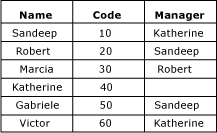
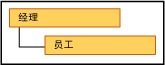

# 递归层次结构 (Master Data Services)

[!INCLUDE[appliesto-ss-xxxx-xxxx-xxx-md-winonly](../includes/appliesto-ss-xxxx-xxxx-xxx-md-winonly.md)]

  在 [!INCLUDE[ssMDSshort](../includes/ssmdsshort-md.md)]中，递归层次结构是包括递归关系的派生层次结构。 在实体具有基于域的属性，且该属性基于实体本身时，存在递归关系。  
  
## 递归层次结构样本  
 典型的递归层次结构样本是组织结构。 在 [!INCLUDE[ssMDSshort](../includes/ssmdsshort-md.md)]中，可以通过创建一个 Employee 实体（该实体具有名为 Manager 的基于域的属性）来说明这一点。 该 Manager 属性通过雇员列表填充。 在这个示例组织中，所有雇员都可以是经理。  
  
   
  
 您可以创建一个派生层次结构，该层次结构突出显示 Employee 实体和 Manager 基于域的属性之间的关系。  
  
   
  
 若要在层次结构中仅包括每个成员一次，您可以定位 Null 关系。 在您进行定位时，具有空的基于域的属性值的成员显示在层次结构的顶级。  
  
   
  
 如果没有定位 Null 关系，成员将包含多次。 所有成员都显示在顶级。 它们还显示在自己是其属性的成员之下。  
  
   
  
 在本示例中，Marcia 处于顶级。 她不是任何雇员的经理，因为她未用作任何其他 Employee 成员的基于域的属性值。 而相反，Robert 在其下具有一个级别，因为 Marcia 将 Robert 作为其 Manager 属性值。  
  
## 规则  
  
-   派生层次结构不能包含多个递归关系。 但是，它可以具有其他派生关系（例如，包含“经理到雇员”递归关系的派生层次结构还可以具有“国家/地区到经理”关系和“雇员到商店”关系）。  
  
-   不能将成员权限（在“层次结构成员”**** 选项卡上）分配给递归层次结构中的成员。  
  
-   递归层次结构不能包括循环关系。 例如，如果 Sandeep 是 Katherine 的经理，则 Katherine 不能是 Sandeep 的经理。 此外，Katherine 不能管理她自己。  
  
## Related Tasks  
  
|任务说明|主题|  
|----------------------|-----------|  
|创建派生层次结构。|[创建派生层次结构 (Master Data Services)](../master-data-services/create-a-derived-hierarchy-master-data-services.md)|  
|更改现有派生层次结构的名称。|[更改派生层次结构名称 (Master Data Services)](../master-data-services/change-a-derived-hierarchy-name-master-data-services.md)|  
|删除现有派生层次结构。|[删除派生层次结构 (Master Data Services)](../master-data-services/delete-a-derived-hierarchy-master-data-services.md)|  
  
## 相关内容  
  
-   [基于域的属性 (Master Data Services)](../master-data-services/domain-based-attributes-master-data-services.md)  
  
-   [派生层次结构 (Master Data Services)](../master-data-services/derived-hierarchies-master-data-services.md)  
  
  
