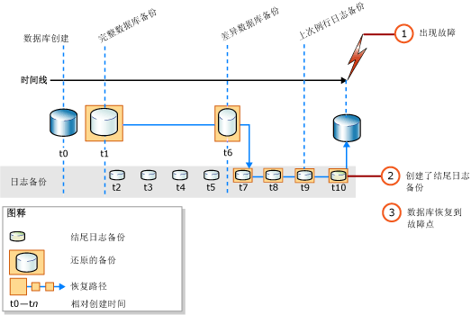

# <a name="complete-database-restores-full-recovery-model"></a>完整数据库还原（完整恢复模式）
[!INCLUDE[appliesto-ss-xxxx-xxxx-xxx-md](../../includes/appliesto-ss-xxxx-xxxx-xxx-md.md)]

  数据库完整还原的目的是还原整个数据库。 整个数据库在还原期间处于脱机状态。 在数据库的任何部分变为联机之前，必须将所有数据恢复到同一点，即数据库的所有部分都处于同一时间点并且不存在未提交的事务。  
  
 在完整恢复模式下，还原数据备份之后，必须还原所有后续的事务日志备份，然后再恢复数据库。 您可以将数据库还原到这些日志备份之一的特定 *恢复点* 。 恢复点可以是特定的日期和时间、标记的事务或日志序列号 (LSN)。  
  
 还原数据库时，特别是在完整恢复模式或大容量日志恢复模式下，您应使用一个还原顺序。 *还原顺序* 由通过一个或多个还原阶段来移动数据的一个或多个还原操作组成。  
  
> [!IMPORTANT]  
>  建议您不要附加或还原来自未知或不可信源的数据库。 这些数据库可能包含执行非预期 [!INCLUDE[tsql](../../includes/tsql-md.md)] 代码的恶意代码，或通过修改架构或物理数据库结构导致错误。 使用来自未知源或不可信源的数据库前，请在非生产服务器上针对数据库运行 [DBCC CHECKDB](../../t-sql/database-console-commands/dbcc-checkdb-transact-sql.md) ，然后检查数据库中的代码，例如存储过程或其他用户定义代码。  
  
 **本主题内容：**  
  
-   [将数据库还原到故障点](#PointOfFailure)  
  
-   [将数据库还原到日志备份中的某个时间点](#PointWithinBackup)  
  
-   [相关任务](#RelatedTasks)  
  
> [!NOTE]  
>  有关支持从 [!INCLUDE[ssNoVersion](../../includes/ssnoversion-md.md)]的早期版本进行备份的信息，请参阅 [RESTORE (Transact-SQL)](../../t-sql/statements/restore-statements-transact-sql.md)中的“兼容性支持”部分。  
  
##  <a name="PointOfFailure"></a> 将数据库还原到故障点  
 通常，将数据库恢复到故障点分为下列基本步骤：  
  
1.  备份活动事务日志（称为日志尾部）。 此操作将创建结尾日志备份。 如果活动事务日志不可用，则该日志部分的所有事务都将丢失。  
  
    > [!IMPORTANT]  
    >  在大容量日志恢复模式下，备份任何包含大容量日志操作的日志都需要访问数据库中的所有数据文件。 如果无法访问该数据文件，则不能备份事务日志。 在这种情况下，您必须手动重做自最近备份日志以来所做的所有更改。  
  
     有关详细信息，请参阅[结尾日志备份 (SQL Server)](../../relational-databases/backup-restore/tail-log-backups-sql-server.md)。  
  
2.  还原最新完整数据库备份而不恢复数据库 (RESTORE DATABASE *database_name* FROM *backup_device* WITH NORECOVERY)。  
  
3.  如果存在差异备份，则还原最新的差异备份而不恢复数据库 (RESTORE DATABASE *database_name* FROM *differential_backup_device* WITH NORECOVERY).。  
  
     还原最新差异备份可减少必须还原的日志备份数。  
  
4.  从还原备份后创建的第一个事务日志备份开始，使用 NORECOVERY 依次还原日志。  
  
5.  恢复数据库 (RESTORE DATABASE *database_name* WITH RECOVERY)。 此步骤也可以与还原上一次日志备份结合使用。  
  
 下图说明此还原顺序。 故障发生后 (1)，将创建结尾日志备份 (2)。 接着，将数据库还原到该故障点。 这涉及到还原数据库备份、后续差异备份以及在差异备份后执行的每个日志备份，包括结尾日志备份。  
  
   
  
> [!NOTE]  
>  计划将数据库备份还原到其它服务器实例时，请参阅 [通过备份和还原来复制数据库](../../relational-databases/databases/copy-databases-with-backup-and-restore.md)。  
  
###  <a name="TsqlSyntax"></a> 基本 TRANSACT-SQL RESTORE 语法  
 上图中还原顺序的基本 [RESTORE](../../t-sql/statements/restore-statements-transact-sql.md)[!INCLUDE[tsql](../../includes/tsql-md.md)] 语法如下：  
  
1.  RESTORE DATABASE *database* FROM *full database backup* WITH NORECOVERY;  
  
2.  RESTORE DATABASE *database* FROM *full_differential_backup* WITH NORECOVERY;  
  
3.  RESTORE LOG *database* FROM *log_backup* WITH NORECOVERY;  
  
     对于其他每个日志备份，重复此还原日志步骤。  
  
4.  RESTORE DATABASE *database* WITH RECOVERY;  
  
###  <a name="ExampleToPoFTsql"></a> 示例：恢复到故障点 (Transact-SQL)  
 以下 [!INCLUDE[tsql](../../includes/tsql-md.md)] 示例显示了将数据库还原到故障点的还原顺序中的基本选项。 此示例将创建数据库的结尾日志备份。 接下来，此示例将还原完整数据库备份和日志备份，然后还原结尾日志备份。 此示例将在最后的单独步骤中恢复数据库。  
  
> [!NOTE]  
>  此示例使用在 [完整数据库备份 (SQL Server)](../../relational-databases/backup-restore/full-database-backups-sql-server.md)中的“兼容性支持”部分。 在备份数据库之前， [!INCLUDE[ssSampleDBobject](../../includes/sssampledbobject-md.md)] 示例数据库设置为使用完整恢复模式。  
  
```  
USE master;  
--Create tail-log backup.  
BACKUP LOG AdventureWorks2012   
TO DISK = 'Z:\SQLServerBackups\AdventureWorksFullRM.bak'    
   WITH NORECOVERY;   
GO  
--Restore the full database backup (from backup set 1).  
RESTORE DATABASE AdventureWorks2012   
  FROM DISK = 'Z:\SQLServerBackups\AdventureWorksFullRM.bak'   
  WITH FILE=1,   
    NORECOVERY;  
  
--Restore the regular log backup (from backup set 2).  
RESTORE LOG AdventureWorks2012   
  FROM DISK = 'Z:\SQLServerBackups\AdventureWorksFullRM.bak'   
  WITH FILE=2,   
    NORECOVERY;  
  
--Restore the tail-log backup (from backup set 3).  
RESTORE LOG AdventureWorks2012   
  FROM DISK = 'Z:\SQLServerBackups\AdventureWorksFullRM.bak'  
  WITH FILE=3,   
    NORECOVERY;  
GO  
--recover the database:  
RESTORE DATABASE AdventureWorks2012 WITH RECOVERY;  
GO  
```  
  
##  <a name="PointWithinBackup"></a> 将数据库还原到日志备份中的某个时间点  
 在完整恢复模式下，完整的数据库还原通常可恢复到日志备份中的某个时间点、标记的事务或 LSN。 但是，在大容量日志恢复模式下，如果日志备份包含大容量更改，则不能进行时点恢复。  
  
### <a name="sample-point-in-time-restore-scenarios"></a>时点还原方案示例  
 下例假定针对一个关键任务型数据库系统，每天午夜创建一个完整数据库备份；从星期一到星期六，每小时创建一个差异数据库备份；全天每 10 分钟创建一个事务日志备份。 若要将数据库还原到星期三凌晨 5:19 的状态， 请执行以下操作：  
  
1.  还原星期二午夜创建的完整数据库备份。  
  
2.  还原星期四凌晨 5:00 创建的差异数据库 备份。  
  
3.  应用星期四凌晨 5:10创建的事务日志 备份。  
  
4.  应用星期三凌晨 5:20 创建的事务日志 备份，指定恢复进程仅应用到凌晨 5:19 之前发生的事务。  
  
 或者，如果需要将数据库还原到它在星期四凌晨 3:04 的状态， 而在星期四凌晨 3:00 创建的差异数据库备份已不可用， 则执行下列操作：  
  
1.  还原在星期三午夜创建的数据库备份。  
  
2.  还原星期四凌晨 2:00 创建的差异数据库 备份。  
  
3.  应用从星期四凌晨 2:10 到 3:00 创建的所有事务 日志 备份。  
  
4.  应用星期四凌晨 3:10 创建的事务日志 备份，停止凌晨 3:04 的恢复进程。  
  
> [!NOTE]  
>  有关时间点存储的示例，请参阅 [将 SQL Server 数据库还原到某个时间点（完整恢复模式）](../../relational-databases/backup-restore/restore-a-sql-server-database-to-a-point-in-time-full-recovery-model.md)中的“兼容性支持”部分。  
  
##  <a name="RelatedTasks"></a> 相关任务  
 **还原完整数据库备份**  
  
-   [Restore a Database Backup Using SSMS](../../relational-databases/backup-restore/restore-a-database-backup-using-ssms.md)  
  
-   [将数据库还原到新位置 (SQL Server)](../../relational-databases/backup-restore/restore-a-database-to-a-new-location-sql-server.md)  
  
 **还原差异数据库备份**  
  
-   [还原差异数据库备份 (SQL Server)](../../relational-databases/backup-restore/restore-a-differential-database-backup-sql-server.md)  
  
 **还原事务日志备份**  
  
-   [还原事务日志备份 (SQL Server)](../../relational-databases/backup-restore/restore-a-transaction-log-backup-sql-server.md)  
  
 **使用 SQL Server 管理对象 (SMO) 还原备份**  
  
-   <xref:Microsoft.SqlServer.Management.Smo.Restore.SqlRestore%2A>  
  
 **将数据库还原到日志备份中的某个时间点**  
  
-   [将 SQL Server 数据库还原到某个时间点（完整恢复模式）](../../relational-databases/backup-restore/restore-a-sql-server-database-to-a-point-in-time-full-recovery-model.md)  
  
-   [包含标记的事务的相关数据库的恢复](../../relational-databases/backup-restore/recovery-of-related-databases-that-contain-marked-transaction.md)  
  
-   [恢复到日志序列号 (SQL Server)](../../relational-databases/backup-restore/recover-to-a-log-sequence-number-sql-server.md)  
  
## <a name="see-also"></a>另请参阅  
 [RESTORE &#40;Transact-SQL&#41;](../../t-sql/statements/restore-statements-transact-sql.md)   
 [BACKUP (Transact-SQL)](../../t-sql/statements/backup-transact-sql.md)   
 [应用事务日志备份 (SQL Server)](../../relational-databases/backup-restore/apply-transaction-log-backups-sql-server.md)   
 [sp_addumpdevice (Transact-SQL)](../../relational-databases/system-stored-procedures/sp-addumpdevice-transact-sql.md)   
 [完整数据库备份 (SQL Server)](../../relational-databases/backup-restore/full-database-backups-sql-server.md)   
 [差异备份 (SQL Server)](../../relational-databases/backup-restore/differential-backups-sql-server.md)   
 [备份概述 (SQL Server)](../../relational-databases/backup-restore/backup-overview-sql-server.md)   
 [还原和恢复概述 (SQL Server)](../../relational-databases/backup-restore/restore-and-recovery-overview-sql-server.md)  
  
  
