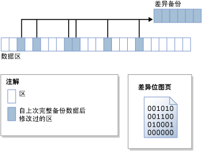

# 差异备份 (SQL Server)
  此备份和还原主题与所有 [!INCLUDE[ssNoVersion](../../includes/ssnoversion-md.md)] 数据库相关。  
  
 差异备份所基于的是最近一次的完整数据备份。 差异备份仅捕获自该次完整备份后发生更改的数据。 差异备份所基于的完整备份称为差异的“基准”  。 完整备份（仅复制备份除外）可以用作一系列差异备份的基准，包括数据库备份、部分备份和文件备份。 文件差异备份的基准备份可以包含在完整备份、文件备份或部分备份中。  
  
  
##   优点  
  
-   与创建完整备份相比，创建差异备份的速度可能非常快。 差异备份只记录自差异备份所基于的完整备份后更改的数据。 这有助于频繁地进行数据备份，减少数据丢失的风险。 但是，在还原差异备份之前，必须先还原其基准。 因此，从差异备份进行还原必然要比从完整备份进行还原需要更多的步骤和时间，因为这需要两个备份文件。  
  
-   如果数据库的某个子集比该数据库的其余部分修改得更为频繁，则差异数据库备份特别有用。 在这些情况下，使用差异数据库备份，您可以频繁执行备份，并且不会产生完整数据库备份的开销。  
  
-   在完整恢复模式下，使用差异备份可以减少必须还原的日志备份的数量。  
  
##   差异备份概述  
 差异备份捕获在创建差异基准和创建差异备份之间发生更改的任何 *盘区* （物理上连续的八个页的集合）的状态。 这意味着，给定差异备份的大小取决于自建立差异基准后更改的数据量。 通常，差异基准越旧，新的差异备份就越大。 在一系列差异备份中，频繁更新的区可能在每个差异备份中包含不同的数据。  
  
 下图显示的是差异备份的工作原理。 该图显示了二十四个数据区，其中的六个已发生更改。 差异备份只包含这六个数据区。 差异备份操作取决于位图页，此页针对每个区包含一位。 对于自建立差异基准后更新的每个区，该位在位图中设置为 1。  
  
   
  
> [!NOTE]  
>  仅复制备份不能更新差异位图。 因此，仅复制备份不会影响后续差异备份。  
  
 在建立基准之后立即执行的差异备份通常明显小于差异基准。 这可以节省存储空间和备份时间。 但是，当数据库随着时间的推移发生更改时，数据库与特定差异基准之间的差异将增大。 差异备份与其基准间隔的时间越长，差异备份可能就越大。 这意味着差异备份的大小最终会接近差异基准的大小。 较大的差异备份将失去备份更快、更小的优势。  
  
 当差异备份的大小增大时，还原差异备份会显著延长还原数据库所需的时间。 因此，建议按设定的间隔执行新的完整备份，以便为数据建立新的差异基准。 例如，您可以每周执行一次整个数据库的完整备份（即完整数据库备份），然后在该周内执行一系列常规的差异数据库备份。  
  
 在还原过程中，还原差异备份之前，必须先还原其基准。 然后只需还原最新的差异备份，即可将数据库前滚到创建差异备份的时间。 通常，应该先还原最新的完整备份，然后再还原基于该完整备份的最新差异备份。  
  
## 具有内存优化表的数据库的差异备份  
 有关具有内存优化表的数据库的差异备份的详细信息，请参阅 [备份具有内存优化表的数据库](../../relational-databases/in-memory-oltp/backing-up-a-database-with-memory-optimized-tables.md)。  
  
##   对只读数据库进行差异备份  
 对于只读数据库，单独使用完整备份比同时使用完整备份和差异备份更容易管理。 当数据库为只读时，备份和其他操作无法更改文件中包含的元数据。 因此，差异备份所要求的元数据（如差异备份开始的日志序列号，即差异基准 LSN）存储在 **master** 数据库中。 如果在数据库只读时采用的是差异基准，则差异位图指示的更改多于在基准备份之后实际发生的更改。 额外的数据由备份读取，但不会写入到备份中，因为存储在 **backupset** 系统表中的 [differential_base_lsn](../../relational-databases/system-tables/backupset-transact-sql.md) 用于确定在基准之后是否实际更改了数据。  
  
 重新构建、还原只读数据库或者分离再重新附加只读数据库后，会丢失差异基准信息。 这是因为 **master** 数据库与用户数据库不同步。 [!INCLUDE[ssDEnoversion](../../includes/ssdenoversion-md.md)] 无法检测或防止此问题的出现。 所有后续差异备份都不是基于最新的完整备份，从而可能会出现出人意料的结果。 若要建立新的差异基准，建议先创建完整数据库备份。  
  
### 对只读数据库进行差异备份的最佳方法  
 创建只读数据库的完整数据库备份之后，如果要创建后续差异备份，则请备份 **master** 数据库。  
  
 如果 **master** 数据库丢失，请在还原用户数据库的任何差异备份之前，将其还原。  
  
 如果分离和附加计划稍后对其使用差异备份的只读数据库，则应尽快执行此只读数据库和 **master** 数据库的完整数据库备份。  
  
##   相关任务  
  
-   [创建差异数据库备份 (SQL Server)](../../relational-databases/backup-restore/create-a-differential-database-backup-sql-server.md)  
  
-   [还原差异数据库备份 (SQL Server)](../../relational-databases/backup-restore/restore-a-differential-database-backup-sql-server.md)  
  
  
## 另请参阅  
 [备份概述 (SQL Server)](../../relational-databases/backup-restore/backup-overview-sql-server.md)   
 [完整数据库备份 (SQL Server)](../../relational-databases/backup-restore/full-database-backups-sql-server.md)   
 [完整数据库还原（完整恢复模式）](../../relational-databases/backup-restore/complete-database-restores-full-recovery-model.md)   
 [完整数据库还原（简单恢复模式）](../../relational-databases/backup-restore/complete-database-restores-simple-recovery-model.md)   
 [事务日志备份 (SQL Server)](../../relational-databases/backup-restore/transaction-log-backups-sql-server.md)  
  
  
