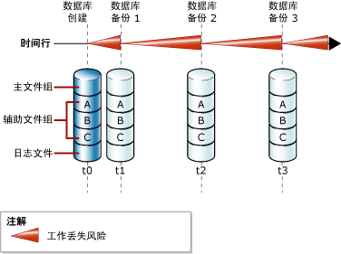
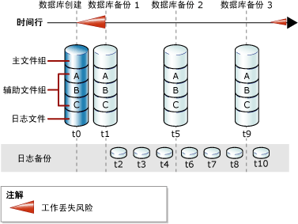

# <a name="full-database-backups-sql-server"></a>完整数据库备份 (SQL Server)
  完整数据库备份可对整个数据库进行备份。 这包括对部分事务日志进行备份，以便在还原完整数据库备份之后，能够恢复完整数据库备份。 完整数据库备份表示备份完成时的数据库。  
  
> [!TIP]  
>  随着数据库不断增大，完整备份需花费更多时间才能完成，并且需要更多的存储空间。 因此，对于大型数据库而言，您可以用一系列“差异数据库备份” **来补充完整数据库备份。 有关详细信息，请参阅[差异备份 (SQL Server)](../../relational-databases/backup-restore/differential-backups-sql-server.md)。  
  
> [!IMPORTANT]  
>  针对数据库备份，TRUSTWORTHY 设置为 OFF。 有关如何将 TRUSTWORTHY 设置为 ON 的详细信息，请参阅 [ALTER DATABASE SET 选项 (Transact-SQL)](../../t-sql/statements/alter-database-transact-sql-set-options.md)。  
  
 **本主题内容：**  
  
-   [简单恢复模式下的数据库备份](#DbBuRMs)  
  
-   [完整恢复模式下的数据库备份](#DbBuRMf)  
  
-   [使用完整数据库备份还原数据库](#RestoreDbBu)  
  
-   [相关任务](#RelatedTasks)  
  
##  <a name="DbBuRMs"></a> 简单恢复模式下的数据库备份  
 在简单恢复模式下，每次备份后，如果出现严重故障，数据库将有可能丢失工作。 每次更新都会增加丢失工作的风险，这种情况将一直持续到下一次备份。这时，工作丢失风险将变为零，并开始新一轮的工作丢失风险。 备份之间的工作丢失风险随着时间的推移而增加。 下图显示了仅使用完整数据库备份的备份策略的工作丢失风险。  
  
   
  
### <a name="example-includetsqlincludestsql-mdmd"></a>例如 ([!INCLUDE[tsql](../../includes/tsql-md.md)])  
 下面的示例说明了如何使用 WITH FORMAT 覆盖任意现有备份并创建新介质集，从而创建一个完整数据库备份。  
  
```  
-- Back up the AdventureWorks2012 database to new media set.  
BACKUP DATABASE AdventureWorks2012  
    TO DISK = 'Z:\SQLServerBackups\AdventureWorksSimpleRM.bak'   
    WITH FORMAT;  
GO  
```  
  
##  <a name="DbBuRMf"></a> 完整恢复模式下的数据库备份  
 对于使用完整恢复模式和大容量日志恢复模式的数据库而言，数据库备份是必需的，但并不足够。 还需要事务日志备份。 下图显示了在完整恢复模式下可以使用的复杂性最小的备份策略。  
  
   
  
 有关如何创建日志备份的信息，请参阅[事务日志备份 (SQL Server)](../../relational-databases/backup-restore/transaction-log-backups-sql-server.md)。  
  
### <a name="example-includetsqlincludestsql-mdmd"></a>例如 ([!INCLUDE[tsql](../../includes/tsql-md.md)])  
 下面的示例说明了如何使用 WITH FORMAT 覆盖任意现有备份并创建新介质集，从而创建一个完整数据库备份。 然后，此示例将备份事务日志。 在现实情况下，您必须执行一系列的定期日志备份。 在此示例中， [!INCLUDE[ssSampleDBobject](../../includes/sssampledbobject-md.md)] 示例数据库设置为使用完整恢复模式。  
  
```  
USE master;  
ALTER DATABASE AdventureWorks2012 SET RECOVERY FULL;  
GO  
-- Back up the AdventureWorks2012 database to new media set (backup set 1).  
BACKUP DATABASE AdventureWorks2012  
  TO DISK = 'Z:\SQLServerBackups\AdventureWorks2012FullRM.bak'   
  WITH FORMAT;  
GO  
--Create a routine log backup (backup set 2).  
BACKUP LOG AdventureWorks2012 TO DISK = 'Z:\SQLServerBackups\AdventureWorks2012FullRM.bak';  
GO  
```  
  
##  <a name="RestoreDbBu"></a> 使用完整数据库备份还原数据库  
 您可以通过将数据库从完整数据库备份还原到任意位置的方法一步完成整个数据库的重新创建。 备份中包含了足够的事务日志，这使您能够将数据库恢复到备份完成的时间。 还原的数据库将与还原数据库备份完成时的原始数据库状态相符，但不包含任何未提交的事务。 在完整恢复模式下，随后应还原所有后续日志备份。 恢复数据库后，将回滚未提交的事务。  
  
 有关详细信息，请参阅[完整数据库还原（简单恢复模式）](../../relational-databases/backup-restore/complete-database-restores-simple-recovery-model.md)或[数据库还原（完整恢复模式）](../../relational-databases/backup-restore/complete-database-restores-full-recovery-model.md)。  
  
##  <a name="RelatedTasks"></a> 相关任务  
 **创建完整数据库备份**  
  
-   [创建完整数据库备份 (SQL Server)](../../relational-databases/backup-restore/create-a-full-database-backup-sql-server.md)  
  
-   <xref:Microsoft.SqlServer.Management.Smo.Backup.SqlBackup%2A> (SMO)  
  
 **计划备份作业**  
  
 [使用维护计划向导](../../relational-databases/maintenance-plans/use-the-maintenance-plan-wizard.md)  
  
## <a name="see-also"></a>另请参阅  
 [SQL Server 数据库的备份和还原](../../relational-databases/backup-restore/back-up-and-restore-of-sql-server-databases.md)   
 [备份概述 (SQL Server)](../../relational-databases/backup-restore/backup-overview-sql-server.md)   
 [备份和还原 Analysis Services 数据库](../../analysis-services/multidimensional-models/backup-and-restore-of-analysis-services-databases.md)  
  
  
