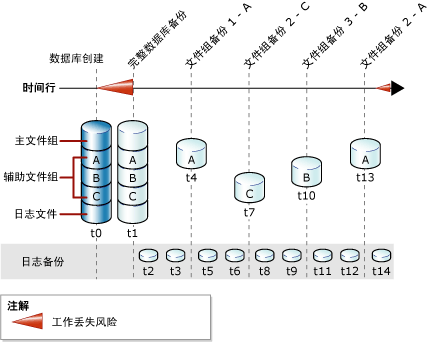

# 完整文件备份 (SQL Server)
 [!INCLUDE [SQL Server](../../includes/applies-to-version/sqlserver.md)]
  本主题适用于包含多个文件或文件组的 [!INCLUDE[ssNoVersion](../../includes/ssnoversion-md.md)] 数据库。  
  
 可以分别备份和还原 [!INCLUDE[ssNoVersion](../../includes/ssnoversion-md.md)] 数据库中的文件。 此外，可以指定整个文件组，而不是逐个指定每个构成文件。 请注意，如果文件组中的任何文件脱机（例如，由于正在还原该文件），则整个文件组均将脱机并且无法备份。  
  
 只读文件组的文件备份可以与部分备份一起使用。 部分备份包括所有读/写文件组以及可选的一个或多个只读文件组。 有关详细信息，请参阅[部分备份 (SQL Server)](../../relational-databases/backup-restore/partial-backups-sql-server.md)。  
  
 文件备份可以用作差异文件备份的“差异基准  ”。 有关详细信息，请参阅 [差异备份 (SQL Server)](../../relational-databases/backup-restore/differential-backups-sql-server.md)。  
  
> [!NOTE]  
>  除了在与“差异文件备份”  明确进行比较的时候，完整文件备份通常称为文件备份  。  
  
 **本主题内容：**  
  
-   [文件备份的优点](#Benefits)  
  
-   [文件备份的缺点](#Disadvantages)  
  
-   [文件备份概述](#Overview)  
  
-   [相关任务](#RelatedTasks)  
  
##   文件备份的优点  
 相对于数据库备份，文件备份具有如下优点：  
  
-   使用文件备份使您能够只还原损坏的文件，而不用还原数据库的其余部分，从而加快了恢复速度。  
  
     例如，如果数据库由位于不同磁盘上的若干个文件组成，在其中一个磁盘发生故障时，只需还原故障磁盘上的文件。 可以快速还原已损坏的文件，并且恢复速度快于针对整个数据库的恢复速度。  
  
-   与完整数据库备份（对于超大型数据库而言，变得难以管理）相比，文件备份增加了计划和介质处理的灵活性。 文件或文件组备份的更高灵活性对于包含具有不同更新特征的数据的大型数据库也很有用。  
  
##   文件备份的缺点  
  
-   与完整数据库备份相比，文件备份的主要缺点是管理较复杂。 维护和跟踪这些完整备份是一种耗时的任务，所需空间可能会超过完整数据库备份的所需空间。  
  
-   如果某个损坏的文件未备份，那么介质故障可能会导致无法恢复整个数据库。 因此，必须维护一组完整的文件备份，对于完整/大容量日志恢复模式，还必须维护一个或多个日志备份，这些日志备份至少涵盖第一个完整文件备份和最后一个完整备份之间的时间间隔。  
  
##   文件备份概述  
 完整文件备份指备份一个或多个文件或文件组中的所有数据。 文件备份在默认情况下包含足够的日志记录，可以将文件前滚至备份操作的末尾。  
  
 备份只读文件或文件组的方法对每种恢复模式均相同。 在完整恢复模式下，一整套完整文件备份与跨所有文件备份的足够日志备份合起来等同于完整数据库备份。  
  
 一次只能进行一个文件备份操作。 可以在一个操作中备份多个文件，但如果只需要还原一个文件，这样做可能会延长恢复时间。 这是因为查找该文件时，将读取整个备份。  
  
> [!NOTE]  
>  单个文件可以从数据库备份中还原；但与从文件备份中还原相比，从数据库备份中找到和还原文件所需的时间更长。  
  
### 文件备份和简单恢复模式  
 在简单恢复模式下，必须一起备份所有读/写文件。 这样可以确保将数据库还原到一致的时点。 请使用 READ_WRITE_FILEGROUPS 选项，而不是逐个指定每个读/写文件或文件组。 此选项用于备份数据库中的所有读/写文件组。 通过指定 READ_WRITE_FILEGROUPS 创建的备份称为部分备份。 有关详细信息，请参阅[部分备份 (SQL Server)](../../relational-databases/backup-restore/partial-backups-sql-server.md)。  
  
### 文件备份和完全恢复模式  
 在完整恢复模式下，必须备份事务日志，不用考虑备份策略的其余部分。 一整套完整文件备份与涵盖从第一个文件备份开始的所有文件备份的足够日志备份合起来等同于完整数据库备份。  
  
 仅使用文件备份和日志备份还原数据库的操作可能比较复杂。 因此，如果可能，最好执行完整数据库备份并在第一个文件备份开始之前开始日志备份。 下图显示了在创建数据库（在 t0 时间）之后立即执行完整数据库备份（在 t1 时间）的策略。 创建了第一个数据库备份之后，便可开始执行事务日志备份。 事务日志备份计划按设置的间隔执行。 文件备份以最适合数据库业务要求的间隔执行。 此图显示了四个文件组，每次备份其中的一个文件组。 它们的备份顺序（A、C、B、A）反映了数据库的业务要求。  
  
   
  
> [!NOTE]  
>  在完整恢复模式下，必须在还原读/写文件备份时前滚事务日志，以确保该文件与数据库的其余部分保持一致。 若要避免前滚大量事务日志备份，请考虑使用差异文件备份。 有关详细信息，请参阅 [差异备份 (SQL Server)](../../relational-databases/backup-restore/differential-backups-sql-server.md)。  
  
##   相关任务  
 **创建文件或文件组备份**  
  
-   [备份文件和文件组 (SQL Server)](../../relational-databases/backup-restore/back-up-files-and-filegroups-sql-server.md)  
  
-   <xref:Microsoft.SqlServer.Management.Smo.Backup.SqlBackup%2A> (SMO)  
  
> [!NOTE]  
>  维护计划向导不支持文件备份。  
  
## 另请参阅  
 [BACKUP (Transact-SQL)](../../t-sql/statements/backup-transact-sql.md)   
 [备份概述 (SQL Server)](../../relational-databases/backup-restore/backup-overview-sql-server.md)   
 [备份和还原：互操作性和共存 &#40;SQL Server&#41;](../../relational-databases/backup-restore/backup-and-restore-interoperability-and-coexistence-sql-server.md)   
 [差异备份 (SQL Server)](../../relational-databases/backup-restore/differential-backups-sql-server.md)   
 [文件还原（简单恢复模式）](../../relational-databases/backup-restore/file-restores-simple-recovery-model.md)   
 [文件还原（完整恢复模式）](../../relational-databases/backup-restore/file-restores-full-recovery-model.md)   
 [联机还原 (SQL Server)](../../relational-databases/backup-restore/online-restore-sql-server.md)   
 [段落还原 (SQL Server)](../../relational-databases/backup-restore/piecemeal-restores-sql-server.md)  
  
  
