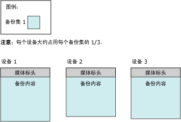
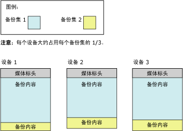

# <a name="media-sets-media-families-and-backup-sets-sql-server"></a>介质集、介质簇和备份集 (SQL Server)
[!INCLUDE[appliesto-ss-xxxx-xxxx-xxx-md](../../includes/appliesto-ss-xxxx-xxxx-xxx-md.md)]
  **本主题介绍 [!INCLUDE[ssNoVersion](../../includes/ssnoversion-md.md)] 备份和还原的基本备份介质术语，适用于对 [!INCLUDE[ssNoVersion](../../includes/ssnoversion-md.md)]不熟悉的读者。** 
  
  本主题介绍 [!INCLUDE[ssNoVersion](../../includes/ssnoversion-md.md)] 用于备份介质的格式、备份介质和备份设备之间的对应关系、备份介质上备份的组织结构，以及介质集和介质簇的若干注意事项。 本主题还介绍在第一次使用备份介质或在使用新介质集替代旧介质集之前对备份介质进行初始化和格式化的步骤，如何覆盖介质集中的旧备份集，以及如何将新备份集追加到介质集。  
  
>**注意！** 有关 SQL Server 备份到 Microsoft Azure Blob 存储服务的详细信息，请参阅 [使用 Microsoft Azure Blob 存储服务进行 SQL Server 备份和还原](../../relational-databases/backup-restore/sql-server-backup-and-restore-with-microsoft-azure-blob-storage-service.md)。  
   
##  <a name="TermsAndDefinitions"></a> 术语  
 **介质集 (media set)**  
 备份介质（磁带或磁盘文件）的有序集合，使用固定类型和数量的备份设备向其写入了一个或多个备份操作。  
  
 **介质簇 (media family)**  
 在介质集中的单个非镜像设备或一组镜像设备上创建的备份。  
  
**备份集 (backup set)**  
 通过成功的备份操作添加到介质组的备份内容。  
  

##  <a name="OvMediaSetsFamiliesBackupSets"></a> 媒体集、媒体簇和备份集概述  
 包含一个或多个备份介质的集合的备份构成一个介质集。 *媒体集* 是 *备份媒体*（磁带或磁盘文件，或者是 Azure Blob）的有序集合，一个或多个备份操作使用固定类型和数量的备份设备向其写入。 给定媒体集使用磁带驱动器，或者使用磁盘驱动器或 Azure Blob，但不能结合使用两者或以上。 
 
**例如：** 与媒体集相关联的备份设备可能是三个名为 `\\.\TAPE0`、 `\\.\TAPE1`和 `\\.\TAPE2`的磁带驱动器。 该介质集仅包含磁带，最少需要三个磁带（每个磁带机一个磁带）。 备份设备的类型和数量是在创建介质集时建立的，不能更改。 但是，如有必要，可以在备份和还原操作之间将给定设备替换为同一类型的设备。  
  
 介质集是在备份操作过程中通过格式化备份介质从而在备份介质上创建的。 有关详细信息，请参阅本主题后面的 [创建新介质集](#CreatingMediaSet)。 设置格式后，每个文件或磁带都包含介质集的介质标头，可以开始接收备份内容。 有了标头后，备份操作会将指定数据备份到为该操作指定的所有备份设备中的备份介质。  
  
> **注意！** 可以镜像介质集，以防介质卷（磁带或磁盘文件）被破坏。 有关详细信息，请参阅本主题后面的 [镜像备份媒体集 (SQL Server)](../../relational-databases/backup-restore/mirrored-backup-media-sets-sql-server.md)不熟悉的读者。  
  
 压缩和未压缩的备份不能在一个介质集中共存。 任何 [!INCLUDE[ssKatmai](../../includes/sskatmai-md.md)] 版本或更高版本都可以读取压缩的备份。 有关详细信息，请参阅[备份压缩 (SQL Server)](../../relational-databases/backup-restore/backup-compression-sql-server.md)。  

  
## <a name="media-families"></a>介质簇  
 “介质簇” 由在介质集中的单个非镜像设备或一组镜像设备上创建的备份构成。 介质集所使用的备份设备的数量决定了介质集中的介质簇的数量。 例如，如果介质集使用两个非镜像备份设备，则该介质集包含两个介质簇。  
  
在镜像介质集中，所有介质簇也是镜像的。 例如，如果使用六个备份设备来设置介质集的格式，其中使用了两个镜像，则有三个介质簇，每个介质簇包含两个相同的备份数据副本。 有关镜像媒体集的详细信息，请参阅[镜像备份媒体集 (SQL Server)](../../relational-databases/backup-restore/mirrored-backup-media-sets-sql-server.md)。  
  
 介质簇中的每个磁带或磁盘都分配了“介质序列号” 。 磁盘的介质序列号通常为 1。 在磁带介质簇中，起始磁带的序列号为 1，第二盘磁带的序列号为 2，依此类推。 有关详细信息，请参阅本主题后面的 [介质集、介质簇和备份集 (SQL Server)](../../relational-databases/backup-restore/media-sets-media-families-and-backup-sets-sql-server.md)不熟悉的读者。
  
## <a name="the-media-header"></a>介质标头  
 备份介质（磁盘文件或磁带）的每个卷都包含介质标头，介质标头是在第一次使用磁带（或磁盘）执行备份操作时创建的。 标头在重新设置介质格式之前保持不变。  
  
 介质标头包含标识介质（磁盘文件或磁带）及其在所属介质簇中的位置所需的所有信息。 此信息包括：  
  
-   介质的名称。  
  
     介质名称是可选的，但建议始终使用能够明确标识介质的名称。 介质名称由设置介质格式的用户指定。  
  
-   介质集的唯一标识号。  
  
-   介质集中的介质簇数。  
  
-   包含此介质的介质簇的序列号。  
  
-   介质簇的唯一标识号。  
  
-   介质簇中此介质的序列号。 对于磁盘文件，此值始终为 1。  
  
-   介质说明中是包含 MTF 介质标签还是包含介质说明。  
  
    >**注意！** 用于备份或还原操作的所有介质都使用称为 [!INCLUDE[msCoName](../../includes/msconame-md.md)] 磁带格式 (MTF) 的标准备份格式。 MTF 使得用户可以指定磁带标签，标签中包含特定于 MTF 的说明。 [!INCLUDE[ssNoVersion](../../includes/ssnoversion-md.md)] 保留由其他应用程序写入的任何 MTF 介质标签，但其本身不会写入 MTF 介质标签。  
  
-   [!INCLUDE[msCoName](../../includes/msconame-md.md)] 磁带格式介质标签或介质说明（自由格式文本）。  
  
-   用于创建标签的备份软件的名称。  
  
-   格式化介质的软件供应商的唯一供应商标识号。  
  
-   创建标签的日期和时间。  
  
-   介质集中的镜像数 (1-4)，1 表示设备未镜像。  
  
 [!INCLUDE[ssCurrent](../../includes/sscurrent-md.md)] 可以处理使用早期版本的 [!INCLUDE[ssNoVersion](../../includes/ssnoversion-md.md)]设置格式的介质。  
  
## <a name="backup-sets"></a>备份集  
 成功的备份操作将向介质集中添加一个“备份集”  。 从备份所属的介质集方面对备份集进行说明。 如果备份介质只包含一个介质簇，则该簇包含整个备份集。 如果备份介质包含多个介质簇，则备份集分布在各个介质簇之间。 在每个介质上，备份集都包含说明备份集的标头。  
  
 下例显示一个 [!INCLUDE[tsql](../../includes/tsql-md.md)] 语句，该语句使用三个磁带驱动器作为备份设备，为 `MyAdvWorks_MediaSet_1` 数据库创建一个名为 [!INCLUDE[ssSampleDBobject](../../includes/sssampledbobject-md.md)] 的媒体集。  
  
```  
BACKUP DATABASE AdventureWorks2012  
TO TAPE = '\\.\tape0', TAPE = '\\.\tape1', TAPE = '\\.\tape2'  
WITH   
   FORMAT,  
   MEDIANAME = 'MyAdvWorks_MediaSet_1'  
```  
  
 如果成功，此备份操作将生成一个新的介质集，该介质集包含一个新介质标头和一个分布在三个磁带上的备份集。 下图说明了这些结果：  
  
   
  
 通常，创建介质集后，后续备份操作将依次向介质集追加其备份集。 备份集使用的所有介质构成了介质集，而与所涉及到的介质或备份设备的数量无关。 备份集按照其在介质集中的位置依次编号，从而使您能够指定还原哪个备份集。  
  
 介质集的每个备份操作都必须写入相同数量和类型的备份设备。 如果使用多个设备，则与第一个备份集相同，每个后续备份集的内容都分布在所有设备的备份介质中。 为了继续上面的示例，第二个备份操作（差异备份）将向同一介质集追加信息：  
  
```  
BACKUP DATABASE AdventureWorks2012  
TO TAPE = '\\.\tape0', TAPE = '\\.\tape1', TAPE = '\\.\tape2'  
WITH   
   NOINIT,  
   MEDIANAME = 'AdventureWorksMediaSet1',  
   DIFFERENTIAL  
```  
  
> **注意！** NOINIT 选项是默认选项，但为清楚起见，要包括此选项。  
  
 如果第二个备份操作成功，将向介质集写入第二个备份集，并按以下方式分布备份内容：  
  
   
  
 在还原备份时，您可以使用 FILE 选项来指定想要使用的备份。 下面的示例展示了 FILE = backup_set_file_number 子句的使用方法，在还原 [!INCLUDE[ssSampleDBobject](../../includes/sssampledbobject-md.md)] 数据库的完整数据库备份并随后还原位于相同媒体集上的差异数据库备份时使用该子句。 介质集使用了三个备份磁带，它们位于磁带机 `\\.\tape0`、 `tape1`和 `tape2`上。  
  
```  
RESTORE DATABASE AdventureWorks2012 FROM TAPE = '\\.\tape0', TAPE = '\\.\tape1', TAPE = '\\.\tape2'  
   WITH   
   MEDIANAME = 'AdventureWorksMediaSet1',  
   FILE=1,   
   NORECOVERY;  
RESTORE DATABASE AdventureWorks2012 FROM TAPE = '\\.\tape0', TAPE = '\\.\tape1', TAPE = '\\.\tape2'   
   WITH   
   MEDIANAME = 'AdventureWorksMediaSet1',  
   FILE=2,   
   RECOVERY;  
GO  
```  
  
 历史记录表存储了媒体集及其媒体簇和备份集的相关信息，有关历史记录表的信息，请参阅 [备份历史记录和标头信息 (SQL Server)](../../relational-databases/backup-restore/backup-history-and-header-information-sql-server.md)不熟悉的读者。  
  
 介质集中备份介质的数量取决于下列几个因素：  
  
-   备份设备的数量  
  
-   备份设备的类型  
  
-   备份集的数量  

  
##  <a name="CreatingMediaSet"></a> Creating a new media set  
 若要创建新介质集，必须格式化备份介质（一个或多个磁带或磁盘文件）。 格式化进程会对备份介质进行以下更改：  
  
1.  删除旧标头（如果存在），从而有效地删除备份介质中以前的内容。  
  
     格式化磁带设备会删除当前装入的磁带中以前所有内容。 格式化磁盘只影响您为备份操作指定的文件。  
  
2.  向每个备份设备中的备份介质（磁带或磁盘文件）写入新的介质标头。  

  
##  <a name="UseExistingMediaSet"></a> 备份到现有媒体集  
 当备份到某个现有介质集时，您可以使用以下两个选项：  
  
-   追加到现有备份集。  
  
     为了尽可能利用可用空间，通常将新的备份集追加到现有介质集。 追加到备份时会保留所有以前的备份。 有关详细信息，请参阅本节后面的 [追加到现有备份集](#Appending)。  

追加是 BACKUP 的默认行为，可以通过使用 NOINIT 选项显式指定追加。  
  
-   使用当前备份覆盖所有现有备份集，保持当前介质标头位置不变。  
  
     [!INCLUDE[ssNoVersion](../../includes/ssnoversion-md.md)] 备份提供防止意外覆盖介质的安全措施。 但是，备份集到达预定义的到期日期时，备份会自动覆盖备份集。  
  
     对于磁带标头，适当地保留标头还是很有帮助的。 有关详细信息，请参阅本节后面的 [覆盖备份集](#Overwriting)。  

    >  使用 BACKUP 语句中的 INIT 选项可指定覆盖现有备份集。  
  
##  <a name="Appending"></a> Appending to existing backup sets  
 可以将来自相同或不同数据库的、在不同时间执行的备份存储在同一个介质上。 通过将其他备份集追加到现有介质上，介质上以前的内容保持不变，新的备份在介质上最后一个备份的结尾处写入。  
  
 默认情况下, [!INCLUDE[ssNoVersion](../../includes/ssnoversion-md.md)] 始终在介质上追加新的备份。 只能在介质的结尾处追加备份。 例如，如果介质卷包含五个备份集，则不能跳过前三个备份集而用新的备份集覆盖第四个备份集。  
  
 如果将 BACKUP WITH NOREWIND 用于磁带备份，则磁带在操作结束时将保持打开状态。 这使您得以在磁带中追加其他备份，而不用倒带然后再次往前扫描以查找最后一个备份集。 你可以在 **sys.dm_io_backup_tapes** 动态管理视图中找到打开的磁带驱动器的列表；有关详细信息，请参阅 [sys.dm_io_backup_tapes (Transact-SQL)](../../relational-databases/system-dynamic-management-views/sys-dm-io-backup-tapes-transact-sql.md)。  
  
 Microsoft Windows 备份和 [!INCLUDE[ssNoVersion](../../includes/ssnoversion-md.md)] 备份可以共享同一介质，但它们之间不能相互操作。 [!INCLUDE[ssNoVersion](../../includes/ssnoversion-md.md)] 备份不能备份 Windows 数据。  
  
> **重要说明！** 压缩和未压缩的备份不能在一个介质集中共存。 任何版本的 [!INCLUDE[ssKatmai](../../includes/sskatmai-md.md)] 或更高版本可以读取压缩的备份。 有关详细信息，请参阅[备份压缩 (SQL Server)](../../relational-databases/backup-restore/backup-compression-sql-server.md)。  
  
 
##  <a name="Overwriting"></a> Overwriting backup sets  
 使用 BACKUP 语句中的 INIT 选项可指定覆盖现有备份集。 此选项将覆盖介质上的所有备份集并保留介质标头（如果有）。 如果没有介质标头，则创建一个标头。  
  
 对于磁带标头，适当地保留标头还是很有帮助的。 对于磁盘备份介质，只覆盖备份操作中指定的备份设备所使用的文件；磁盘上的其他文件不受影响。 覆盖备份时，保留现有的所有介质标头，同时将新的备份创建为备份设备中的第一个备份。 如果没有现有的介质标头，将自动编写一个带相关介质名称和介质描述的有效介质标头。 如果现有的介质标头无效，备份操作将终止。 如果介质为空，则使用给定的 MEDIANAME、MEDIAPASSWORD 和 MEDIADESCRIPTION（如果存在）生成新的介质标头。  
  
 
 存在下列任一条件时不覆盖备份介质：  
  
-   介质上的现有备份尚未过期。 （如果指定 SKIP，则不检查过期。）  
  
     过期日期将指定备份过期的日期，并可以由另一个备份覆盖。 创建备份时可以指定过期日期。 默认情况下，过期日期由 **sp_configure** 设置的 **media retention**选项确定。 有关详细信息，请参阅本主题后面的 [sp_configure &#40;Transact-SQL&#41;](../../relational-databases/system-stored-procedures/sp-configure-transact-sql.md)不熟悉的读者。  
  
-   介质名称（如果有）与备份介质上的名称不匹配。  
  
     介质名称是一个描述性名称，用于方便地识别介质。  
  
 如果确实想要覆盖现有介质（例如知道不再需要磁带上的备份），则可以显式跳过这些检查。  
  
 如果备份介质受 Microsoft Windows 密码保护，则 Microsoft SQL Server 不会写入介质。 若要覆盖有密码保护的介质，必须重新初始化该介质。  
  

  
##  <a name="SequenceNumbers"></a> 序列号  
 对于介质集中的多个介质簇或介质簇中的多个备份介质，正确的顺序很重要。 因此，备份按以下方式分配序列号：  
  
-   介质集中的有序介质簇  
  
     在介质集中，根据介质簇在介质集中的位置，按顺序给介质簇进行编号。 媒体簇号记录在 **backupmediafamily** 表的 **family_sequence_number** 列中。  
  
-   介质簇中的物理介质  
  
     介质序列号指示介质簇中的物理介质的顺序。 对于第一个备份介质，序列号是 1。 第一个备份介质的标记为 1，第二个介质（第一个延续磁带）的标记为 2，依此类推。 在还原备份集时，介质序列号可以确保负责还原备份的操作员按正确的顺序装入介质。  
  
###  <a name="MultipleDevices"></a> 多个设备  
 当您使用多个磁带机或磁盘文件时，请注意以下事项：  
  
-   备份时的注意事项：  
  
     由备份操作创建的整个介质集必须用于所有后续备份操作。 例如，如果介质集是使用两台磁带备份设备创建的，则涉及相同介质集的所有后续备份操作都必须使用两台备份设备。  
  
-   还原时的注意事项：  
  
     对于任何从磁盘备份进行的还原以及任何联机还原，必须同时装入全部介质簇。 对于从磁带备份进行的脱机还原，可以在数量少于介质簇的备份设备中处理介质簇。 必须在每一介质簇已完全处理之后才能开始处理另一个介质簇。 介质簇总是并行处理的，除非使用单个设备还原介质簇。  
  
##  <a name="RelatedTasks"></a> 相关任务  
 **创建新媒体集**  
  
-   [创建完整数据库备份 (SQL Server)](../../relational-databases/backup-restore/create-a-full-database-backup-sql-server.md)（“备份到新媒体集并清除所有现有备份集”选项）  
  
-   [BACKUP (Transact-SQL)](../../t-sql/statements/backup-transact-sql.md) （FORMAT 选项）  
  
-   <xref:Microsoft.SqlServer.Management.Smo.Backup.FormatMedia%2A>  
  
 **在现有媒体上追加新的备份**  
  
-   [创建完整数据库备份 (SQL Server)](../../relational-databases/backup-restore/create-a-full-database-backup-sql-server.md)（“追加到现有备份集”选项）  
  
-   [BACKUP (Transact-SQL)](../../t-sql/statements/backup-transact-sql.md) （NOINIT 选项）  
  
 **覆盖所有现有备份集**  
  
-   [创建完整数据库备份 (SQL Server)](../../relational-databases/backup-restore/create-a-full-database-backup-sql-server.md)（“覆盖所有现有备份集”选项）  
  
-   [BACKUP (Transact-SQL)](../../t-sql/statements/backup-transact-sql.md) （INIT 选项）  
  
 **设置过期日期**  
  
-   [设置备份的过期日期 (SQL Server)](../../relational-databases/backup-restore/set-the-expiration-date-on-a-backup-sql-server.md)  
  
 **查看媒体序列号和簇序列号**  
  
-   [查看逻辑备份设备的属性和内容 (SQL Server)](../../relational-databases/backup-restore/view-the-properties-and-contents-of-a-logical-backup-device-sql-server.md)  
  
-   [backupmediafamily (Transact-SQL)](../../relational-databases/system-tables/backupmediafamily-transact-sql.md)（**family_sequence_number** 列）  
  
 **查看特定备份设备中的备份集**  
  
-   [查看备份集中的数据文件和日志文件 (SQL Server)](../../relational-databases/backup-restore/view-the-data-and-log-files-in-a-backup-set-sql-server.md)  
  
-   [查看逻辑备份设备的属性和内容 (SQL Server)](../../relational-databases/backup-restore/view-the-properties-and-contents-of-a-logical-backup-device-sql-server.md)  
  
-   [RESTORE HEADERONLY (Transact-SQL)](../../t-sql/statements/restore-statements-headeronly-transact-sql.md)  
  
 **读取备份设备上媒体的介质标头**  
  
-   [RESTORE LABELONLY (Transact-SQL)](../../t-sql/statements/restore-statements-labelonly-transact-sql.md)  
 
  
## <a name="see-also"></a>另请参阅  
 [SQL Server 数据库的备份和还原](../../relational-databases/backup-restore/back-up-and-restore-of-sql-server-databases.md)   
 [备份和还原期间可能出现的媒体错误 (SQL Server)](../../relational-databases/backup-restore/possible-media-errors-during-backup-and-restore-sql-server.md)   
 [备份历史记录和标头信息 (SQL Server)](../../relational-databases/backup-restore/backup-history-and-header-information-sql-server.md)   
 [镜像备份媒体集 (SQL Server)](../../relational-databases/backup-restore/mirrored-backup-media-sets-sql-server.md)   
 [BACKUP (Transact-SQL)](../../t-sql/statements/backup-transact-sql.md)   
 [RESTORE &#40;Transact-SQL&#41;](../../t-sql/statements/restore-statements-transact-sql.md)   
 [RESTORE REWINDONLY (Transact-SQL)](../../t-sql/statements/restore-statements-rewindonly-transact-sql.md)   
 [sp_configure &#40;Transact-SQL&#41;](../../relational-databases/system-stored-procedures/sp-configure-transact-sql.md)  
  
  
