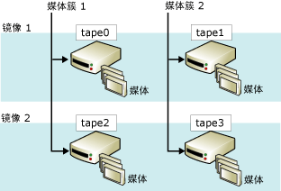

# 镜像备份介质集 (SQL Server)
[!INCLUDE[appliesto-ss-xxxx-xxxx-xxx-md](../../includes/appliesto-ss-xxxx-xxxx-xxx-md.md)]
    
> [!NOTE]  
>  只有 [!INCLUDE[ssNoVersion](../../includes/ssnoversion-md.md)]Enterprise Edition 支持镜像备份介质集。  
  
 镜像介质集通过降低备份设备故障的影响来提高备份的可靠性。 由于备份是防止数据丢失的最后“防线”，因此备份设备出现故障的后果是非常严重的。 随着数据库大小的增加，备份设备或介质发生故障致使备份不可还原的可能性也相应增加。 镜像备份介质通过提供冗余来提高备份的可靠性。  
  
> [!NOTE]  
>  有关媒体集的常规信息，请参阅 [媒体集、媒体簇和备份集 (SQL Server)](../../relational-databases/backup-restore/media-sets-media-families-and-backup-sets-sql-server.md)Enterprise Edition 支持镜像备份介质集。  
  
 **本主题内容：**  
  
-   [镜像介质集概述](#OverviewofMirroredMediaSets)  
  
-   [备份镜像的硬件要求](#HardwareReqs)  
  
-   [相关任务](#RelatedTasks)  
  
##   镜像介质集概述  
 介质镜像是介质集的一个属性。 *镜像媒体集* 是由媒体集的多个副本（*镜像*）组成的。 介质集包含一个或多个介质簇，其中每个介质簇对应一个备份设备。 例如，如果 BACKUP DATABASE 语句的 TO 子句列出三个设备，则 BACKUP 将数据分布在三个介质簇中，每个设备一个介质簇。 介质簇和镜像的数量在创建介质集时进行定义（使用指定了 WITH FORMAT 的 BACKUP DATABASE 语句）。  
  
 一个镜像介质集包含两个到四个镜像。 每个镜像包含介质集中的所有介质簇。 镜像必须有相同的设备数，每个介质簇一个设备。 每个镜像要求每个介质簇都有一个单独的备份设备。 例如，包含四个介质簇、三个镜像的镜像介质集需要十二个备份设备。 所有这些设备必须是相同的。 例如，使用同一制造商提供的同一型号的磁带机。  
  
 下图显示了包含两个介质簇、两个镜像的镜像介质集示例。 每个介质簇都包含三个介质卷，这些介质卷在每个镜像中都备份一次。  
  
   
  
 镜像中的对应卷都具有相同的内容。 这样，还原时它们可以互换。 例如，在上图中，tape2 的第三卷可以与 tape0 的第三卷互换。  
  
 [!INCLUDE[ssDEnoversion](../../includes/ssdenoversion-md.md)] 通过将数据同步写入设备来保证镜像介质具有相同的内容。 填充任一镜像时，同时也会填充所有镜像。  
  
> [!IMPORTANT]  
>  不能通过删除某个镜像来隐性分割（拆分）镜像介质集。 如果某个镜像中磁带或磁盘已损坏或已经过重新格式化，则该镜像不能再用于其他备份。 至少有一个完整镜像保持完好无损时，才可以读取介质集。 如果每个镜像都丢失了指定的介质簇，则介质集将不再可用。  
  
 备份和还原操作对是否必须存在所有镜像有不同的要求。 对写入（即创建或扩展）镜像介质集的备份操作，必须存在所有镜像。 相反，从镜像介质集中还原备份时，对于每个介质簇，只能指定一个镜像。 从其进行还原的设备可以少于介质簇，但每个介质簇只能处理一次。 不过，在出现错误的情况下，如果具有其他镜像则可快速解决某些还原问题。 您可以使用其他镜像服务器中的相应卷替换损坏的介质卷。 这是因为 RESTORE 和 RESTORE VERIFYONLY 支持使用其他镜像中的相应备份介质卷替换损坏的介质。  
  
##   备份镜像的硬件要求  
 磁盘和磁带可作为备份镜像的设备（磁盘不支持延续磁带）。 用于单个备份或还原操作的所有备份设备的类型必须相同（磁盘或磁带）。  
  
 在这些广泛的设备类别中，必须使用具有相同属性的相似设备。 设备不够相似会生成错误消息 (3212)。 为了避免出现设备不匹配的情况，请使用相同的设备，例如，只使用同一制造商提供的同一型号的设备。  
  
##   相关任务  
 **备份至镜像备份设备**  
  
-   [备份至镜像媒体集 (Transact-SQL)](../../relational-databases/backup-restore/back-up-to-a-mirrored-media-set-transact-sql.md)  
  
## 另请参阅  
 [备份和还原期间可能出现的媒体错误 (SQL Server)](../../relational-databases/backup-restore/possible-media-errors-during-backup-and-restore-sql-server.md)   
 [RESTORE VERIFYONLY (Transact-SQL)](../../t-sql/statements/restore-statements-verifyonly-transact-sql.md)   
 [备份设备 (SQL Server)](../../relational-databases/backup-restore/backup-devices-sql-server.md)   
 [媒体集、媒体簇和备份集 (SQL Server)](../../relational-databases/backup-restore/media-sets-media-families-and-backup-sets-sql-server.md)  
  
  
