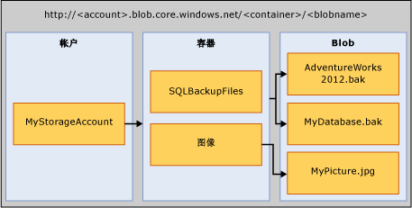

# <a name="sql-server-backup-to-url"></a>SQL Server 备份到 URL
[!INCLUDE[appliesto-ss-asdbmi-xxxx-xxx-md](../../includes/appliesto-ss-asdbmi-xxxx-xxx-md.md)]

  本主题介绍使用 Microsoft Azure Blob 存储服务作为备份目标所需的概念、要求和组件。 备份和还原功能与使用磁盘或磁带时相同，或类似但区别不大。 本主题介绍这些不同之处和几个代码示例。  
  
## <a name="requirements-components-and-concepts"></a>要求、组件和概念  
 **本节内容：**  
  
-   [安全性](#security)  
  
-   [关键组件和概念简介](#intorkeyconcepts)  
  
-   [Microsoft Azure Blob 存储服务](#Blob)  
  
-   [SQL Server 组件](#sqlserver)  
  
-   [限制](#limitations)  
  
-   [对备份/还原语句的支持](#Support)  
  
-   [使用 SQL Server Management Studio 中的备份任务](../../relational-databases/backup-restore/sql-server-backup-to-url.md#BackupTaskSSMS)  
  
-   [使用维护计划向导将 SQL Server 备份到 URL](../../relational-databases/backup-restore/sql-server-backup-to-url.md#MaintenanceWiz)  
  
-   [使用 SQL Server Management Studio 从 Azure 存储还原](../../relational-databases/backup-restore/sql-server-backup-to-url.md#RestoreSSMS)  
  
###  <a name="security"></a> Security  
 以下是备份到 Microsoft Azure Blob 存储服务或从该服务还原时的安全注意事项和要求。  
  
-   为 Microsoft Azure Blob 存储服务创建容器时，我们建议你将访问权限设置为“私有”  。 将访问权限设置为“私有”后，只允许可提供对 Azure 帐户进行身份验证所需的信息的用户或帐户进行访问。  
  
    > [!IMPORTANT]  
    >  [!INCLUDE[ssNoVersion](../../includes/ssnoversion-md.md)] 要求将 Azure 帐户名称和访问密钥身份验证或共享访问签名和访问令牌存储在 [!INCLUDE[ssNoVersion](../../includes/ssnoversion-md.md)] 凭据中。 在执行备份或还原操作时，将使用此信息对 Azure 帐户进行身份验证。  
  
-   用于发出 BACKUP 或 RESTORE 命令的用户帐户应属于具有“更改任意凭据”  权限的 **db_backup 操作员**数据库角色。  
  
###  <a name="intorkeyconcepts"></a> 关键组件和概念简介  
 以下两节介绍 Microsoft Azure Blob 存储服务以及在备份到 Microsoft Azure Blob 存储服务或从该服务还原时使用的 [!INCLUDE[ssNoVersion](../../includes/ssnoversion-md.md)] 组件。 了解这些组件和它们之间的交互对于执行备份到 Microsoft Azure Blob 存储服务或从中还原很重要。  
  
 在 Azure 订阅中创建 Azure 存储帐户是此过程中的第一步。 此存储帐户是对使用存储帐户创建的所有容器和对象具有完全管理权限的管理帐户。 [!INCLUDE[ssNoVersion](../../includes/ssnoversion-md.md)] 可以使用 Azure 存储帐户名称及其访问密钥值来进行身份验证，将 blob 写入到 Microsoft Azure Blob 存储服务和从中读取 blob，也可以使用特定容器上生成的共享访问签名令牌授予它读取和写入权限。 有关 Azure 存储帐户的详细信息，请参阅[关于 Azure 存储帐户](https://azure.microsoft.com/documentation/articles/storage-create-storage-account/)；有关共享访问签名的详细信息，请参阅[共享访问签名，第 1 部分：了解 SAS 模型](https://azure.microsoft.com/documentation/articles/storage-dotnet-shared-access-signature-part-1/)。 [!INCLUDE[ssNoVersion](../../includes/ssnoversion-md.md)] 凭据存储此身份验证信息并在备份或还原操作期间使用它。  
  
###  <a name="blockbloborpageblob"></a> 备份到块 blob 和页 blob 
 Microsoft Azure Blob 存储服务中可存储两类 blob：块 blob 和页 blob。 SQL Server 备份可以使用其中任一 blob 类型，具体取决于所使用的 Transact-SQL 语法：如果凭证中使用的是存储密钥，则使用页 blob；如果使用的是共享访问签名，则使用块 blob。
 
 备份到块 blob 仅在 SQL Server 2016 或更高版本中可用。 如果正在运行 SQL Server 2016 或更高版本，我们建议你备份到块 blob 而不是页 blob。 主要原因是：
- 与存储密钥相比，共享访问签名是用来授予 blob 访问权限的更为安全的方式。
- 你可以备份到多个块 blob 以获得更好的备份和还原性能，并支持更大的数据库备份。
- [块 blob](https://azure.microsoft.com/pricing/details/storage/blobs/) 比[页 blob](https://azure.microsoft.com/pricing/details/storage/page-blobs/) 便宜。 

将大型数据库备份到 blob 存储会受到[托管实例 T-SQL 差异、限制和已知问题](/azure/sql-database/sql-database-managed-instance-transact-sql-information#backup)中所述限制的约束。

 如果数据库太大，请执行以下任一操作：
- 使用备份压缩或
- 备份到多个块 blob

###  <a name="Blob"></a> Microsoft Azure Blob 存储服务  
 **存储帐户：** 存储帐户是所有存储服务的起始点。 要访问 Microsoft Azure Blob 存储服务，请首先创建一个 Azure 存储帐户。 有关详细信息，请参阅 [创建存储帐户](https://azure.microsoft.com/documentation/articles/storage-create-storage-account/)  
  
 **容器：** 一个容器提供一组 Blob 的分组，并且可以存储无限数目的 Blob。 要将 [!INCLUDE[ssNoVersion](../../includes/ssnoversion-md.md)] 备份写入 Microsoft Azure Blob 存储服务，你必须至少创建根容器。 你可以在容器上生成共享访问签名令牌，并只授予其对特定容器上的对象的访问权限。  
  
 **Blob：** 任意类型和大小的文件。 Microsoft Azure Blob 存储服务中可存储两类 blob：块 blob 和页 blob。 [!INCLUDE[ssNoVersion](../../includes/ssnoversion-md.md)] 备份可以使用其中任一 blob 类型，具体取决于所使用的 Transact-SQL 语法。 Blob 可使用以下 URL 格式寻址： https://\<storage account>.blob.core.windows.net/\<container>/\<blob>。 有关 Microsoft Azure Blob 存储服务的详细信息，请参阅 [如何通过 .NET 使用 Blob 存储](https://www.windowsazure.com/develop/net/how-to-guides/blob-storage/)。 有关页 blob 和块 blob 的详细信息，请参阅 [了解块 Blob 和页 Blob](https://msdn.microsoft.com/library/windowsazure/ee691964.aspx)。  
  
   
  
 **Azure 快照：** 在某一时间点创建的 Azure blob 快照。 有关详细信息，请参阅 [创建 Blob 的快照](https://msdn.microsoft.com/library/azure/hh488361.aspx)。 [!INCLUDE[ssNoVersion](../../includes/ssnoversion-md.md)] 备份现在支持对 Microsoft Azure Blob 存储服务中存储的数据库文件进行 Azure 快照备份。 有关详细信息，请参阅 [Azure 中数据库文件的文件快照备份](../../relational-databases/backup-restore/file-snapshot-backups-for-database-files-in-azure.md)。  
  
###  <a name="sqlserver"></a> [!INCLUDE[ssNoVersion](../../includes/ssnoversion-md.md)] 组件  
 **URL：** URL 指定统一资源标识符 (URI) 来标识唯一备份文件。 URL 用于提供 [!INCLUDE[ssNoVersion](../../includes/ssnoversion-md.md)] 备份文件的位置和名称。 URL 必须指向实际 blob，而不仅仅是容器。 如果 blob 不存在，则创建它。 如果指定了现有 blob，则除非指定了“WITH FORMAT”选项以覆盖 blob 中的现有备份文件，否则备份将失败。  
  
 以下是一个示例 URL 值：http[s]://ACCOUNTNAME.blob.core.windows.net/\<CONTAINER>/\<FILENAME.bak>。 HTTPS 不是必需的，但建议这样做。  
  
 **凭据：** [!INCLUDE[ssNoVersion](../../includes/ssnoversion-md.md)] 凭据是用于存储连接到 SQL Server 外部资源所需的身份验证信息的对象。 在这里， [!INCLUDE[ssNoVersion](../../includes/ssnoversion-md.md)] 备份和还原进程使用凭据对 Microsoft Azure Blob 存储服务及其容器和 blob 对象进行身份验证。 凭据存储存储帐户名称和存储帐户 **访问密钥** 值或容器 URL 及其共享访问签名令牌。 创建凭据后，BACKUP/RESTORE 语句的语法确定 blob 的类型和所需的凭据。  
  
 有关如何创建共享访问签名的示例，请参阅本主题后面的 [创建共享访问签名](../../relational-databases/backup-restore/sql-server-backup-to-url.md#SAS) 示例；有关如何创建 [!INCLUDE[ssNoVersion](../../includes/ssnoversion-md.md)] 凭据的示例，请参阅本主题后面的 [创建凭据](../../relational-databases/backup-restore/sql-server-backup-to-url.md#credential) 示例。  
  
 有关凭据的一般信息，请参阅 [凭据](../security/authentication-access/credentials-database-engine.md)  
  
 有关使用凭据的其他示例的信息，请参阅 [创建 SQL Server 代理的代理](../../ssms/agent/create-a-sql-server-agent-proxy.md)。  
  
###  <a name="limitations"></a> 限制  
  
-   不支持备份到高级存储。  
  
-   SQL Server 将使用页 blob 支持的最大备份大小限制为 1 TB。 并将使用块 blob 支持的最大备份大小限制为 200 GB 左右（50,000 块 * 4 MB MAXTRANSFERSIZE）。 块 blob 支持条带化，因而支持更大的备份大小。  
  
-   可使用 TSQL、SMO, PowerShell cmdlet、SQL Server Management Studio 备份或还原向导发出备份或还原语句。   
  
-   不支持创建逻辑设备名称。 因此，不支持使用 sp_dumpdevice 或通过 SQL Server Management Studio 将 URL 添加为备份设备。  
  
-   不支持追加到现有备份 blob。 只能使用 **WITH FORMAT** 选项覆盖到现有 blob 的备份。 但是，当使用文件快照备份（使用 **WITH FILE_SNAPSHOT** 参数）时，不允许使用 **WITH FORMAT** 参数以避免保留使用原始文件快照备份创建的孤立文件快照。  
  
-   只有在使用块 blob 以及使用共享访问签名 (SAS) 令牌（而不是存储帐户密钥）作为 SQL 凭据时才支持通过单个备份操作备份到多个 blob。  
  
-   不支持为页 blob 指定 **BLOCKSIZE**。 
  
-   不支持为页 blob 指定 **MAXTRANSFERSIZE**。 
  
-   不支持指定备份集选项 - **RETAINDAYS** 和 **EXPIREDATE** 。  
  
-   [!INCLUDE[ssNoVersion](../../includes/ssnoversion-md.md)] 要求备份设备名称最多包含 259 个字符。 对于用于指定 URL“https://.blob.core.windows.net//.bak”所需的元素，BACKUP TO URL 占用 36 个字符，其余 223 个字符将用于帐户、容器和 Blob 名称。  
  
###  <a name="Support"></a> 对备份/还原语句的支持  
  
|备份/还原语句|支持|例外|注释|
|-|-|-|-|
|备份|Y|支持将 BLOCKSIZE 和 MAXTRANSFERSIZE 用于块 blob。 不支持将它们用于页 blob。 | 备份到块 blob 需要 SQL Server 凭据中保存的共享访问签名。 备份到页 blob 需要 [!INCLUDE[ssNoVersion](../../includes/ssnoversion-md.md)] 凭据中保存的存储帐户密钥，并且需要指定 WITH CREDENTIAL 参数。|  
|RESTORE|Y||需要定义 [!INCLUDE[ssNoVersion](../../includes/ssnoversion-md.md)] 凭据，如果使用存储帐户密钥作为机密定义了 [!INCLUDE[ssNoVersion](../../includes/ssnoversion-md.md)] 凭据，则需要指定 WITH CREDENTIAL 参数|  
|RESTORE FILELISTONLY|Y||需要定义 [!INCLUDE[ssNoVersion](../../includes/ssnoversion-md.md)] 凭据，如果使用存储帐户密钥作为机密定义了 [!INCLUDE[ssNoVersion](../../includes/ssnoversion-md.md)] 凭据，则需要指定 WITH CREDENTIAL 参数|  
|RESTORE HEADERONLY|Y||需要定义 [!INCLUDE[ssNoVersion](../../includes/ssnoversion-md.md)] 凭据，如果使用存储帐户密钥作为机密定义了 [!INCLUDE[ssNoVersion](../../includes/ssnoversion-md.md)] 凭据，则需要指定 WITH CREDENTIAL 参数|  
|RESTORE LABELONLY|Y||需要定义 [!INCLUDE[ssNoVersion](../../includes/ssnoversion-md.md)] 凭据，如果使用存储帐户密钥作为机密定义了 [!INCLUDE[ssNoVersion](../../includes/ssnoversion-md.md)] 凭据，则需要指定 WITH CREDENTIAL 参数|  
|RESTORE VERIFYONLY|Y||需要定义 [!INCLUDE[ssNoVersion](../../includes/ssnoversion-md.md)] 凭据，如果使用存储帐户密钥作为机密定义了 [!INCLUDE[ssNoVersion](../../includes/ssnoversion-md.md)] 凭据，则需要指定 WITH CREDENTIAL 参数|  
|RESTORE REWINDONLY|-|||  
  
 有关备份语句的语法和一般信息，请参阅 [BACKUP (Transact-SQL)](../../t-sql/statements/backup-transact-sql.md)。  
  
 有关还原语句的语法和一般信息，请参阅 [RESTORE (Transact-SQL)](../../t-sql/statements/restore-statements-transact-sql.md)。  
  
### <a name="support-for-backup-arguments"></a>对备份参数的支持  

|参数|支持|异常|注释|  
|-|-|-|-|  
|DATABASE|Y|||  
|日志|Y|||  
||  
|TO (URL)|Y|与 DISK 和 TAPE 不同，URL 不支持指定或创建逻辑名称。|此参数用于指定备份文件的 URL 路径。|  
|MIRROR TO|Y|||  
|**WITH 选项：**||||  
|CREDENTIAL|Y||仅当使用 BACKUP TO URL 选项备份到 Microsoft Azure Blob 存储服务且使用存储帐户密钥作为机密定义了 [!INCLUDE[ssNoVersion](../../includes/ssnoversion-md.md)] 凭据时，才支持 WITH CREDENTIAL|  
|FILE_SNAPSHOT|Y|||  
|ENCRYPTION|Y||当指定了 **WITH ENCRYPTION** 参数时， [!INCLUDE[ssNoVersion](../../includes/ssnoversion-md.md)] 文件快照备份会确保在执行备份之前对整个数据库进行 TDE 加密，如果是这样，请使用数据库中为 TDE 指定的算法加密文件快照备份文件本身。 如果未加密整个数据库中的所有数据，备份将失败（例如，加密过程尚未完成）。|  
|DIFFERENTIAL|Y|||  
|COPY_ONLY|Y|||  
|COMPRESSION&#124;NO_COMPRESSION|Y|对文件快照备份不支持||  
|DESCRIPTION|Y|||  
|名称|Y|||  
|EXPIREDATE &#124; RETAINDAYS|-|||  
|NOINIT &#124; INIT|-||不能追加到 blob。 要覆盖备份，请使用 **WITH FORMAT** 参数。 但是，当使用文件快照备份（使用 **WITH FILE_SNAPSHOT** 参数）时，不允许使用 **WITH FORMAT** 参数以避免保留使用原始备份创建的孤立文件快照。|  
|NOSKIP &#124; SKIP|-|||  
|NOFORMAT &#124; FORMAT|Y||除非指定 **WITH FORMAT** ，否则对现有 blob 执行的备份将失败。 指定 **WITH FORMAT** 时，将覆盖现有 blob。 但是，当使用文件快照备份（使用 **WITH FILE_SNAPSHOT** 参数）时，不允许使用 FORMAT 参数以避免保留使用原始文件快照备份创建的孤立文件快照。 但是，当使用文件快照备份（使用 **WITH FILE_SNAPSHOT** 参数）时，不允许使用 **WITH FORMAT** 参数以避免保留使用原始备份创建的孤立文件快照。|  
|MEDIADESCRIPTION|Y|||  
|MEDIANAME|Y|||  
|BLOCKSIZE|Y|不支持用于页 blob。 支持用于块 blob。| 建议使用 BLOCKSIZE=65536 以优化块 blob 中允许的 50,000 个块的使用。 |  
|BUFFERCOUNT|Y|||  
|MAXTRANSFERSIZE|Y|不支持用于页 blob。 支持用于块 blob。| 默认值为 1048576。 该值的最大范围为 4 MB，以 65536 字节为增量递增。</br> 建议使用 MAXTRANSFERSIZE=4194304 以优化块 blob 中允许的 50,000 个块的使用。 |  
|NO_CHECKSUM &#124; CHECKSUM|Y|||  
|STOP_ON_ERROR &#124; CONTINUE_AFTER_ERROR|Y|||  
|统计信息|Y|||  
|REWIND &#124; NOREWIND|-|||  
|UNLOAD &#124; NOUNLOAD|-|||  
|NORECOVERY &#124; STANDBY|Y|||  
|NO_TRUNCATE|Y|||  
  
 有关备份参数的详细信息，请参阅 [BACKUP (Transact-SQL)](../../t-sql/statements/backup-transact-sql.md)。  
  
### <a name="support-for-restore-arguments"></a>对还原参数的支持  
  
|参数|支持|例外|注释|  
|-|-|-|-|  
|DATABASE|Y|||  
|日志|Y|||  
|FROM (URL)|Y||FROM URL 参数用于指定备份文件的 URL 路径。|  
|**WITH Options:**||||  
|CREDENTIAL|Y||仅当使用 RESTORE FROM URL 选项从 Microsoft Azure Blob 存储服务还原时，才支持 WITH CREDENTIAL。|  
|PARTIAL|Y|||  
|RECOVERY &#124; NORECOVERY &#124; STANDBY|Y|||  
|LOADHISTORY|Y|||  
|MOVE|Y|||  
|REPLACE|Y|||  
|RESTART|Y|||  
|RESTRICTED_USER|Y|||  
|FILE|-|||  
|PASSWORD|Y|||  
|MEDIANAME|Y|||  
|MEDIAPASSWORD|Y|||  
|BLOCKSIZE|Y|||  
|BUFFERCOUNT|-|||  
|MAXTRANSFERSIZE|-|||  
|CHECKSUM &#124; NO_CHECKSUM|Y|||  
|STOP_ON_ERROR &#124; CONTINUE_AFTER_ERROR|Y|||  
|FILESTREAM|Y|对快照备份不支持||  
|统计信息|Y|||  
|REWIND &#124; NOREWIND|-|||  
|UNLOAD &#124; NOUNLOAD|-|||  
|KEEP_REPLICATION|Y|||  
|KEEP_CDC|Y|||  
|ENABLE_BROKER &#124; ERROR_BROKER_CONVERSATIONS &#124; NEW_BROKER|Y|||  
|STOPAT &#124; STOPATMARK &#124; STOPBEFOREMARK|Y|||  
  
 有关还原参数的详细信息，请参阅[RESTORE 参数 (Transact-SQL)](../../t-sql/statements/restore-statements-arguments-transact-sql.md)。  
  
##  <a name="BackupTaskSSMS"></a> 使用 SQL Server Management Studio 中的备份任务  
可以使用 SQL Server 凭据通过 SQL Server Management Studio 中的备份任务将数据库备份到 URL。  
  
> [!NOTE]  
>  若要创建 [!INCLUDE[ssNoVersion](../../includes/ssnoversion-md.md)] 文件快照备份或覆盖现有媒体集，必须在 SQL Server Management Studio 中使用 Transact-SQL、Powershell 或 C#，而不是备份任务。  
  
 以下步骤介绍为了能够备份到 Azure 存储而对 SQL Server Management Studio 中的“备份数据库”任务做出的更改：  
  
1.  在“对象资源管理器”  中，连接到一个 SQL Server 数据库引擎实例，然后展开该实例。

2.  展开“数据库”  ，右键单击所需数据库，指向“任务”  ，然后单击“备份...”  。
  
3.  在“常规”  页上，“目标”  部分中，**URL**选项在“备份到：”  下拉列表中可用。  **URL**选项用于向 Microsoft Azure 存储创建备份。 单击  “添加”，  “选择备份目标”对话框将打开：
    1.  **Azure 存储容器：** 用于存储备份文件的 Microsoft Azure 存储容器名称。  从下拉列表中选择一个现有容器或手动输入该容器。 
  
    2.  **共享访问策略：** 对手动输入的容器输入共享访问签名。  如果已选择现有容器，则此字段不可用。 
  
    3.  **备份文件：** 备份文件的名称。
    
    4.  **新建容器：** 用于注册没有共享访问签名的现有容器。  请参阅 [连接到 Microsoft Azure 订阅](../../relational-databases/backup-restore/connect-to-a-microsoft-azure-subscription.md)。

> [!NOTE] 
>  “添加”  单个媒体集支持多个备份文件和存储容器。

选择 **URL** 作为目标后，将禁用“媒体选项”  页中的某些选项。  以下主题详细介绍“备份数据库”对话框：  
  
 [备份数据库（“常规”页）](../../relational-databases/backup-restore/back-up-database-general-page.md)  
  
 [备份数据库（“媒体选项”页）](../../relational-databases/backup-restore/back-up-database-media-options-page.md)  
  
 [备份数据库（“备份选项”页）](../../relational-databases/backup-restore/back-up-database-backup-options-page.md)  
  
 [创建凭据 - 向 Azure 存储进行身份验证](../../relational-databases/backup-restore/create-credential-authenticate-to-azure-storage.md)  
  
##  <a name="MaintenanceWiz"></a> 使用维护计划向导将 SQL Server 备份到 URL  
 与之前介绍的备份任务类似，SQL Server Management Studio 中的维护计划向导包括 URL  作为一个目标选项，以及 SQL 凭据等备份到 Azure 存储所需的其他支持对象。 它具有相同的功能。有关详细信息，请参阅 [Using Maintenance Plan Wizard](../../relational-databases/maintenance-plans/use-the-maintenance-plan-wizard.md#SSMSProcedure) 中的“定义备份任务”部分  。  
  
> [!NOTE]  
>  若要使用共享访问令牌创建条带备份集、 [!INCLUDE[ssNoVersion](../../includes/ssnoversion-md.md)] 文件快照备份或 SQL 凭据，则必须在维护计划向导中使用 Transact-SQL、Powershell 或 C#，而不是备份任务。  
  
##  <a name="RestoreSSMS"></a> 使用 SQL Server Management Studio 从 Microsoft Azure 存储还原  
“还原数据库”任务包括 **URL** 作为要从其还原的设备。  以下步骤描述如何使用还原任务从 Microsoft Azure Blob 存储服务进行还原： 
  
1.  右键单击“数据库”  ，然后选择“还原数据库...”  。 
  
2.  在“常规”  页上，在“源”  部分下选择“设备”  。
  
3.  单击“浏览 (...)”按钮以打开“选择备份设备”  对话框。 

4.  从“备份媒体类型:”  下拉列表中选择 **URL**。  单击“添加”  可打开“选择备份文件位置”  对话框。

    1.  **Azure 存储容器：** 包含备份文件的 Microsoft Azure 存储容器的完全限定名称。  从下拉列表中选择一个现有容器或手动输入该完全限定容器名称。
      
    2.  **共享访问签名：** 用于输入指定容器的共享访问签名。
      
    3.  **添加：** 用于注册没有共享访问签名的现有容器。  请参阅 [连接到 Microsoft Azure 订阅](../../relational-databases/backup-restore/connect-to-a-microsoft-azure-subscription.md)。
      
    4.  **确定：** SQL Server 使用所提供的 SQL 凭据信息连接到 Microsoft Azure 存储，然后打开“在 Microsoft Azure 上定位备份文件”对话框  。 此页上显示位于存储容器中的备份文件。 选择要用于还原的文件，然后单击 **“确定”** 。 此操作将返回“选择备份设备”  对话框，而单击此对话框上的“确定”  将返回“还原”  主对话框，从中将可完成还原。 
  
     [还原数据库（“常规”页）](../../relational-databases/backup-restore/restore-database-general-page.md)  
  
     [还原数据库（“文件”页）](../../relational-databases/backup-restore/restore-database-files-page.md)  
  
     [还原数据库（“选项”页）](../../relational-databases/backup-restore/restore-database-options-page.md)  
  
##  <a name="Examples"></a> 代码示例  
 本节包含以下示例。  
  
-   [创建凭据](#credential)  
  
-   [备份整个数据库](#complete)  
    
-   [使用 STOPAT 还原到时间点](#PITR)  
  
> [!NOTE]  
>  有关将 Microsoft Azure Blob 存储服务和 SQL Server 2016 配合使用的教程，请参见[教程：将 Microsoft Azure Blob 存储服务用于 SQL Server 2016 数据库](../tutorial-use-azure-blob-storage-service-with-sql-server-2016.md)  
  
###  <a name="SAS"></a> 创建共享访问签名  
 以下示例创建可用于在新创建的容器中创建 [!INCLUDE[ssNoVersion](../../includes/ssnoversion-md.md)] 凭据的共享访问签名。 该脚本创建与存储访问策略关联的共享访问签名。 有关详细信息，请参阅[共享访问签名，第 1 部分：了解 SAS 模型](https://azure.microsoft.com/documentation/articles/storage-dotnet-shared-access-signature-part-1/)。 此脚本还编写在 SQL Server 上创建凭据时所需的 T-SQL 命令。 

> [!NOTE] 
> 该示例需要 Microsoft Azure Powershell。 有关安装和使用 Azure Powershell 的信息，请参阅 [如何安装和配置 Azure PowerShell](https://azure.microsoft.com/documentation/articles/powershell-install-configure/)。  
> 这些脚本是使用 Azure PowerShell 5.1.15063 验证的。 


**与存储访问策略关联的共享访问签名**  
  
```Powershell  
# Define global variables for the script  
$prefixName = '<a prefix name>'  # used as the prefix for the name for various objects  
$subscriptionName='<your subscription name>'   # the name of subscription name you will use  
$locationName = '<a data center location>'  # the data center region you will use  
$storageAccountName= $prefixName + 'storage' # the storage account name you will create or use  
$containerName= $prefixName + 'container'  # the storage container name to which you will attach the SAS policy with its SAS token  
$policyName = $prefixName + 'policy' # the name of the SAS policy  


# Set a variable for the name of the resource group you will create or use  
$resourceGroupName=$prefixName + 'rg'   

# adds an authenticated Azure account for use in the session   
Connect-AzAccount

# set the tenant, subscription and environment for use in the rest of   
Set-AzContext -SubscriptionName $subscriptionName   

# create a new resource group - comment out this line to use an existing resource group  
New-AzResourceGroup -Name $resourceGroupName -Location $locationName   

# Create a new ARM storage account - comment out this line to use an existing ARM storage account  
New-AzStorageAccount -Name $storageAccountName -ResourceGroupName $resourceGroupName -Type Standard_RAGRS -Location $locationName   

# Get the access keys for the ARM storage account  
$accountKeys = Get-AzStorageAccountKey -ResourceGroupName $resourceGroupName -Name $storageAccountName  

# Create a new storage account context using an ARM storage account  
$storageContext = New-AzStorageContext -StorageAccountName $storageAccountName -StorageAccountKey $accountKeys[0].value 

# Creates a new container in blob storage  
$container = New-AzStorageContainer -Context $storageContext -Name $containerName  
$cbc = $container.CloudBlobContainer  

# Sets up a Stored Access Policy and a Shared Access Signature for the new container  
$policy = New-AzStorageContainerStoredAccessPolicy -Container $containerName -Policy $policyName -Context $storageContext -ExpiryTime $(Get-Date).ToUniversalTime().AddYears(10) -Permission "rwld"
$sas = New-AzStorageContainerSASToken -Policy $policyName -Context $storageContext -Container $containerName
Write-Host 'Shared Access Signature= '$($sas.Substring(1))''  

# Outputs the Transact SQL to the clipboard and to the screen to create the credential using the Shared Access Signature  
Write-Host 'Credential T-SQL'  
$tSql = "CREATE CREDENTIAL [{0}] WITH IDENTITY='Shared Access Signature', SECRET='{1}'" -f $cbc.Uri,$sas.Substring(1)   
$tSql | clip  
Write-Host $tSql  
```  

成功运行脚本后，将 `CREATE CREDENTIAL` 命令复制到查询工具，连接到 SQL Server 的实例并运行该命令以创建使用共享访问签名的凭据。 

###  <a name="credential"></a> 创建凭据  
 下面的示例创建用于向 Microsoft Azure Blob 存储服务进行身份验证的 [!INCLUDE[ssNoVersion](../../includes/ssnoversion-md.md)] 凭据。 执行下列操作之一： 
  
1.  **使用共享访问签名**  

   如果运行脚本来创建上述的共享访问签名，将 `CREATE CREDENTIAL` 复制到连接 SQL Server 实例的查询编辑器并运行命令。 

   下面的 T-SQL 是创建凭据以使用共享访问签名的一个例子。 

   ```sql  
   IF NOT EXISTS  
   (SELECT * FROM sys.credentials   
   WHERE name = 'https://<mystorageaccountname>.blob.core.windows.net/<mystorageaccountcontainername>')  
   CREATE CREDENTIAL [https://<mystorageaccountname>.blob.core.windows.net/<mystorageaccountcontainername>] 
      WITH IDENTITY = 'SHARED ACCESS SIGNATURE',  
      SECRET = '<SAS_TOKEN>';  
   ```  
  
2.  **使用存储帐户标识和访问密钥**  
  
   ```sql 
   IF NOT EXISTS  
   (SELECT * FROM sys.credentials   
   WHERE name = '<mycredentialname>')  
   CREATE CREDENTIAL [<mycredentialname>] WITH IDENTITY = '<mystorageaccountname>'  
   ,SECRET = '<mystorageaccountaccesskey>';  
   ```  
  
###  <a name="complete"></a> 执行完整数据库备份  
 下面的示例执行 AdventureWorks2016 数据库到 Microsoft Azure Blob 存储服务的完整数据库备份。 执行下列操作之一：   
  
  
2.  **To URL 使用共享访问签名**  
  
   ```sql  
   BACKUP DATABASE AdventureWorks2016   
   TO URL = 'https://<mystorageaccountname>.blob.core.windows.net/<mycontainername>/AdventureWorks2016.bak';  
   GO   
   ```  

1.  **To URL 使用存储帐户标识和访问密钥**  
  
   ```sql
   BACKUP DATABASE AdventureWorks2016  
   TO URL = 'https://<mystorageaccountname>.blob.core.windows.net/<mycontainername>/AdventureWorks2016.bak'   
         WITH CREDENTIAL = '<mycredentialname>'   
        ,COMPRESSION  
        ,STATS = 5;  
   GO   
   ```  
  

  
  
###  <a name="PITR"></a> 使用 STOPAT 还原到时间点  
 下面的示例将 AdventureWorks2016 示例数据库还原到某个时间点的状态，并显示还原操作。  
  
1.  **From URL 使用共享访问签名**  
  
   ```sql
   RESTORE DATABASE AdventureWorks2016 FROM URL = 'https://<mystorageaccountname>.blob.core.windows.net/<mycontainername>/AdventureWorks2016_2015_05_18_16_00_00.bak'   
   WITH MOVE 'AdventureWorks2016_data' to 'C:\Program Files\Microsoft SQL Server\<myinstancename>\MSSQL\DATA\AdventureWorks2016.mdf'  
   ,MOVE 'AdventureWorks2016_log' to 'C:\Program Files\Microsoft SQL Server\<myinstancename>\MSSQL\DATA\AdventureWorks2016.ldf'  
   ,NORECOVERY  
   ,REPLACE  
   ,STATS = 5;  
   GO   
  
   RESTORE LOG AdventureWorks2016 FROM URL = 'https://<mystorageaccountname>.blob.core.windows.net/<mycontainername>/AdventureWorks2016_2015_05_18_18_00_00.trn'   
   WITH   
   RECOVERY   
   ,STOPAT = 'May 18, 2015 5:35 PM'   
   GO  
   ```  
  
## <a name="see-also"></a>另请参阅  
 [SQL Server 备份到 URL 最佳实践和故障排除](../../relational-databases/backup-restore/sql-server-backup-to-url-best-practices-and-troubleshooting.md)   
 [备份和还原系统数据库 (SQL Server)](../../relational-databases/backup-restore/back-up-and-restore-of-system-databases-sql-server.md)   
 [教程：将 Microsoft Azure Blob 存储服务用于 SQL Server 2016 数据库](../tutorial-use-azure-blob-storage-service-with-sql-server-2016.md)  
  
  
