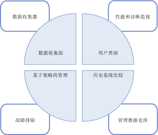
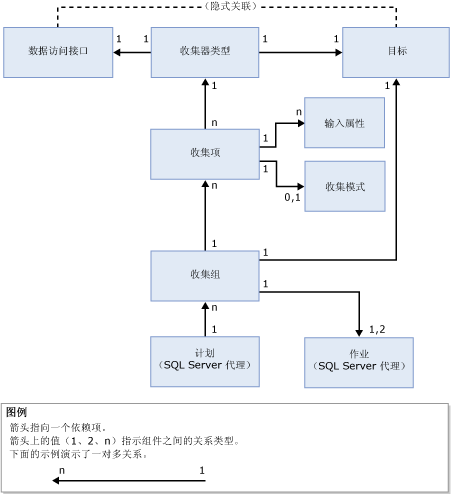

# “数据收集”
[!INCLUDE[appliesto-ss-xxxx-xxxx-xxx-md](../../includes/appliesto-ss-xxxx-xxxx-xxx-md.md)]
  数据收集器是 [!INCLUDE[ssCurrent](../../includes/sscurrent-md.md)] 的一个组件，用于收集不同的数据集。 数据收集连续运行或按照用户定义的计划运行。 数据收集器将收集的数据存储在称为管理数据仓库的关系数据库中。  
  
## 什么是数据收集器？ 
 数据收集器是 [!INCLUDE[ssCurrent](../../includes/sscurrent-md.md)] 数据收集平台的核心组件，是 [!INCLUDE[ssNoVersion](../../includes/ssnoversion-md.md)]所提供的工具。 数据收集器为在数据库服务器和应用程序范围内的数据收集提供了一个中心点。 与 SQL 跟踪不同，此收集点可获取来自多种来源的数据而不仅限于性能数据。  
  
 您可以使用数据收集器根据自己的测试和生产环境调整数据收集的范围。 数据收集器还使用数据仓库，数据仓库是一个关系数据库，借助此数据库，您可以通过为数据设置不同的保持期来管理收集的数据。  
  
 数据收集器支持对数据收集进行动态优化并可通过其 API 进行扩展。 有关详细信息，请参阅 [Data Collector Programming](http://msdn.microsoft.com/library/53b4752b-055d-4716-b2bc-75b4cce84101)。  
  
 下图显示数据收集器如何配合 [!INCLUDE[ssCurrent](../../includes/sscurrent-md.md)]数据收集和数据管理的总体策略。  
  
   
  
## 概念  
 数据收集器与 [!INCLUDE[ssNoVersion](../../includes/ssnoversion-md.md)] 代理和 [!INCLUDE[ssISnoversion](../../includes/ssisnoversion-md.md)]集成并可广泛使用这两者。 因此在使用数据收集器之前，应了解与这些 [!INCLUDE[ssNoVersion](../../includes/ssnoversion-md.md)] 组件相关的某些概念。  
  
 [!INCLUDE[ssNoVersion](../../includes/ssnoversion-md.md)] 代理用于计划和运行收集作业。 您应该了解以下概念：  
  
-   作业  
  
-   作业步骤  
  
-   作业计划  
  
-   子系统  
  
-   代理帐户  
  
 有关详细信息，请参阅 [自动执行管理任务（SQL Server 代理）](http://msdn.microsoft.com/library/541ee5ac-2c9f-4b74-b4f0-13b7bd5920b0)。  
  
 [!INCLUDE[ssISnoversion](../../includes/ssisnoversion-md.md)] ([!INCLUDE[ssIS](../../includes/ssis-md.md)]) 用于执行从各个数据提供程序收集数据的包。 您应该熟悉以下 [!INCLUDE[ssIS](../../includes/ssis-md.md)] 工具和概念：  
  
-   [!INCLUDE[ssIS](../../includes/ssis-md.md)] 包  
  
-   [!INCLUDE[ssIS](../../includes/ssis-md.md)] 包配置  
  
 有关详细信息，请参阅 [Integration Services (SSIS) 包](../../integration-services/integration-services-ssis-packages.md)。  
  
## 术语  
 **目标 (target)**  
 支持数据收集的 [!INCLUDE[ssDE](../../includes/ssde-md.md)] 版本中的 [!INCLUDE[ssNoVersion](../../includes/ssnoversion-md.md)] 实例。 有关支持的版本的详细信息，请参阅 [SQL Server 2016 各个版本支持的功能](~/sql-server/editions-and-supported-features-for-sql-server-2016.md)的“可管理性”部分。  
  
 “目标根目录  ”定义目标层次结构中的子树。 “目标集  ”是通过将筛选器应用到目标根目录定义的子树上而得到的目标组。 目标根目录可以是数据库、[!INCLUDE[ssNoVersion](../../includes/ssnoversion-md.md)] 实例，或计算机实例。  
  
**目标类型 (target type)**  
 目标的类型，它具有某些特征和行为。 例如， [!INCLUDE[ssNoVersion](../../includes/ssnoversion-md.md)] 实例目标具有与 [!INCLUDE[ssNoVersion](../../includes/ssnoversion-md.md)] 数据库目标不同的特征。  
  
 **数据提供程序 (data provider)**  
 特定于某个目标类型的已知数据源，用于为收集器类型提供数据。  
  
**收集器类型 (collector type)**  
 [!INCLUDE[ssIS](../../includes/ssis-md.md)] 包的逻辑包装，该包提供收集数据和将数据上载到管理数据仓库的实际机制。  
  
 **收集项 (collection item)**  
 收集器类型的实例。 收集项是通过一组特定的输入属性并以特定的收集频率创建的。  
  
 **收集组 (collection set)**  
 一组收集项。 收集组是用户可以通过用户界面与其进行交互的数据收集单元。  
  
 **收集模式 (collection mode)**  
 收集和存储数据的方式。 收集模式可以是缓存的或非缓存的。 缓存模式支持连续收集，而非缓存模式适用于按需收集或收集快照。  
  
 **管理数据仓库 (management data warehouse)**  
 用来存储所收集数据的关系数据库。  
  
 下图说明了数据收集器各组件之间的依存关系。  
  
   
  
 如图所示，数据访问接口不属于数据收集器，就定义而言，它与目标之间具有隐式关系。 数据访问接口特定于特定的目标（例如，诸如关系引擎这样的 [!INCLUDE[ssNoVersion](../../includes/ssnoversion-md.md)] 服务）并提供数据收集器可以使用的数据，例如 [!INCLUDE[ssNoVersion](../../includes/ssnoversion-md.md)]中的系统视图、性能监视器计数器和 WMI 提供程序。  
  
 收集器类型特定于目标类型，基于数据访问接口与目标类型之间的逻辑关联。 收集器类型定义如何从特定数据访问接口收集数据（通过使用架构化参数），并指定数据存储架构。 为存储所收集的数据，需要使用数据访问接口架构和存储架构。 收集器类型还提供管理数据仓库的位置，该管理数据仓库可以驻留在运行数据收集的计算机上或者另一台计算机上。  
  
 如图所示，收集项是用输入参数（如收集器类型的 XML 架构）进行了参数化的特定收集器类型的实例。 所有的收集项必须对同一目标根目录进行操作，或对空的目标根目录进行操作。 这将使数据收集器组合来自操作系统或特定目标根目录的收集器类型，而不会组合来自不同目标根目录的收集器类型。  
  
 收集项具有已定义的收集频率，该频率决定拍摄值快照的频率。 虽然收集项是收集组的构造块，但它不能独立存在。  
  
 收集组在服务器实例上定义和部署，各个组可以独立运行。 可将各收集组应用于与收集组包含的所有收集器类型的目标类型匹配的目标。 收集组由一个 [!INCLUDE[ssNoVersion](../../includes/ssnoversion-md.md)] 代理作业或多个代理作业运行，数据按预定义计划上载到管理数据仓库。  
  
 由收集组内的不同实例收集的所有数据将按同一计划上载到管理数据仓库。 此计划定义为共享 [!INCLUDE[ssNoVersion](../../includes/ssnoversion-md.md)] 代理计划，并可由多个收集组使用。 收集组作为单个实体打开或关闭，收集项不能单独打开或关闭。  
  
 创建或更新收集组时，可以配置用于收集数据并将数据上载到管理数据仓库的收集模式。 计划的类型由收集类型（即缓存或非缓存）决定。 如果收集是缓存的，则数据收集和上载将分别在单独的作业中运行。 收集将按与 [!INCLUDE[ssNoVersion](../../includes/ssnoversion-md.md)] 代理同步启动的计划运行，其运行频率在收集项中指定。 上载将按照用户指定的计划运行。  
  
 如果是非缓存的收集，数据收集和上载将在同一个作业中运行，但会分为两个步骤。 第一步是收集，第二步是上载。 按需收集无需计划。  
  
 启用了收集组后，数据收集就可以按照计划或按需开始。 数据收集开始后， [!INCLUDE[ssNoVersion](../../includes/ssnoversion-md.md)] 代理将为数据收集器生成进程，而数据收集器又将为收集组上载 [!INCLUDE[ssISnoversion](../../includes/ssisnoversion-md.md)] 包。 表示收集类型的收集项将针对特定目标从适当的数据访问接口收集数据。 收集周期结束时, 此数据将上载到管理数据仓库。  
  
## 你可以执行的事项  
  
|Description|主题|  
|----------------------|-----------|  
|管理数据收集的各个方面，例如启用或禁用数据收集、更改收集组配置或查看管理数据仓库中的数据。|[管理数据收集](../../relational-databases/data-collection/manage-data-collection.md)|  
|使用这些报表获取信息以监视系统功能和解决系统性能问题。|[系统数据收集组报表](../../relational-databases/data-collection/system-data-collection-set-reports.md)|  
|使用管理数据仓库来收集自身为数据收集目标的服务器的数据。|[管理数据仓库](../../relational-databases/data-collection/management-data-warehouse.md)| 
|可以利用 SQL Server Profiler 的服务器端跟踪功能导出跟踪定义，可使用跟踪定义创建一个使用通用 SQL 跟踪收集器类型的收集组| [使用 SQL Server Profiler 创建 SQL 跟踪收集组 (SQL Server Management Studio)](https://msdn.microsoft.com/library/cc645955(v=sql.130).aspx)
  
  

