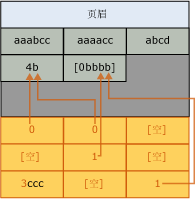

# 页压缩的实现
[!INCLUDE[appliesto-ss-asdb-xxxx-xxx-md](../../includes/appliesto-ss-asdb-xxxx-xxx-md.md)]

  本主题概述了 [!INCLUDE[ssDE](../../includes/ssde-md.md)] 是如何实现页压缩的。 此摘要提供了有助于你规划数据所需存储空间的基本信息。  
  
 表、表分区、索引和索引分区的页压缩都是类似的。 以下针对表的页压缩的说明同样适用于所有对象类型的页压缩。 以下示例压缩的是字符串，但对于其他数据类型而言，前缀压缩和字典压缩的原理都是相同的。  
  
 使用页压缩压缩表和索引的叶级别的过程由按以下顺序进行的三个操作组成：  
  
1.  行压缩  
  
2.  前缀压缩  
  
3.  字典压缩  
  
 当使用页压缩时，将仅使用行压缩来压缩索引的非叶级别页。 有关行压缩的详细信息，请参阅 [Row Compression Implementation](../../relational-databases/data-compression/row-compression-implementation.md)。  
  
## 前缀压缩  
 对于要压缩的每一页，前缀压缩采用以下步骤：  
  
1.  对于每一列，将确定一个值，此值可用于减少每一列中的值的存储空间。  
  
2.  将创建表示每一列的前缀值的行，并将其存储在紧随页头之后的压缩信息 (CI) 结构中。  
  
3.  列中重复的前缀值将由指向对应前缀的引用进行替换。 如果行中的值与所选前缀值并不完全匹配，则仍会指示存在部分匹配。  
  
 下图显示了前缀压缩之前表的一个示例页。  
  
   
  
 下图显示的是同一页在前缀压缩之后的样子。 前缀移至页头，列值更改为指向前缀的引用。  
  
   
  
 在第一行的第一列，值 4b 指示为该行显示前缀的前四个字符 (aaab) 和字符 b。 这样的话，结果值就是 aaabb，这是原始值。  
  
## 字典压缩  
 前缀压缩完成后，将应用字典压缩。 字典压缩搜索页面上任意位置的重复值，然后将它们存储在 CI 区域中。 与前缀压缩不同，字典压缩不局限于一列。 字典压缩可以替换页面上任意位置出现的重复值。 下图显示的是同一页在字典压缩之后的样子。  
  
   
  
 请注意，值 4b 已由页的其他列引用。  
  
## 进行页压缩时  
 当创建具有页压缩的新表时，不会进行压缩。 但是，表的元数据会指示应使用页压缩。 当将数据添加到第一个数据页时，会对数据进行行压缩。 因为此页未满，所以无法通过页压缩获得任何益处。 如果页已满，则添加下一行将引导页压缩操作。 将查看整个页；计算每一列以进行前缀压缩，然后计算所有列以进行字典压缩。 如果页压缩已在页上为要添加的行创建了足够的空间，则添加该行，并对数据进行行压缩和页压缩。 如果通过页压缩获得的空间减去 CI 结构所需空间之后剩余的空间并不充足，则不会对此页使用页压缩。 以后，行将添加到新页上，如果新页中也无法再容纳更多的行，则将再向表中添加一个新页。 与第一页类似，新页最初也不进行页压缩。  
  
 当包含数据的现有表转换为页压缩时，将重新生成和计算每一页。 重新生成所有页会导致重新生成表、索引或分区。  
  
## 另请参阅  
 [数据压缩](../../relational-databases/data-compression/data-compression.md)   
 [Row Compression Implementation](../../relational-databases/data-compression/row-compression-implementation.md)  
  
  
