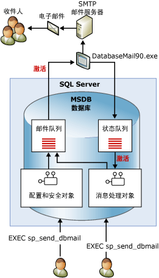

# 数据库邮件
[!INCLUDE [SQL Server SQL MI](../../includes/applies-to-version/sql-asdbmi.md)]
  数据库邮件是一种从 [!INCLUDE[ssDEnoversion](../../includes/ssdenoversion-md.md)] 或 [Azure SQL 托管实例](https://docs.microsoft.com/azure/sql-database/sql-database-managed-instance-index)发送电子邮件的企业解决方案。 通过使用数据库邮件，数据库应用程序可以向用户发送电子邮件。 邮件中可以包含查询结果，还可以包含来自网络中任何资源的文件。  
  
> [!NOTE] 
> 数据库邮件可在 [!INCLUDE[ssDEnoversion](../../includes/ssdenoversion-md.md)] 和 [Azure SQL 托管实例](https://docs.microsoft.com/azure/sql-database/sql-database-managed-instance-index)中使用，但不可在 Azure SQL 数据库单一实例和弹性池中使用。 

##   使用数据库邮件的优点  
 数据库邮件旨在实现可靠性、灵活性、安全性和兼容性。  
  
### 可靠性  
  
-   数据库邮件使用标准的简单邮件传输协议 (SMTP) 发送邮件。 无须在运行 [!INCLUDE[ssNoVersion](../../includes/ssnoversion-md.md)]的计算机上安装扩展 MAPI 客户端便可以使用数据库邮件。  
  
-   进程隔离。 若要最大程度上减小对 [!INCLUDE[ssNoVersion](../../includes/ssnoversion-md.md)]的影响，传递电子邮件的组件必须在 [!INCLUDE[ssNoVersion](../../includes/ssnoversion-md.md)]外部的单独进程中运行。 即使外部进程停止或失败，[!INCLUDE[ssNoVersion](../../includes/ssnoversion-md.md)] 也会继续对电子邮件进行排队。 队列中的邮件将在外部进程或 SMTP 服务器联机时发送。  
  
-   故障转移帐户。 数据库邮件配置文件允许您指定多台 SMTP 服务器。 如果一台 SMTP 服务器不可用，还可以将邮件传递至其他的 SMTP 服务器。  
  
-   群集支持。 数据库邮件与群集兼容，并且可以完全用于群集中。  
  
### 可伸缩性  
  
-   后台传递：数据库邮件提供后台（或异步）传递。 调用 **sp_send_dbmail** 发送消息时，数据库邮件可以向 [!INCLUDE[ssSB](../../includes/sssb-md.md)] 队列中添加请求。 存储过程将立即返回。 外部电子邮件组件将接收请求并传递电子邮件。  
  
-   多个配置文件：数据库邮件允许您在一个 [!INCLUDE[ssNoVersion](../../includes/ssnoversion-md.md)] 实例中创建多个配置文件。 另外，您也可以选择发送邮件时数据库邮件使用的配置文件。  
  
-   多个帐户：每个配置文件都可以包含多个故障转移帐户。 您可以配置包含不同帐户的不同配置文件以跨多台电子邮件服务器分发电子邮件。  
  
-   64 位兼容性：数据库邮件完全可以用于采用 64 位安装的 [!INCLUDE[ssNoVersion](../../includes/ssnoversion-md.md)]。  
  
### 安全性  
  
-   默认为关闭：为了减少 [!INCLUDE[ssNoVersion](../../includes/ssnoversion-md.md)]的外围应用，默认情况下，禁用数据库邮件存储过程。  
  
-   邮件安全性：若要发送数据库邮件，您必须是 **msdb** 数据库中的 **DatabaseMailUserRole** 数据库角色的成员。  
  
-   配置文件安全性：数据库邮件增强了邮件配置文件的安全性。 您可以选择对数据库邮件配置文件具有访问权限的 **msdb** 数据库用户或组， 并可以为 **msdb**中的任一特定用户或所有用户授予访问权限。 专用配置文件用于限制指定用户的访问权限。 公共配置文件可供数据库中的所有用户使用。  
  
-   附件大小调控器：数据库邮件增强了对附件文件大小的可配置限制。 可以使用 [sysmail_configure_sp](../../relational-databases/system-stored-procedures/sysmail-configure-sp-transact-sql.md) 存储过程更改此限制。  
  
-   禁止的文件扩展名：数据库邮件维护一个禁止的文件扩展名列表。 用户无法附加扩展名为列表中某个扩展名的文件。 可以使用 sysmail_configure_sp 更改该列表。  
  
-   数据库邮件在 [!INCLUDE[ssNoVersion](../../includes/ssnoversion-md.md)] 引擎服务帐户下运行。 若要将文件夹中的文件附加到电子邮件， [!INCLUDE[ssNoVersion](../../includes/ssnoversion-md.md)] 引擎帐户应有权访问该文件所在的文件夹。  
  
### 可支持性  
  
-   集成配置：数据库邮件在 [!INCLUDE[ssDEnoversion](../../includes/ssdenoversion-md.md)]中维护电子邮件帐户的信息。 无需在外部客户端应用程序中管理邮件配置文件。 数据库邮件配置向导提供了十分方便的界面来配置数据库邮件。 您还可以使用 [!INCLUDE[tsql](../../includes/tsql-md.md)]创建并维护数据库邮件的配置。  
  
-   日志记录。 数据库邮件将电子邮件活动记录到 [!INCLUDE[ssNoVersion](../../includes/ssnoversion-md.md)]、Microsoft Windows 应用程序事件日志和 **msdb** 数据库的表中。  
  
-   审核：数据库邮件将发送的邮件和附件的副本保留在 **msdb** 数据库中。 您可以轻松地审核数据库邮件的使用情况并检查保留的邮件。  
  
-   支持 HTML：数据库邮件允许您以 HTML 格式发送电子邮件。  
  
  
##   数据库邮件体系结构  
 数据库邮件的设计基于使用 Service Broker 技术的排队体系结构。 当用户执行 **sp_send_dbmail**时，存储过程将向邮件队列中插入一项，并创建一条包含该电子邮件信息的记录。 在邮件队列中插入新项将启动数据库邮件外部进程 (DatabaseMail.exe)。 该外部进程会读取电子邮件的信息并将电子邮件发送到相应的一台或多台电子邮件服务器。 该外部进程还会在状态队列中插入一项，来指示发送操作的结果。 在状态队列中插入新项将启动内部存储过程，该过程将更新电子邮件信息的状态。 除存储已发送（或未发送）的电子邮件信息外，数据库邮件还在系统表中记录所有电子邮件的附件。 数据库邮件视图提供了供排除故障使用的邮件状态，使用存储过程可以对数据库邮件队列进行管理。  
  
   
  
  
##   数据库邮件组件简介  
 数据库邮件由以下主要组件构成：  
  
-   配置和安全组件  
  
     数据库邮件将配置和安全信息存储在 **msdb** 数据库中。 配置和安全对象可创建数据库邮件所用的配置文件和帐户。  
  
-   邮件处理组件  
  
     **msdb** 数据库是邮件主机数据库，包含数据库邮件用于发送电子邮件的消息处理对象。 这些对象包括 **sp_send_dbmail** 存储过程和保存邮件信息的数据结构。  
  
-   数据库邮件可执行文件  
  
     数据库邮件可执行文件是一个外部程序，从 **msdb** 数据库中的队列读取邮件并将邮件发送到电子邮件服务器。  
  
-   日志记录和审核组件  
  
     数据库邮件将日志记录信息记录在 **msdb** 数据库和 [!INCLUDE[msCoName](../../includes/msconame-md.md)] Windows 应用程序事件日志中。  
  
 **配置代理以使用数据库邮件：**  
  
 SQL Server 代理可配置为使用数据库邮件。 对于作业完成时的警报通知和自动通知，这是必需的。  
  
> [!WARNING]  
>  无需将 [!INCLUDE[ssNoVersion](../../includes/ssnoversion-md.md)] 代理配置为使用数据库邮件，作业中的各个作业步骤也可以发送电子邮件。 例如， [!INCLUDE[tsql](../../includes/tsql-md.md)] 作业步骤可以使用数据库邮件将查询结果发送给一些收件人。  
  
 您可以配置 [!INCLUDE[ssNoVersion](../../includes/ssnoversion-md.md)] 代理，使其在出现下列情况时向预定义的操作员发送电子邮件：  
  
-   警报触发时。 可以配置警报，以针对所发生的特定事件发送电子邮件通知。 例如，可以配置警报，将可能需要立即采取行动的特定数据库事件或操作系统情况通知操作员。 有关配置警报的详细信息，请参阅 [警报](../../ssms/agent/alerts.md)。  
  
-   计划任务成功完成或未完成（例如，数据库备份或复制事件）。 例如，如果在月底的处理过程中出现错误，就可以使用 [!INCLUDE[ssNoVersion](../../includes/ssnoversion-md.md)] 代理邮件通知操作员。  
  
  
##   另请参阅  
  
-   [数据库邮件配置对象](../../relational-databases/database-mail/database-mail-configuration-objects.md)  
  
-   [数据库邮件消息处理对象](../../relational-databases/database-mail/database-mail-messaging-objects.md)  
  
-   [数据库邮件外部程序](../../relational-databases/database-mail/database-mail-external-program.md)  
  
-   [数据库邮件日志和审核](../../relational-databases/database-mail/database-mail-log-and-audits.md)  
  
-   [配置 SQL Server 代理邮件以使用数据库邮件](../../relational-databases/database-mail/configure-sql-server-agent-mail-to-use-database-mail.md)  
  
  
  
