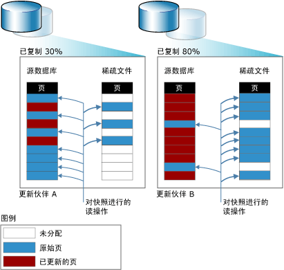

# 数据库快照 (SQL Server)
[!INCLUDE[appliesto-ss-xxxx-xxxx-xxx-md](../../includes/appliesto-ss-xxxx-xxxx-xxx-md.md)]
  数据库快照是 [!INCLUDE[ssNoVersion](../../includes/ssnoversion-md.md)] 数据库（源数据库）的只读静态视图。 自创建快照那刻起，数据库快照在事务上与源数据库一致。 数据库快照始终与其源数据库位于同一服务器实例上。 当源数据库更新时，数据库快照也将更新。 因此，数据库快照存在的时间越长，就越有可能用完其可用磁盘空间。  
  
 给定源数据库中可以存在多个快照。 在数据库所有者显式删除每个数据库快照之前，该快照将一直保留。  
  
> [!NOTE]  
>  数据库快照与快照备份、事务的快照隔离或快照复制无关。  
  
 **本主题内容：**  
  
-   [功能概述](#FeatureOverview)  
  
-   [数据库快照的优点](#Benefits)  
  
-   [术语和定义](#TermsAndDefinitions)  
  
-   [数据库快照的先决条件和限制](#LimitationsRequirements)  
  
-   [相关任务](#RelatedTasks)  
  
##   功能概述  
 数据库快照在数据页级运行。 在第一次修改源数据库页之前，先将原始页从源数据库复制到快照。 快照将存储原始页，保留它们在创建快照时的数据记录。 对要进行第一次修改的每一页重复此过程。 对于用户而言，数据库快照似乎始终保持不变，因为对数据库快照的读操作始终访问原始数据页，而与页驻留的位置无关。  
  
 为了存储复制的原始页，快照使用一个或多个“稀疏文件” 。 最初，稀疏文件实质上是空文件，不包含用户数据并且未被分配存储用户数据的磁盘空间。 随着源数据库中更新的页越来越多，文件的大小也不断增长。 下图说明了两种相对的更新模式对快照大小的影响。 更新模式 A 反映的是在快照使用期限内仅有 30% 的原始页更新的环境。 更新模式 B 反映的是在快照使用期限内有 80% 的原始页更新的环境。  
  
   
  
##   数据库快照的优点  
  
-   快照可用于报告目的。  
  
     客户端可以查询数据库快照，这对于基于创建快照时的数据编写报表是很有用的。  
  
-   维护历史数据以生成报表。  
  
     快照可以从特定时点扩展用户对数据的访问权限。 例如，您可以在给定时间段（例如，财务季度）要结束的时候创建数据库快照以便日后制作报表。 然后便可以在快照上运行期间要结束时创建的报表。 如果磁盘空间允许，还可以维护任意多个不同期间要结束时的快照，以便能够对这些时间段的结果进行查询。例如，调查单位性能。  
  
-   使用为了实现可用性目标而维护的镜像数据库来减轻报表负载。  
  
     使用带有数据库镜像的数据库快照，使您能够访问镜像服务器上的数据以生成报表。 而且，在镜像数据库上运行查询可以释放主体数据库上的资源。 有关详细信息，请参阅 [数据库镜像和数据库快照 (SQL Server)](../../database-engine/database-mirroring/database-mirroring-and-database-snapshots-sql-server.md)。  
  
-   使数据免受管理失误所带来的影响。  
  
-   如果源数据库上出现用户错误，您可将源数据库恢复到创建给定数据库快照时的状态。 丢失的数据仅限于创建快照后数据库更新的数据。  
  
     例如，在进行重大更新（比如大容量更新或架构更改）前，对数据库创建数据库快照以保护数据。 一旦进行了错误操作，可以使用快照将数据库恢复到生成快照时的状态。 为此目的进行的恢复很可能比从备份还原快得多；但是，此后您无法对数据进行前滚操作。  
  
    > [!IMPORTANT]  
    >  无法对脱机或损坏的数据库进行恢复。 因此，为了保护数据库，非常有必要定期执行备份并测试还原计划。  
  
    > [!NOTE]  
    >  数据库快照与源数据库相关。 因此，使用数据库快照恢复数据库不能代替备份和还原策略。 严格按计划执行备份仍然至关重要。 如果必须将源数据库还原到创建数据库快照的时间点，请实施允许您执行该操作的备份策略。  
  
-   使数据免受用户失误所带来的影响。  
  
     定期创建数据库快照，可以减轻重大用户错误（例如，删除的表）的影响。 为了很好地保护数据，可以创建时间跨度足以识别和处理大多数用户错误的一系列数据库快照。 例如，根据磁盘资源，可以每 24 小时创建 6 到 12 个滚动快照。 每创建一个新的快照，就删除最早的快照。  
  
    -   若要从用户错误中恢复，可以将数据库恢复到在错误发生的前一时刻的快照。 为此目的进行的恢复很可能比从备份还原快得多；但是，此后您无法对数据进行前滚操作。  
  
    -   或者，也可以利用快照中的信息，手动重新创建删除的表或其他丢失的数据。 例如，可以将快照中的数据大容量复制到数据库中，然后手动将数据合并回数据库中。  
  
    > [!NOTE]  
    >  使用数据库快照的原因，决定了数据库需要多少个并发快照、多久创建一次新快照以及将其保留多久。  
  
-   管理测试数据库  
  
     在测试环境中，当每一轮测试开始时针对要包含相同数据的数据库重复运行测试协议将十分有用。 在运行第一轮测试前，应用程序开发人员或测试人员可以在测试数据库中创建数据库快照。 每次运行测试之后，数据库都可以通过恢复数据库快照快速返回到它以前的状态。  
  
##   术语和定义  
 database snapshot  
 一个数据库（源数据库）的事务一致的只读静态视图。  
  
 源数据库 (source database)  
 对于数据库快照，指的是在其上创建快照的数据库。 数据库快照与源数据库相关。 数据库快照必须与数据库在同一服务器实例上。 此外，如果数据库因某种原因而不可用，则它的所有数据库快照也将不可用。  
  
 稀疏文件 (sparse file)  
 NTFS 文件系统提供的文件，需要的磁盘空间要比其他文件格式少很多。 稀疏文件用于存储复制到数据库快照的页面。 首次创建稀疏文件时，稀疏文件占用的磁盘空间非常少。 随着数据写入数据库快照，NTFS 会将磁盘空间逐渐分配给相应的稀疏文件。  
  
##   数据库快照的先决条件和限制  
 **本节内容：**  
  
-   [先决条件](#Prerequisites)  
  
-   [源数据库的限制](#LimitsOnSourceDb)  
  
-   [数据库快照的限制](#LimitsOnDbSS)  
  
-   [磁盘空间要求](#DiskSpace)  
  
-   [含有脱机文件组的数据库快照](#OfflineFGs)  
  
###   先决条件  
 可以使用任何恢复模式的源数据库必须满足以下先决条件：  
  
-   服务器实例必须在支持数据库快照的 [!INCLUDE[ssNoVersion](../../includes/ssnoversion-md.md)] 版本上运行。 有关详细信息，请参阅 [SQL Server 2016 各个版本支持的功能](~/sql-server/editions-and-supported-features-for-sql-server-2016.md)。  
  
-   源数据库必须处于联机状态，除非该数据库是数据库镜像会话中的镜像数据库。  
  
-   您可在可用性组中的任何主数据库或辅助数据库上创建数据库快照。 副本角色必须是 PRIMARY 或 SECONDARY，且不处于 RESOLVING 状态。  
  
     当您创建一个数据库快照时，我们建议数据库同步状态是 SYNCHRONIZING 或 SYNCHRONIZED。 但是，当数据库同步状态为 NOT SYNCHRONIZING 时，可以创建数据库快照。  
  
     有关详细信息，请参阅 [含有 AlwaysOn 可用性组的数据库快照 (SQL Server)](../../database-engine/availability-groups/windows/database-snapshots-with-always-on-availability-groups-sql-server.md)。  
  
-   若要在镜像数据库中创建数据库快照，数据库必须处于 SYNCHRONIZED 镜像状态。  
  
-   不能将源数据库配置为可缩放共享数据库。  

-   源数据库不得包含 MEMORY_OPTIMIZED_DATA 文件组。  有关详细信息，请参阅 [内存中 OLTP 不支持的 SQL Server 功能](../../relational-databases/in-memory-oltp/unsupported-sql-server-features-for-in-memory-oltp.md)。
  
> [!NOTE]  
>  所有恢复模式都支持数据库快照。  
  
###   源数据库的限制  
 只要存在数据库快照，快照的源数据库就存在以下限制：  
  
-   不能对数据库进行删除、分离或还原。  
  
    > [!NOTE]  
    >  可以备份源数据库，这方面将不受数据库快照的影响。  
  
-   源数据库的性能受到影响。由于每次更新页时都会对快照执行“写入时复制”操作，导致源数据库上的 I/O 增加。  
  
-   不能从源数据库或任何快照中删除文件。  
  
###   数据库快照的限制  
 数据库快照存在以下限制：  
  
-   数据库快照必须与源数据库在相同的服务器实例上创建和保留。  
  
-   始终对整个数据库制作数据库快照。  
  
-   数据库快照依赖于源数据库，但不是冗余存储。 它们无法防止磁盘错误或其他类型的损坏。 因此，使用数据库快照恢复数据库不能代替备份和还原策略。 严格按计划执行备份仍然至关重要。 如果必须将源数据库还原到创建数据库快照的时间点，请实施允许您执行该操作的备份策略。  
  
-   当将源数据库中更新的页强制压入快照时，如果快照用尽磁盘空间或者遇到其他错误，则该快照将成为可疑快照并且必须将其删除。  
  
-   快照为只读。 由于它们为只读，所以无法升级。 因此，可以知道数据库快照在升级后会不可用。  
  
-   禁止对 **model**数据库、 **master**数据库和 **tempdb** 数据库创建快照。  
  
-   不能更改数据库快照文件的任何规范。  
  
-   不能从数据库快照中删除文件。  
  
-   不能备份或还原数据库快照。  
  
-   不能附加或分离数据库快照。  
  
-   不能在 FAT32 文件系统或 RAW 分区上创建数据库快照。 数据库快照所用的稀疏文件由 NTFS 文件系统提供。  
  
-   数据库快照不支持全文索引。 不从源数据库传播全文目录。  
  
-   数据库快照将继承快照创建时其源数据库的安全约束。 由于快照是只读的，因此无法更改继承的权限，对源数据库的更改权限将不反映在现有快照中。  
  
-   快照始终反映创建该快照时的文件组状态：联机文件组将保持联机状态，脱机文件组将保持脱机状态。 有关详细信息，请参阅本主题后面的“含有脱机文件组的数据库快照”。  
  
-   如果源数据库的状态为 RECOVERY_PENDING，可能无法访问其数据库快照。 但是，当解决了源数据库的问题之后，快照将再次变成可用快照。  
  
-   数据库中的任何 NTFS 只读文件或 NTFS 压缩文件不支持恢复。  尝试恢复包含下列任意一种文件组的数据库将失败。  
  
-   在日志传送配置中，只能针对主数据库，而不能针对辅助数据库创建数据库快照。 如果您在主服务器实例和辅助服务器实例之间切换角色，则在将主数据库设置为辅助数据库之前，必须先删除所有数据库快照。  
  
-   不能将数据库快照配置为可缩放共享数据库。  
  
-   数据库快照不支持 FILESTREAM 文件组。 如果源数据库中存在 FILESTREAM 文件组，则它们在数据库快照中被标识为脱机状态，且其数据库快照不能用于恢复数据库。  
  
    > [!NOTE]  
    >  对数据库快照执行的 SELECT 语句不能指定 FILESTREAM 列；否则，将返回如下错误消息： `Could not continue scan with NOLOCK due to data movement.`  
  
-   当有关只读快照的统计信息丢失或变得陈旧时， [!INCLUDE[ssDE](../../includes/ssde-md.md)] 将创建临时统计信息并在 tempdb 中进行维护。 有关更多信息，请参见 [Statistics](../../relational-databases/statistics/statistics.md)。  
  
###   磁盘空间要求  
 数据库快照占用磁盘空间。 如果数据库快照用尽了磁盘空间，将被标记为可疑，必须将其删除。 （但是，源数据库不会受到影响，对其执行的操作仍能继续正常进行。）然而，与一份完整的数据库相比，快照具有高度空间有效性。 快照仅需足够存储空间来存储在其生存期中更改的页。 通常情况下，快照只会保留一段有限的时间，因此其大小不是主要问题。  
  
 但是，保留快照的时间越长，越有可能将可用空间用完。 稀疏文件最大只能增长到创建快照时相应的源数据库文件的大小。 如果数据库快照用完了磁盘空间，则必须删除该快照。  
  
> [!NOTE]  
>  除文件空间外，数据库快照与数据库占用的资源量大致相同。  
  
###   含有脱机文件组的数据库快照  
 当您尝试执行下列任何操作时，源数据库中的脱机文件组都将影响数据库快照：  
  
-   创建快照  
  
     当源数据库具有一个或多个脱机文件组时，快照创建只有在文件组处于脱机状态时才能成功。 不能为脱机文件组创建稀疏文件。  
  
-   使文件组脱机  
  
     可以在源数据库中使文件脱机。 但是，如果创建快照时文件组处于联机状态，则该文件组在数据库快照中仍将保持联机状态。 如果查询的数据在快照创建后已更改，则在快照中可以访问原始数据页。 但是，使用快照访问文件组中未修改数据的查询可能会由于出现输入/输出 (I/O) 错误而失败。  
  
-   使文件组联机  
  
     只要数据库具有任何快照，就不能使其中的文件组联机。 如果在创建快照时文件组处于脱机状态，或当数据库快照存在时使文件组脱机，则文件组将保持脱机状态。 这是因为使文件重新联机需要还原该文件，而如果数据库已具有快照，则无法执行此操作。  
  
-   将源数据库恢复到快照  
  
     将源数据库恢复到数据库快照要求除创建快照时处于脱机状态的文件组外，所有文件组都要处于联机状态。  
  
##   相关任务  
  
-   [创建数据库快照 (Transact-SQL)](../../relational-databases/databases/create-a-database-snapshot-transact-sql.md)  
  
-   [查看数据库快照 (SQL Server)](../../relational-databases/databases/view-a-database-snapshot-sql-server.md)  
  
-   [查看数据库快照的稀疏文件大小 (Transact-SQL)](../../relational-databases/databases/view-the-size-of-the-sparse-file-of-a-database-snapshot-transact-sql.md)  
  
-   [将数据库恢复到数据库快照](../../relational-databases/databases/revert-a-database-to-a-database-snapshot.md)  
  
-   [删除数据库快照 (Transact-SQL)](../../relational-databases/databases/drop-a-database-snapshot-transact-sql.md)  
  
## 另请参阅  
 [数据库镜像和数据库快照 (SQL Server)](../../database-engine/database-mirroring/database-mirroring-and-database-snapshots-sql-server.md)  
  
  

