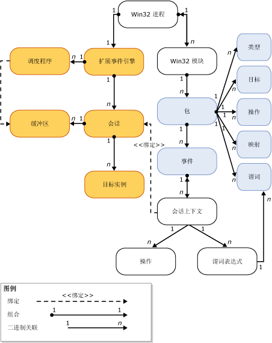

# SQL Server 扩展事件引擎
[!INCLUDE[tsql-appliesto-ss2014-asdb-xxxx-xxx_md](../../includes/tsql-appliesto-ss2014-asdb-xxxx-xxx-md.md)]

  [!INCLUDE[ssNoVersion](../../includes/ssnoversion-md.md)] 扩展事件引擎是具有以下功能的服务和对象的集合：  
  
-   可以定义事件。  
  
-   可以处理事件数据。  
  
-   管理系统中的扩展事件服务和对象。  
  
-   维护扩展事件会话列表并管理对该列表的访问。  
  
 扩展事件引擎本身并不提供任何事件，也不提供在事件激发时要采取的操作。 使用扩展事件引擎的进程定义与引擎之间的交互。 这些进程用于添加事件点并提供为了响应事件激发而要采取的操作。  
  
 下图是扩展事件会话的一个简化视图。 有关详细信息，请参阅 [SQL Server Extended Events Sessions](../../relational-databases/extended-events/sql-server-extended-events-sessions.md)。  
  
   
  
 请注意以下事项：  
  
-   每个 Windows 进程都可以有一个或多个模块（**Win32 进程**、**Win32 模块**）。 这些模块也称为“二进制模块”  或“可执行模块” 。  
  
-   每个 Windows 进程模块都可以包含一个或多个扩展事件包（**包**），而扩展事件包则包含一个或多个扩展事件对象（**类型**、**目标**、**操作Action**、**映射**、**谓词** 和 **事件**）。  
  
-   在主机进程中只能有一个扩展事件引擎实例（**扩展事件引擎**），该实例具有如下功能：  
  
    -   管理会话的某些方面（如枚举会话）。  
  
    -   处理调度（**调度程序**）。 这类似于线程池。  
  
    -   处理事件的内存缓冲区（**缓冲区**）。 缓冲区在填充后将被分派给目标。  
  
-   在创建会话并将事件绑定（可选）到该会话（**会话上下文**）之后：  
  
    -   还可以创建目标实例（**目标实例**）并将其添加到会话中。  
  
    -   缓冲区在填充后将被分派给目标。  
  
## 另请参阅  
 [扩展事件](../../relational-databases/extended-events/extended-events.md)  
  
  
